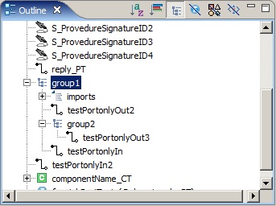

= Contents of the Outline View
:toc:
:figure-number: 118

This section presents how TITAN Designer plugin is integrated in the Outline view.

It is often useful to get a higher level view of the actual TTCN-3/ASN.1 module, especially if the module is thousands of lines long. The Outline view provides a solution to this problem and makes it easy to navigate inside TTCN-3/ASN.1 modules. If an element is selected in the Outline view the editor jumps to the position of the selected element in the source code.

The Outline view consists of two main parts. The toolbar and the actual tree view.

== The Tree

The Outline view contains a tree, representing the structure of the current TTCN-3/ASN.1 module. Each element is represented in the Outline view by an icon that makes the type of the item easily recognizable and by a text that shows the name and the type of the element or in case of structures with formal parameters their calling convention.

The root of the tree always represents the current TTCN-3/ASN.1 module and optionally the list of module importations if there were any. The structure of the underlying levels shows data structure hierarchies, type definition groupings etc.

== The Toolbar

With the functionality available through the toolbar buttons, the elements of the Outline view can be ordered, restructured or the visibility of specific elements can be changed. In the following subsections these toolbar actions will be described.

=== Sorting Elements

By default the elements in the Outline view are in the order of their position in the TTCN-3/ASN.1 module.

The elements can be sorted alphabetically with toggling the image:images/sortalphabetically.png[sort_alphabetically] icon.

=== Categorizing Elements

It is possible to order the outline view t categorizes the elements to be displayed before sorting them. This function is useful if one is only interested records, or functions as this way functions, types, module parameters will be found together in the outline view.

Categorizing of the outline elements is possible with toggling the image:images/icon_01.png[sort_alphabetically] icon.

=== Grouping

By default the Outline view does not show the group hierarchies in the module, as the groups do not have any effect on scoping. However they can be used to group semantically similar functions, type definitions etc. To make group hierarchies visible in the Outline view the image:images/outlinegroup.png[outline_group] button can be used.

=== Filtering Elements

If there are lots of elements in the Outline view it can be hard to find the appropriate one, so it is possible to filter the elements based on their types, using the filtering buttons in the toolbar. Filtering is additive, more filters can be active at the same time.

Filters for TTCN-3:

Hide functions (image:images/filterfunctions.png[filter_functions])

Hide templates ()

Hide types (image:images/icon_03.png[filter_03])

== Outline View Icons

Pitfalls

NOTE: As long we have to re-parse the whole TTCN-3 and ASN.1 modules on a change the outline view will always have to reinitialize all of its contents. This means, that all structures actually open at such a change will be closed (in fact the old structure will be deleted and a new will be created).
