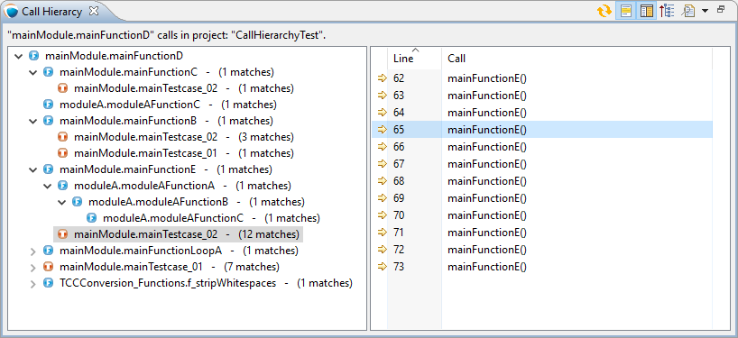
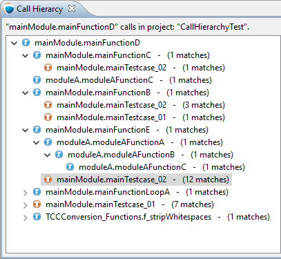
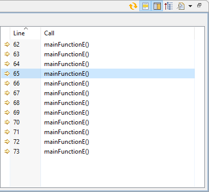
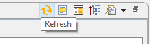
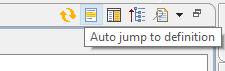
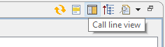
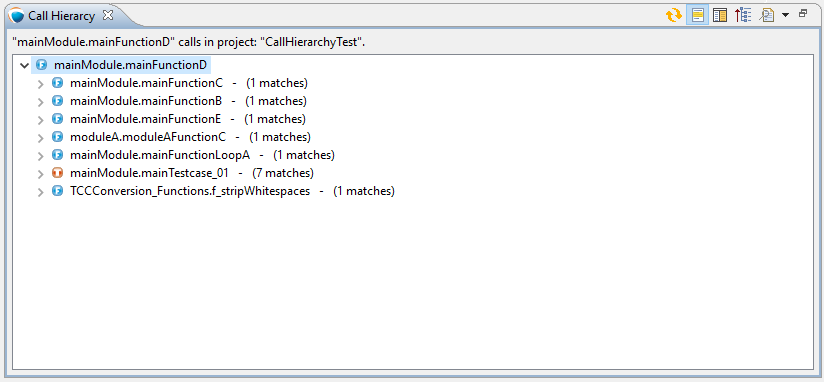
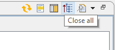
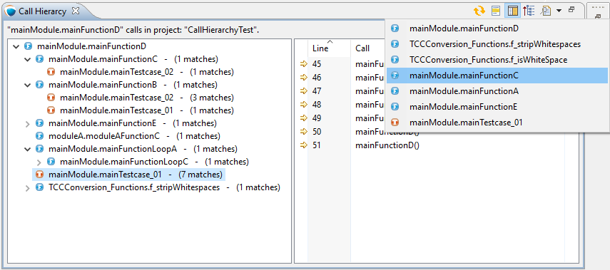

= The Call Hierarchy View
:toc:
:figure-number: 124

This section presents how TITAN Designer plugin implement the Call Hierarchy View.

During the development is often useful to get an overview of the TTCN-3 function (), testcase () or external function () calls. This view help see your functions location in the call tree and you can see witch other functions call yours.

You can call the view from the *Window/Show View* menu, from the *right click menu* or with the *CTRL+ALT+H* command.
The Call Hierarchy View consists of three main parts. The toolbar, the actual tree view and the current call list.

== The Tree

The root of the tree always represents the searched TTCN-3 function (), testcase () or external function (). The second level of the tree contains the functions what call the searched (root) function. Near the tree nodes you can see the number of calls.

When you click to a tree node, the editor jump to the function definition and select it automatically (if this option is enabled  ) and the call list on the right side show the current calls, if the call list is enabled (). When you click to the small arrow near a subnode  (), you start a subsearch on the selected node. You can build recursively the part of the tree what you need.

== The Call List

Near the tree nodes you can see the number of calls (), when you click to a tree node the call list show the calls with the row number. When you click to a row in the list, the editor jump to the  row of the call. (image:images/11_11_call_hierarchy_view_call_list_row.png[title="view_call_list_row"]) You can switch off the call list in the toolbar. ()

== The Toolbar

On the top of the view you can see a toolbar with five buttons:

=== The refresh button

The refresh button () update the current search. (Update the unsaved changes too.)

=== The auto jump to definition switch

When this option () is switched on, the editor jump to the definition of the selected function automatically, when you choose a node in the tree.

=== The call list switch

This switch () show or hide the function call list table.

=== The close all button

This button () collapse the call hierarchy tree.

=== The search history

The history droppdown menu () list the prevouse searches and you cen recall these searches.

NOTE: The search discover your unsaved changes too under the tree bulding, updating or under the hystory recall.
