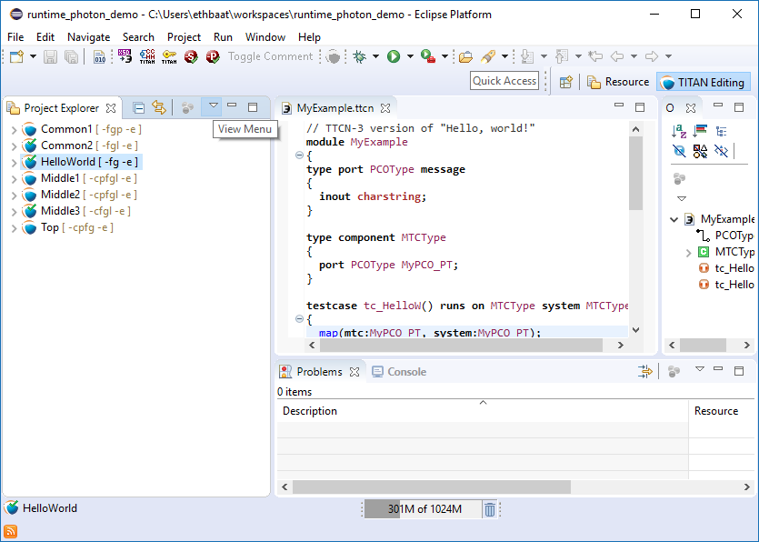
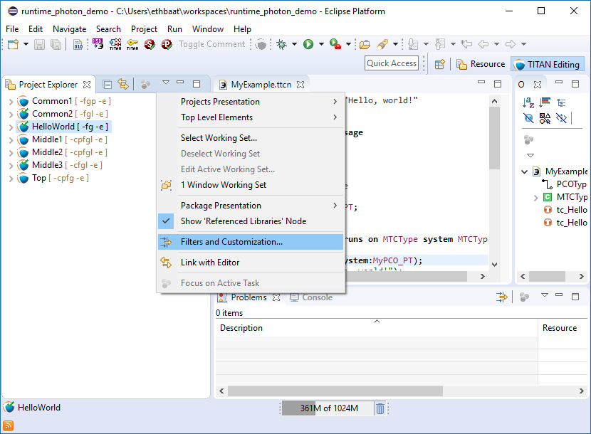
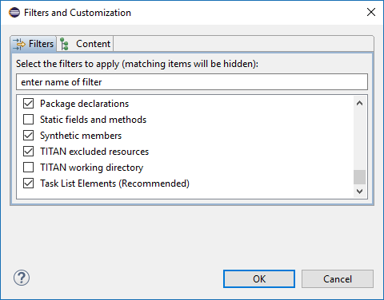

= Extensions to the Project Explorer
:toc:
:figure-number: 128

[[filtering-resources-from-the-view]]
== Filtering Resources from the View

It is possible to hide excluded resources from the Project explorer view.

To achieve this go to *View Menu* / select *Filters and Customization...* (or  *Customize View…* )

On the *Filters and Customization* window (or *Available Customizations* window) there are two exclusion filters provided by the Designer plug-in:

* TITAN working directory.
+
When selected the working directories of the projects will be filtered from the *Project Explorer* view.

* TITAN excluded resources.
+
When selected all resources excluded from the build on some way, will be filtered from the view. For more information on how a resource can be excluded from build please refer <<2-getting_started.adoc#_enabling_titan_decorations, here>>.

By default the "TITAN working directory" filter is selected.

