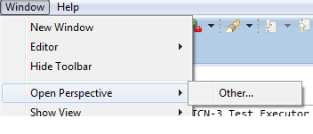
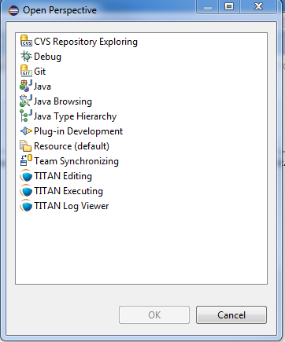
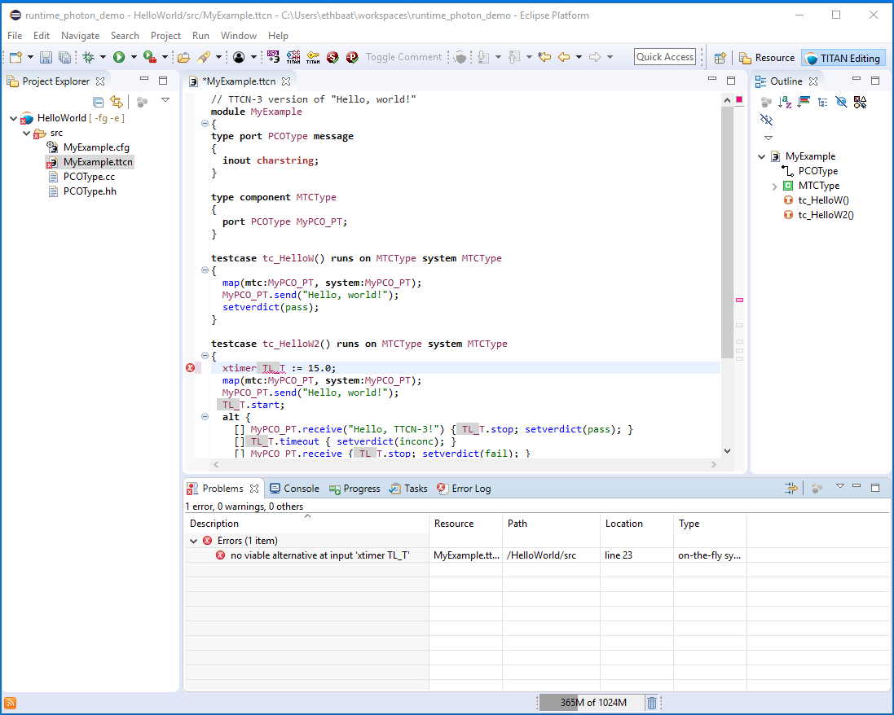
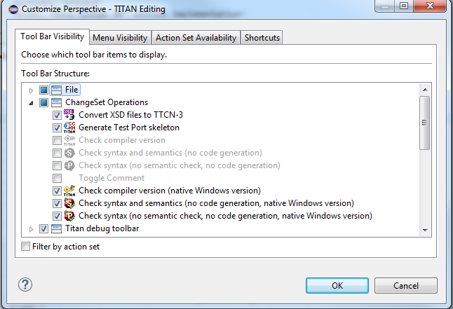
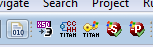
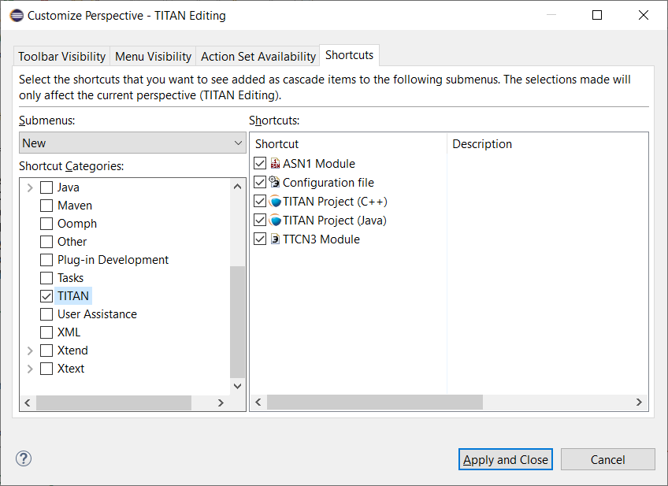
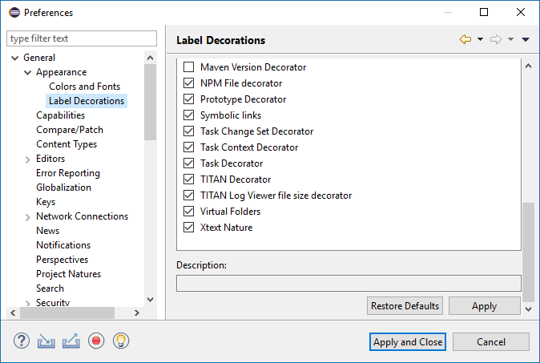

= Getting started
:toc:
:figure-number: 0

This section explains how to setup Eclipse to access every feature provided by TITAN Designer.

== The TITAN Editing Perspective

TITAN Designer provides its own perspective to Eclipse. This is a layout of visual elements that provides a good environment for working with TITAN. This layout is a starting point, since users can create their own layout in Eclipse, to set the best working environment for themselves.

Open the TITAN Designer perspective by opening *Window / Open Perspective / Other…*.

In the pop-up window select *TITAN Editing*.

The perspective is divided in three fields. <<titan-editing-perspective,Figure TITAN Editing Perspective>> shows the default layout.

[[titan-editing-perspective]]

The tab on the left side is the Project Explorer view. This is a navigator where projects can be managed; for example, opened, renamed, or closed. Files can be added or removed from a project and so on.

The biggest pane of the perspective is the editing area (upper right). Here the code can be edited using the provided source code editors (or built-in text editors), once a file had been opened.

The four tabs at the bottom of the picture open the following views:

* The Problems view (see <<8-contents_of_the_problems_view.adoc#the_problems_view,here>>) displays information about problems found in the project. The problems reported can be ordered using several criteria (see <<8-contents_of_the_problems_view.adoc#grouping-of-problems, here>>).

* The Console view contains the commands executed and their output; Consoles only appear if there is something to display. The Console view has two sub views (TITAN console and TITAN Debug console, respectively); by default only one of both is displayed in the pane. The hidden sub view can be displayed by clicking on the display icon on the right of the pane.

* The TITAN console displays the commands executed by the parts of TITAN Designer and their results.

* The TITAN Debug console holds special debug related information for the plug-in developers. If something strange happens this might hold additional information that the user can include in his trouble report.
+
NOTE: The contents of this view have no effect on the work of the user.

* The Progress view contains information about the progresses of Eclipse related operations. Lengthy operations (for example building, remote building or the first on-the-fly build pass) always provide information to the user about their progress. Operations in general can be canceled in this view, provided that cancellation is allowed.

* The Tasks view contains information extracted from the projects in a sorted manner. The contents of this view differ from the contents of the Problems view in that they are usually not errors, but TODO or FIXME like notations. This view is described in detail <<9-contents_of_the_tasks_view.adoc#_contents_of_the_tasks_view, here>>.

== Enabling TITAN Actions on the Toolbar

TITAN Actions or Change Set Operations are commands (apart from those used in the build process) that can be executed on TTCN-3 files.

The TITAN Actions are enabled by checking the *Change Set Operations* submenu on the tab *Tool Bar Visibility* after selecting *Windows / Customize Perspective* (see the next figure).

Enabling TITAN Actions will add a new toolbar with the TITAN Actions commands described below to the available ones:

The command `Check syntax` checks the selected files for syntactical errors; no other operation is performed. When a folder is selected, the check is performed for all the files in the folder. The command is only available if at least one file is selected.

The command `Check semantics` checks the selected files both syntactically and semantically; no other operation is performed. When a folder is selected, the check is performed for all the files in the folder. The command is only available if at least one file is selected.

The command `Check compiler version` displays the version of the compiler.

The command `Generate Test Port skeleton` generates a test port skeleton from the selected TTCN-3 file. The command is only available if there is exactly one selected file in the project.

The command Convert XSD files to TTCN-3 takes as input the files selected by the user, and converts them into TTCN-3 files. As for the output the user is asked to select a folder, where the newly created files will be written to.

The output of the commands is written to the TITAN Console. Commands are executed regardless of the file properties; for example, the selected file will be syntactically or semantically checked even if it is excluded from the build process.

== Enabling TITAN Shortcuts

TITAN Shortcuts appear in the *File/New* menu and are used to open a new ASN.1 module, a configuration file, a TITAN project or a TTCN-3 module, respectively.

The TITAN Shortcuts are enabled by checking the appropriate box on the right pane of the Shortcuts tab after selecting *Windows / Customize Perspective* (see <<enabling-the-titan-shortcuts,the next figure>> ).The boxes are checked by default.

[[enabling-the-titan-shortcuts]]

== Enabling TITAN Decorations

Decoration here means a string added to a project, folder or file name or a picture overlapping the icon of the resource to provide the reader with additional information.

The  mark on the top right corner of a project’s icon means the project has been built and the binaries are up to date. If the plug-in detects the modification of a non-excluded file or folder inside the project, the check mark will disappear.

Decoration after a project name shows whether the `Makefile` has been automatically generated. If it has, the corresponding command line switches are displayed between brackets; for example, `[ -s ]` for single mode. No additional text is displayed if the `Makefile` has been manually generated (not even the brackets).

Decoration after a folder name indicates that the folder is used as a central storage (`[ centralstorage ]`) or the folder is excluded from build (`[ excluded by X]`). If both are true, `[ excluded by X centralstorage ]` is displayed.

Decoration after a file name denotes exclusion from build. Files excluded from build are marked `[ excluded ]`.

Decoration is enabled by checking the *TITAN Decorator* box after selecting *Windows / Preferences / General / Appearance / Label decorations*; see the figure below.

NOTE: Decorations are extending the information displayed for elements. As there can be several decorations extending an element, the texts shown above might not be the only ones displayed.

== Excluding resources

The possible reasons for a resource being excluded from build are as follows:

* Excluded by user:
+
These resources were explicitly excluded from the build by the user. (For more information refer <<4-managing_projects.adoc#excluding-files-and-folders-from-the-build-process, here>>)

* Excluded as working directory:
+
The working directory by definition is excluded from the build process, in order to make sure, that source files and generated file do not mix.

* Excluded by regexp:
+
The names of these resources was matching one or more exclusion regular expressions provided on the *Excluded resources* preference page (for more information refer <<3-setting_workbench_preferences.adoc#excluded-resources,here>>.)

* Excluded by convention:
+
On the Eclipse platform if the name of a resource (either a file or a folder) starts with a dot, it indicates that the resource is some special resource used by one of the plug-ins exclusively. All other plug-ins should exclude these files from their operation; they should not be regarded as part of the project by any plug-in other than its creator.

NOTE: When either the excluded resources or the working directory filter is active, it is indicated by the projects being decorated with the "[filtered]" decoration too. For more information on these filters please refer <<11-extensions_to_the_project_explorer.adoc#filtering-resources-from-the-view, here>>.

