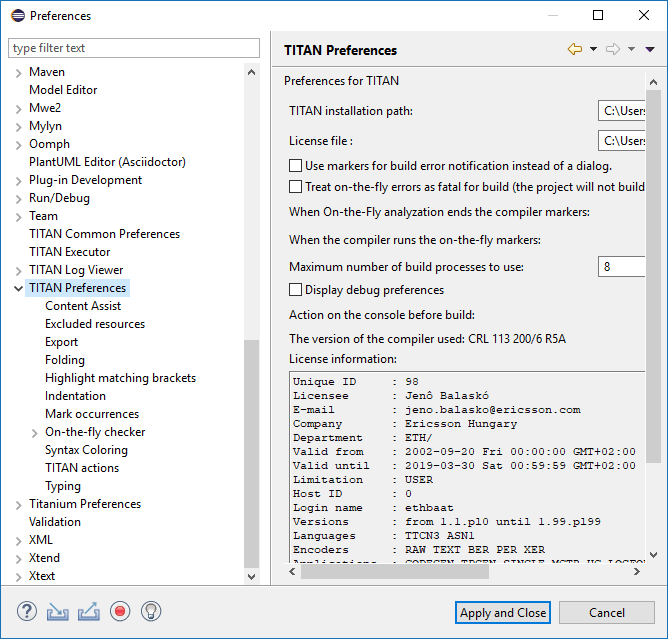
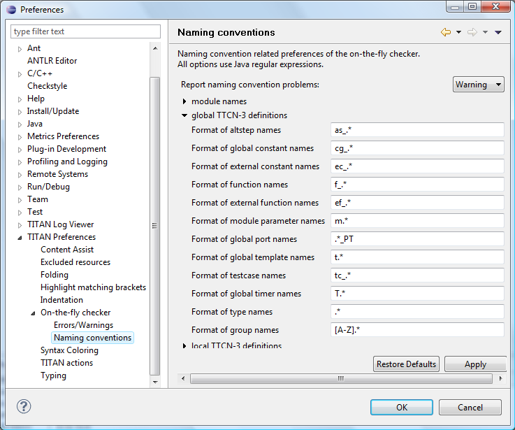

= Setting Workbench Preferences
:toc:
:figure-number: 7

This section gives an overview about the various settings related to the workbench provided by the TITAN Designer plug-in.

In Eclipse, workbench preferences are used to set user specific general rules, which apply to every project; for example, preferred font styles, access to version handling systems and so on.

Workbench preferences are accessible selecting *Window / Preferences*. Clicking on the menu item will bring up the preferences page. The opening window contains a preference tree on the left pane to ease navigation (see <<titan-preferences-sub-tree,figure below>>).
[[titan-preferences-sub-tree]]

This section only concerns the preferences that are available under the TITAN preferences node of this preference tree.

== TITAN Preferences
[[titan-preferences]]

The following options can be set on the TITAN preferences page (see <<titan-preferences,the figure above>>):

* **TITAN installation path.**
+
The path to the TITAN installation directory. The TITAN version used to build the projects can be changed by modifying the contents of this field. The *Browse* button can be used to browse the directories.

* **License file.**The path must point to a valid TITAN license file. The *Browse* button can be used to browse the files.
+
This option is not available in all versions.

* **Use markers for build error notification instead of dialog.**
+
By default, an error during the build process is reported in a dialog window. However, this is sometimes the unwanted behavior; for example, when a job is running in the background. If this option is checked, no dialog window will pop-up; instead, an error marker will be placed on the project resource, seamlessly integrated into the general error processing behavior of the tool. The error message is assigned to the marker in this case. +
The option is UNCHECKED by default.

* **Treat on-the-fly errors as fatal for build.**
+
By default if the on-the-fly analyzer recognizes a syntactic or semantic error, that has no effect on the build process of the project. However, most of the time this is not optimal behavior, because if the semantic analyzer finds something erroneous, the build process will also find it erroneous and as such the build process will not be able to fully complete (plus in such cases the time spent by the build process to detect and report the problem is actually wasted as the problem is already known). +
The option is NOT CHECKED by default.

* **When on-the-fly analysis ends the compiler markers.**
+
When the on-the-fly analyzer starts it can trigger the following behaviors for error markers generated by the compiler previously: *“Stay unchanged”*, *“Become outdated”*, and *“Are removed”*. +
The default setting is: *“Become outdated”*

* **When the compiler runs the on-the-fly markers.**
+
When the compiler starts it can trigger the following behaviors for error markers generated by the on-the-fly analyzer previously: *“Are removed”*, *“Stay”*. Setting this option to *“Stay”* can enhance the speed of the on-the-fly analyzer, because if the markers need to be refreshed, so does all syntactic and semantic information needs to be refreshed too. +
The default setting is: *“Are removed”.*

* **Maximum number of build processes to use.**
+
By default, the build process is only executing in one process which is not efficient on modern multi-core hardware. Using this option the users can set how many parallel processes shall be used by the build process at the same time to compile modules. +
The option is set equal the number of processors/cores available in the system by default.

* **Display debug preferences**
+
By default, the Designer plug-in isn’t logging debug information to the Debug Console to help solving problems. However as errors are reported to the Error Log of Eclipse this information is rarely used. Most of the time these printouts hold no value for the users. Debugging and load balancing features can be set by this option see <<debug, here>>.
+
The option is NOT CHECKED by default because most of the time these features hold no value for the users.
+
If you want to set any of these options, set the options "Display debug preferences" [.underline]#then press button "Apply".# An entry "Debug" appears under "**TITAN Preferences**" on the left pane (see <<display-debug-preferences,figure below>> ).

[[display-debug-preferences]]

Below the last option, the version of the currently set compiler and information about the license of the user is displayed.

NOTE: In case the license file is not provided, is not valid or has expired an additional link will appear on this page. Clicking on this link a browser will open directing the user to a web page where he can order a new license or can ask for a renewal of his existing one.

== Content Assist Preferences
[[content-assist]]

The following options can be set on the <<content-assist,Content Assist page>>:

* **Insert single proposals automatically**
+
When the analysis finds only one possible proposal to show to the user, it can be set whether it should be inserted automatically, or displayed anyway. +
This option is NOT CHECKED by default.

* **Insert common prefixes automatically**
+
Very often all of the listed proposals start with a common prefix, that is longer than the text being extended (for example naming conventions usually have such prefixes). +
In such cases if this option is checked, the common prefix will be inserted automatically. This way the user only has to enter those characters that actually differentiate between two options, allowing finishing with the actual code completion much faster. +
This option is NOT CHECKED by default.

* **Sort proposals**
+
The sorting of the proposals can set to be done either "**by relevance**", or "**alphabetically**". +
If ordered by relevance definitions that were declared closer in the scope hierarchy will be closer to the top of the proposal list. When the aim of the code compilation is usually a local variable, using this sorting method it can be found much faster. +
If ordered alphabetically all of the items will be in alphabetical order, although not as fast in completing local definitions, it might be easier to search for most people. +
The default setting is: "**by relevance**".

* **Enable auto activation**
+
The code completion cannot only be activated by the user by pressing CTRL + SPACE, but it can also be set to be automatically activated every time the `.' character is entered. +
This option is CHECKED by default.

* **Auto activation delay**
+
The delay between the auto activation of the content assistant, and its actual starting can be set here in milliseconds. +
The default setting is: 500 milliseconds

[[debug]]
== Debug
[[debug-options]]

The following option groups can be set on the Debug page (see <<debug-options,figure above>>):

* **Debug options for the Titan plugins**
+
The elements of this group are rarely used but they are very useful in error reporting to the Eclipse Titan plugin developers. These settings affect the output on the *Debug Console* view.

* **Load balancing**
+
These options can be useful for advanced users to speed up the semantic analyzer in case of huge projects.

The Debug options are as follows:

* *Enable debug console*
+
Enables the output on debug console

* **Console timestamp**
+
Timestamps are inserted before each debug line

* **Print AST element for the cursor position**
+
This debug information can be sent to the Eclipse Titan plugin developer as useful information to localize a bug.
+
Example: The following figure shows a Debug console log with timestamp and AST element info in the first three lines.
+

+
The Load balancing options are as follows:

* **Tokens to process between thread switches**
+
Sets how many tokens shall process between switching threads. It can modify the speed of the analysis. Higher values are equivalent to faster file processing, lower values to lesser system load.
+
Its default value is 100.

* **Thread priority**
+
Sets the Java priority of the lexical analyzer related to other applications, leftmost being lowest, rightmost highest priority.
+
Its default value is lowest.

* *Sleep the syntax analyzer text after processing a single file (-1 to do not sleep at all)*
+
Sets the length of sleep call after the lexical analysis of each file; Longer value means longer analysis but other activities are more possible.
+
Its default value is 10 ms.

* **Switch thread after semantically checking modules or definitions**
+
Gives the chance to other threads (activities) to work.

[[excluded-resources]]
== Excluded Resources

On the excluded resources page, it is possible to provide a list of regular expressions, which should be used to exclude resources from build in the workspace. If even just one of the regular expressions matches on a name of a resource it will be excluded from build.

NOTE: The regular expressions are to be provided in the Java regular expression format.

[[export]]
== Export

The export options contain 2 groups of settings.

The first group contains the export fine tuning options on workspace level. Their values are used in manual project export as default values and in automatic export as values. (Their names are the same as the option names of manual export dialog (see <<4-managing_projects.adoc#exporting-project-manually-into-the-titan-project-descriptor-tpd-format, here>>).

The options in the first group are as follows:

* *Do not generate information on the contents of the working directory:*
+
If the working directory is visible inside Eclipse, inside the project, its contents are by default also mentioned in the project description. As the working directory usually contains only generated files, that can be reproduced later, this behavior is not always desired. Its default value is on.

* **Do not generate information about resources whose name starts with a ".":**
+
In Eclipse this naming convention is used to signal that a resource stores some tool specific options about the project. As such, from the point of view of TITAN, they are not needed. Its default value is on.

* **Do not generate information on resources contained within linked resources:**
+
In many cases such links are intentionally used to connect to an existing folder whose content might change externally. For example, version handling of files can also be done like that.
+
NOTE: It is recommended to use this feature with care: as there is not much connection between the Eclipse internal resource system, and the file system, the activation of this option can cause unexpected side effects. Its default value is on.

* **Save default values:**
+
By default we do not include any information on any option/setting in the descriptor file, which has its default value as the actual one. This makes for a very compact description, but in cases where all information needs to be saved, this might not be ideal. Its default value is off. **** If it is switched on, the size of the tpd file is unnecessarily big. This is not a problem but perhaps it is not so easy to analyze by the user.

* **Pack all data of related projects:**
+
Project references in Eclipse are a great way to structure one’s work into manageable pieces. However, if one of those projects is not available, building the whole set is not possible. For this reason, it is possible to save all information from all required projects into one project descriptor. Its default value is off.

The second group contains the settings for automatic export.

The options are as follows:

* **Refresh tpd file automatically on adding/deleting/renaming file/folder and on modifying project properties**
+
Choose this option if you want to have up-to-date tpd files in your workspace. This is useful if you want to store information of your project in tpd files and the content of your projects changes frequently.

* **Request new location for the tpds at the first automatic save**
+
This option works if the previous option is set. Choose this option if you want to change the location of the tpd file while it is being imported or if you want to specify the location of new tpd files at the first automatic save. The automatic save shall not work if it is not set and the project does not have a tpd file yet. This way the automatic save can work only on a subset of the projects.

== Folding Preferences

The following options can be set on the Folding page (see the figure above):

* **Enable folding**
+
Line folding can generally be enabled or disabled with this option.
+
NOTE: folding is called upon when parsing a modified file; thus, disabling this feature may somewhat speed up file processing.

* **Comments**
+
Comments, that is, text between /* and +*/ will be folded if both this option and+ *Enable folding* are checked.

* **Statement blocks**
+
Statements blocks, that is, {text between curly brackets} will be folded if both this option and *Enable folding* are checked.

* **Between parentheses**
+
Parameters, that is, (text between parentheses) will be folded if both this option and *Enable folding* are checked.

* **When distance is at least**
+
This option disables the folding of a region unless there are at least that many lines between the ending and starting lines of the region.

[[matching-brackets-highlighting-preferences]]
== Matching Brackets Highlighting Preferences

The following options can be set on the Highlight matching brackets page (see the figure above):

* **Highlight matching brackets**
+
Checking this option enables highlighting of matching round, square and curly bracket pairs.

* **Color**
+
The highlighting color is selected with this option.

== Indentation Preferences

Indentation rules (valid for each editor provided by the TITAN Designer plug-in) are set on the Indentation page (see the figure above):

* **Indentation policy**
+
the drop-down list contains two options: *Spaces* and *Tab*. When *Spaces* is selected, indentation is done by inserting a number of spaces before the text; the number of space characters is determined in the field *Indentation size*. When *Tab* is selected, indentation is performed by inserting a single tabulator character before the text.

* **Indentation size**
+
this field determines the number of spaces used for indentation. It is only enabled when the indentation policy is set to *Spaces*.

In the default indentation policy, a single indentation level corresponds to inserting two spaces.

[[mark-occurrences-0]]
== Mark Occurrences

* **Mark occurrences of the selected element**
+
the mark occurrences feature can be turned on/off by checking this checkbox. If this box is not checked, the other options are not available.

* **Keep the marks after changing the selection**
+
if the selection or the position of the cursor changes and the occurrences of the newly selected element cannot be marked, the marks of the previous selection will stay visible.

* **Mark occurrences of the following elements**
+
the occurrences of the selected elements will be displayed.

== On-the-fly Checker Preferences

The following options can be set on the TITAN preferences page (see the figure above):

* **Enable parsing of TTCN-3, ASN.1 and Runtime Configuration files**
+
Right now the on-the-fly parser might take a long time to run depending on the size or the amount of source files. For this reason, the parsing process can be disabled with this option, but disabling it will also disable most of the advanced features. This option is CHECKED by default.

* **Enable the incremental parsing of TTCN-3 files (EXPERIMENTAL)**
+
By default when source code is modified the whole file needs to be syntactically re-analyzed, which can take up to a few seconds for large files. Incremental parsing tries to utilize the already existing syntactic and semantic information to speed up this process, by only re-analyzing a minimal part of the code whose semantic value might have changed because of the modification. When used correctly the length of the syntactic re-analyzing can be reduced to the latexmath:[10^(-2)] second range, even for file of ten thousands of lines. It is still in experimental phase. This option is UNCHECKED by default.
+
NOTE: `ttcnpp` files are not analyzed incrementally even if incremental analysis is switched on.

* **Timeout in seconds before on-the-fly check starts**
+
If the tool would start an on-the-fly check every time a character is entered or deleted, it would overload the machine, not letting the user to enter text. For this reason, the on-the-fly analyzer only starts up a few seconds after the last continuous editing has ended (the user stopped typing for a few seconds). In this option the length of this waiting period can be set. This option is set to 1 second by default.

* **Delay on-the-fly semantic checking till the file is saved**
+
when this feature is enabled, the on-the-fly analysis done when the user edits something in a file will only involve syntactic checking, the semantic checking of the project is delayed until the file is saved. Usually there would be no need for this feature, however in huge projects the semantic checking can take a few seconds. In those cases, now the programmers will be able to edit their code with less overhead. There is however a bad side to this feature too: If there is no semantic checking the on-the-fly database is also not updated. This means that for example newly created local variables will only appear in code completion offerings after the file is saved. This option is CHECKED by default.
+
The parsing process is detailed <<7-editing_with_titan_designer_plugin.adoc#on-the-fly-parsing, here>>.
+
NOTE: The delayed semantic checking separates the syntactic analysis from the semantic analysis, while the timeout before on-the-fly check starts feature shifts them together. As such these two features are orthogonal to each other.

* **Enable support for the realtime extension**
+
When this feature enabled support for the realtime extension of the TTCN-3 standard will be activated. This also means that the now, realtime and timestamp words become keywords in TTCN-3 files.

=== Pitfalls

* In the worst case incremental parsing can actually take somewhat longer than a full parsing of the file. As it is using among others the opening and closing brackets to localize the semantic effect of a change, if these are not used in a consistent way, which reduce the performance drastically. For example, if only the '{' sign is entered, but the pairing '}' is not, that might structurally damage the whole file, as all statement blocks might become syntactically invalid.
+
NOTE: Using the automatic typing features provided, and programming in a consistent way, can practically eliminate the chances of such performance degradations.

* It is very important to have the timeout before the on-the-fly check as low as possible. It can lead to strange phenomenon, if the text is modified too much between two checks. For example, code completion might believe that according to its outdated data the cursor has left a statement block, while in reality new statements were added to it, extending its size.

* If the minimize memory usage option is turned on most of the semantic information that is not currently needed to re-analyze a project is removed from memory. In case of advanced functions this can cause problems if they would build on that data, or modify that data.
+
For example in the case of rename refactoring a global constant this might mean, that occurrences inside functions will not be renamed, since the data required to identify those locations is not present in memory. Yet for renaming local variables the functionality will operate correctly even with this option turn on.

[[errors-warnings-preferences]]
== Errors/Warnings Preferences

There are some situations which are not semantically erroneous in general, but in most of the cases they indicate bad coding practices or inefficient code. These checks in several cases are above the level of semantic checks. On-the-fly checker options determine TITAN behavior in such circumstances. These options are categorized in 3 groups based on the kind of problem they detect: code style problems, unnecessary code and potential programming problems.

NOTE: By default only the first group is in opened state.

These options are set on the On-the-fly checker page (see the figure above):

Code style problems:

* **Language constructs not supported yet**
+
The on-the-fly checker, suspecting unsupported language constructs, triggers one of the following behaviors: *Ignore*, *Warning*, *Error*. The default setting is: *Warning*.

* **DEFAULT elements of ASN.1 sequence and set types as OPTIONAL.**
+
If this option is set the on-the-fly checker will handle elements of sequence and set types in ASN.1 modules with default values as if they were optional. The option is UNCHECKED by default.

* **Report uses of structured-type compatibility.**
+
The on-the-fly checker, when a type compatibility check is detected, triggers one of the following behaviors: *Ignore*, *Warning*, *Error*. The default setting is: *Warning*.

* **Use stricter checks for constants.**
+
Since version 4.2.1 of the TTCN-3 standard it is not required to completely initialize constant values, to allow more general operations. However, this also might introduce some hard to trace bugs. The option is UNCHECKED by default.

* **Report the usage of label and goto statement**
+
The on-the-fly checker, when usage of label and goto is detected, triggers one of the following behaviors: *Ignore*, *Warning*, **Error.** The default setting is *Ignore*

Unnecessary code:

* **Report unused module importation**
+
Unused imports can increase the time of analysis, re-analysis and compilation.The on-the-fly checker, when unused import is detected, triggers one of the following behaviors: *Ignore*, *Warning*, **Error.** The default setting is: *Warning*.

* **Report unused module level definition**
+
The on-the-fly checker, when unused module level definition is detected, triggers one of the following behaviors: *Ignore*, *Warning*, **Error.** The default setting is: *Ignore*.

* **Report unused local definition**
+
The on-the-fly checker, when unused local definition is detected, triggers one of the following behaviors: *Ignore*, *Warning*, **Error.** The default setting is: *Warning*.

* **Report unnecessary controls**
+
The on-the-fly checker, when usage of unnecessary control is detected, triggers one of the following behaviors: *Ignore*, *Warning*, **Error.** The default setting is: *Warning*.

* **Report ignored preprocessor directives.**
+
The on-the-fly checker, suspecting that preprocessor directive is ignored, triggers one of the following behaviors: *Ignore*, *Warning*, *Error*. The default setting is: *Warning*.

Potential programming problems:

* **Report missing imported modules**
+
The on-the-fly checker, when missing imported module is detected, triggers one of the following behaviors: *Ignore*, *Warning*, *Error*. The default setting is: *Error*.

* **Report friend declaration with missing modules**
+
The on-the-fly checker, when friend declaration with missing module is detected, triggers one of the following behaviors: *Ignore*, *Warning*, *Error*. The default setting is: *Ignore*.

* **Report unused function return values**
+
The on-the-fly checker, when a function returns a value or a template, but it is not used, triggers one of the following behaviors: *Ignore*, *Warning*, *Error*. The default setting is: *Warning*.

* **Report infinite loops**
+
The on-the-fly checker, when infinite loop is detected, triggers one of the following behaviors: *Ignore*, *Warning*, *Error*. The default setting is: *Ignore*.

* **Report read only variables**
+
The on-the-fly checker, when a definition was declared to be changeable, but is never modified, triggers one of the following behaviors: *Ignore*, *Warning*, *Error*. The default setting is: *Ignore*.

* **Report TTCN-3 definitions that could be private, but are not set so**
+
By default all definitions are public, but by declaring some private one can make them invisible to importing modules. This might be useful in case of internal functions, types, and constants. The on-the-fly checker, when it detects TTCN-3 definitions that could be private, but are not set so, triggers one of the following behaviors: *Ignore, Warning, Error*. The default setting is: *Ignore*.

* **Report too big or too small shift and rotation sizes**
+
If the on-the-fly checker detects too big (bigger than the string itself) or negative rotation size then triggers one of the following behaviors: *Ignore*, *Warning*, *Error*. The default setting is: *Warning*

* **Report conditional statements without else block**
+
The on-the-fly checker, when it detects that a conditional statement does not contain an else block, triggers one of the following behaviors: *Ignore, Warning, Error*. The default setting is: *Ignore*.

* **Report setverdict without reason**
+
The on-the-fly checker, when it detects that a setverdict does not contain a reason, triggers one of the following behaviors: *Ignore, Warning, Error*. The default setting is: *Ignore*.

* **Report incorrect syntax in extension attributes.**
+
According to the standard syntax errors in the extension attribute should not be reported, but should be assumed as correct for some other tool. The on-the-fly checker, when a syntax error is detected in an extension attribute, triggers one of the following behaviors: *Ignore*, *Warning*, *Error*. The default setting is: *Error*.

The on-the-fly checker is described in detail <<7-editing_with_titan_designer_plugin.adoc#on-the-fly-semantic-checking, here>>.

NOTE: Changing these preferences will trigger a full re-checking of the projects already checked (when the changes are applied).

[[pitfalls-0]]
=== Pitfalls

The detection of unused module importations and definitions is based on the semantic analyzes done on-the-fly.
As that is not yet a full semantic analyzes, these feature can also produce only heuristic behavior.

For example, every importation / definition will be reported unused, if it is not used by the semantic analyzer.
This sadly does not mean that they are actually not used, but on the contrary it means that every importation / definition not marked is sure to be used.
However this also means that if there are any unused importations / definitions in the project they will be contained in this list, thus considerably reducing every effort needed to find them.

== Naming Conventions

Usually it is preferred to follow a given naming convention in a project/environment as it decreases the maintenance cost of source code, by making it easier to understand for every developer working on it. These naming conventions can be configured on this page for the on-the-fly checker to use.

NOTE: These options can be overridden on project and folder level.

NOTE: It is suggested to switch off checking the naming convention because it significantly decreases the speed of the analysis. It should be switched on only at code cleaning.

The naming conventions are grouped into sections.

The last section, the "other naming rules", is not self-explanatory therefore it is explained below.

Section "Other naming rules":

* **Report if the name of the module is mentioned in the name of the definition**
+
Definitions can be referenced in the `modulename.identifier` format, in order to avoid a name collision. Adding the module name to the definition is unnecessary, this only makes it longer. The on-the-fly checker, when it detects that a definition contains its module name, triggers one of the following behaviors: *Ignore, Warning, Error*. The default setting is: *Ignore*.

* **Report visibility settings mentioned in the name of definitions**
+
Visibility attributes should not be mentioned in the names of the definitions. They should be explicitly set as visibility attributes of the definition. The on-the-fly checker, when it detects that a definition contains a visibility attribute (private, public, friend), triggers one of the following behaviors: *Ignore, Warning, Error*. The default setting is: *Ignore*.

[[syntax-coloring-preferences]]
== Syntax Coloring Preferences

On the Syntax coloring page, the syntax coloring preferences of the editors can be set. To change the color scheme of an element, the element must be selected in the middle pane. To find the right element, click the *+* sign next to the appropriate group. The following groups have been defined:

* **General**
+
the settings of these elements are applied in every editor. The coloring of text, comments and strings can be set here.

* **ASN.1 specific**
+
the settings of these elements are applied in the ASN.1 editor. Colors of ASN.1 specific elements are determined here.

* **Configuration specific**
+
the settings applied to these elements are valid for the Configuration editor. Colors of configuration specific elements are set here.

* **TTCN-3 specific**
+
the settings of these elements are applied in the TTCN-3, TTCNPP and TTCNIN editors. Colors of TTCN-3 specific elements and preprocessor tokens are chosen here.

The elements are only enabled if there is a node selected in the tree displayed on the middle pane. The elements are disabled if a branch is selected.

The actual attributes assigned to the selected elements are always shown (and can be modified) on the upper half of the right pane as follows:

* **foreground color**
+
This option sets the color used for displaying characters.

* **background color**
+
This option sets the character background color.

* **use background color**
+
This option enables background color. If this is disabled, the background color of the general text editor will be used instead of the selected one.

* **bold**
+
This option sets the style of the text to be bold. If this is disabled, the normal text will be used.

The lower half of the right pane, if a node is selected, shows either the words that are affected by the color scheme or an example text.

To apply the new syntax color scheme, press the *Apply* or the *OK* button. Active editors are instantly adapting the changes in the color scheme.

The *Restore Defaults* button restores every setting to its default value.

== TITAN Actions

On the TITAN Actions page the preferences of the external actions can be set. These options are available on this page (see the figure above):

* **Process build excluded resources too**
+
if this option is set the external actions will also operate in resources that were excluded from the build process. The option is CHECKED by default.

* **Default as omit**
+
if this options is set default values in ASN.1 structures will be handled as omitted ones.
+
NOTE: This is only useful in a few protocols. The option is UNCHECKED by default.

== Typing Preferences
[[typing-preferences]]

The Typing page (above) is used to configure the automatic behavior during typing in supported editors.
The variable parameters are divided into two groups.

The first group deals with automatic bracket insertion. For the last three items a checked box means that, as soon as the user types the opening bracket, the corresponding closing bracket will be automatically inserted. The cursor will be placed between the two brackets. This automatism can be invoked for three types of brackets: (parentheses), [square brackets] and {curly brackets}. For apostrophe it is somewhat different. In this case if there is some text selected when the user types an apostrophe, its pair will not be inserted right after, but rather on the other side of the selection, effectively enclosing the selected region. If there is an alphabetical character right before or after the cursor only one apostrophe is inserted. In other cases, the closing apostrophe is inserted automatically after the one typed.

The second group contains only one box for controlling new line insertion. A checked box has the following effect:
if the user hits *Enter* between two curly brackets, the cursor will be moved to the next line and the closing bracket even further, to the second line. This way an empty line is formed with an opening bracket above and a closing bracket below it. The cursor will be placed on the empty line.

By default, all boxes are checked.
