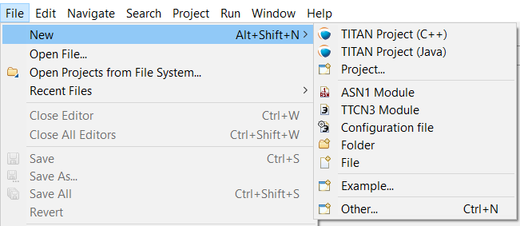
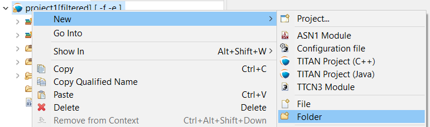
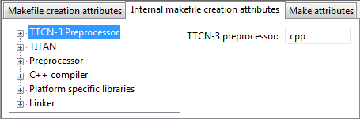
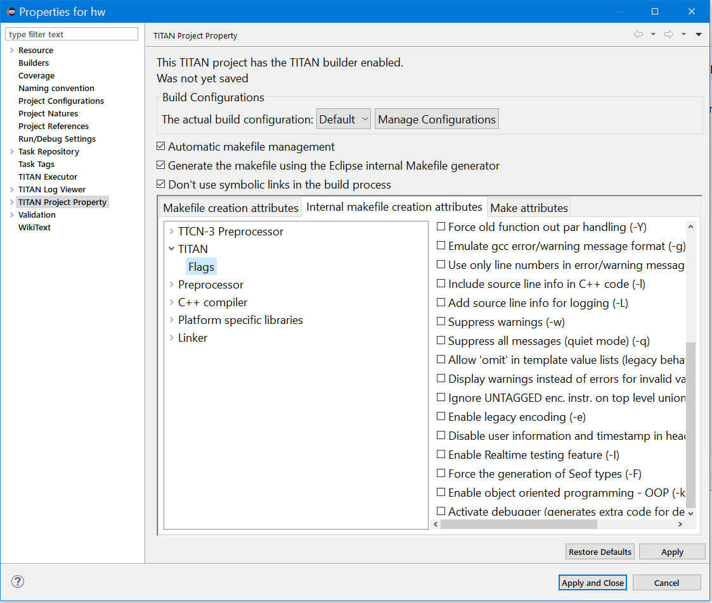
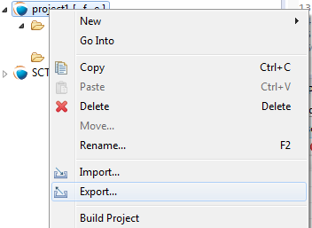
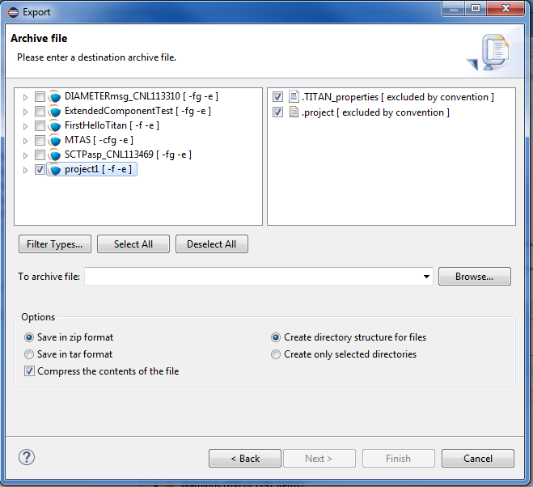

= Managing Projects
:toc:
:toclevels: 4
:figure-number: 26

In the TITAN Designer plug-in, you work with projects. A project usually represents the complex procedure of developing a test suite and creating the executable from this test suite.

To manage these projects, it is advised to use the Project Explorer view provided by Eclipse. 
Other views, like the Navigator view, can also be used; however, beginners shall take special care as those views might provide completely different data. 
For example, by default the Project Explorer does not show the `.TITAN_properties` file, while the Navigator view does. 
The role of the `.TITAN_properties` will be explained later in section <<Saving and Loading Project Properties>>

For advanced users it is advised to take also a look on the other navigators, as they might be better in solving some minor problems.

Projects that are handled by the TITAN Designer plug-in will be referred to as TITAN projects although in the Eclipse terminology they should be called TITAN natured projects. More information on natures can be found in the Eclipse documentation.

== Creating a New Project

Using the TITAN Designer, new TITAN projects can be created following these three steps:

1. Select *File / New / TITAN Project…* from the main menu (see <<new-resources-menu, the next figure>>).(The corresponding TITAN shortcut must be enabled, see section <<2-getting_started.adoc#_enabling_titan_shortcuts,Enabling TITAN Shortcuts>> )
+
[[new-resources-menu]]

2. Enter project name and location (see <<first-page-of-the-new-titan-project-wizard, the next figure>> ). 
By default, the project will be created in the directory of the workbench. 
It is not recommended to select a path that contains special characters (like the spaces in "Documents and Settings").
+
[[first-page-of-the-new-titan-project-wizard]]

3. At this point you can either select either *Finish* or *Next*.
+
If you select *Finish,* the new TITAN project will be created immediately.
+
If you select *Next,* you can customize some project properties (see the next figure): the name of the folder containing the sources, and the name of the working directory (containing the generated binaries).In case the project to be created will need a long time to set up, before it can be used it is possible to set that the source folder should be generated as excluded from build.

The final project is only created when you select *Finish*.

Now the new TITAN project (called `project1` on the figures) and the two directories are created and are listed in the Project Explorer. The TITAN logo is displayed to the left of the project name (provided that the TITAN decorator is enabled, see <<2-getting_started.adoc#_enabling_titan_decorations, here>>). TITAN projects will generally be decorated like this.

The projects created with this wizard differ from other "General" projects in that the TITAN nature and the TITAN builder (responsible for building the executable) are automatically set on them.

Once the new project is created the property page of that project will be displayed, so that it can be configured immediately. For more information on project properties please refer to section <<_setting_project_properties,Setting Project Properties>>  

== Adding Directories to the Project

Directories can be added to projects in the following way: 
*right click* the project where the directory should be added to and select *New / Folder* (see the next figure).

[[new-menu]]

In the <<new-folder-window,New Folder window>> there is a possibility to set:

* where the new folder will be placed;

* how the new folder will be called;

* whether the folder is a virtual folder ("Folder is not located in the file system (Virtual Folder)" see Eclipse general documentation)

* whether only a link to an existing folder will be established ("Link to alternate location (Linked Folder)") (This will appear in the Project Explorer just like a normal folder, but is actually a link to a folder).
+
NOTE: linked folders are handled entirely by Eclipse; no additional resource will be placed in the projects directory.

[[new-folder-window]]

Once the new folder created, you shall see something like shown on the <<new-file-created,Figure>>  (without the filename file1.ttcn).

[[new-file-created]]

== Adding Files to the Project

There are two ways to add files to a project. The first one, using wizards, is the recommended way to do it.

=== Using Wizards to Add Files to the Project

Wizards are available to create some of the TITAN modules 
footnote:[The terms "modules" and "files" are used interchangeably in this section.] (TTCN-3, ASN.1 and Configuration files). 
This functionality is reached by selecting *File / New* (see figure <<new-resources-menu,New resources menu>>).

In the Project Explorer view, the wizards "TTCN-3 Module", "ASN.1 Module" and "Configuration file" can be reached by **right click**ing the content area and selecting *New / Other…* .

In the example below, the "TTCN-3 Module" wizard is shown. The wizard is launched by selecting *File / New / TTCN3 Module*.

[[first-page-of-the-new-ttcn3-module-wizard]]
image::images/4_F33.png[title="First page of the New TTCN3 Module wizard"]

On the <<first-page-of-the-new-ttcn3-module-wizard,First page of the New TTCN3 Module wizard>> the correctness of the new module name is verified. The file extension is checked against the type of module being created. If the extension is not set, it is automatically appended when the file is created (the defaults are: `ttcn`, `asn` and `cfg` for the respective wizards). The on-the-fly checker, if it has enough data collected, verifies that a module name is unique in the project (right now this only works for TTCN-3 modules).

On the second page of the wizard there is a checkbox and a combo box:

* *Generate as excluded from build*.
+
If this checkbox is selected the file to be created is excluded from the build; that is, the build system will not try to build it instantly. It is advised to create new modules with this option turned on to avoid build errors until the code logic is complete.

* **Generate with module with this content**
+
This Combo box contains three options: Empty module name, Module name and empty body and Module skeleton. As the names suggest, the generated file will contain empty module or module containing only module name and empty body or a module skeleton.

NOTE: Configuration files may also be created with a skeleton.

NOTE: The filename will be used as the module name in the inserted module.

=== Manually Adding Files to the Project

Manual file addition has moderate means to set file properties compared to the wizard (see <<_using_wizards_to_add_files_to_the_project, here>>). 
On the other hand, some files can only be inserted into projects manually; 
namely the following way: *right click* on the project (or on a folder in the project) where the file should be included and select *New / File* 
(see <<new-menu,Figure New menu>> above).

On the <<new-file,New File>> window there is a possibility to set:

* where the new file should be placed;

* how the new file will be called;

* whether only a link to an existing file will be established (under selection menu *Advanced>>*)
+
(This will appear in the Project Explorer just like a normal file, but is actually a link to a file).

NOTE: Linked files are fully handled by Eclipse; no additional resource will be placed in the projects directory.

[[new-file]]

Once the file created, you should see something like shown on <<new-file-created,New file created>>. 
You have created a project, added a folder and a file to it.

NOTE: Files handled by the TITAN Designer plug-in also have the TITAN moon to the left of their names, just like projects do. Decorators used by TITAN Designer are described <<2-getting_started.adoc#_enabling_titan_decorations, here>>.

== Setting Project Properties

Project properties for local and remote build are set in two separate windows.

=== Build Configurations

Our projects support to have several "build configurations" or "sets of build settings". 
This means that it is possible to create sets of build settings, which can be switched to in an easy and consistent way.

One excellent usage tip would be, to have "Development" and "Release" modes for projects. 
Debug could have settings tuned for very fast compilation, at the expense of generating slowly executing code: 
This way development could be sped up considerably while only loosing features not relevant at development time. 
Release mode could be fine-tuned for runtime performance, at the cost of increase in build times. 
This way once the development is over, and the product is ready to be tested/investigated/used, 
the build system could be set to use the most aggressive optimization methods available.

[.underline]#Changing the active build configuration# is available on all project preference pages, in the upper part of the window, 
as seen on Figure <<makefile-creation-attributes,Makefile creation attributes>>.

Using the drop-down control, one can select and switch to any already existing build configuration created for the actual project.

Pushing the *Manage Configurations* button a new window will pop-up.

On this window it is possible to create new configurations, delete existing ones, or simply rename one.

[NOTE]
====
Even though the settings of the Default configuration can be changed it cannot be deleted or renamed, the existence of this configuration is needed to be forward compatible with older versions of our tools.

[.underline]#The build configuration name cannot contain whitespace character.#

[.underline]#The visible build configuration settings always refer to the active build configuration.# To change a build configuration at first it shall be selected as active configuration, then some of the settings described below shall be modified then the settings shall be saved by pushing the button "Apply" or "OK".
====

[[setting-the-local-build-properties-of-a-project]]
=== Setting the Local Build Properties of a Project

To set the project properties for local build first *right click* the project and select *Properties* then select *<<makefile-creation-attributes,TITAN Project Property>>*.

On the main window three options can be set:

* Automatic Makefile management
+
configures the TITAN Designer to automatically manage the `Makefile` 
+
NOTE: disabling the automatic `Makefile` management makes it the users’ responsibility to update the file when it is needed. 
In case it is unchecked, the buttons on the *Makefile creation attributes* tab and on the *Internal makefile creation attributes* tab will be disabled; +
Default: selected.

* Generate the Makefile using Eclipse internal Makefile generator.
+
figures the TITAN Designer to use its own `Makefile` generator instead of the one provided by TITAN; +
Default: selected

* Don’t use symbolic links in the build process
+
Figures the internal Makefile generator and the builder to drive the build process in a way that does not requires the creation of symbolic links.
+
NOTE: This option requires the internal Makefile generation option to be set; +
Default: selected.
[[makefile-creation-attributes]]

[[the-makefile-creation-attributes-tab]]
==== The Makefile Creation Attributes tab

Information from the *Makefile creation attributes* tab is transferred to the `Makefile` generator program. The options of the `Makefile` generator are described in the TITAN Programmer’s Technical Reference <<12-references.adoc#_4, [4]>>.

The following Makefile creation attributes are set on this tab:

* **Use absolute pathnames in the Makefile**
+
Specifies whether the generated `Makefile` should contain absolute or relative pathnames. Default: not selected.

* **Generate Makefile for GNU make**
+
If checked, a GNU `Makefile` will be generated during the building process. The gnu make utility can handle complex `Makefile` that the Solaris make cannot. Default: selected.

* **Generate Makefile with incrementally refreshing dependency**
+
If checked and GNU make style `Makefile` generation is also set, the generated `Makefile` will use GCC’s dependency tracking instead of makedepend. For more information, please refer <<6-building_the_project.adoc#creating-dependencies, here>>. Default: selected.

* **Link dynamically**
+
If checked, all files of the project will be compiled with `–fPIC` and for each (static) object, a new shared object will be created. Then, these shared objects will be linked to the final executable instead of the (static) objects. For more information, pros and cons etc. consult the TITAN Programmer’s Technical Reference <<12-references.adoc#_4, [4]>>. Default: not selected.

* **Generate Makefile for use with the function test runtime**
+
Titan has two runtime environments: one for function testing and one for load testing. The function test runtime provides more runtime checks and supports some specific features, like the negative testing feature, that is not available in the load test runtime. Therefore, for projects aiming functional testing, it is also advised to check the "generate `Makefile` for use with the function test runtime" checkbox. Default: not selected
+
NOTE: all dependent projects ("Project References" in Eclipse's term) shall use the same Titan runtime.

* **Generate Makefile for single mode**
+
If checked, the executable will be built for single mode execution. Only one test component is allowed in single test mode. In parallel mode, on the other hand, several components can be used. Default: not selected.

* **Code splitting**
+
Configures how the generated code should be organized: *none*, *type*, *number*. By default it is set to be: *none*.

* **Default target**
+
Configures the default target of the generated `Makefile`:
+
- *Executable:* Executable test suite
+
- *Library:* Library archive

* **Name of the target executable**
+
The path of the executable to be built including the name of the file. This setting will be written into the `Makefile` generated by the builder and will also be used for execution. If it is not set, the executable will be generated in the working directory having the name of the project.

[[the-internal-makefile-creation-attributes-tab]]
==== The Internal Makefile Creation Attributes Tab

On the Internal makefile creation attributes tab the options to be generated into the `Makefile` can be set. To change the value of an element it must be selected. Depending on the element selected on the left side, the right hand side of the tab will contain different options.

. TTCN-3 Preprocessor
+

+
On the TTCN-3 Preprocessor page it is possible to specify the preprocessor tool used to pre-process the .ttcnpp and .ttcnin.
+
This will be applied to the *CPP* macro. By default it is set to be: *cpp*
+
The pre-processing of .ttcnpp and .ttcnin files is the very first step of the build process, as the compiler is not able to analyze these file formats.

. TTCN-3 Preprocessor Symbols
+

+
On the symbols page it is possible to specify the list of symbols that should be defined and the list of symbols that should be undefined when the TTCN-3 pre-processor tool is executed.
+
These lists of options are applied to the *CPPFLAGS_TTCN3* macro (only present if pre-processable files are used in the project). By default both lists are empty.

. TTCN-3 Preprocessor Included Directories
+

+
On the included directories page, it is possible to specify the list of directories where the TTCN-3 pre-processor can look for included files.
+
The list of options is applied to the *CPPFLAGS_TTCN3* macro (only present if pre-processable files are used in the project). By default the list is empty.

. TITAN Flags
+

+
On the TITAN flags page, it is possible to specify the flags TITAN should be called with when compiling the TTCN-3 and ASN.1 files.
+
The options will be applied to the *COMPILER_FLAGS* macro. By default only the *Include source line info in {cpp} code* and *add source line info for logging* options are set.
+
NOTE: The flag responsible for function or load test runtime generation is not set here, but on the Makefile creation attributes (as that flag is handled by the Eclipse external `makefile` generator too).
+
For more information on the meanings of these options please refer to section 5.1 of the TITAN Programmer’s Technical Reference guide <<12-references.adoc#_4, [4]>>.

. Preprocessor
+

+
The Preprocessor page only functions as reminder to the fact, that the generated `Makefile` uses the same tool for pre-processing the .ttcnpp, .ttcnin and C/{cpp} files.

. Preprocessor Symbols
+

+
On the preprocessor symbols page, it is possible to specify the list of symbols that should be defined and the list of symbols that should be undefined when the C/{cpp} pre-processor tool is executed.
+
These lists of options are applied to the *CPPFLAGS* macro.By default both lists are empty.
+
NOTE: There are a few symbols that are not displayed here, but are generated into the `Makefile`. These symbols are required for proper operation.

. Preprocessor Included Directories
+

+
On the included directories page, it is possible to specify the list of directories where the C/{cpp} pre-processor can look for included files.
+
The list of options is applied to the *CPPFLAGS* macro. By default the list is empty.
+
NOTE: Some directories (like the include directory of TITAN) are not displayed here, but are generated into the `Makefile`. They are required for proper operation.

. C/{cpp} Compiler
+

+
A C/C\++ compiler tool used to process the generated and the user provided C/{cpp} files can be specified on the C/{cpp} compiler page.
+
This will be applied to the *CXX* macro. By default it is set to be: *g++*

. C/{cpp} Compiler Optimization
+

+
The C/{cpp} compiler optimization page allows the specification of optimization options for C/{cpp} compiler.
+
The optimization level option can be: none, minor optimizations, common optimizations, optimize for speed, optimize for size. By default it is set to: common optimizations.
+
The other optimization flags option allows the specification of any user defined optimization flag that is supported by the C/{cpp} compiler.
+
Both options will be applied the *CXXFLAGS* macro.
+
NOTE: The *–Wall* option is not displayed here, but is generated into the `Makefile`. It is required for proper operation.
+
For more information on the optimization flags please refer to the documentation of your C/{cpp} compiler. In case of the default C/{cpp} compiler g\++ is the manual pages of g++ (invoked with the *man g++* command line command).

. Platform Specific Libraries
+

+
On the platform specific libraries pages it is possible to specify the list of platform specific libraries that are needed to build the final executable for each supported platform.
+
The list of platform specific libraries is applied to the *SOLARIS_LIB*, *SOLARIS8_LIBS*, *LINUX_LIBS*, *FREEBSD_LIBS* and *WIN32_LIBS* macros respectively. By default all lists are empty.
+
NOTE: Some libraries are not displayed here, but are generated into the `Makefile`. These are required for proper operation on the above platforms.

. Linker
+

+
The Linker page only functions as reminder to the fact, that the generated `Makefile` uses the same tool for compiling C/{cpp} sources and linking the generated object files.

. Linker Libraries
+

+
On the linker libraries page it is possible to specify

* additional object files,
* the list of platform independent libraries (-l switch) and
* library search path (-L switch)
+
that are needed by the linker to produce a valid executable.
+
These lists of options are generated directly into the command responsible for creating the final executable. By default the lists are empty.
+
NOTE: In list of the library search paths (-L), environment variables can be used. If the form `[MYVAR]` or `$\{MYVAR}` is used, the value of `[MYVAR]` or `$\{MYVAR}` will be resolved, if it is possible, while generating `Makefile`. Any other form will be regarded as a path relative to the project folder and will be prefixed with the project path.
+
In order for the generated `Makefile` to work and the project to compile properly there are some libraries and search locations not displayed here, but generated into the `Makefile`.
+
If the *Disable the entries of the predefined libraries* option is selected only the search paths related to *TTCN3_DIR* will be generated, all other libraries and search paths are left out of the generated `Makefile`. For example, in the generated Makefile, lines
+
[source]
----
OPENSSL_DIR = $(TTCN3_DIR)
XMLDIR = $(TTCN3_DIR)
----
+
will be commented out and their usage will be omitted.
+
By default, this option is not selected.

. Linker Options
+

+
On the page "Linker Options" you can select different linker options. These will be added to the value of LDFLAGS in the Makefile.
+
The first option is to use the GNU "gold" linker instead of the regular one. If it is selected the text "`-fuse-ld=gold`" will be added to the value of LDFLAGS.
+
The second option is a free text. It also will be added to the value of LDFLAGS without any checking. Use it carefully!

==== The Make Attributes Tab
[[make-attributes]]

Figure Make attributes

On the <<make-attributes,Make attributes tab>> the following attributes are set:

* **The path to the Makefile updater script**
+
Points out a shell script that will be run to modify to the generated Makefile. The field is checked for validity: if not empty, it must point to an existing file.

* **Build level**
+
Specifies the project build level. For more information, please refer chapter <<5-converting_existing_projects.adoc,Converting Existing Projects>>.

* **Make flags**
+
Specifies the make command suffixes.

* **Working directory**
+
specifies a directory used by the build operations: symbolic links and generated files will be placed in this directory. This field is checked for validity.

In our resource based project representation it is impossible to tell which files are source files and which ones are generated files. For this reason, we assume that every file in the working directory is a generated file and every file outside the working directory is a source file (if it is not excluded from build). For this reason, the user is forced to set a working directory, or otherwise we wouldn’t know which files to build.

NOTE: if the provided directories are in the project, either as actual directories or linked folders, the generated files can be seen from the workbench.

=== Setting Project and Folder Level Naming Convention Settings

image::images/4_F53.png[title="Project level naming convention settings"]

On the project and folder level it is possible to override the general workspace level naming conventions. This option can be used to further constrain the naming conventions, for example to include some project specific constants.

These are same options that are available as on the workspace level.

The overriding rules are evaluated in the following order:

. We start from the folder immediately containing the module in question.
. We walk search the folder hierarchy upwards to the project either till we find a folder that overrides the naming conventions or till we reach the project.
. If the folder overrides the naming conventions, we use the settings found there.
. If we reached the project and it overrides the naming conventions, we use the settings found there.
. If we reached the project, but even the project itself is not overriding the naming conventions we will use the workspace level settings.

NOTE: It is suggested to switch off checking the naming convention because it significantly decreases the speed of the analysis. It should be switched only on at code cleaning.

[[setting-requirements-on-the-configuration-of-referenced-projects]]
=== Setting Requirements on the Configuration of Referenced Projects

On this page it is possible to set for each project, directly referenced by the actual one, a requirement on its actual configuration. If the actual configuration on the given project is not the same as the required one it will cause a build error. This way it is possible to have fairly large project hierarchies, while still being able to consistently support build configuration for each project.

To change the requirement for a project either *select it* in the list and click on the *Edit…* button, or *double click on it* in the list.

On the window that pops up (Figure 56) it will be possible to select a configuration, from all of the configurations configured for the selected project.

NOTE: Both in the list and on the requirement selection window the "*<No requirement>*" option is displayed if there is no requirement set for that given project at this time. If you wish to disable a previously set requirement, you have to select this option.

=== Setting the Remote Build Properties of a Project

Remote build enables building of source codes:

* on several different machines;

* on several platforms;

* in several different directories;

* with several different build settings;

* using all of the above possibilities at the same time.

On this property page one or more hosts can be chosen to build the project remotely. The modalities of the remote build process on these hosts are also set.

To set the project properties for remote build first *right click* the project and select *Properties* than select *Remote build* on the left pane(Figure 57). (If *Remote build* is missing from the left pane, *left click* the triangle sign next to the *TITAN Project Property*; see Figure 52.)

The checkbox *Execute the build commands in parallel* controls how the provided build commands should be executed.

* If this option is NOT CHECKED (this is the default), the build commands will be executed serially, that is, one by one.

* If this option is CHECKED, the build command will be executed in a parallel fashion, meaning that each execution will start at the same time.

NOTE: The majority of the build systems requires exclusive access to the intermediate files (this is the reason why NOT SET is the default), otherwise the build process might become corrupted (this can happen for example when an intermediate file built with GCC 3.4 and another built with GCC 4.0 is linked together).

Remote build hosts have three attributes:

* *Active*
+
This attribute indicates whether the host should be included in the next remote build session or not.

* *Name*
+
This attribute shows the name of the host. It is only used to provide feedback to the user about the progress of the build processes. It doesn’t need to be unique.

* *Command*
+
This attribute contains part of the command that will be executed in the remote build process. The string inserted will be prefixed with sh –c before executing it. The default attribute content is `rsh <[user@]hostname> -n 'cd <working directory>; make dep; make',` and the string inserted must follow this pattern.

The user can control the build hosts using the buttons to the right from the table.

The *New…* button is used to create a new remote build host. It brings up the remote build host configuration window (Figure 58), where the properties of the new build host can be set. The new build host will be added to the end of the list of build hosts. Host creation can be cancelled by pressing the *Cancel* button, while the new host data is validated by pressing the *OK* button.

The *Edit…* button is used to edit the attributes of an existing remote build host. Before pressing the button, the host to be edited must be selected from the table. By pressing the button, the remote build host configuration window (Figure 58) will appear, showing with the current properties of the selected host. Changes made to the host can be revoked by pressing the *Cancel* button, while modifying the host is done by pressing the *OK* button.

The *Copy…* button is used to create a copy of an already existing host. Pressing this button will create an exact copy of the currently selected host. This way of creating a new host can be beneficial for example when the build command of the new host only slightly differs from the build command of the source host. Copying is abandoned by pressing the *Cancel* button, while it is confirmed by pressing the *OK* button.

The *Remove…* button is used to remove an existing host from list of remote build hosts. The command is abandoned by pressing the *Cancel* button, while it is confirmed by pressing the *OK* button.

NOTE: The saving of every change done on this page is validated by pressing the *Apply* or *OK* buttons at the bottom on the property page (Figure 57).

==== Pitfalls

In case the rsh command is not present one should use the ssh command instead. In this case the default command to start from should be: `ssh –n <[user@]hostname> 'cd <working directory>; make dep; make`

As there is no way to enter a password when logging in to a remote machine, it is of crucial importance to set the login mechanism of the remote machine, to not require a password on login.

[[excluding-files-and-folders-from-the-build-process]]
== Excluding Files and Folders from the Build Process

A file or a folder excluded from the build process won’t be placed into the generated `Makefile`. For this reason, once an exclusion or inclusion has taken place, the `Makefile` and the symbolic links are updated (provided that automatic `Makefile` management is enabled for the project).

Excluding a folder from the build process also means that every file and subfolder contained in that folder will be excluded, too.

If a file or folder is excluded from build, its name is decorated with the string `[excluded]`, provided that TITAN decoration is enabled (see <<2-getting_started.adoc#_enabling_titan_decorations, here>>).

=== Excluding a File from the Build Process

A file can be excluded from build or included in the build in two different ways described below.

NOTE: There are some special files that can never be included into the build. In Eclipse these are project related plug-in resources, which by convention never have a name, just an extension, for example `.TITAN_properties`. Such files (that don’t have a name), are always excluded from build, no matter how their property is set.

To access File properties (the first alternative): *right click* the file and select *Properties*. On the *Properties for …* window, select *TITAN File Property*. Here the exclusion state of the file can be set via ticking the *Excluded from build* box.

To access the Pop-up menu (the second alternative), *right click* the fileand select *TITAN / Toggle exclude from build state*. This method has the advantage that the exclusion state of several selected files can be changed all at once.

=== Excluding a Folder from the Build Process

A folder can be excluded from build or included in the build in two different ways described below.

NOTE: There are some special folders that can never be included into the build. In Eclipse by convention folders having a name which starts with a . (dot) are used for storing special files or folders, that one or more plug-ins might temporarily create. Such folders and for this reason their whole content is always excluded from build, no matter how their property is set.

To access Folder properties (the first alternative), *right click* the folder and select *Properties*. On the *Properties for …* window, select *TITAN Folder Property*. Here the exclusion state of the folder can be set via ticking the *Excluded from build* box. (The other checkbox, *Folder is in central storage*, is described <<converting-a-folder-into-a-central-storage, here>>.)

image::images/4_F62.png[title="TITAN folder property"]

To access the Pop-up menu (the second alternative), *right click* the folderand select *TITAN / Toggle exclude from build state*. This method has the advantage that the exclusion state of several selected folders can be changed all at once (see Figure 61 above).

[[converting-a-folder-into-a-central-storage]]
== Converting a Folder into a Central Storage

A folder marked as Central Storage is assumed to have its own `Makefile`. For this reason, when this property of a directory is toggled, the `Makefile` and the symbolic links are updated (provided that automatic `Makefile` management is enabled for the project). For description of the Central Storage concept, please refer to the TITAN User Guide (<<12-references.adoc#_3, [3]>>), section 11.3.1.

A directory’s Central storage property can be toggled the following way:

*Right click* on the folder, select *Properties* and in the *Properties for …* window click *TITAN Folder Property*. Here the central storage state of the folder can be toggled via ticking the *Folder is in central storage* button (Figure 62).

== Opening and Closing Projects

A closed project cannot be edited; even its contents are hidden. This is useful to decrease memory occupation and computational load: a closed project does not use any resources.

In Eclipse, projects can be opened and closedby *right clicking* the project and selecting *open project* respective *close project*.

== Saving and Loading Project Properties

There is no need to save or load the project properties file, as this is done automatically. When files or folders are added or removed, or their properties are changed, the TITAN Designer plug-in automatically saves the new properties into the `.TITAN_properties` file, which always resides in the root directory of the project. When the content of this file is edited and saved, or when the TITAN Designer plugin starts up noticing that files were changed while it was not active, then it automatically loads the file’s contents and modifies the resources properties accordingly.

Besides the obvious use this is useful if more people are working on the same project. Someone updates the properties of the resources and sends the file to the others; when the recipients save the file the properties of their resources will be updated automatically.

== Importing and Exporting Projects

Importing and exporting projects can be done in many ways in Eclipse. Out of those 3 will be shown in detail: a native way, one using the TITAN project descriptor format, and a way to import project from the old mctr_gui format.

It is important to turn off automatic building and to refresh the project before importing and exporting. Because of the changing nature of the projects, it can be expected that there will always be files which are out of synchrony with the file system. Importing and exporting can only be done if every file in the project is in synchrony with their file system counterparts.

NOTE: Exporting and importing without archiving is almost exactly the same.

The following steps should be done before exporting a project:

. Automatic building should be turned off, so that further operations will not invoke any build related functionality.
. Optionally the project should be cleaned to reduce the size of the exported data.
. The project should be refreshed (*right click* the projectand select *Refresh*), to synchronize the files and the file system.

=== Exporting Projects in Native Format

To export a project using a native way, for example into an archive file, follow the steps described below:

. *Right click* the project to be exported and select *Export*.
+

. On the *Export* window select *General / Archive File* and press *Next*.
+

. Fill in the fields in the *Export Archive file* wizard.
+
NOTE: it is advised to export every file related to the project, and also to export only those files in the archive which belong to the project.
+

NOTE: This will export the whole project: not just the information on settings, but also the files and folders themselves.

=== Importing Projects from Native Format

To import a project from a native format, for example an archive file, follow the steps described below:

. *Right click* somewhere in *Project Explorer* and select *Import*, as shown on Figure 63 above.
. On the *Import* window select *General / Existing Projects into Workspace* and press *next* (below).
+

. In the *Import Projects* wizard select the archive to import from. Eclipse will list the projects the archive contains. Select one or more of them and press *Finish*.
+

[[importing-an-existing-mctr-gui-project]]
=== Importing an Existing mctr_gui Project

To import a project from an existing mctr_gui project file follow the steps described below:

. *Right click* somewhere in *Project Explorer* and select *Import*, as shown on Figure 63.
 On the *Import* window select *TITAN / Project from .prj file* and press *next* (below).
+

. On the *Import new TITAN Project from .prj file* wizard select the original project file to import from and press *Next*.
+

. Select the name and location of the new project to be created.
+

+

. On the last page of the wizard it is possible to select whether included projects (if any exists) should be imported automatically or not.

The wizard will now create the new project, populate it with the files referring to the ones provided by the mctr_gui project file and set all options for the project which can be transferred.

For more information on how the project is converted to this format please refer <<5-converting_existing_projects.adoc#convert-an-existing-mctr-gui-project-using-an-import-wizard, here>>.

[[importing-files-as-linked-resources]]
=== Importing Files as Linked Resources

Linked resources are files and folders which are not physically copied into the Eclipse workspace nor linked as soft or hard linked there (at least not into the source folder just later into the build folder under the building process). Linked resources are stored primarily internally in the Eclipse. When linked resources are modified, the original files will be modified. This is the most useful ttcn source file handling method.

To import folders and files as "linked resources" follow the steps described below.

. Create an empty project without src subfolder according to <<_creating_a_new_project, this section>>. The project name should be the same as the name of the project to be imported.
. Right click on the project name and select *Import*, as shown on Figure 63 above. On the *Import* window select *General / File System* and press *Next* as shown on below.
+

. In The Import File system dialog select *Browse* near to field *``From directory''* (as seen below) then find and select the src folder of the project to be imported.
+
image::images/4_F73.png[title=""]
. Click on the button "*Advanced>>*" in the "Import file system" dialog, select the options "*Create link in workspace*" an unselect options "*create virtual folders*" and "*create link locations relative to:*" as shown on below.
+

. Push Finish. The src folder appears under the project name in the Project Explorer as linked resource (the icon before the src contains a little link arrow) as shown below.
+

[[exporting-projects-into-the-titan-project-descriptor-tpd-format]]
=== Exporting Projects into the TITAN Project Descriptor (tpd) Format

Exporting only project information into TITAN project Descriptor (tpd) format can be performed manually or automatically.

[[exporting-project-manually-into-the-titan-project-descriptor-tpd-format]]
==== Exporting Project manually into the TITAN Project Descriptor (tpd) Format

To export the project information into a tpd file, follow the steps described below:

. *Right click* on the project to be exported and select *Export*.
. On the *Export* window select *TITAN / TITAN project settings* and press *Next* (see the figure below):
+

. Select the file where the information should be exported to, and press *Next* (see the next figure).
+

. On the options page fine tune the amount of data to be exported and press *Finish*.
+

The available options are:

* *Do not generate information on the contents of the working directory:*
+
If the working directory is visible inside Eclipse, inside the project, its contents are by default also mentioned in the project description. As the working directory usually contains only generated files, that can be reproduced later, this behavior is not always desired. Its default value is on.

* *Do not generate information about resources whose name starts with a ".":*
+
In Eclipse this naming convention is used to signal that a resource stores some tool specific options about the project. As such, from the point of view of TITAN, they are not needed. Its default value is on.

* *Do not generate information on resources contained within linked resources:*
+
In many cases such links are intentionally used to connect to an existing folder whose content might change externally. For example, version handling of files can also be done like that.
+
NOTE:  It is recommended to use this feature with care: as there is not much connection between the Eclipse internal resource system, and the file system, the activation of this option can cause unexpected side effects. Its default value is on.

* *Save default values:*
+
By default we do not include any information on any option/setting in the descriptor file, which has its default value as the actual one. This makes for a very compact description, but in cases where all information needs to be saved, this might not be ideal. Its default value is off. If it is switched on, the size of the tpd file is unnecessarily big. This is not a problem but perhaps it is not so easy to analyze by the user.

* *Pack all data of related projects:*
+
Project references in Eclipse are a great way to structure one’s work into manageable pieces. However, if one of those projects is not available, building the whole set is not possible. For this reason, it is possible to save all information from all required projects into one project descriptor. Its default value is off.

* *Export tpdName attribute to referenced projects:*
+
If this option is on, then the referenced projects will have a `tpdName` attribute. The value of the `tpdName` attribute by default is the project’s name and the .tpd suffix. If the referenced project had a `tpdName` attribute during the import, then that value will be stored.By default this option is on, if the project was imported from a `tpd` file using `–I` switches.

The default settings can be changed under *Window / Preferences / TITAN Preferences / Export* (see <<3-setting_workbench_preferences.adoc#export, here>>).

For more information, related to this file format, please refer to section 8 of the Programmer’s Technical Reference guide.

==== Exporting Projects automatically into the TITAN Project Descriptor (tpd) Format

The automatic export of projects can be set on workspace level. The fine tuning of the information can be set. It can be set to ask/request the location of the tpd file when the first automatic save happens.

To export your projects automatically, follow the steps below:

. Select *Window / Preferences / TITAN Preferences / Export*. An option dialog appears (see <<3-setting_workbench_preferences.adoc#export, Figure Export options>>).
. Switch on the option "Refresh tpd file automatically".
. Switch on the option "Request new location for the tpds at the first automatic save" if your projects to be automatically saved have not been saved yet or if you want to change the location of your tpds when importing them.
. Optionally change the options in the group "Fine tune the amount of data saved about the project" if it is necessary. (It is not suggested.)
. Press *Apply* or *OK* to save the settings.

=== Importing Projects from TITAN Project Descriptor Format

To import a project using an existing TITAN project descriptor file follow the steps described below:

. *Right click* somewhere in *Project Explorer* and select *Import*, as shown on Figure 63.
. On the *Import* window select *TITAN / Project from new project file* and press *Next* (below).
+

. On the *Import new TITAN Project from .tpd file* page select the original project file to import from. There is an optional field where search paths can be entered in the format of `–Ipath` where path must be an absolute path. The mechanism of the `–I` flag is described in the Referred project usage with `–I` switch in the TITAN Reference guide see ref. <<12-references.adoc#_4, [4]>>.
. Press *Next*.
+

. On the options page select how the importer should behave in certain situations.
+

Available options:

* *Open the preference page for all imported sub projects:* By default the page where the project preferences can be configured is only displayed for the top level project, referenced projects don’t trigger this mechanism. However, if several projects are imported it can be useful to open this page for each of them.

* *Skip existing projects on import:* This is important when a project with a name, which is about to be loaded as a referenced project, already exists in the workbench. By default, there will be no warning, and the importation of that project will not take place.

=== Useful Tips for Exporting and Importing

[[pitfalls-1]]
==== Pitfalls

During the importation there might be several behaviors which might look strange at first.

When importing a project description containing Eclipse path variables, we will ask permission from the user to add new variables, or in case the variable exists with a different value, override variables in his system.

However, if the project description does not store, or the user does not add the necessary Eclipse path variable to his own system, this will not be treated as an error by our tool. Instead either the platform, or any other tool trying to access a resource being unavailable, will report this error.

If a project with the same name to be loaded already exists:

* If it is the top level project the user will be asked to change the name.

* If it is not the top level project the default is to silently ignore the import request, as the project is already imported.

* If it is not the top level project and the user asked not to skip existing projects, the name changing dialog will be displayed. Upon name change all references to the new project will use the new name.

It is worth to mention, that in order to re-import a project from a project descriptor file, it is required to first delete the actual project. It is not supported to overwrite the current contents automatically.

As an example, in the `mctr_gui` the process of closing the user interface and re-opening it while loading the same project, will load the newest version of the project description (and if it is not saved it will also lose all intermediate changes). However, as the closing of Eclipse does not change any state of the imported projects, after re-opening it, the original project with the original settings will be present. In order to load the new settings, the old project has to be explicitly removed from the working environment.

For more information, related to this file format, please refer to section 8 of the Programmer’s Technical Reference guide.

==== Native Export and Import

If your projects contain absolute pathnames, the project can be natively exported and then imported only if the places defined with their absolute paths are visible from the new workspace. This is a strong requirement/restriction but it can be satisfied within the same group or working environment. But in that case why should the project be compressed, relocated and uncompressed?

==== Exporting and Importing Project Information and Projects via TPD Files in Case of Complex Projects

All project information can be stored in TPD files as it is described in the previous subchapters but not all way of working achieves portability. The next method is applicable for projects of any complexity.

Terminology:

*Source root folder or root folder* is the folder which contains all source files of all projects. For example, for ClearCase titan users it can be /vobs/ttcn/TCC_Releases.

*Workspace* is the Eclipse workspace. It is a folder containing Eclipse related project information (and generally it can contain even source files).

*Source project* is a project of our complex project. It is stored in a subfolder of the source root folder. The name of the source project is the name of its containing folder.

General requirements

. The projects should be handled from bottom to top, precisely string from the projects independent from any others.
. The Eclipse workspace and the folders containing the project and the source code shall be totally disjoint (they shall not have any common element).

Suppose that the source codes are created and hierarchically stored under the source root folder. Follow the steps for each project of our complex project.

. Create an empty project in the workspace with the same name as the source project (see <<_creating_a_new_project, here>>).
. Import the src folder of the project as linked resources according to <<importing-files-as-linked-resources, this section>>.
. Fill in project properties according to <<setting-the-local-build-properties-of-a-project, this section>>.
. Export project properties into tpd according to <<exporting-projects-into-the-titan-project-descriptor-tpd-format, this section>>.
+
NOTE: The target place should be the folder of the original project where the project was imported from.
. Import the tpd file from the source project into the Eclipse project.
. Export the project into tpd as in step 4.
+
NOTE: This way the new tpd will contain the information about itself. It is extremely important if the whole set of project should be exported as a compressed file for example to send to a test lab as a product or to the TITAN support to report a bug.

==== Exporting Project Content from Command Line Using TPDs

To export the content of whole project sets if each project has a tpd, follow the steps described below. 
Unix environment is required.

. Go to the folder of the top level source project.
+
NOTE: It is located in the source root folder not in the workspace!
. Use this command from command line:
+
....
ttcn3_makefilegen -V -P rootdir_to_split -t top_level_tpd.tpd | xargs tar cfz my_target_tar.tgz
....
+
for example:
+
....
ttcn3_makefilegen -V -P /home/ethbaat/DiameterApplib/Diameter_Applib_2013_03_01 -t Libraries/EPTF_Applib_Diameter_CNL113521/EPTF_Applib_Diameter_CNL113521.tpd | xargs tar cfz DiamAppLibTest.tar.gz
....

[NOTE]
====
The compressed file will contain the files in the same structure as they have been stored in the source root directory.

See more information about the command ttcn3_makefilegen in sections 6.1.2 and 6.1.3 in TITAN Programmer’s Technical Reference for TITAN TTCN-3 Test Executor <<12-references.adoc#_4, [4]>>.
====

== Formatting Log Files

To format a log file (one having log as extension) *right click* the fileand select *TITAN / Format log*.

This will produce a formatted log file in the very same directory, with the same name, but having the extension formatted_log.

NOTE: For the duration while the formatted log is being created progress indication is provided in the *Progress view*.

== Merging Log Files

To merge several log files (ones having log as extension) select them, and after right clicking on one select TITAN / Format log.

This will first ask for the file where the results have to be saved, processing the log files will only start after a new or an existing files is selected.

NOTE: For the duration while the formatted log is being created progress indication is provided in the *Progress view*.

[[using-project-references]]
== Using Project References

In Eclipse for the creation of a hierarchy of projects building on other projects we can use project references (Figure 81).

When a project references another project, this means for Eclipse that all of the resources of the referenced project are available for use in the referring project. For example if Project_2 is referencing Project_1:

* All modules available in Project_1 can be used in Project_2 too (for importation, code completion …).For the on-the-fly toolset is will seem as if those modules were also part of Project_2.

* The order in which Project_1 and Project_2 are built will always be handled automatically:

* If Project_1 changes, Project_2 will be refreshed too.

* If Project_2 is built Project_1 will also be built, but only if it has also changed since the last time it was built.

* When Project_2 is built, it will not attempt to build the modules from Project_1 again, but rather use their already built form from the working directory of Project_1.

NOTE: Project reference hierarchies are not limited to 2 projects they can contain any number of projects.

Project references for one project can be managed in the following way: *right click* the project whose references should be changed and select *Properties / Project References.* Adding or removing a reference to a project can be done by simply selecting or unselecting to projects the references should point to.

NOTE: These references are operating system and file system independent. This means that it is possible to connect projects coming from different physical locations / version handling systems … as long as each is project is set up to work correctly within its own rules.

== Mapping Elements of the Old Format

The elements of the old GUI can usually be mapped to the new GUI as folders. So, for example, a testports folder should be created in the project, and the files of testports should be placed there. This provides the users with much more configurable project hierarchy, as they can organize their sources as they wish.

Included projects can be generally mapped to simple or linked folders, provided that the central storage property of the folder is set (see section 4.6). Included projects are fully functioning projects that can be built separately, but are included in the actual project because they provide some useful features. Generally speaking, they are folders (projects are practically stored separately), which might be linked (as they are expected to be on a different computer in the network, if they are just local folders then they can be mapped to local directories) and they have their own `makefile` (because they can be built separately).

NOTE: Linked folders with their central storage property set provide the same features.

Automatic conversion between the old and new format is not a part of the TITAN Designer plug-in for the time being.

== Common Threats

There are some very dangerous operations related to project management in Eclipse.

These are "good to have" features in a general sense, and they also provide more flexibility, but if someone misuses them, then it is sometimes impossible to revert the situation to its original state.

=== Disabling, Removing or Corrupting the Builder of the Project

This may happen when editing the `.project` file, where Eclipse stores the natures and projects associated to the given project. Any modification of the `.project` file is discouraged.

Repair can be attempted using the functionality *Toggle TITAN project nature*. It can be activated by *right clicking* the projectand selecting *TITAN / Toggle TITAN project nature*. As shown on Figure 80, this functionality is used to add the TITAN nature and TITAN builder to (or to remove them from) a given project. Removing is useful if only the builder was removed; the user should then first remove the nature from the project, and thereafter add it back together with the builder.

NOTE: the result of this problem (or its repairing) can result in losing every project specific settings. So these settings must be checked after using this functionality.

=== Removing or Corrupting the Nature of the Project

This problem is almost exactly the same as the one mentioned just above: editing the `.project` file is probably its cause. The possible remedy is also the same.

=== Adding or Removing Resources from the Project

Modifying project resources in the operating system (outside Eclipse) can temporarily create problems for the users as the project structure they see might not be the actual one.

This problem can be solved easily: *right click* the project and select *Refresh*. Eclipse also does similar operations regularly.

== Make Archive

It can happen that the source code shall be sent to another team member or to the Titan support team to debug.

This can be done

* by exporting the whole project (by right clicking on the project, selecting the option *Export…> General>Archive File*) or

* by executing the command "make archive" from the Eclipse IDE. It can be executed if the Makefile exists in the working directory and a UNIX shell can be executed. Right click on the name of the project and select the option *Titan>Make archive*. The command ``make archive'' will be executed in the working directory and a backup directory will be generated in it. This directory will contain a tgz file including the source files, the Makefile and optionally the tpd file.

