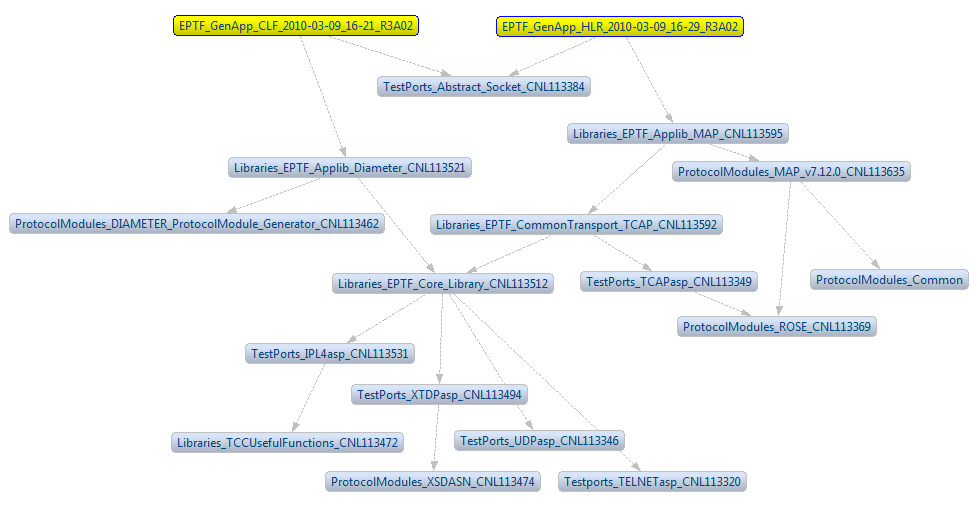

= Converting Existing Projects
:toc:
:figure-number: 87

In the TITAN toolset we are supporting 3 different tools/project handling principles at this time: Makefiles, mctr_gui projects and Eclipse projects. Before going into detail on how to convert one of the first two into an Eclipse project, we should review the features offered by these tools to work with projects.

== The Construction Principles of Projects

=== Makefile

Makefiles support the following ways of working with projects:

* Direct access:
+
The files are in the same folder as the Makefile.

* Central storage:
+
Some of the files are in a different folder, which also has its own Makefile. The actual Makefile will call the Makefile of this folder, if needed to build the binary files, instead of building them itself. This efficiently reduces build times even for a single user scenario, and can also be used where several users refer to the same already built folder.

* Anything else:
+
The Makefile is available for the users to modify, so any kind of project structure can be created. It is also possible to add new commands, new build rules, new behaviors.

[[mctr-gui]]
=== Mctr_gui

The mctr_gui supports the following ways of working with projects:

* Referring to files directly anywhere in the file system:
+
when the project is built, symbolic links are created for all of these files in the working directory of the project. Practically this maps to the direct access feature of the Makefile mode.

* Referring to file groups:
+
file groups recursively declare a list of files and file groups that they represent. When a file group is used, all files and other file groups it references are also automatically used. The files included in a group do not have to be in the same folder or be related any other way. For each file added to the project this way the build system creates symbolic links in the working directory.

* Included projects:
+
it is possible to refer to a whole project, instead of referring to files or file groups one-by-one. In this case at build time the working directories of the included projects are used as central storages for the actual project.In this mode, if something is changed in a project (build mode, additional files) all projects including that one will also see that change, at the next build, as it will go differently.

=== Eclipse

In Eclipse the fundamental difference to all previous systems is that in this case Eclipse as the platform provides all of the options for structuring the projects. Our IDE only extends the platform with TTCN-3 related features (and doesn’t define the whole platform).

On one side this is a limitation, on the other side this means, that anyone can extend his projects with additional capabilities, either by developing his Eclipse extensions (for example a builder that converts some 3rd party file format into TTCN-3 files), or by using existing 3rd party tools (for example CDT for working with C/{cpp} and Makefiles, JDT for Java, documentation supporting tools, supporting writing command line scripts easier … and the list goes on).

The following ways of structuring are provided by Eclipse: footnote:[There is one more dimension of structuring in Eclipse when several plug-ins are used on the same project /_by default all plug-ins are active on all projects _/.If there are several plug-ins active in/on a given project, this can create several ``layers'' of responsibilities. This is an important feature, as this makes it possible to mix plug-ins that each provide some separate functionality into a working environment that best supports the user’s daily work routine. For example on a parallel cooperation the Designer supports editing TTCN-3, ASN.1 and configuration files, while CDT support editing C/{cpp} and Makefiles practically covering all aspects of working with TITAN by default. For an example of sequential cooperation we can say, that the working directory we use to output the final product of TITAN (the executable test system), can be viewed by CDT as the source of information for debugging/profiling the generated executable.]:

* Each file and folder below the project’s folder is part of the project, and by default should be used to operate the project. However, plug-ins working on the project can choose to ignore some of them on their own. For folders this is very much like file groups in mctr_gui, but in this case all files/folders in a given folder are part of that project by default.

* Linked resources can be used to refer to files/folders that are not contained within the folder of the actual project. This way the linked files/folders will also be members of the project in the resource system of Eclipse. It is important to understand that linked resources are only represented in Eclipse as the path they point to. When such a project is moved (or checked out on a different location), the contents of the linked resources are not moved together.

* Linked folders can be marked to be central storages. In this case the contents of the folder are not built with the actual project, but used as central storages.

* Linked files/folders can be set to use Path variables to refer to the target location. Using this method, it is possible to refer to files/folders that are outside the project in the local file system, in a semi-transportable way. In this case the contents of the files are not moved together with the project, but if the receiving user has the same folder structure as the sending one, and has the same path variables set, the linked resources will point to valid locations at his site too.

* Referenced projects:
+
the projects in Eclipse can reference any other project inside the same workspace (see <<4-managing_projects.adoc#using-project-references,Chapter Using Project references>> ). Similar to included projects in the mctr_gui this feature also maps the working directories of the referenced projects as central storages. However there is difference between the two features: If a setting or file is changed in the mctr_gui project, the projects including it will only notice the change when they are being loaded / built the next time. As in Eclipse most of the time all projects are available and interactively worked with, if something changes in a project, all accessible projects referring to that one will automatically (and supposedly instantly) react. For example if a function is removed from the source code in one project, all of its call sites will notice and report the error, even if they are located in different projects. Also the internal Makefile generator is able to make use of settings of the referenced projects, to make its own job better: for example if a library is set to be used at linking time for a project, all projects referencing that one (either directly or indirectly), will also include that library in the Makefiles they generate.
+
NOTE: Referenced projects are represented with their name only. As long as there is a project in the workspace with the same name it will be ok to use, without regard to where it might be located, how it is version controlled, or if it really exists or is just emulated by a 3rd party plug-in.

Additional information related to Eclipse:

It is important to note, that using referenced projects is also a good way to manage complex projects, and the possibly large load of build and analysis. In such a hierarchy if something changes the command line build, and the on-the-fly analysis will only reanalyze only those projects, that might be affected by the change, usually only a small part of all of the sources.

As Eclipse defines the base folder of the project as the folder where the ".project" file resides, it comes naturally, that in a single folder we can only have one Eclipse project.

No matter where they are originating from, in the workbench of Eclipse all projects are located on the same level: directly below the root of the workbench. For this reason, creating connections between projects, by any means other than "project references" is not really recommended, as even importing, or joining such a project can create a structure different from the one seen in the native file system of the projects involved.

Referring outside, the project should be discouraged in case of files and folders, as those methods are not always transportable. In those cases, the project might not be transferable as it is not the contents of these references that will be transferred, but the reference itself. In case of referenced projects this is not that much of a problem, as in that case it is natural, that in order to transport a project, we also need to transport all projects that it builds onto. As long as each project can be transferred on its own their referencing sets will be transferable also.

== Manually Converting an Existing Project to Eclipse Format

=== Small Project

If the project is so small that all of its files are located in one place (in or below one folder) it can be converted easily.

If done from Eclipse one just has to create a new project, setting the location of the project to be linked to the folder where the sources are located in.
footnote:[In case the original project has some kind of structure like src, doc folders the new project should also be created in this base directory instead of using the src folder directly.]. This will create the project in Eclipse, and all of the files needed to store the settings of the project (which are set to default values at this time). For more information, please refer to chapter <<4-managing_projects.adoc#_creating_a_new_project,Managing Projects/Creating a New Project>>.

If it is needed to perform this step from the command line, one needs to place a default ".project" and ".TITAN_properties" file in the base folder of this project.

In the "project" the name of the project has to be set. Eclipse should be able to import the project and all further configurations can be done from there.

=== Large Project Sets Consisting of Several Included Projects or Logically Separate Parts

This can be easily mapped to referenced projects inside Eclipse. For each separate project or logically separate part there should be one project created, and the proper referring relation between each one should be set. It is recommended to set this attribute in Eclipse, so that all needed modifications are done in the internal representation. For more information, please refer <<4-managing_projects.adoc#using-project-references, Using Project References>>.

If we have to do the changes externally the ".project" file has to be extended with the following code:

[source]
----
<projects>
<project>included_project_name</project>
</projects>
----

As Eclipse will use the name of the project as reference, this will be a transportable solution, as neither local file system paths, nor the relation between the actual and the referenced project is fixed (with symbolic links we would be forced to build the same project structure which is not possible in Eclipse, as all projects have to be on the same level).

<<two-large-projects,Next figure>> gives an example on how it might look if 2 large projects are separated into smaller referring projects.

[[two-large-projects]]

=== Large Projects Using Central Storage Folders

If the project uses central storage folders there are two good solutions possible:

* If it is possible these cases should be solved by converting the central storage relation into a referencing relation between 2 projects. As such the folder declared to be a central storage should be converted into a project on its own, and the original project should be set to reference this project. For more information, please refer to section 4.6.

* A second solution is to create a folder in the project for each such reference and set it as central storage. It is recommended to do this change from Eclipse by a single right click on the folder. If this has to be done from the command line, the ".TITAN_properties" file’s "FolderProperties" section has to be extended with the following code:

[source]
----
<FolderResource>
<FolderPath>path_of_the_folder_in_the_project</FolderPath>
 <FolderProperties>
  <CentralStorage>true</CentralStorage>
 </FolderProperties>
</FolderResource>
----

When loading this project the Designer plug-in will know, that that folder is not to be handled as a normal folder, but instead as a central storage. This solution will also let the user/converter chose whether he wishes to have the central storage inside the project, or use Eclipse linked resources to refer to places outside the project no matter whether the folder is inside or outside the project.

NOTE: Even though the second solution sounds to be the better one at first, because of the similar terminology, actually it is not.

Creating referencing relations between projects reflects the logical structure of such folders better, promotes reuse of projects (and so source code) and in the longer run could be used to validate the relations between projects in a hierarchy.

=== Project Referring to Specific Files Outside its Own Jurisdiction

In some cases, it might have happened, that people did break logical relations and either created symbolic links to files in other projects, or referred to them in the mctr_gui one-by-one specifically.

If it is not possible to map this relation to referring projects or central storages the only solution left is to create a linked resource. This new resource should be placed in the actual project, but setting its location as a link to the original file.

NOTE: It is not recommended to have symbolic links in a project pointing to some other location as those projects are typically not transportable, and also this introduces a hidden dependency between projects, that cannot be validated automatically.

[[convert-an-existing-mctr-gui-project-using-an-import-wizard]]
== Convert an Existing mctr_gui Project Using an Import Wizard

The Designer feature comes with an import wizard, which is able to create an Eclipse project out of an existing mctr_gui project automatically. For information on how to find this wizard, and what its steps are please refer <<4-managing_projects.adoc#importing-an-existing-mctr-gui-project,here>>.

As this wizard has no knowledge about the internal semantic structure of the project to be loaded (the mctr_gui did not helped the organization of project parts too well), the conversion is rather simple:

Projects mentioned as included project in the input project file will be converted to references to Eclipse project.

File referred to directly will be linked in the base folder of the newly created project, with Eclipse links.

Group files are read, but as such an automated wizard is not allowed to create arbitrary folder structures, the files in each group will be linked to the base folder of the project, just like directly referenced files.

In the last two cases if the location of the project directly contains any of the files to be imported, instead of creating Eclipse links, the original files will be used.

Although it might be possible to work with the project created, it is recommended to fine tune it by hand afterwards (or for large projects do the conversion by hand to start with). As the generated out is known to have serious flows: not structured, not easy to version handle and contains links to all files … even if it would be possible to create a project hierarchy using existing projects.

