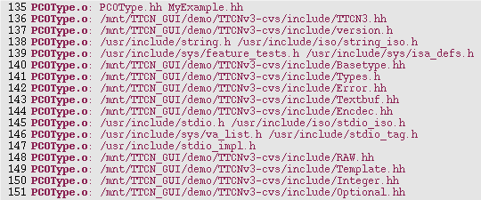
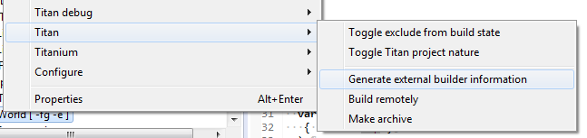

= Building the Project
:toc:
:figure-number: 89

In this chapter a detailed, stepbystep procedure description is provided about how to build a project according to the workflow.

Building a project from the TTCN–3 or ASN.1 source modules and perhaps test port files is a procedure consisting of several steps. In the TITAN Designer plugin, the procedure is fully automated. The commands issued by the build related functionalities and their progress messages are displayed in the TITAN console, so the successful completion of the processes can easily be verified. Also, in case of an error, the analysis of the progress messages helps to find the cause of the problem (this is also automated to some extent; please refer <<7-editing_with_titan_designer_plugin.adoc#mark-occurrences, here>>). The build process also provides Eclipse with user friendly information about its progress.

The building process is automated; that is, the executable is updated in the background when project resources change (because they have been created, deleted or updated). There is no need for user interaction—provided that automatic building is enabled.

There is a way to build the project manually, by selecting *Project* / *Build project* or *Project* / *Build all.* This is useful when automatic building (*Project* / *Build Automatically*) is disabled**.**

NOTE: The problem markers of the compiler are parsed from the output of TITAN, for this reason they are updated when the compiler is run (the project is built, or the files are checked). If automatic building is not used, the projects should be built regularly, to have up-to-date problem markers (see <<7-editing_with_titan_designer_plugin.adoc#mark-occurrences, here>>)).

== Building the Project – Step by Step

The following sections describe the steps of the build process. These steps are carried out either automatically by the TITAN plugin or manually by the user; the sections indicate which way applies.

=== Creating Symbolic Links

By default, the first step of the build process is creating or updating symbolic links in the working directory of the project. The working directory contains symbolic links pointing to every file included in the project (this is not true for files contained in a central storage directory, because they are handled differently). For information please see the TITAN Programmer’s Technical Reference <<12-references.adoc#_4, [4]>>.

Symbolic link creation is done automatically by the build process; no user action is required.

NOTE: The creation of symbolic links can be turned off in the Designer plug-in, for more information please refer <<4-managing_projects.adoc#setting-the-local-build-properties-of-a-project, here>>.

=== Creating or Regenerating the Makefile

The second step of the build process, if needed, is creating or updating the project `Makefile`. Automatic `Makefile` management should be enabled on the *Properties / TITAN Project Property* page of the projects.

Every time it is required, the `Makefile` generator of TITAN will be called with the parameters provided on the *Makefile creation attributes* tab (see <<4-managing_projects.adoc#the-makefile-creation-attributes-tab, here>>). It is possible to indicate a `Makefile` updater script on the *Make attributes* tab (see <<4-managing_projects.adoc#the-internal-makefile-creation-attributes-tab, here>>) that will be run on the generated `Makefile`.

Information about the flags of the TITAN `Makefile` generator and the `Makefile` updater script can be found in the TITAN Programmer’s Technical Reference <<12-references.adoc#_4, [4]>>.

It is the user’s responsibility to create and update the `Makefile` when automatic `Makefile` management is disabled.

=== Editing the Makefile Skeleton

If the generated `Makefile` is not suitable then either the options that direct its generation should be changed or (after having disabled automatic building) the `Makefile` should be created by hand. Everyone is allowed to write his own `Makefile`; however, the `Makefile` skeleton generated by the compiler always serves as a good starting point. For an extensive description of what shall be checked in the generated `Makefile`, see the TITAN User Guide <<12-references.adoc#_3, [3]>>.

The TITAN plug-in has knowledge about the following `Makefile` commands:

* `make`
* `make all`
* `make dep`
* `make check`
* `make clean`

NOTE: the TITAN plug-in has some assumptions on what functionality the `Makefile` offers. The real `Makefile` should support these functions, and they should be conforming to what behavior TITAN would create.

This step, if needed, is carried out manually by the user.

=== Module Compilation

In this step C++ files are generated from virgin TTCN-3 and ASN.1 files. When a C++ file already exists, then the timestamp of the Compile file is used to decide whether a C++ file in question is uptodate or not. A C++ file is refreshed only if the corresponding TTCN–3 or ASN.1 module was modified later than the timestamp in the Compile file indicates, or the project was refreshed by *right clicking* the project and selecting *Refresh*; otherwise the generated C++ file is considered uptodate.

The first compilation of the modules will result in addition of the following files in the working directory:

* C/C++ header files:
+
These are the header files of the generated C++ code. One `.hh` file is generated for every TTCN–3 and ASN.1 module in the project with the same name.

* C/C++ source files:
+
These are the body files of the generated C++ code. One `.cc` file is generated for every TTCN–3 and ASN.1 module in the project with the same name.

* Compile file:
+
This is an empty file. The attributes of the file indicate the date and the time of the last compilation process.

* `Makefile.bak`:
+
This is the backup of the `Makefile`, created when the `make dep` command has been issued.

Module compilation is done automatically by the build process; no user action is required.

[[creating-dependencies]]
=== Creating Dependencies

Once the symbolic links have been created and the `Makefile` of the project has been properly edited if necessary, the command make dep has to be issued to find the dependencies between the resulting C++ codes. It is extremely important that the dependencies are always uptodate. If, for example, a TTCN–3 module is removed from the project, the dependencies between the C++ files must be updated, otherwise the command `make` fails.

Dependencies appear at the end of the `Makefile` as dependency lines. They are determining the conditions of the binary object code recompilation launched by the command make.

It is discouraged to edit the appended dependency lines.

The dependency update is done automatically if the build level mentioned <<building, here>> is set to three or five. Otherwise it must be carried out manually.

Alternatively, incremental generation of dependency information is available when using Makefiles written for GNU `make`. Instead of modifying the `Makefile`, dependency information is written into separate files with `.d` extension (one for each `.cc` file). These files are included into the main `Makefile`. This has the advantage that the `Makefile` is not modified every time a dependency changes. Another benefit is that the dependencies are always updated during `make`; there is no need to explicitly run `make dep`. For information on how to set this option please refer <<4-managing_projects.adoc#the-makefile-creation-attributes-tab, here>>.

[[building]]
=== Building

In the final step of the project building procedure a conventional C++ compiler is used to compile Test port codes and the generated C++ source code to a binary object code. The resulting code is linked with the Base Library. The Base Library contains important supplementary function libraries used for the execution of the generated code (for example verdict handling, Host Controller code, and so on).

If automatic building is enabled, Eclipse will invoke the build process whenever project resources change (are created, deleted or updated), or you refresh your project by *right clicking* the project and selecting *Refresh*.

If automatic building (*Project / Build Automatically*) is disabled, then the build process is started by a click on *Project / Build project,* *Project / Build all* or by *right clicking* the project name and selecting *Build*.

The build process will result in the generation of the following files in the working directory:

* Object files:
+
For every C++ file in the project (source code files, test ports, and so on), an object file (with the extension `.o`) will be created by the C++ compiler.

* Shared object files (if dynamic linking is enabled, see <<4-managing_projects.adoc#setting-the-local-build-properties-of-a-project, here>>):
+
For every (static) object file (with extension `.o`) in the project a shared object file (with the extension `.so`) will be created by the C++ compiler.

* Executable:
+
The executable file has the same name as the project has.

The build process can be configured to set the build level for the given project (see <<4-managing_projects.adoc#setting-the-local-build-properties-of-a-project, here>>). The following build levels are supported:

* Level 0 – Semantic Check
+
Only syntactic and semantic checks are carried out on the TTCN-3 and ASN.1 source files.Uses the Makefile target *check*.

* Level 1 – TTCN3 → C++ compilation
+
In addition to the syntactic and semantic checks, the C++ code is also generated from the TTCN-3 and ASN.1 source files if there were no errors found.Uses the `Makefile` target *compile*.

* Level 2 – Creating object files
+
Executes the syntactic and semantic checks, generates the C++ code and tries to compile it into object (`.o`) and if applicable, into shared object (`.so`) files.Uses the `Makefile` target *objects* or *shared_objects*.

* Level 2.5 – Creating object files with heuristic dependency update
+
Executes the syntactic and semantic checks and generates the C++ code, but before generating the object and if applicable, shared object files it also updates the dependencies of the source codes if this is needed. This means that the long lasting dependency refresh will not be executed if only such files that the on-the-fly analyzer is able to analyze were changed since the last build, and none of the changes made make a dependency refresh mandatory. Uses the `Makefile` targets *objects* or *shared_objects*; or *dep objects* or *dep shared_objects*.

* Level 3 – Creating object files with dependency update
+
Executes the syntactic and semantic checks and generates the C++ code, but before generating the object and if applicable, shared object files it also always updates the dependencies of the source codes. Uses the `Makefile` targets *dep objects* or *dep shared_objects*.

* Level 4 – Creating Executable Test Suite
+
Carries out a full build and creates the Executable Test Suite, but the dependencies are not updated. Uses the `Makefile` target *all*.

* Level 4.5 – Creating Executable Test Suite with heuristic dependency update
+
Carries out a full build, creates the Executable Test Suite and the dependencies are also updated if that is needed. This means that the long lasting dependency refresh will not be executed if only such files that the on-the-fly analyzer is able to analyze were changed since the last build, and none of the changes made make a dependency refresh mandatory.Uses the `Makefile` target *all* or *dep all*.

* Level 5 – Creating Executable Test Suite with dependency update
+
Carries out a full build, creates the Executable Test Suite and the dependencies are also always updated. Uses the `Makefile` target *dep all*.

Some hints for selecting the appropriate build level: on build levels 0-3 the executable will not be generated, only levels 4 and 5 produce an Executable Test Suite. Dependency update is only required when the import hierarchy of the source files is changed.

== Remote Build

Projects might need to be built for several platforms, for several different GCC versions, or it might just happen that the user’s computer is not powerful enough to assure short build times.

Remote building (see <<4-managing_projects.adoc#setting-requirements-on-the-configuration-of-referenced-projects, here>>) is chosen by *right clicking* the project and selecting *TITAN / Build remotely*, as shown on Figure 80 above.

The outputs of the remote build processes are displayed in the TITAN Console view. Every piece of such an output is prefixed by the host name that provided it.

=== Remarks and Tips

It is impossible to clearly identify which source files were some errors reported for, for this reason precise build problems reported by remote build hosts are not redirected to the graphical interface. Only those problems are reported and marked, which are the errors in the build process itself (for example: abnormal termination is reported, but as a build process is not terminated by build errors, such errors are not redirected).

As it is the user’s responsibility to keep the files on the remote host uptodate, no file transfer or file synchronization is provided by the TITAN plugin. Therefore, the remote build process cannot be run automatically.

Building remotely might start up the shell of the remote host in interactive mode. If the remote build host reports missing environmental variables, it is a good idea to check how the shell of the remote build host is configured in interactive mode (this is usually user specified).

The overall length of the name and build commands of the remote hosts should be less than about 2,000 characters. However, assuming that an automated login mechanism and a build script is used on the remote hosts (creating remote build commands like `rlogin rhea; buildscript.sh`), means that the build process might still be executed in parallel on about 60 remote hosts, which should be enough for now.

== Building from the Command Line

=== Building Directly

It is possible to invoke the build process of Eclipse from the command line, without Eclipse showing even the splash screen.

An example invocation:
[source]
----
eclipse.exe -noSplash -consoleLog -data location_of_workspace -application com.ericsson.titan.designer.application.InvokeBuild project_name_to_build
----

This command instructs Eclipse to call our application with the name of the project to be built, while not displaying even the splash screen, redirecting all error log to the console too and using the workspace from the provided location.

The benefit of using this feature over generating the Makefile and building by hand is that this way one will build with the exact same settings he uses inside Eclipse. If for example 3rd party tools are also used as part of the build process, this method will invoke them too properly.

=== Building with an External Script

It is possible to create an XML file for each Eclipse project, which will store all the information needed to create the Makefile and build the project from the command line.

In order to create this file, right click on a project and select the *TITAN* / *Generate external builder information* menu entry. This will create a new file in the root of the project called *external_builder_information.xml*

The XSD schema definition of this file looks like:

[source,xml]
----
<?xml version="1.0" encoding="UTF-8" standalone="no"?>
<xs:schema xmlns:xs="http://www.w3.org/2001/XMLSchema" id="TITAN_External_Builder_Information">
  <xs:element name="TITAN_External_Builder_Information">
    <xs:complexType>
      <xs:sequence>
        <xs:element name="Makefile_settings">
          <xs:complexType>
            <xs:sequence>
              <xs:element name="useAbsolutePath" type="xs:boolean"/>
              <xs:element name="GNUMake" type="xs:boolean"/>
              <xs:element name="incrementalDependencyRefresh" type="xs:boolean"/>
              <xs:element name="dynamicLinking" type="xs:boolean"/>
              <xs:element name="singleMode" type="xs:boolean"/>
              <xs:element name="codeSplitting">
                <xs:simpleType>
                  <xs:restriction base="xs:string">
                    <xs:pattern value="none|type"/>
                  </xs:restriction>
                </xs:simpleType>
              </xs:element>
              <xs:element name="projectName" type="xs:string"/>
              <xs:element name="projectRoot" type="xs:anyURI"/>
              <xs:element name="workingDirectory" type="xs:anyURI"/>
              <xs:element name="targetExecutable" type="xs:anyURI"/>
              <xs:element name="MakefileScript" type="xs:anyURI"/>
              <xs:element name="MakefileFlags" type="xs:string"/>
            </xs:sequence>
          </xs:complexType>
        </xs:element>
        <xs:element name="ReferencedProjects">
          <xs:complexType>
            <xs:sequence>
              <xs:element maxOccurs="unbounded" minOccurs="0" name="ReferencedProject">
                <xs:complexType>
                  <xs:attribute name="location" type="xs:anyURI" use="required"/>
                  <xs:attribute name="name" type="xs:string" use="required"/>
                  <xs:attribute name="cygwinPath" type="xs:anyURI"/>
                </xs:complexType>
              </xs:element>
            </xs:sequence>
          </xs:complexType>
        </xs:element>
        <xs:element name="Files">
          <xs:complexType>
            <xs:sequence>
              <xs:element maxOccurs="unbounded" minOccurs="0" name="File">
                <xs:complexType>
                  <xs:attribute name="path" type="xs:anyURI" use="required"/>
                  <xs:attribute name="relativePath" type="xs:anyURI" use="required"/>
                  <xs:attribute name="centralStorage" type="xs:boolean"/>
                  <xs:attribute name="fromProject" type="xs:string"/>
                  <xs:attribute name="cygwinPath" type="xs:anyURI"/>
                </xs:complexType>
              </xs:element>
            </xs:sequence>
          </xs:complexType>
        </xs:element>
      </xs:sequence>
      <xs:attribute name="version" type="xs:decimal"/>
    </xs:complexType>
  </xs:element>
</xs:schema>
----

NOTE: After this information was generated it is the user’s responsibility to create and use the script files that actually do the building of the project.

NOTE: This file will only hold information relevant from the point of view of TITAN. If other tools are also integrated on the project (to help its build, execution) their data will not be included.

== Cleaning the Project

After switching to a newer version of the test executor or simply to save disk space, the project might need to be cleaned by removing the generated files from the working directory.

To remove all generated files from the project, select *Clean* in the *Project* menu option in Eclipse.

The following files will be deleted from the working directory:

* All object files (files with suffix `.o`) and if applicable, all TITAN generated shared object files (files with suffix `.so`)

* All C++ sources files translated from the original TTCN–3 and or ASN.1 modules

* The Compile file

* The executable file

== Pitfalls

Every build related action is executed as a command line command. If the command line is not responsive, the tool will not be able to extract messages from it.

In the `Makefile` generation process the size of the longest allowed command can become a serious limitation. For example, on Windows 2000 this number is around 2048 characters by default; this is not enough for larger projects. However, as every command that we try to execute, this is also displayed in the TITAN Console, making it is possible to copy and paste it into a proper command line window (in this case into a Cygwin console).

Manually editing of the `Makefile` can kick off a vicious build cycle if automatic `Makefile` generation is enabled. Explanation: saving a file is a resource change and can start the build process. On the other hand, the build process, with automatic `Makefile` generation enabled, might re-create the `Makefile`. Next, the editor detects that the `Makefile` has been changed and tries to open it which is also a resource changing operation and triggers the build process.

