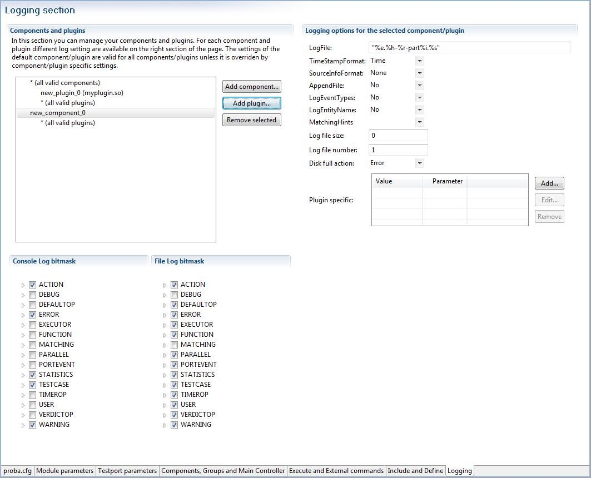

= Editing with TITAN Designer Plugin
:toc:
:figure-number: 96

This chapter presents the editors provided by TITAN Designer plug-in and their features.

== File Types

The TITAN Designer plugin includes editors for the following file types supported by the TITAN executor (the default extensions are given in brackets):

* ASN.1 (`.asn`, `.asn1`)

* TTCN-3 (`.ttcn`, `.ttcn3`)

* TTCN-3 preprocessable (`.ttcnpp`)

* TTCN-3 includable (`.ttcnin`)

* Configuration (`.cfg`)

Additional file extensions can be associated to these editors by selecting the Eclipse menu point *Windows / Preferences / General / Editors / File Associations*, but this is discouraged for source files. Although the file will be well colored, the dynamic analysis will not work. For the same reason it is also discouraged to use the extensions listed above for other file types.

NOTE: The editors may throw an exception if a file is deleted while being edited.

== Syntax Highlighting

Each of the included editors has its own syntax highlighting schema that can be customized by modifying the workbench preferences (see <<3-setting_workbench_preferences.adoc#syntax-coloring-preferences, here>>)

image::images/7_F85.png[title="Syntax coloring of TTCN-3 files"]

== Matching Brackets

Bracket matching in source code provides structural information to the user. The functionality is activated by placing the mouse cursor after an opening or closing bracket. Figure 85 shows the closing bracket in line 51 highlighted with black color.

The function can be customized on the workbench preferences; see <<3-setting_workbench_preferences.adoc#matching-brackets-highlighting-preferences, here>>.

== Folding

Folding is another mechanism to provide structural information to the user. Folding decreases the amount of information displayed on screen, thus, users only sees that part of the code they are working with. Text regions can be folded and un-folded with a single click on the folding marker on the left-side ruler.

Figure 86 shows a possible folding but the text is not folded.

NOTE: Folding marker on the left-side ruler at line 47.

Figure 87 shows the folding range, the smallest folding region the selected line belongs to. The folding range is displayed when the mouse pointer is placed over the left-side ruler.

Figure 88 shows the text folded. Regions of text can be folded and un-folded with a single click on the folding marker on the left-side ruler.

The function can be customized by modifying the Folding preferences on the workbench (see <<3-setting_workbench_preferences.adoc#excluded-resources, here>>).

[[on-the-fly-parsing]]
== On-the-fly Parsing

On-the-fly parsing means that the text is automatically parsed and checked as it is changing.

The parser starts one second after the last character is typed. (This duration should be long enough for the parser to operate without disturbing the user.) The problems found by this parser are automatically and instantly indicated to the user, allowing a fast and precise feedback on errors and reducing the detection time to almost zero.

Figure 89 shows an example error marker. The user was about to type the keyword `template`, but as soon as he has typed `tem` the on-the-fly parser noticed that the file was syntactically faulty.

Before parsing, the error markers created by the on-the-fly parser are removed. As parsing proceeds, new markers are appearing ensuring that the markers are always up-to-date (except for the markers of the compiler as they are updated by the compiler itself, see <<mark-occurrences-1, here>>).

The three steps of the parsing process:

. Every file in the given project is checked whether it needs to be parsed or not. A file needs to be parsed if at least one of the following is true:
.. There is no information stored related to its content or the information extracted from the file could not be stored in the data storages (for example, two or more modules exist with the same name in the project).
.. The file has changed since the stored information was extracted last time.
.. The execution of the TITAN compiler removed syntax error markers reported by the on-the-fly parser.
. The file is parsed.
. The on-the-fly data storage is updated.

The parsing process (like every other long running operation in the plugin) provides progress indication. Overall parsing of a file is usually very fast; however, the duration of the on-the-fly parsing is adversely influenced by the size of the actually edited file. The size of the project does not matter except for the first parsing of a project, when every file needs to be analyzed once. However, if several files need to be parsed, our algorithm will try to do this in parallel, where the level of parallelism is only limited by the amount of hardware support available (for example a computer with 2 or 4 processor cores, will finish this task about 2, 4 times faster in the optimal case).

If too slow, the parsing can be turned off on the TITAN preferences page (see <<3-setting_workbench_preferences.adoc#titan-preferences, here>>). Disabling the parsing does not destruct the data stored in the memory; rather, the data cannot be updated while this option is set. If parsing is enabled again, the parser will try to update outdated data.

Parsing of files can be slow in the following cases:

* Files containing more than twenty thousand lines of statements.
* Files containing more than fifty thousand lines of definitions only.
* Any time if the virtual machine does the garbage collection while parsing.

The on-the-fly parser is able to parse ASN.1, TTCN-3 and runtime configuration files.

=== Preprocessing of ttcnpp and ttcnin Files

In Titan it is supported to use the C pre-processor for creating TTCN-3 files. For this 2 file extensions are defined: the files with ttcnpp extension are to be preprocessed into TTCN-3 modules, while the ones with ttcnin extension hold code snippets that can be included into ttcnpp and ttcnin files. For detailed information please see the TITAN Programmer's Guide.

The designer plug-in provides support for a subset of the features of the C preprocessor. The supported features are conditional compilation, inclusion of files and the use of some other directives. There is a limited support for macros, object macros are limited to be integer values which can be used in conditional expressions of #if directives, there is no recursive substitution of macro values, function macros are not supported. Identifiers in TTCN-3 code will not be replaced by the values of macros, macros are used only for conditional compilation. A preprocessor directive is usually one line, except when the line continuation is used by placing a backslash at the end of the line. Line continuation of TTCN-3 code lines is not legal. Example of a multi-line macro:

[source]
----
#if 100== \
50+50
----

The above two lines are one logical line: #if 100==50+50

C preprocessor conditional expressions are integer expressions which can contain literal values (64 bit signed integers) and macro identifiers. These expressions are evaluated while parsing the preprocessor directive, in case of #define the value of the macro will be the result of the evaluation. For example:

[source]
----
#define MACRO 1+2+3#
if MACRO==(12/2)
log(MACRO); // in TTCN-3 code macros are not used!
// if there is no constant or variable named MACRO in TTCN-3 then
// there will be a semantic error here
#endif
----

the value of MACRO is 6, this value is used in the #if directive. Integer literals can be decimal, octal and hexadecimal. Conditional constructs can be nested. Inactive branches are displayed in a darker color in the editor.In conditional expressions operators used on integer values in the preprocessor of the C language can be used. For logical operations the integer value 0 is false and non-zero values are true. The special operator *defined* can be used to check if a macro value exists. Example code:

[source]
----
#if (M1 + M2 * 123) > ( M3 & 0xABCD )
const integer cint := 123;
#elif defined M4 || !defined M5
const integer cint := 234;
#else
#error Invalid macro settings!
#endif
----

File inclusion is supported, the included files should have the extension ttcnin. The content of these files is included at the position of the #include directive, multiple inclusion of the same file and recursive inclusion is supported. Example _myfile.ttcnin_ file:

[source]
----
#ifndef _MYFILE_INCLUDED_
#define _MYFILE_INCLUDED_
const integer cint := 123;
#endif
----

The conditional part prevents multiple inclusion of the same source code, this is useful if ttcnin.myfile is included in other ttcnin files which are included in the same ttcnpp file.

To define macros outside of files the Eclipse TITAN plug-in uses the settings given in the *TTCN-3 Preprocessor* part of the *Internal makefile creation attributes* tab on the *TITAN Project Property* page. Macros can be defined by adding them in the *Defined Symbols (-D)* table. The Included directories setting is not used, the name of included ttcnin file must always be relative to the ttcnpp file in which it is included). Every project in Eclipse has its own defined macros (symbols), other projects do not see these macros. This is an important difference between the command line tools and the designer plug-in, the makefile does not know about projects.

[width="100%",cols="m,",,]
|===
|#define MACRO_NAME <expression> |Define a macro, it’s value is the value of the integer expression
|#undef MACRO_NAME |Delete a macro
|#ifdef MACRO_NAME |The code in this branch is active if the macro `MACRO_NAME` was defined previously
|#ifndef MACRO_NAME |The code in this branch is inactive if the macro `MACRO_NAME` was defined previously
|#if <expression> |The code in this branch is active if the expression evaluates to non-zero (true)
|#if defined MACRO_NAME |The same as `#ifdef`
|#if ! defined MACRO_NAME |The same as `#ifndef`
|#if not defined MACRO_NAME |The same as `#ifndef MACRO_NAME"` or `#if ! defined MACRO_NAME"`
|#elif <expression> |The code in this branch is active if the expression evaluates to non-zero and no previous branches were active
|#else |else branch, active if no previous branches were active
|#endif |End the conditional construct (end last branch)
|#line, #pragma, null, linemarker |These directives are ignored, makers: ignored/warning/error depending on the setting in preferences
|#include "filename.ttcnin" |The file name must be provided in a string (`<filename.ttcnin>` notation is not supported). If the file does not exist or it is not found in the project then an error is displayed
|#error <free text> |Display the free text as an error marker
|#warning <free text> |Display the free text as a warning marker
|===

NOTE: ttcnpp files are not analyzed incrementally even if incremental analysis is switched on.

=== Limitations

The on-the-fly parser does not support the single line comment in ASN.1 files when placed right after non-comment elements. A simple workaround for this problem is to insert a SPACE character between the last non-comment character and the "`—`" sign.

Limitations of preprocessing:

Advanced editing features such as rename refactoring may fail or not work as intended in some cases when pre-processor macros are present in the code. According to the preprocessing logic, code in inactive branches of preprocessor conditionals must be ignored, and so exempt from advanced functionalities (like semantic checking, rename refactoring). In case of multiple inclusion of the same code the same source code may be part of different semantic constructs, for example in rename refactoring the changed source code can affect all other related semantic constructs.

In case of file inclusion, the locations of error and warning markers may be invalid, pointing to the wrong file (usually to the ttcnpp file instead of the ttcnin file where the error is located). This is a limitation of the current parsing mechanism which is optimized for the 1 module == 1 file assumption.

Character constants cannot be used in conditional expressions

[[on-the-fly-semantic-checking]]
== On-the-fly Semantic Checking

On-the-fly semantic checking is done after the on-the-fly parser has finished parsing. The level and complexity of this check is on the same level with the command line compiler, but is done much faster.

[[limitations-0]]
=== Limitations

The following structures are not yet analyzed, and as such not all error cases related to them will be detected:

* Encoding and variant attributes are not analyzed, in fact not even parsed. This implies, that for example it is not able to detect if encoding/decoding functions are used with types that does not have the required encoding attributes.

* Charstring and universal charstring patterns are not analyzed. This implies that even though in some cases matching with regular expressions could be evaluated in compile time, the semantic checker will not be able to do that.

* In ASN.1 table constraints, any type values (open type notation) are not checked.

== Content Assistance

Content assistance is a feature providing context-sensitive content completion upon user request for source files.

The content assistant can be activated either by a key combination (which by default is set to *CTRL + SPACE*) or by typing a . (dot) before the keyword. To insert an element from the proposed ones, *double click* it or *select* it and press *Enter*. If only one element is proposed it is inserted automatically.

When an element is selected in the list of the proposed elements, a pop-up window containing a short description may appear.

=== Assistance with Keywords

Editors support a basic level of content assistance, namely the listing of the appropriate keywords (Figure 89).

=== Assistance with Code Skeletons

The intermediate level of assistance inserts structural elements into the source code (Figure 90). Inserting skeletons is only supported for TTCN-3, TTCNPP, TTCNIN and ASN.1 files.

Static and dynamic skeletons are both marked with a unique icon.

A short description of them is provided after the name of the skeleton if a skeleton has several slightly different versions. A popup window shows the text about to be inserted.

==== Using the Inserted Skeleton

The insertions may contain linked editing points (Figure 91).

Hints for using the inserted skeleton:

* The *TAB* key can be used to move between the editing points.

* If two or more editing points are linked, they will have the same content. This means that no matter which one of them is edited, the others take up the same value.

* To leave this insertion mode and validate the insertion, press the *ESC* key.

=== Assistance with Dynamic Elements

The highest level of content assistance is available for TTCN-3 and ASN.1 files. It is providing scope and type structure information that has been parsed and collected by the on-the-fly parser. The calculation of the proposals is done this way:

. The reference to be completed is identified strictly using character data available before the completion point.
. Based on the position of the completion point the smallest enclosing scope is looked up.
. From the smallest scope found the scope hierarchy is traversed in a bottom-up manner to find the possible definitions. (The definitions imported are checked after the definitions of the actual module).
. When a relevant definition is found the search for possible proposals continues inside its structure. For example, if the definition is a variable of a structured type, the reference is used to detect the subtypes or fields that the reference could point to if it were to be completed that way.

The proposals are ordered in the following way (definitions don’t hide each other in the proposal list):

. Dynamic elements available in the given scope. The elements are ordered by the distance of the element definition from the completion point in the scope hierarchy. For example, a local variable will always precede module definitions. The definitions that are most likely to be used are placed earlier in the list. If there is more than one proposal from the same scope, they are ordered alphabetically.
. Skeletons available in the given scope. The skeletons are ordered alphabetically.
. Keywords available. The keywords are ordered alphabetically.

=== Content Assistance Limitations

Full context sensitivity is not possible yet. Only the scopes and the type structures are used to filter the list of proposals. For this reason, the content assistant might offer completion proposals, which are possible in the actual scope but not in the actual context. It is the user’s task to choose the right proposal.

Only data gathered and stored by the on-the-fly parsers can be offered. If this data is outdated or not complete, the content assistance will also offer outdated or limited information. Section 3.1 explains how this can happen.

== Find Declaration

Open Declaration provides a feature to jump to the declaration point of the selected element.

Open Declaration can be invoked either by a key combination (by default *F3*) or by *right clicking* anywhere on the screen and selecting *Open Declaration*. The element is determined by the current position of the cursor when the functionality is invoked.

The search for the declaration is done this order:

. The reference to be searched for is identified using only character data available before the completion point and after the completion point up to the next dot, opening bracket, opening square brace (or another character that cannot be part of a reference). For example, in case of the string `module.definition.field`:
.. If the cursor is somewhere inside, right before or right after the word `module`, the reference will be `module`.
.. If the cursor is somewhere inside, right before or right after the word `definition`, the reference will be `module.definition`.
.. If the cursor is somewhere inside, right before or right after the word field, the reference will be `module.definition.field`.
. Based on the position of the completion point the smallest enclosing scope is looked up.
. From the scope found the scope hierarchy is traversed in a bottom-up manner, to find the possible definitions. (The definitions imported are checked after the definitions of the current module).
. When a relevant definition is found, the search for possible proposals continues inside its structure. For example, if the definition is a variable of a structured type, the reference is used to detect the subtypes or fields that the reference could point to.
. If no definitions could be found in the actual module or in the ones imported by it, a special search takes place. It traverses every module of the actual project to find possibly matching definitions.

Jump to the location of the declaration takes place automatically if a declaration was found in the actual module or in one of the imported modules. The target file will be opened in an editor window taking the focus (if not already done so). The location of the declaration is revealed and selected.

If no valid declarations could be found in the whole module, this will be stated in the *TITAN Debug Console* and *the status line of Eclipse*, without presenting any extra pop-up windows. This way the user can invoke the functionality again, without the need to close several error indicating dialogs.

Open Declaration works for TTCN-3 and ASN.1 modules and configuration files. For configuration files Open Declaration can be used to:

Open configuration files listed in the include section. If the selected configuration file cannot be found the error is reported in the *TITAN Debug Console* and *the status line of Eclipse*.

Find module parameter declarations. If the module parameter is given as a module specific module parameter (e.g. `module.parameter`) only the given module is searched through for the declaration. Otherwise (e.g. `.parameter` or `parameter`) all modules of the project are taken into account. Duplicate module parameter declarations and errors are reported in the same way as for macro definitions.

[[find-references]]
== Find References

"Find references" provides a feature to search for all elements that refer the selected TTCN-3 or ASN.1 element. The user can select TTCN-3 definitions of types, constants, variables, templates, variable templates, functions, testcases, altsteps, components, ports, formal parameters, enumerated values, etc. ASN.1 type and value assignments can be selected in ASN.1 files. In case of structured types (record, set, union, etc.) the individual fields can be selected, in this case all references to that field will be displayed. The source files should be syntactically and semantically correct prior to starting the search, otherwise it cannot be guaranteed that all references to the given element will be found.

Find References can be invoked either by a key combination (by default *F4*) or by *right clicking* anywhere on the screenand selecting *Find References*. The element is determined by the current position of the cursor when the functionality is invoked.

The found references will be displayed in the standard Eclipse search result view, it is usually displayed at the bottom as a new tab. The found references are displayed in a tree view, grouped by module. If it cannot be determined what element we are trying to search for, an error message will be displayed and the search result view will not be opened. The error message will be displayed in *the status line of Eclipse*, without presenting any extra pop-up windows. In the search result view clicking on an occurrence will open the source file and jump to the reference location.

A more precise description of this feature is searching for identifiers that are used in a context where they identify the language element that we are searching for. A reference can contain multiple identifiers, for example in the case of a
recursive record definition:

[source]
----
type record MyRec {
    MyRec rec optional,
    charstring str
}
...
var MyRec v_myrec;
...
v_myrec.rec.rec.rec.str := “foo”;
----

Searching for field rec will give 3 hits in the above line, because the reference `v_myrec.rec.rec.rec.str` contains the identifier of the rec field 3 times.

It is not always guaranteed that all references to the selected element will be found or that an element that should be selectable can be selected, because parsing and semantic analysis of all the source code is not 100% completed in the Eclipse plug-in.

[[mark-occurrences-1]]
== Mark Occurrences

The TTCN-3 and ASN.1 editors are able to highlight the occurrences of the currently selected element in the source code. The search for the occurrences is based on semantic information (see <<find-references, here>>). As the selection or the position of the cursor changes in the editor, the marks are updated automatically. The feature can be configured on the TITAN Preference page (see <<3-setting_workbench_preferences.adoc#mark-occurrences-0, here>>).

[[limitations-1]]
=== Limitations

Occurrences of the following language elements are not highlighted:

* References to modules

* Sub-references of a reference
+
in the example below, if the cursor is on the `field1` sub-reference, the occurrences will not be marked.
+
`myRec.field1 := 1;`

* Fields of types in the assignment notation. In the example below, if the cursor is on one of the fields (`field1` or `field2`) the occurrences will not be marked.
`var MyRec myRecord := {field1 := 0, field2 := 1};`

* The occurrences of keywords, predefined functions, primitive data types and literals are not marked.

== Refactoring

=== Rename Refactoring

This feature builds upon the "Find References" feature, it can be invoked the same way and it works on the same language elements. Most of the TTCN-3 and ASN.1 language elements can be renamed using this feature.

The user can select TTCN-3 definitions of types, constants, variables, templates, variable templates, functions, testcases, altsteps, components, ports, formal parameters, enumerated values, etc. ASN.1 type and value assignments can be selected in ASN.1 files. In case of structured types (record, set, union, etc.) the individual fields can be selected. The source files should be syntactically and semantically correct prior to starting the renaming. By default, projects containing errors or ttcnpp files cannot be refactored, but this behavior can be changed in the TITAN Preferences on the On-the-fly checker page. If refactoring is done on projects which contain syntax or semantic errors or ttcnpp files, then it cannot be guaranteed that all occurrences of the given definition or field will be renamed because some occurrences may reside in places that are inside erroneous source code or places that are not active after pre-processing of ttcnpp files.

Rename refactoring can be invoked either by a key combination (by default *Ctrl+F4*) or by *right clicking* anywhere on the screenand selecting *Rename Refactoring*. The element is determined by the current position of the cursor when the functionality is invoked. If it cannot be determined what element we are trying to rename, an error message will be displayed. The error message will be displayed in *the status line of Eclipse*, without presenting any extra pop-up windows.

The refactoring process starts with a dialog box where the new name should be specified, the new name must be a valid TTCN-3 or ASN.1 identifier.

A preview of all modifications is available; the preview window shows the original and the refactored source code side by side. The source code will be modified only if the OK button was selected.

[[limitations-2]]
=== Limitations

Refactoring might not be able to operate correctly in the following cases:

* If macro definitions are used in the source code, refactoring will not be able to operate on the code parts which are not active at the time of the refactoring. The reason for this is, that those parts are not visible for the semantic analyzer.

* When the minimize memory usage is turned on some information, that might be required for the refactoring, is removed from memory. In this case the refactoring will not take place in the whole project.

In the above cases the user is warned for possible issues.

== Editing Configuration Files

Configuration files can be edited in their own editor in a textual format just like any other file; however, the editor also provides graphical pages to ease this process. As it can be seen on Figure 93, these graphical pages can be selected by clicking on the tabs in the bottom of the editing area.

Whenever the textual page is edited the on-the-fly parser is run within one second and the contents of graphical pages get updated; however, to save the contents of the graphical pages (and to execute the on-the-fly parser on them) pressing the buttons *Ctrl+S* is required.
+
NOTE: The content of the textual page is also updated when it becomes active. The example on the figure below shows an error detected.

The graphical pages are explained in detail in the sections below.

=== Module Parameters Section

On this page (new) values can be assigned to parameters defined in the TTCN–3 modules.

A new parameter can be added by clicking the *Add…* button. The column *Module name* contains the name of the module where the parameter is used. The parameter can be used in all modules when this column is left blank or filled with an asterisk. The column *Module parameter name* is self-explanatory. The value of the parameter is determined by the string in the pane *Module parameter details* in free form as parameters may have different formats.

Highlighted existing parameters are removed by clicking the *Remove* button.

The field *Total* under the buttons shows the number of the defined module parameters.

Changes made to the parameters must be saved by the shortcut key *Ctrl+S*.

=== Test Port Parameters Section

The values of all parameters on this page are passed to test ports.

A new parameter can be added by clicking the *Add…* button. The column *Component name* contains the name of the component defining the test port. An asterisk (\*) denotes all ports of the Test System Interface. The column *Test port name* is the name of the test port. The column *Parameter name* is self-explanatory. The value of the parameter is determined by the string in the pane *Test port parameter details* in free form as parameters may have different formats.

Highlighted existing parameters are removed by clicking the *Remove* button.

The field *Total* under the buttons shows the number of the defined module parameters.

Changes made to the parameters must be saved by the shortcut key *Ctrl + S*.

=== Components, Groups and Main Controller Section

This page contains parameters of three configuration file sections. The parameters make only sense in parallel mode.

Changes made to the parameters must be saved by the shortcut key *Ctrl + S*.

==== Main Controller Options

The options herein control the behavior of Main Controller (MC). Clicking the triangle in the title line will collapse the section leaving more room to the tables.

The options *Local Address* and *TCP port* determine the IP address and TCP port where the MC application will listen for incoming HC connections. The value of *TCP port* is an integer number between 0 and 65535. The recommended port number is 9034. The MC will listen on an ephemeral port chosen by the kernel when this field is left empty or set to zero.

The value *Kill timer* determines how long the MC waits for a busy test component (MTC or PTC) to terminate when it was requested to stop. The value of *Kill timer* is measured in seconds and can be given in either integer or floating point notation. Setting *Kill timer* to zero disables the kill functionality, that is, busy test components will not be killed even if they do not respond within a very long time period. When omitted, the default value of *Kill timer* is 10 seconds.

*Number of Host Controllers* provides support for automated (batch) execution of distributed tests. When set, the MC will not give a command prompt, but wait for the specified number of HCs to connect. When all connected, the MC automatically creates MTC and executes all items defined in the page *Execute* (see section 7.12.4).

The *Use of unix domain socket communication* field can turn on or off the usage of efficient communication between the main controller and other components of the test system. By default it is turned on except on Cygwin because of performance degradation.

==== Components

The aim of the *Components* table is to restrict component execution to certain (group of) hosts. These constraints are useful when distributed tests are executed in a heterogeneous environment. The participating computers may have different hardware setup, computing capacity or operating system.

A new restriction is added by clicking the *Add…* button to the right of the first table. The column *Component name* contains component to be restricted. The column *Host name* contains either a host name, a group of hosts (see <<group-section, here>>) or an IP address of a host.

Highlighted components are removed by the button *Remove*.

The field *Total* under the buttons shows the number of the restrictions in force.

[[group-section]]
==== Group Section

The aim of the tables *Group* and *Group item* is to specify groups of hosts. These groups are used to restrict creation of certain PTCs to a given set of hosts.

A new group can be added by clicking the *Add group* button to the right of the table in the middle. The first column contains the name of the group. are added to the table *Group items* by pressing the button *Add item*.

Highlighted group members or entire groups are removed by the button *Remove item* and *Remove group*, respectively.

The field *Total* under the buttons shows the number of the defined groups and group members.

=== Execute and External Commands Sections

This page contains parameters of two configuration file sections.

Changes made to the parameters must be saved by the shortcut key *Ctrl + S*.

==== External Commands

This section defines external commands (shell scripts) to be executed by the Executable Test Suite whenever a control part or test case is started or terminated. Clicking the triangle in the title line will collapse the section leaving more room to the table. The button *Browse* can be used to locate the shell script.

The field *Begin control part* contains the path to the shell script executed before control part procession.

The field *Begin testcase* contains the path to the shell script executed before testcase execution.

The field *End control part* contains the path to the shell script executed after the control part is processed.

The field *End testcase* contains the path to the shell script executed after a testcase has been executed.

==== Elements to be Executed

This table points out parts of the test suite to be executed. Only test cases having no parameters can be executed from this section.

A new test case is added by clicking the *Add…* button to the right of the table. The column *Module name* contains the name of the module where the test case is defined. The column *Testcase…* lists the test cases to be executed. An asterisk (*) denotes that all test cases in the given module must be executed.

Highlighted test cases are removed by the button *Remove*.

The field *Total* under the buttons shows the number of the rows in the table.

=== Include and Define Sections

This page contains parameters of two configuration file sections. Clicking the triangles in the title line will collapse the section leaving more room to the other section.

Changes made to the parameters must be saved by the shortcut key *Ctrl + S*.

==== Included Configurations

This table lists the configuration files to be imported. This way there is no need to merge configuration files when parameter definitions needed are dispersed over several files.

A new configuration file is imported by clicking the *Add…* button to the right of the upper table. The column *File name* contains between quotation marks the name of the files to be imported.

Highlighted files are removed by the button *Remove*.

The field *Total* under the buttons shows the number of the imported files.

==== Definitions

This table contains macro definitions that can be used in other configuration file sections.

A new macro definition is added by clicking the *Add…* button to the right of the lower table. The column *Definition* contains the macro name whereas the column *Definition value* contains the macro itself between quotation marks.

Highlighted macros are removed by the button *Remove*.

The field *Total* under the buttons shows the number of the defined macros.

=== Logging Section

The executable test program produces a log file during its run. The log file contains important test execution events with time stamps. Logging may be directed to file or displayed on console (standard error). This section explains how to set the parameters connected to the log file.

==== Components and Plug-ins

In the components and plug-ins section a tree of components and plug-ins can be created and managed.

On the first level of the tree components can be added using the _Add component…_ button.Using the _Add plug-in…_ button plug-ins can be added under each component on the second level of the tree.

Both component and plug-in names must be valid identifiers. The only exception is the "\*" component, this can be used to specify settings which are applied to all components and plug-ins.The "*" plug-in is automatically inserted; this can be used to specify settings which are applied to all plug-ins of the selected component. To specify settings for a specific component and plug-in one of the tree elements must be selected.

Any component or plug-in can be deleted using the _Remove selected_ button.

[[logging-options-for-the-selected-component-plug-in]]
==== Logging Options for the Selected Component/Plug-in

*LogFile*: the name of the log file between quotation marks. The string value entered may contain metacharacters that are substituted dynamically during test execution. The available metacharacters are listed in the section `LogFile` of <<12-references.adoc#_4, [4]>>.

*TimeStampFormat* can have three possible values:

`Time` stands for the format `hh:mm:ss.microsec.`

`DateTime` results in `yyyy/Mon/dd hh:mm:ss.microsec.`

`Seconds` results relative timestamps in format `s.microsec.`

*SourceInfoFormat* controls the appearance of the test event location information (position in the TTCN–3 source code). The option can take one of the three possible values: `None`, `Single` and `Stack`. If set to `Single`, the location information of the TTCN–3 statement is logged that is currently being executed. When `Stack` is used, the entire TTCN–3 call stack is logged. The value `None` disables the printing of location information.

*AppendFile* controls whether the run-time environment shall keep the contents of existing log files when starting execution. The possible values are `Yes` or `No`. The default is No, which means that all events from the previous test execution will be overwritten.

*LogEventTypes* can be useful for log post-filtering scripts. The possible values are `Yes`, `No`, `Detailed` and `Subcategories`. These values are explained in the section `LogEventTypes` of <<12-references.adoc#_4, [4]>>.

*LogEntityName:* if set to `Yes`, the name of the TTCN–3 entity is indicated in the log file along with the file name and line number.

*MatchingHints:* controls the verbosity of the logger regarding to template matching. The possible values are `Compact` and `Detailed`. The default is `Compact`, which shows the matched/unmatched fields of messages in a dot-separated notation. The Detailed version is similar to the former logging format. It’s more verbose and preserves the message structures.

*Log file size* limits log file growth: when the file reaches the limit given in kilobytes, the log file is closed and a new one is opened with a different name. The naming scheme is explained in the section `LogFileSize` of <<12-references.adoc#_4, [4]>>.

*Log file number* limits the number of log files stored. When this limit is reached (because new ones are being opened as described in the paragraph above), the oldest log file of the component is deleted.

*Disk full action* determines what to do when writing to the log file fails.

`Stop:` test case execution continues without logging.

`Retry:` TITAN attempts to restart logging activity periodically.

`Delete:` the oldest log file is deleted; logging continues to a new log file fragment.

`Error:` a runtime (dynamic) test case error is triggered.

*Plug-in specific:* this table lists the key-value pairs, that a given plug-in should be called with to parameterize its behavior.

*Console Log Bitmask* and *File Log Bitmask* determine what sort of events will be logged to the console respectively to the log file. Tables 11 to 22 of <<12-references.adoc#_4, [4]>> explain the meaning of the different logging classes.

=== Limitations on the Graphical Pages

The entered parameter values are not verified: any character string can be entered in any field.
