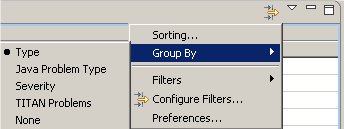
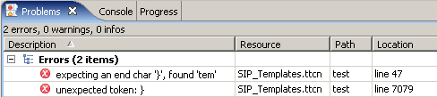
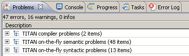
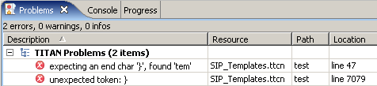

= Contents of the Problems View
:toc:
:figure-number: 109

This section presents how TITAN Designer plugin is integrated in the Problems view.

Whenever a problem is found in a project related resource, a marker is placed on that resource in the TITAN Designer.

In general, when any part of the TITAN Designer plugin checks a given file for problems, it first removes the markers from the resource then does the checking; and if any problems were found new markers are placed on the resource. The only exception to this is that the on-the-fly parser cannot remove markers generated by the compiler; but instead it turns them grey, this was designed so because the checks of the compiler are much more precise than the checks of the on-the-fly parser. The compiler overwrites also the markers of the on-the-fly parser, of course.

== Types of Markers

There are three error marker types indicating:

* issues reported by the compiler;

* syntactic errors reported by the onthefly parser;

* semantic errors reported by the onthefly checker.

Issues are reported as warnings (minuscule issues) or errors (severe issues that must be repaired as soon as possible).

[[eclipse-provided-features]]
== Eclipse Provided Features

Every time a marker is created the TITAN plugin tries to provide as much information about the issue as possible to fully profit from the Eclipse features.

The TITAN plugin makes use of the following features:

* Collecting of markers:
+
Eclipse collects all of the markers in the *Problems view*, so that they can be handled together in a single place.

* Jumping to a given position:
+
The TITAN plugin provides Eclipse sufficient information to make Eclipse jump to the exact problem location when the user *double clicks* a marker. If the file is not opened in the editor Eclipse will first open it and then jump to the location.

* User configurable presentation:
+
The users can configure the presentation of the problems by selecting *Window / Preferences / General / Editors / Text Editors / Annotations*. Here the presentation of errors and warnings can be configured (for example, whether they should be underlined and shown on the side rulers, what color to use).

* Grouping of markers:
+
These markers can be grouped in several, semantically different ways. This will be shown <<grouping-of-problems, here>>.

* Displaying the error text:
+
Every editor provided by the TITAN plug-in is able to show the error texts of markers placed on a line. The mouse pointer must be placed over a marker to activate this functionality. If several errors were found in the same line, each of their texts is displayed on a new line.

[[grouping-of-problems]]
== Grouping of Problems

Grouping of markers can be activated by selecting *Triangle / Group By*.

Other elements of Eclipse can also report problems; these issues will be called other problems. General problems, for example not being able to execute a program, are reported as general Problems by both the local and the remote build procedures.

Groupings supported by TITAN plugin are described in the following sections.

=== Group by Severity

Here the markers are grouped by their severity, that is, whether they are representing errors or warnings. This grouping is preferable when treating errors first. Other problems are mixed into the problems reported by TITAN plugin.

=== Group by Type

Here the problems are grouped by the reporting entity. The following groups are composed by the TITAN plugin:

* TITAN complier problems
* TITAN on-the-fly semantic problems
* TITAN on-the-fly syntactic problems

=== Group by TITAN Problems

Here every problem reported by the TITAN plugin is placed into the same group labeled TITAN Problems. Other problems are placed into a group labeled Other Problems.

