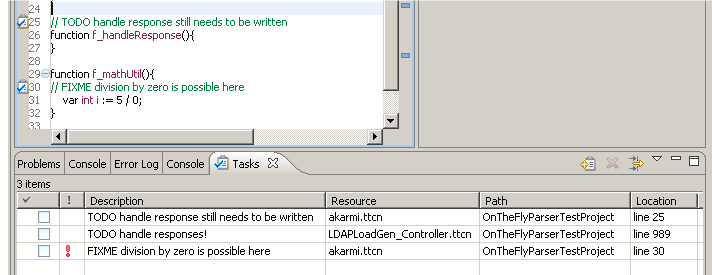

== Contents of the Tasks View
:toc:
:figure-number: 114

This section presents how TITAN Designer plugin is integrated in the Tasks view.

There are many cases when a developer would like to mark parts of the code; not necessarily because of errors. For example, the programmer may be working on a huge project consisting of many small parts easy to overlook. In this case it is invaluable for the programmer if he can mark parts of the code as not finished. It happens several times in real life development that the design of smaller program parts is shifted so many times and so much in time that people actually forget about it.

=== Types of Markers

There are two task marker types:

* TODO markers are created in the code with a single line TODO comment, for example `//TODO this function still needs to be implemented`.

* FIXME markers are created in the code with a single line FIXME comment, for example `//FIXME division by 0 might be possible here`.

It is the on-the-fly parser creating these notifications, not the TITAN compiler.

Eclipse provides all the nice features for Task markers as it did for Problem markers, with the only exception being that grouping is not supported; see <<8-contents_of_the_problems_view.adoc#eclipse-provided-features, here>>

