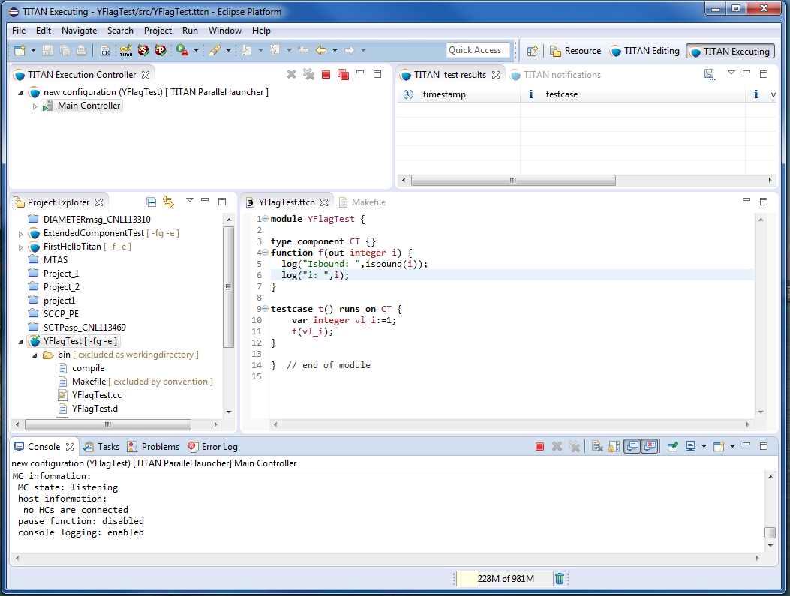
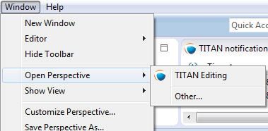
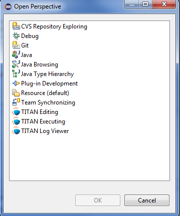

= Getting Started

== The TITAN Executing Perspective

[[Figure-1]]

The TITAN Executor plug-in provides its own perspective to Eclipse. This is a layout of visual elements that provides a good environment for working with TITAN. This layout is a starting point, since users can create their own layout in Eclipse, to set the best working environment for themselves.

Open the TITAN Executing perspective by opening *Window > Open Perspective > Other…*.

In the pop-up window select *TITAN Executing*.

The layout is shown in <<Figure-1,Figure 1>>, and contains the following elements:

* The upper half of the window shows the views defined by the Executing perspective:

* *TITAN Execution Controller*:
+
This view allows the users to monitor and control the started executions.

* *TITAN Test results*:
+
This view optionally shows the test case verdicts fetched from the notifications and related to the selected executor in the TITAN Executor monitor view.

* *TITAN notifications*:
+
This view shows all of the notification messages, error messages and console messages, received from the selected executor in the TITAN Executor monitor view.

* Creating launch configurations and executing them is available in the *Project Explorer view*.

* In the *Editor area* the source codes and configurations can be edited.

* The lower half of the window shows four views:

* *Console*:
+
The console shows all related information about build procedure, and execution. Each executor opens a new console page.

* *Tasks, Problems and Error Log*:
+
This views are not part of the TITAN Executor, however, shows any Executor related information, for example, errors during a project build.

By default, the *Launch Commands* are enabled in this perspective, as shown in <<Figure-4,Figure 4>>. Only the *Run Configuration* is supported by the Executor plug-in. With this tool, new launch configurations can be created, or existing ones modified.

[[Figure-4]]

