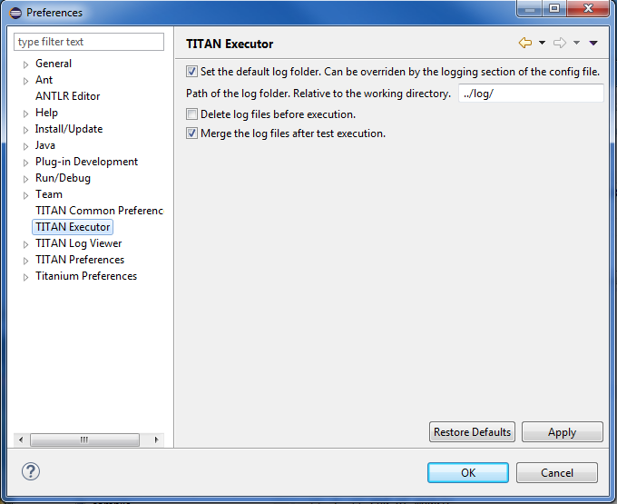
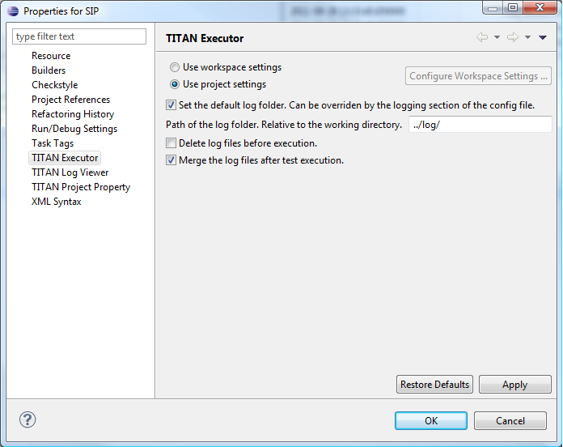

= Setting Workbench Preferences and Project Properties
:figure-number: 4

== TITAN Executor Preferences

Workbench preferences set user specific general rules, which apply to every project, for example, preferred font styles, access to version handling systems.

Open *Window > Preferences*, and select TITAN Executor from the tree.

The following options can be set on the TITAN Executor preferences page:

* **Set the default log folder.**
+
The tests executed by the TITAN Executor will create the log files in the given folder. This option is enabled by default. This option is overridden if the `"FileName"` option is set in the `[LOGGING]` section of the runtime configuration file.

* **Delete log files before execution.**
+
The log files in the default log folder will be deleted before each test execution. Files with `.log` extensions are considered to be log files. This option is only available if the default log folder has been set, by default it is disabled. If the files cannot be deleted, an error message will be displayed.

* **Merge the log files after test execution.**
+
When the test execution is finished, the log files found in the default log directory will be merged into a single file. This option is available if the default log folder has been set, by default it is enabled.

== TITAN Executor Project Properties

To open project properties: *right click* the project and select *Properties*. +
On the project property page it is possible to override the workspace settings for the selected project.

