= Launching the Test Suite
:figure-number: 6

This chapter describes launch configurations, their options, and launching modes. After building an executable test suite, it is ready to be launched. In Eclipse, every aspect of the launch can be configured, for example, different environmental settings can be created by creating different launch configurations, without modifying the system environment variables, so different test environments can be created.

[[launching-modes-supported-by-the-TITAN-Executor-plug-in]]
== The Launching Modes Supported by the TITAN Executor Plug-in

The TITAN Executor can operate in single or parallel mode.

* The single mode - that is also called non-parallel mode - is thought for TTCN–3 test suites built around a single test component. It is forbidden to create parallel test components in single mode, thus the test suite is not supposed to contain any `create` operation; otherwise the test execution will fail.

* The parallel mode offers full-featured test execution including distributed and parallel execution. The goal of introducing the single operating mode was to eliminate redundancies concerning parallelism, and thereby increase the speed of execution.

It is possible to execute non-parallel test suites in parallel mode, but doing so results in unnecessary overhead. The {cpp} code generated by the compiler is suitable for both execution modes, there are no command line switches to select mode. The only difference is that another Base Library has to be linked in single and another in parallel mode.

The TITAN Executor plug-in is built on the TITAN Executor and provides support for the following launch and execution modes:

* Single mode:
+
This mode executes the built executable, and parses its output for information that can be displayed. There is no limitation on the amount of simultaneously running executions of this kind.

* Parallel mode:
+
This mode executes the `mctr_cli` program, and continuously parses its output for information that can be displayed. Although some functions can be reached from the graphical user interface, the main advantage of this launch mode is that it can be driven from its console window, just as `mctr_cli` could be driven from the command line. The user interface reacts to console outputs by the `mctr_cli`. However, as the user is able to change every aspect of the test execution system from outside the execution monitor view, an always consistent controlling environment cannot be provided. There is no limitation on the amount of simultaneously running executions of this kind.

* JNI mode: This mode executes the main controller through the JNI interface, and continuously parses its output for information that can be displayed. The functions can be reached from the graphical user interface. The user interface reacts to the state changes of the main controller through a pipe. There is no limitation on the amount of simultaneously running executions of this kind.
+
NOTE: Execution in JNI mode is not supported on Windows

* Only one parallel execution can be run at a time.

* The plug-in does not provide any means for the user to execute shell commands in the shell where the execution is happening.

* As the plug-in is directly interfacing with the C/{cpp} code in the main controller, it is dependent on the version and the platform of main controller.

Note that some execution modes require a properly set up runtime configuration file.

== Creating a Launch Configuration

Launch configurations can be created, modified and deleted in the *Create, manage, and run configuration* dialog window. It can be opened in the numerous ways.

=== Run as…

Right click on a project in the *Project explorer* and select *Run configurations*… from the *Run as* option.

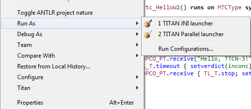

[[Running-from-the-Launch-Command-Toolbar]]
=== Running from the Launch Command Toolbar

*In the toolbar, click the down arrow at the* Launch Commands, *and select* Run as. +
If not visible, modify the Launch properties in the *Windows > Customize Perspective*.

[[Figure-4-F8]]
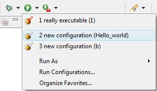

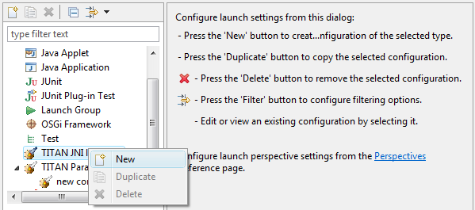

The following operations are available:

* ’*New*’:
+
This button can be used to create a new launch configuration. The values of the created launch configurations will be set to their defaults.

* ’*Duplicate*’:
+
This button will create a new launch configuration, filled with the values of the source launch configuration. This button should be used if the new launch configuration does not differ too much from an earlier one.

* ’*Delete*’:
+
This button deletes the actually selected launch configuration.

All launch configuration types supported by the Executor plug-in can be found in the panel.

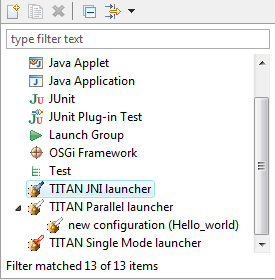

Other launch configuration types supported by other plug-ins are also available here.

=== Creating a Launch Configuration Using Launch Shortcuts

It is possible to create the very first launch configuration for a project, or configuration file in a much easier way then described before:

* Right click on a project in the *Project explorer* *>* *Run As*

* Right click on a .cfg file in the *Project explorer* *>* *Run As*

Both will bring up the launch shortcuts available for the selected project.

In the first case the launch configuration will not have any configuration file set by default, if there isn't any configuration file. It will set the only configuration file if there is exactly one configuration file. It will open a list of configuration files belonging to the project if there are more such files.

In the second case the selected .cfg file will be set as the configuration file to use.

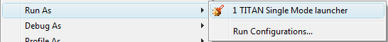

When this function is invoked on a resource to which no launch configuration has ever been created:

. A new launch configuration is made.

. The project, working directory, executable path is initialized.

. If the executable is found, the available testcase will be extracted.

. In case of JNI and Parallel mode execution a single default Host Controller is also initialized.

. Finally the newly created launch configuration is launched automatically.

When this function is invoked on a resource to which there has been already created exactly one launch configuration, that launch configuration will be launched automatically.

When this function is invoked on a resource to which several launch configurations have been made, a list will be displayed for the user to select the one to launch, or cancel to create a new one.

Please note, that after the creation of these launch configuration it is possible to fine tune them just like any other launch configuration using the Launch Configuration Dialog.

[[basic-main-controller-options-page-of-the-launch-configuration]]
=== Basic Main Controller Options Page of the Launch Configuration

[[Ref-1]]
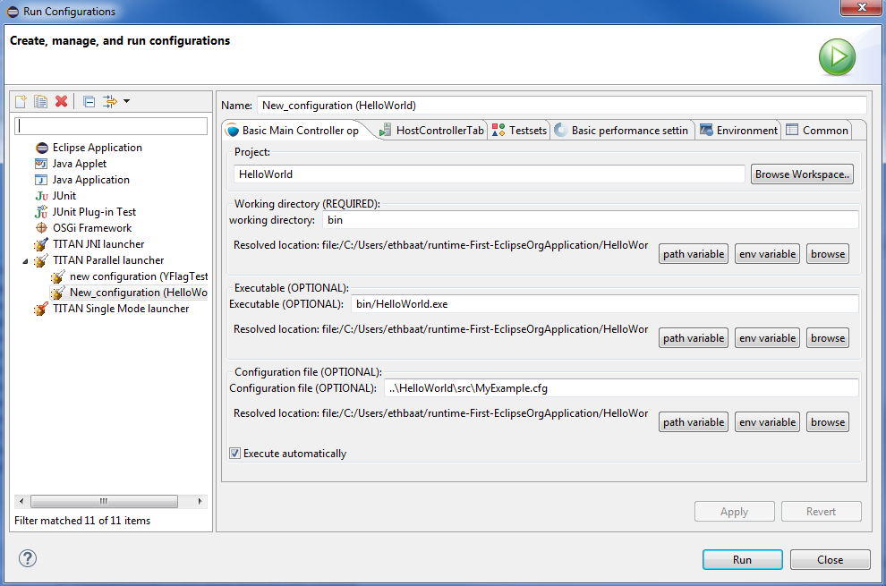

On this page it is possible to set:

* The name of the project.
+
Please note that it is not important to provide the name of the project, it is only provided to support automatic filling of the other fields. If you enter the name of a valid project with TITAN nature (or select one by browsing, as can be seen <<Figure-13,below>>), having the needed build options set, then the fields of the working directory and the executable will be filled in automatically. The entered name is checked for validity.

[[Figure-13]]
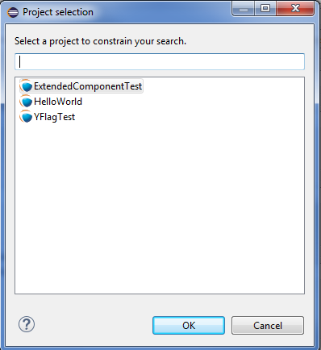

* The working directory of the project.
+
In single mode the built executable and in Mctr_cli mode the Main Controller is executed from this directory. The entered directory path is checked for validity.

* The executable of the project.
+
Please note that this executable is used to fill in the list of testcases on the Testsets page, if you change the path, it will be re-checked, and the data for the Testsets page will be re-evaluated. The entered file path is checked for validity.

* The path of the configuration file.
+
Please note that not only the existence but also the validity of the configuration file is evaluated here. If a problem was found while trying to process the configuration file, the launch process will be interrupted here. Please note that this evaluation is done every time this configuration page becomes active, meaning that switching to and from this page can take some time. The entered file path is checked for validity.

* Whether you wish to start executing the configuration file automatically when the launcher is started.
+
Please note that this option is turned on by default.

All fields can be filled in either by entering the proper values, or via browsing for them. Please note that if a field is not needed and it is not required by the given launch configuration it should be left blank.

Differences between the launch configuration modes regarding this page:

* Single launch mode:
+
The working directory and the executable must be set, but the configuration file is optional.

* Parallel launch mode:
+
The working directory must be set, but the executable and the configuration file are optional.

* JNI based launch mode: (Not available under Windows.)
+
The working directory must be set, but the executable and the configuration file are optional.

In the case of Mctr_cli mode or JNI mode execution if the configuration file is missing, the Main Controller is started with default values. A missing executable can imply that every host controller will connect from remote hosts, and that there is no need to have test sets.

[[host-controllers-page-of-the-launch-configuration]]
=== Host Controllers Page of the Launch Configuration

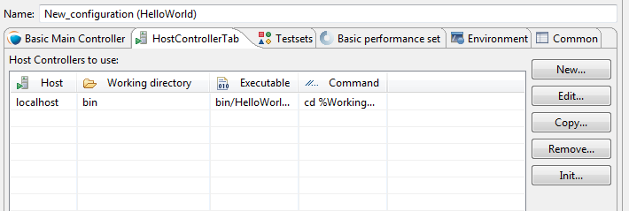

On this page the Host Controllers can be managed.

When activated in the executors, these Host Controllers will be started and parameterized to connect to the Main Controller automatically. Please note that other host controllers might also connect to Main Controller, but those must be manually parameterized.

There are four operations available on this page:

* *New…*:
+
With this button a new Host Controller can be created.

* *Edit…*:
+
With this button the settings of an existing Host Controller can be changed.

* *Copy…*:
+
With this button a copy of an existing Host Controller can be created.

* *Remove…*:
+
With this button an existing Host Controller can be removed.

* *Init…*:
+
Pressing this button will remove the existing host controllers and try to automatically create one based on the settings of the project (provided on the Main Controller page, for more information please refer to section 4.2.4)

The first two of these options opens up the Host Controller dialog (<<Figure-15,below>>).

[[Figure-15]]
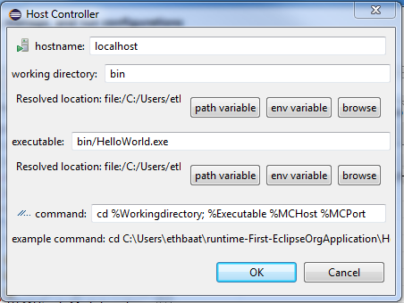

On this Dialog the following options can be set:

* the name of the host

* the working directory of the host

* the executable on the host

* the command to execute when starting a given Host Controller

Please note that:

* none of the fields is required to be unique

* only the command to execute is required for successful operation

* the name, working directory and executable fields are only presented to ease the creation of Host Controllers, especially copying them. In this case it is possible to use the exact same parameterized command for several Host Controllers

You can enter special ’macros’ into the command, which will be extracted just before executing the command.

* `%Host` is replaced by the contents of the name field of the host

* `%Workingdirectory` is replaced by the contents of the Working directory field

* `%Executable` is replaced by the contents of the Executable field

* `%MCHost` is replaced by the address where the Main Controller is running

* `%MCPort` is replaced by the port on which the Main Controller is accepting connections from the Host Controllers

Please note that the values for the last two macros are provided by the Main Controller.

The meaning of the default command string:

* `rsh %Host` : means that before starting the Host Controller it is required to login to a remote machine.

* `cd %Workingdirectory;` : means that the Host Controller will be started from a specific working directory, and all log files will generated in this directory.

* `./%Executable %MCHost %MCPort` : means that the Host Controller is to be executed with the 2 parameters describing how to connect to the Main Controller.
+
NOTE: The `./`, executing on this way is only required if the location of the Host Controller is provided without a full path. In case a full path is used, this part must be removed.

Please also note that in Single launch mode this page does not exist, as in single mode Host Controllers cannot be used.

=== Testsets page of the launch configuration

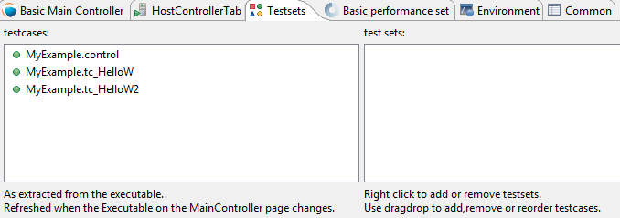

On this page testsets can be set and managed.

The page consists of two areas:

* On the left side is the testcases panel.
+
The available testcases and control parts are listed here. They are collected from the executable provided on the <<basic-main-controller-options-page-of-the-launch-configuration, Basic Main Controller page>>.

* On the right side is the testsets panel.
+
The already created testsets and their contents are displayed here.

To reach the basic test set operation *right click* on the testset panel.

Operations on the testsets panel:

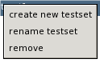

* *Create new testset*:
+
By clicking on this action a new testset can be created. Please note that the names of testsets must be unique.

* *Rename testset*:
+
By clicking on this action while a testset is selected, it can be renamed. Please note that the names of testsets must be unique.

* *Remove* (testset):
+
By clicking on this action while a testset is selected, it can be removed.

* *Remove* (testcase):
+
By clicking on this action while a testcase is selected from a testset, it can be removed from the testset.

Addition, reorganization and copying of testcases is supported via drag & drop operations.

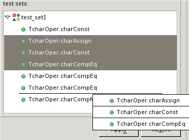

* Inserting new testcases in a testset:
+
To insert a set of testcases into a testset, they should be grabbed from the testcases panel and dropped on the desired testset.Please note that they can be dropped right to their intended positions if the testset is in extracted state. If the testset is in closed state, it can be opened without disrupting the drag & drop operation by holding the mouse over the testset.

* Moving testcases:
+
To move a set of testcases into another position select them, and use drag & drop to move them to the desired place.

* Copying testcases:
+
Copying testcases is almost the same as moving testcase, with the only difference being that the copy type of drag & drop must be used.Please note that on most platforms this behavior can be activated by holding down the *Control button on the keyboard* while the drag & drop operation is ongoing.

NOTE: It might happen that the executable was changed since the testsets were last modified, in a way that some testcases contained in testsets were removed. In this case the structure of the testsets is not adapted automatically; rather it displays warning signs before the missing testcases and the testsets containing such testcases, as it can be seen <<Figure-19,below>>.

[[Figure-19]]
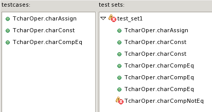

Please note that all three launch configuration types supported by the Executor plug-in use this page the exact same way (however they might use the created test sets differently).

=== Basic Performance Settings Page of the Launch Configuration

On this page performance affecting options can be set. Please note that there are only two general settings available, all other settings are launch mode specific, as it can be seen on figures <<Figure-20,Figure 20>>, <<Figure-21,Figure 21>> and <<Figure-23,Figure 23>>.

* General performance options:
+
[[Figure-20]]
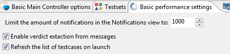

* Limiting the amount of notifications:
+
With this option the maximum amount of notification messages, which can be kept available in the notification view can be set. Basically it can be used in two ways:

* Setting it to 0:
+
This means, that every notification message (console logs and error messages) will be kept available. Please note that in a lengthy execution, the amount of used memory might become very high. Please also note that the views refreshing speed might depend on the amount of elements, which need to be redrawn.

* Setting it to a positive number:
+
This means that the maximum amount of notification messages that are accessible will be around this amount. Please note that if older messages are not needed this is a good way to decrease memory requirements, and possibly increase execution speed. Please also note that the real amount of accessible notifications might somewhat exceed this threshold. This is because of performance reasons, as removing several elements at once is much faster than removing elements one by one.

* Verdict extraction from notification messages:
+
If this option is set, then the notification messages are parsed for possible verdict setting messages. This allows using the TITAN test results view, where only such verdict setting information is displayed. However, please note, that this requires a regular expression matching for every message, which can slow down the execution.

* Refresh the list testcases on launch:
+
If this option is set right after the launch of a launch configuration (but still before actually executing something) if the binary is set, it will be contacted for the actual list of testcases and control parts. The elements from this list which are not included in the configuration (because they were added later) will also be displayed in the execution dialog.Please note that this will not update the configuration itself, as that could lead to data loss regarding testsets (containing the testcase temporarily removed).

* Specific performance options for Single launch mode (below):
+
[[Figure-21]]
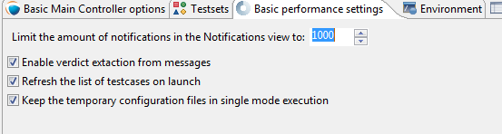

* Keeping temporary configuration files:
+
In single launch mode the execution is controlled with temporarily created configuration files. For example, if a testset is to be executed, the executable will be called with a configuration file containing a properly generated Execute section.

* If this option is not set, then temporary configuration files are deleted after each execution, to save disk space.

* If this option is set, then the temporary configuration files are kept after execution. This can be used to create specific configuration files automatically.

* Specific performance options for parallel launch mode(below):
+
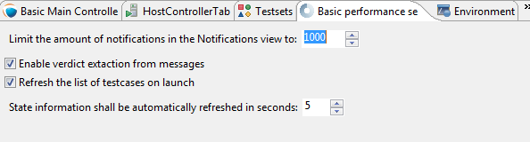

* State information refresh:
+
In parallel mode the execution is controlled with command line messages and outputs. This means that the eclipse side of the executor and the command line side of the executor has a high probability of being in different states. This option set how often should synchronization be done. +
Please note that values are only accepted in the 1..10 range. Lower values could provide too much load, higher values would could effect execution times.

* Specific performance options for JNI launch mode (below):
+
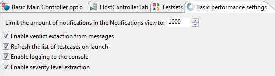
[[Figure-23]]

* Enable logging to the console:
+
If this option is not set, the notification messages will not be printed to the console (but they will still be displayed in the notification view).

* Enable Severity level extraction:
+
The extraction of the severity level of events does not really cost too much performance, so it should always be set unless performance is crucial, and this information is not really needed.

=== The Environment Page of the Launch Configuration

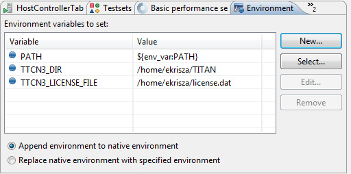

In general, the environment settings page is the place where the execution environment should be configured.

On this page you can:

* Add new variables with the "**New…**" button.

* Add environmental variables from the actual environment with the "**Select…**" button.

* Modify already set variables with the "**Edit…**" button.

* Delete already set variables with the "**Remove…**" button.

On the bottom of the page there is one more important option: whether you want to append or overwrite the list of variables coming from the operating system, with these variables.

Important:

* Please don’t forget that the TITAN executor requires the setting of some environmental variables, to work properly. For more information please refer to the Programmer’s Technical Reference <<8-references.adoc#_4, [4]>>.

* Please note that the execution is not taking place in the operating system’s environment, but in the Java Virtual Machine’s environment. Special caution is required, if your tests depend on the values of environmental variables defined in the operating system.

* In order to make dynamic linking work, the `LD_LIBRARY_PATH` environment variable is set automatically for all launch modes. It generally means, that `${TTCN3_DIR}/lib` and the working directories of all reachable projects are appended to `LD_LIBRARY_PATH`. (The user defined `LD_LIBRARY_PATH` always comes first, if it’s available.)

Please note that this page is fully provided by Eclipse, however features like appending the environmental variables or using variable variables (this feature can be reached by pressing the *Edit…* button), only take affect if they are implemented in the plug-in, too. Appending or overwriting environmental variables is fully supported. Some effort was made to support the variables too, but as their number, and ways of behaving is internal to Eclipse (meaning that it can be changed at any time), their usage is NOT RECOMMENDED.

Differences of the launch modes:

* In single mode:
+
The shell created to run the built executable will receive the environmental variables.

* In parallel mode:
+
Both the Main Controller and the Host Controllers will be executed in shells, having the provided environmental variables set.

* In JNI mode:
+
The Host Controllers will be executed in shells, having the provided environmental variables set.

=== Common Page of the Launch Configuration

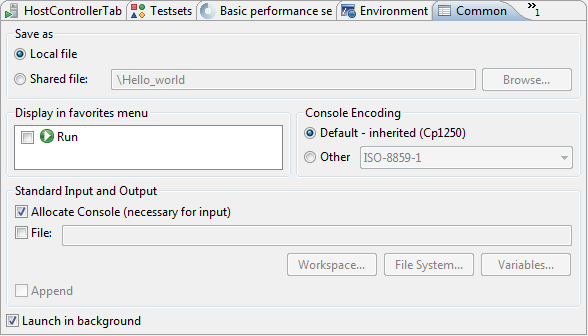

This is a fully Eclipse provided and supported page.

For us the two most important parts of this page are:

* The Save as region:
+
Here you can select a directory where the data of the launch configuration will be saved. The file will be named after the name of the launch configuration, with the extension "launch". Eclipse is automatically taking care of such files, if it finds such a file anywhere in the directories of the projects, it will be offered to the user. Please note that for this reason it is advised to put the launch configurations in the project’s directories. On this way if a project is closed, the launch configurations belonging to it won’t be displayed. +
Please note that if you choose not to save the launch configuration it will still be saved, but to an internal point in Eclipse’s inner data hierarchies. output:

* Standard input and output:
+
--
** *Allocate Console*:
+
This option should always be checked; otherwise Eclipse will not create a console for the executed processes, disabling communication with them.

** *File*:
+
If a file is set, then every command entered in, or output on the console will be written to the given file, too.

** *Append*:
+
If this option is not set, then every time a new process is started it will erase the contents of the above mentioned file, before writing out the new messages.
--
+
NOTE: In JNI mode launch the Standard input and output handling part is not supported.
