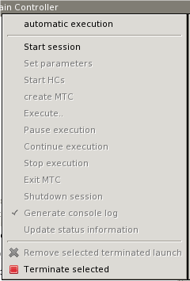

= Executing and Controlling the Execution of Test Suites
:figure-number: 25

The three different launch modes that are supported by the Executor plug-in, also imply three different execution mechanisms (executions and executors).

As the general user interaction interfaces, are about the same, we will discuss them one by one, detailing the differences between the execution modes when they apply.

== Execution Control

Execution can be started on several ways:

* Pressing the *Run* button on a launch configuration, starts an execution configured with that launch configuration.

* Pressing the *Run* button on the launch commands actionset, on the toolbar, will start an execution configured with the launch configuration used the last time.

* Pressing the arrow to the right from the Run button on the launch configuration actionset, and selecting the preferred launch configuration, will start an execution configured with the selected launch configuration.

The launching modes are explained in detail in the chapter describing <<4-launching_the_test_suite.adoc#launching-modes-supported-by-the-TITAN-Executor-plug-in, launching modes supported by the TITAN Executor plug-in>>.

Please note that redrawing the supported views might cost some performance, for this reason it is supported to close these views. If these views are closed then the performance penalty of redrawing them does not apply, however in that state you cannot control the execution of the tests, and you don’t receive any status information. If in the middle of the execution the views are opened up again, they will show the actual state of the system, and you can again take control of the execution. Please note that only the views can be closed; exiting Eclipse stops every ongoing execution automatically.

As soon as an execution is started it will be displayed in the Executor monitor view.

== TITAN Execution Controller View

[[Figure-26]]

The TITAN Execution Controller view is the place where you can control the execution via their executors.

It is made up of two main parts:

* The toolbar:
+
This is the place where general execution mode independent actions are made available.

* The main window:
+
This is the place where executor specific information and actions are made available.

Four actions are available from the toolbar:

* *Remove selected terminated launch*:
 +
This action can remove an already terminated launch from the list.

* *Remove all terminated launches*:
 +
This action removes every terminated launch from the list.

* *Terminate selected launch*:
 +
This action can terminate a not yet terminated launch.

* *Terminate all launches*:
 +
This action can terminate every not yet terminated launch.

These actions are only enabled if they can be applied.

Please note that it is a good idea to look around in the *Window > Preferences > Run/Debug* section, as several Eclipse level preferences can be set here, that might affect the user experience.

For example:

* In *Console* the preferences of the launch consoles can be set.

* In *Launching* you can choose to have a build before every launch (the build actually only happens if it is required).

The main window contains information about the launches and executors.

This representation has:

* A general part:
+
This is a tree, where the root represents the launch, and the leaf represents the executor.

* The name of the root follows the `<name of the launch configuration> [ <launch mode> ]` convention. +
The root always offers all four actions known from the toolbar (they can be reached by a *right click on the root element)*.

* The name of the leaf is always Main Controller.
+
The leaf allows the *terminate selected launch* and the *remove terminated launch* actions.

** A specific part:
+
The actions generally provided by the leaf are extended with executor specific ones. In case of the parallel and JNI launch modes, detailed information about the Main Controller can be made visible as a sub tree of this tree node.

Specific commands:

* in Single mode:
+
image::images/5_F27.png[title="Commands in single mode"]

* Start execution:
+
This action lets you execute your test campaign, via the Execute dialog (<<Figure-31,Figure 31>>). Please note that temporary configuration files, based on the selection in the Execute dialog, are generated to drive the execution.

* in parallel mode:
+

* *Automatic execution*:
+
This action allows you to automatically execute tests. You will be presented with the Execute dialog (<<Figure-31,Figure 31>>). After selecting the element you wish to execute, if the launch was configured properly, it will automatically navigate through the steps that are required for the execution.

* *Start Host Controllers*:
+
This action starts the Host Controllers set on the Host Controllers page of the launch configuration. Please note that the variables inserted into the Host Controllers commands are extracted at this point. For more information on the Host Controllers page of the launch configuration, please refer <<4-launching_the_test_suite.adoc#host-controllers-page-of-the-launch-configuration, here>>;

* *Create MTC*:
+
This action executes the "**cmtc**" command, creating the Main Test Component of this execution;

* *start execution*:
+
This action brings up the Execute dialog (<<Figure-31,Figure 31>>), and executes the "**smtc**" command properly parameterized, with the selected item to execute;

* *Terminate MTC*:
+
This action executes the "**emtc**" command, terminating the Main Test Component;

* *exit*:
+
This action executes the "**exit**" command, exiting from the Main Controller;

* *info*:
+
This action executes the "**info**" command, providing inner state information to the user.

NOTE: The last five commands are commands of the `Mctr_cli`.

All of the commands of *Mctr_cli* can be issued directly from the Console too (including the ones mentioned). The executor will try to adapt to the changes, for example if you select the *info* action, or execute the *info* command in the Console, the information displayed under the executor node will be updated (this can be seen on <<Figure-29,Figure 29>>). For more information on the commands of the *Mctr_cli* and how to execute testcases in it please refer to chapter 12 of the User Guide <<7-references.adoc#_3, [3]>>.

[[Figure-29]]

* JNI mode:
+

* *Automatic execution*:
+
This action allows you to automatically execute tests. You will be presented with the Execute dialog (<<Figure-31,Figure 31>>). After selecting the element you wish to execute, if the launch was configured properly, it will automatically navigate through the steps that are required for the execution. +
If you wish to do these steps yourself, then you can use the following actions.

* *Start session*:
+
The Main Controller starts listening for incoming Host Controller connections on the TCP port defined in the configuration file.

* *Set parameters*:
+
The Main Controller downloads the configuration file to the connected Host Controllers, so they can process it.

* *Start HCs*:
+
The Host Controllers, defined on the Host Controller page of the launch configuration, are started. They first try to establish a TCP connection to the Main Controller and then wait for further requests. If a Host Controller connects to the test system after the parameters were already set, the Main Controller will download the configuration file to this new Host Controller, too.

* *Create MTC*:
+
Creates the Main Test Component and establishes a control connection between the Main Controller and the Main Test Component. +
Please note that there can be only one MTC in the test system.

* *Execute…*:
+
Brings up the Execute dialog (<<Figure-31,Figure 31>>), where control parts, testcases, test sets and even execution schemes created in the configuration file can be executed.

* *Pause execution*:
+
Sets whether to interrupt test execution after each test case, or not. The actual value is displayed as the checked status of this action (if it is set, then a checked state is displayed). If this action is checked and the actual testcase is finished, the execution is stopped until the *Continue execution* action is selected. If this action is not checked and the actual test case finished execution, then the execution continues with the next test case.

* *Continue execution*:
+
Resumes the interrupted test execution.

* *Stop execution*:
+
Terminates the test execution. +The verdict of the actual test case will not be considered in the statistics of the test suite.

* *Exit MTC*:
+
Terminates the Main Test Component.

* *Shutdown session*:
+
Shuts down the session, terminating the Host Controllers and the Main Controller. +
Please note that the already connected Host Controllers cannot be terminated till this point in the execution.

* *Generate console log*:
+
Enables / disables console logging. +
If this action is not checked, console messages will not be generated. +
Please note that in this case the notification messages (originally also considered as console messages), will not be emitted by the Main Controller, this way such messages will be missing from the Notification view too.

* *Update status information*:
+
Selecting this action you can update the detailed information, which the main controller provides (an example can be seen on <<Figure-29,Figure 29>>).

=== Execute Dialog

[[Figure-31]]

This dialog (<<Figure-31,above>>) is shown by all 3 launch modes when you select to execute tests of any kind.

This dialog represents the executable test elements in a tree:

* Control parts.

* Test sets.

* Testcases.

* Configuration file:
+
This means the tests and their order defined in the execute section of the configuration file, provided on the Basic Main Controller options page of the launch configuration (for more information please refer <<4-launching_the_test_suite.adoc#basic-main-controller-options-page-of-the-launch-configuration, here>>).

On this dialog you can also select how many times you wish to execute the selected element.

Selecting the amount of execution times is only available if an executable element is selected. If one of the main elements (branches) of the tree is selected, then the execution amount adjusting part of this dialog becomes disabled (this can be seen below).

Please note that if an element type is not present then the corresponding branch cannot be expanded. For example if no configuration file was set on the Basic Main Controller options page, then the configuration file branch does not have leafs.

== TITAN Notifications View

The TITAN Notifications view (above) contains all of the notifications (previously console and error messages), that might come from the test system.

As several executions can be ongoing at any given time, this view always shows the notification messages, created by the execution/launch actually selected in the TITAN Execution Controller view (<<Figure-26,Figure 26>>). For this reason the tool tip of this view shows which execution it belongs to at a given time.

Notifications of an execution can only be reached; as long as the execution is not removed from the system (being terminated is allowed).

Please note that the Performance page of the launch configuration has some options to tweak the performance of this view. For more information please refer <<4-launching_the_test_suite.adoc#host-controllers-page-of-the-launch-configuration, here>>.

The following actions are supported:

* *Clear*:
+
Selecting this action clears the notification logs of the selected execution.

* *Save as*:
+
Selecting this action allows the user to save the notification message in a file via a standard *save as…* Window.

* *Follow the last record*:
+
If this action is checked and new records are inserted into the lists of notifications, then the view will automatically make the last record visible. If this action is not set, then the user can stay fixed on a record (by selecting it), while new log records are still inserted.

Please note that these actions can be selected from the toolbar and menu bar of the view.

== TITAN Test Results View

The TITAN test results view (above) contains verdict changing notifications extracted from the list of notifications.

This view serves the purpose of summarizing the verdict changes of a test execution, briefly showing when and which testcase set what verdict value. As several executions can be ongoing at any given time, this view always shows the verdict changing messages, created by the execution/launch actually selected in the

TITAN Execution Controller view (<<Figure-26,Figure 26>>). This information of an execution can only be reached; as long as the execution is not removed from the system (being terminated is allowed).

It is worth to notice that the tool tip of this view not only identifies the execution it belongs to, but also presents its statistics (as seen below).

The following actions are supported:

* *Save as*:
+
Selecting this action allows the user to save the extracted notifications in a file via a standard save as… Window.

* *Follow the last record*:
+
If this action is checked and new records are inserted into the lists of extracted notifications, then the view will automatically make the last record visible. If this action is not set, then the user can stay fixed on a record (by selecting it), while new log records are still inserted.

Please note that these actions can be selected from the toolbar and menu bar of the view.

Please note, that if verdict extraction is not enabled on the Performance page of the launch configuration, this view will be empty. For more information please refer to section 4.2.5.

== Console Views

There are a few things to remember about console views:

* For single and mctr_cli mode launching these are supported by Eclipse, for JNI mode launching the TITAN RUNTIME Console is used to output messages.

* The consoles of the single and mctr_cli mode launches and the consoles of all host controllers can be used to enter text.

* The consoles of the single and mctr_cli mode launches are executing in shells, con-figured on the Environment page of the launch configuration (please refer to section 4.2.3). The commands that execute the Main controllers in these views are prefixed with `"sh -c sleep1;"`. +
`"sh -c"` creates a new shell. +
"`sleep 1`" is used to have enough time to connect to the output of the started process before it actually has some outputs. (This is a technical limitation: we have experienced a few so fast executions in our tests, that at the time the output processing functionalities tried to connect to the output of the process, the process was already finished. This amount of delay is still not too much, but should already be enough to solve this kind of situations).

* When an executing launch is selected in the Executor monitor view, the Console view changes to the console of the main controller belonging to the execution.

=== Creating a New Console View

By default the Executor perspective has only a single Console view open this can be changed by selecting the Open Console menu (Figure 36) and clicking on the New Console View option (Figure 37). By doing so a new Console view will be created in the actual perspective

Using this feature of the Console views it is possible to create a separate Console view for each Host Controller or Main Controller of interest, and with their output at the same time.

=== Selecting and Pining to a New Console Output

The default behavior of the Console View provided by its plug-in is that it always tries to show the data printed to a console. For this reason when any Host controller or the Main Controller displays any information on its standard output, the Console View will automatically switch to the Console displaying that information.

If it is desired to have a given console present at all time this can be achieved by selecting the Display Selected Console menu item (Figure 38), and from the list of available consoles selecting the one desired (Figure 39).

image::images/5_F38.png[title="The Display Selected Console menu"]

To force a Console View to always display the contents of a given console, one has to click on the Pin Console menu item (Figure 40). To lift this limitation from the Console View the Pin Console menu item has to be clicked again.

image::images/5_F40.png[title="The Pin Console menu item"]

== Limitations

* In Parallel mode the actions that are displayed to be available and the ones truly available might differ in special time periods. The reason for this limitation is that it is almost impossible to tell the exact state of the Main Controller at a given time. For example, if the system buffers the output of the Main Controller, or the input of the watching process, than a short status change indicating message might not appear until the buffer is not filled up (with still to come messages). On the performance page of the mctr_cli launch configuration it can be set how often the states should be synchronized.

* In JNI mode we have witnessed, that on some machines the Java Virtual Machine fails to load the `LD_LIBRARY_PATH` environmental variable from the shell into his set of environmental variables. +
An indication of this problem is when the JNI executor reports, that the JNI dynamic library could not be loaded, though the path to the file can be found on the `LD_LIBRARY_PATH` of the shell. +
A solution can be to start Eclipse with the following command forcing the Java Virtual Machine to load this environmental variable: *java -classpath startup.jar –Djava.library.path=$LD_LIBRARY_PATH org.eclipse.core.launcher.Main* +
(This command must be executed in the directory where Eclipse was installed to)

* Execution in JNI mode is not supported on Windows
