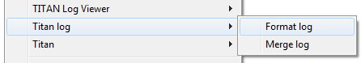
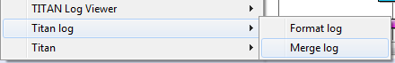

== Other Available Functions
:figure-number: 40

=== Formatting Log Files

To format a log file (one having log as extension) *right click* the fileand select *Titan Log > Format log*.

This will produce a formatted log file in the very same directory, with the same name, but having the extension formatted_log.

Please note that for the duration while the formatted log is being created progress indication is provided in the *Progress view*.

=== Merging Log Files

To merge several log files (ones having log as extension) select them, and after right clicking on one select *Titan Log > Format log.*

This will first ask for the file where the results have to be saved, processing the log files will only start after a new or an existing file is selected.

Please note that for the duration while the formatted log is being created progress indication is provided in the *Progress view*.

