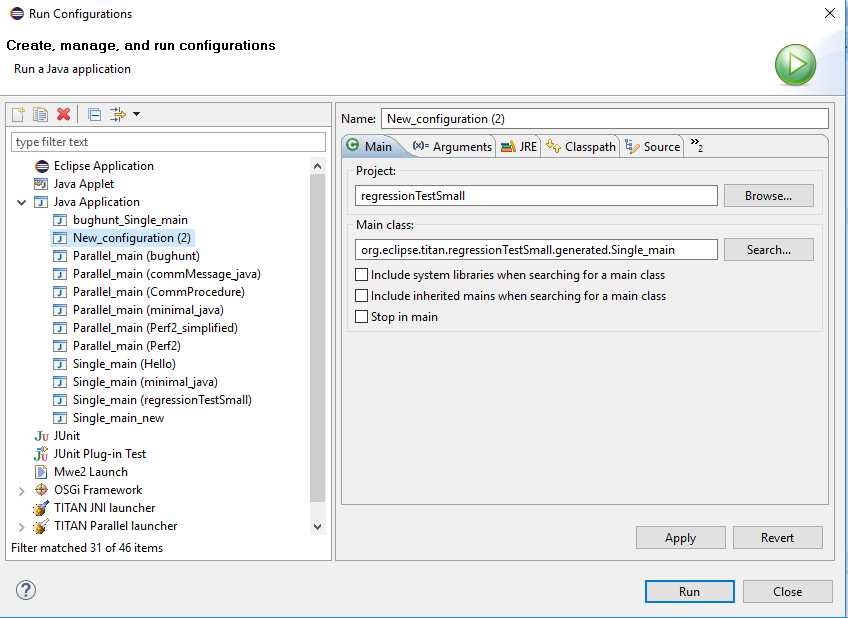
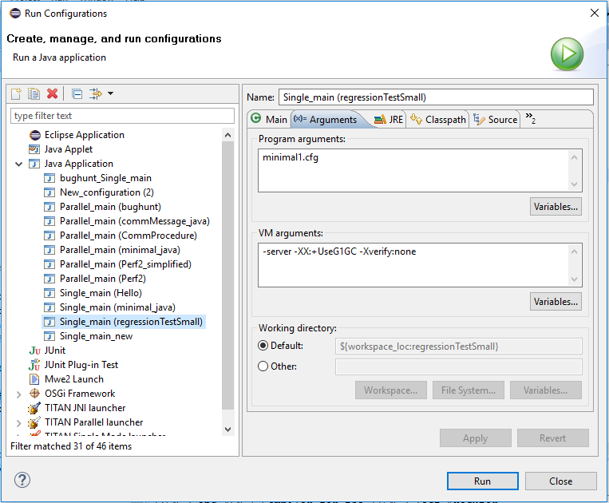
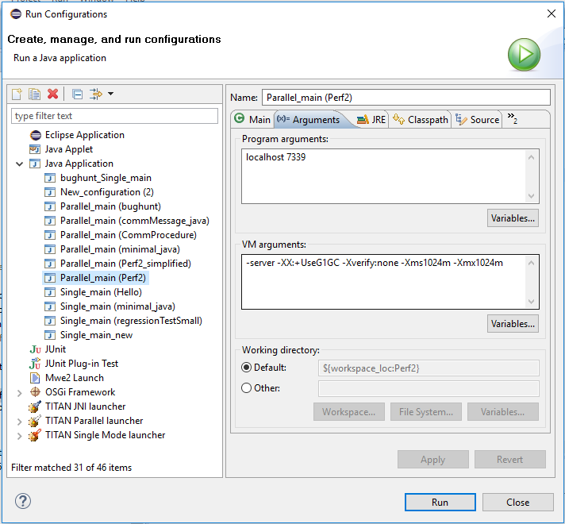
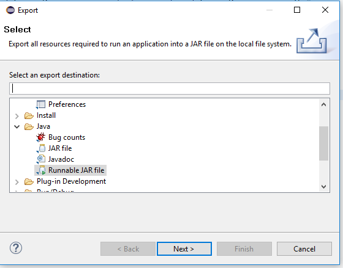
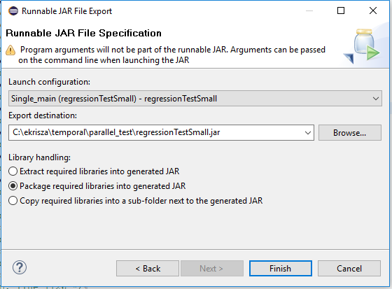

= Launching TITAN Java Projects
:figure-number: 42

This chapter describes the launching modes of TITAN Java projects.

After building a TITAN Java project, it is ready to be launched as a Java project.
In Eclipse, every aspect of the launch can be configured, for example, different environmental settings can be created by creating different launch configurations, without modifying the system environment variables, so different test environments can be created.

NOTE: Right now the Java side of the TITAN Test Executor is supported as a Java application native to Eclipse. It as executed with the same limitations and benefits.

WARNING: The execution of TITAN Java projects (the Java side of the Test Executor) is done as Eclipse native java applications. It is not yet integrated to the usual Interface elements (Views, TITAN Launch configurations, etc...) that support the execution of the binaries of the C side of the TITAN Test Executor.

[[launching-modes-supported-by-the-TITAN-Executor-plug-in-for-TITAN-Java-Projects]]
== The Launching Modes Supported by the TITAN Executor Plug-in for TITAN Java Projects

The TITAN Executor can operate in single or parallel mode.

From the point of view there are 2 ways to execute TITAN Java projects: 
from Eclipse as Java projects and executing exported jar files.

=== Executing TITAN Java Projects from Eclipse

To execute TITAN Java projects inside Eclipse requires the creation of a Launch configuration.

In the toolbar, click the down arrow at the *Launch Commands*, and select *Run Configurations...* . +
If not visible, modify the Launch properties in the *Windows > Customize Perspective* (see <<Figure-4-F8,Figure 4>>).

The following operations are available:

* ’*New*’:
+
This button can be used to create a new launch configuration. The values of the created launch configurations will be set to their defaults.

* ’*Duplicate*’:
+
This button will create a new launch configuration, filled with the values of the source launch configuration. This button should be used if the new launch configuration does not differ too much from an earlier one.

* ’*Delete*’:
+
This button deletes the actually selected launch configuration.

To create a new Launch Configuration for executing a TITAN Java Project:

1. select *Java Application*.

2. On the toolbar select *New*.
+
At this point a new Launch Configuration should appear, similar to "New_Configuration (2)" on figure <<Figure-7-F43,Figure 43>>.
+
[[Figure-7-F43]]

3. To configure the *Main* page:
* for the *Project* field select the project you wish to execute.

* for the Main Class field select the generated class fitting to your execution mode:
** classes with their names ending in "generated.Single_main" can be used to drive single mode execution.
** classes with their names ending in "generated.Parallel_main" can be used to drive parallel mode execution.

4. To configure the *Arguments* page:
* for the *Program Arguments* field provide the arguments you would like your execution started with.
** For single mode execution this is generally the path of the configuration file to use (relative to the root folder of the project being executed).
** For parallel mode execution this is generally the host address and port, the Main Controller is expecting connection on.

* In the *VM Arguments* field, you can provide configuration options for the Java Virtual Machine that will do the execution.

[[Figure-7-F44]]

Figure <<Figure-7-F44,Figure 44>> shows an example for configuring a single mode execution. The "minimal1.cfg" will be the configuration file used for execution. The Java Virtual Machine will be configured to execute in server mode, using the Garbage First (G1) garbage collector.

[[Figure-7-F45]]

Figure <<Figure-7-F45,Figure 45>> shows an example for configuring a parallel mode execution. The main controller is expecting the host controller to connect to the "localhost" to port number "7339" for execution. The Java Virtual Machine will be configured to execute in server mode, using the Garbage First (G1) garbage collector, and to use 1024 MBs of memory during its execution.

All launch configuration types supported by the Executor plug-in can be found in the panel.

NOTE: Please note, that the process is very similar to that described in section <<Running-from-the-Launch-Command-Toolbar,4.2>>, we are just using a different launch configuration kind to configure the execution.

=== Executing TITAN Java project via exported jar files.

==== Exporting the JAR files.

It is possible to export TITAN Java projects into a single jar file and use them as executables.

To export a .jar file from a TITAN Java project:

1. Select the project in the navigator/project explorer view.

2. In the right click menu, select *Export...*.

3. In the window appearing select *Java / Runnable JAR file* and than *Next* (see <<Figure-7-F46,Figure 46>>).
+
[[Figure-7-F46]]

4. Configure the export (see <<Figure-7-F47,Figure 47>>).
+
[[Figure-7-F47]]

+
The following options are available:

* *Launch Configuration*: select the launch configuration that configures the execution for this jar file. This will set the class to be used for execution.

* *Export destination*: select the file into which the export should be done.

* *Library handling*: It is possible to configure how the libraries are handled in the resulting jar. We recommend selecting the *Package required libraries into generated JAR*

5. Select *Finish*.

==== Executing with JAR files in single mode

The Java side of the TITAN Test Executor, in the case of the exported jar files, follows the same procedures as the C side does described in the User Guide for TITAN TTCN-3 Test Executor<<8-references.adoc#_3, [3]>>.
With differences related to executing Java files.

For example executing a generated executable, in single mode, on the C side:
[source]
----
./regressionTestSmall.exe minimal1.cfg
----

Executing an exported jar file, in single mode, on the Java side:
[source]
----
java -jar regressionTestSmall.jar minimal1.cfg
----

==== Executing with JAR files in parallel mode

The Java side of the TITAN Test Executor, in the case of the exported jar files, follows the same procedures as the C side does described in the User Guide for TITAN TTCN-3 Test Executor<<8-references.adoc#_3, [3]>>.
With differences related to executing Java files.

To execute test suites in parallel mode first the Main Controller needs to be started:
[source]
----
$ ./mctr_cli.exe Perf2.cfg

*************************************************************************
* TTCN-3 Test Executor - Main Controller 2                              *
* Version: CRL 113 200/6 R6A                                            *
* Copyright (c) 2000-2019 Ericsson Telecom AB                           *
* All rights reserved. This program and the accompanying materials      *
* are made available under the terms of the Eclipse Public License v2.0 *
* which accompanies this distribution, and is available at              *
* https://www.eclipse.org/org/documents/epl-2.0/EPL-2.0.html            *
*************************************************************************

Using configuration file: Perf2.cfg
MC@HU-00000227: Listening on TCP port 7339.
MC2>
----

It will tell us, that it accepts connections on the localhost machine, on the port number 7339.

To connect to it, in parallel mode, on the C side:
[source]
----
./regressionTestSmall.exe localhost 7339
----

Executing an exported jar file, in single mode, on the Java side:
[source]
----
java -jar regressionTestSmall.jar localhost 7339
----

==== Tips

It is possible to provide Java VM arguments when executing exported jar files.
For example:
[source]
----
java -Xmx1024m -jar regressionTestSmall.jar minimal1.cfg
----
