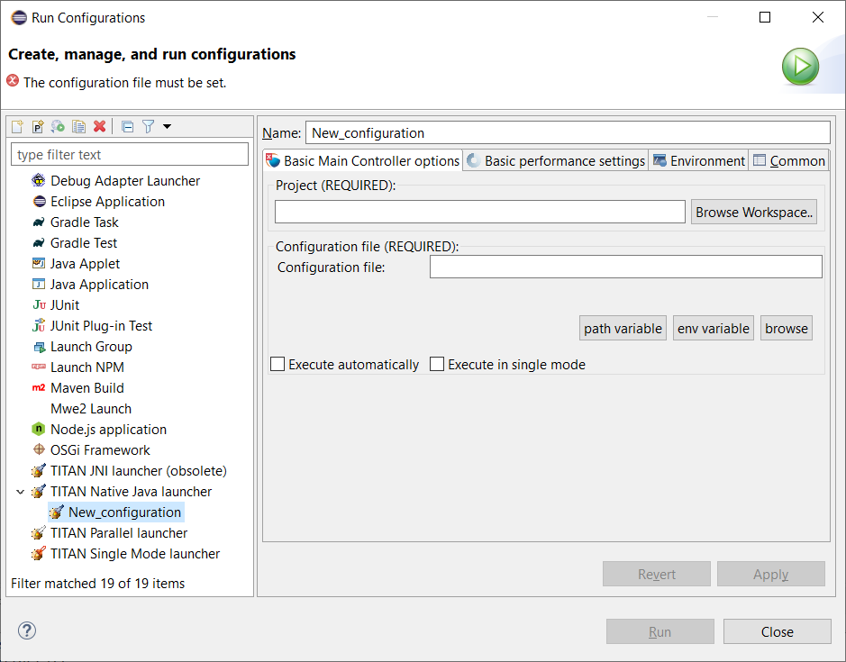

= Launching TITAN Java Projects
:figure-number: 42

This chapter describes the launching modes of TITAN Java projects.

After building a TITAN Java project, it is ready to be launched as a Java project.
In Eclipse, every aspect of the launch can be configured, for example, different environmental settings can be created by creating different launch configurations, without modifying the system environment variables, so different test environments can be created.

NOTE: Right now the Java side of the TITAN Test Executor is supported as a Java application native to Eclipse. It as executed with the same limitations and benefits.

WARNING: The execution of TITAN Java projects (the Java side of the Test Executor) is done as Eclipse native Java applications. It is not yet fully integrated to the usual Interface elements like Views that support the execution of the binaries of the C side of the TITAN Test Executor.

[[launching-modes-supported-by-the-TITAN-Executor-plug-in-for-TITAN-Java-Projects]]
== The Launching Modes Supported by the TITAN Executor Plug-in for TITAN Java Projects

The TITAN Executor can operate in single or in parallel mode.

From the point of view there are 2 ways to execute TITAN Java projects: 
from Eclipse as Java projects and executing exported jar files.

=== Executing TITAN Java Projects from Eclipse

To execute TITAN Java projects inside Eclipse requires the creation of a Launch configuration. For TITAN Java Projects the TITAN Native Java launch configuration mode is necessary that supports both the single and parallel execution mode. Launch configurations can be created, modified and deleted in the *Create, manage, and run configuration* dialog window. It can be opened in the numerous ways as detailed in <<creating-launch-configuration,Creating Launch Configuration>>:
* using the *Run as* option in pop-up menu of the *Project explorer* (<<Figure-4-F7,Figure 7>>),
* using the *Launch Commands* on the toolbar (<<Figure-4-F8,Figure 8>>).

Furthermore, a default launch configuration can be created using launch shortcuts. It works the same way as described in <<creating-launch-configuration,Creating Launch Configuration>>, however the TITAN Native Java launching mode requires less option, i.e.:

. A new launch configuration is made.

. The project and configuration file paths are initialized.

. Finally the newly created launch configuration is launched automatically in parallel execution mode.

The launch configuration created using launch shortcuts is automatically added to favorite list under the *Launch Commands* (<<Figure-4-F8,Figure 8>>).

NOTE: It is encouraged to use the launch shortcuts to reduce the number of possible mistakes. The generated launch configuration is still editable in the *Create, manage, and run configuration* dialog window (see below).

=== Basic Main Controller Options Page of the Launch Configuration

[[Figure-7-F43]]

On this page it is possible to set:

* The name of the project.
+
Filling this field is mandatory. The entered name is checked for validity. The project's root folder is used during the automatically filling of the other fields. The path variables are relative to the project's root supporting the portability of the project as whole. If you enter the name of a valid project with TITAN nature (or select one by browsing, as can be seen <<Figure-13,below>>), the configuration file will be filled in automatically.

NOTE: It is encouraged to use the *Browse Workspace* button to select a valid project from the workspace that simplifies the filling of the other fields, as well as reduces the possible mistakes. 

* The path of the configuration file.
+
Please note that not only the existence but also the validity of the configuration file is evaluated here. If a problem was found while trying to process the configuration file, the launch process will be interrupted here. Please note that this evaluation is done every time this configuration page becomes active, meaning that switching to and from this page can take some time. The entered file path is checked for validity.

* Execute automatically
+
Whether the user wish to start executing the configuration file automatically when the launcher is started. Please note that this option is turned on by default.

* Execute in single mode
+
Whether the user wish to start executing the TITAN Java project in single or in parallel mode. Please note that this option is turned off by default.

All fields can be filled in either by entering the proper values, or via browsing for them.

If you press *Apply* some other launch configurations will appear automatically according to the filled values in the *Create, manage, and run configuration* dialog window.

[NOTE]
====
During the filling Eclipse might ask for saving the modification.

Sometimes Eclipse automatically switches to one of the additionally created launch configuration after saving the TITAN Native Java launch configuration.
====

The functionality of other tab pages of the of the TITAN Native Java launch configuration matches the ones for JNI launch mode, see <<creating-launch-configuration,Creating Launch Configuration>>.

=== Executing TITAN Java project via exported jar files.

==== Exporting the JAR files.

It is possible to export TITAN Java projects into a single jar file and use them as executables.

To export a .jar file from a TITAN Java project:

1. Select the project in the navigator/project explorer view.

2. In the right click menu, select *Export...*.

3. In the window appearing select *Java / Runnable JAR file* and than *Next* (see <<Figure-7-F46,Figure 49>>).
+
[[Figure-7-F46]]
image::images/7_F46.png[title="Export wizard"]

4. Configure the export (see <<Figure-7-F47,Figure 50>>).
+
[[Figure-7-F47]]

+
The following options are available:

* *Launch Configuration*: select the launch configuration that configures the execution for this jar file. This will set the class to be used for execution.

* *Export destination*: select the file into which the export should be done.

* *Library handling*: It is possible to configure how the libraries are handled in the resulting jar. We recommend selecting the *Package required libraries into generated JAR*

5. Select *Finish*.

==== Executing with JAR files in single mode

The Java side of the TITAN Test Executor, in the case of the exported jar files, follows the same procedures as the C side does described in the User Guide for TITAN TTCN-3 Test Executor<<8-references.adoc#_3, [3]>>.
With differences related to executing Java files.

For example executing a generated executable, in single mode, on the C side:
[source]
----
./regressionTestSmall.exe minimal1.cfg
----

Executing an exported jar file, in single mode, on the Java side:
[source]
----
java -jar regressionTestSmall.jar minimal1.cfg
----

==== Executing with JAR files in parallel mode

The Java side of the TITAN Test Executor, in the case of the exported jar files, follows the same procedures as the C side does described in the User Guide for TITAN TTCN-3 Test Executor<<8-references.adoc#_3, [3]>>.
With differences related to executing Java files.

To execute test suites in parallel mode first the Main Controller needs to be started:
[source]
----
$ ./mctr_cli.exe Perf2.cfg

*************************************************************************
* TTCN-3 Test Executor - Main Controller 2                              *
* Version: 7/CAX 105 7730 R2A                                           *
* Copyright (c) 2000-2021 Ericsson Telecom AB                           *
* All rights reserved. This program and the accompanying materials      *
* are made available under the terms of the Eclipse Public License v2.0 *
* which accompanies this distribution, and is available at              *
* https://www.eclipse.org/org/documents/epl-2.0/EPL-2.0.html            *
*************************************************************************

Using configuration file: Perf2.cfg
MC@HU-00000227: Listening on TCP port 7339.
MC2>
----

It will tell us, that it accepts connections on the localhost machine, on the port number 7339.

To connect to it, in parallel mode, on the C side:
[source]
----
./regressionTestSmall.exe localhost 7339
----

Executing an exported jar file, in single mode, on the Java side:
[source]
----
java -jar regressionTestSmall.jar localhost 7339
----

==== Tips

It is possible to provide Java VM arguments when executing exported jar files.
For example:
[source]
----
java -Xmx1024m -jar regressionTestSmall.jar minimal1.cfg
----
