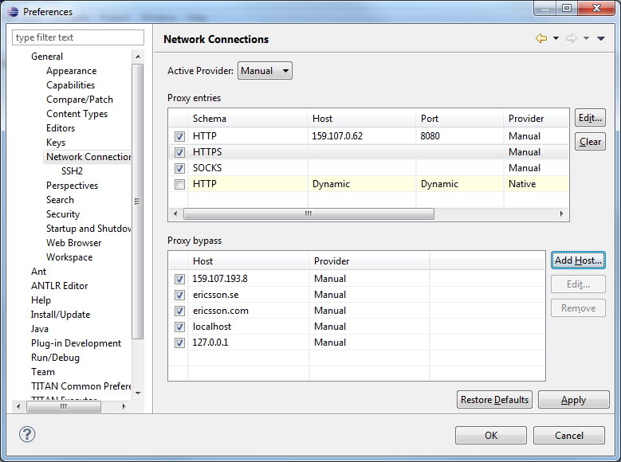
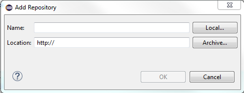
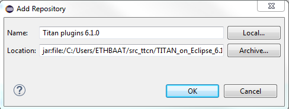
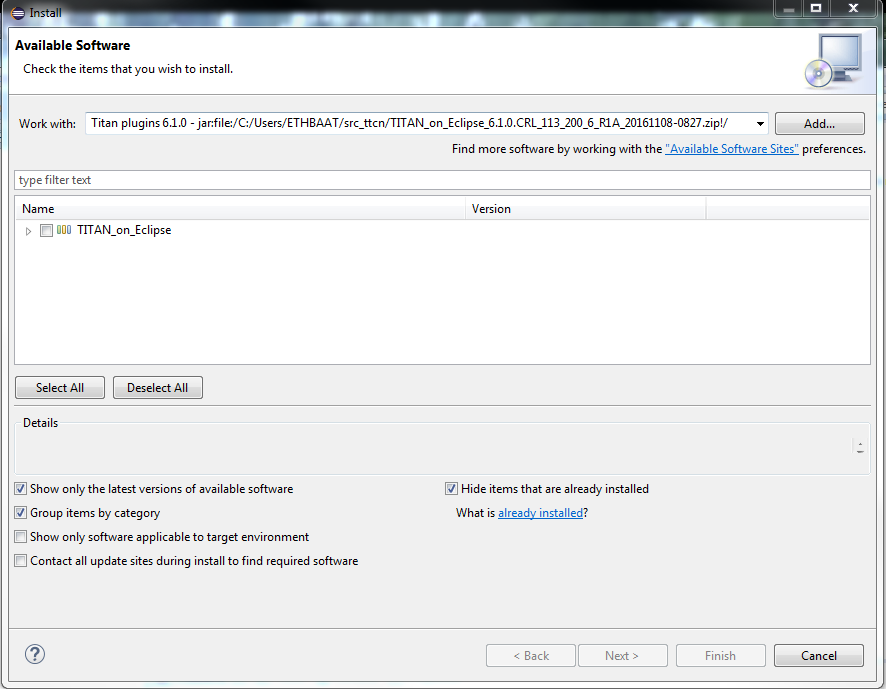
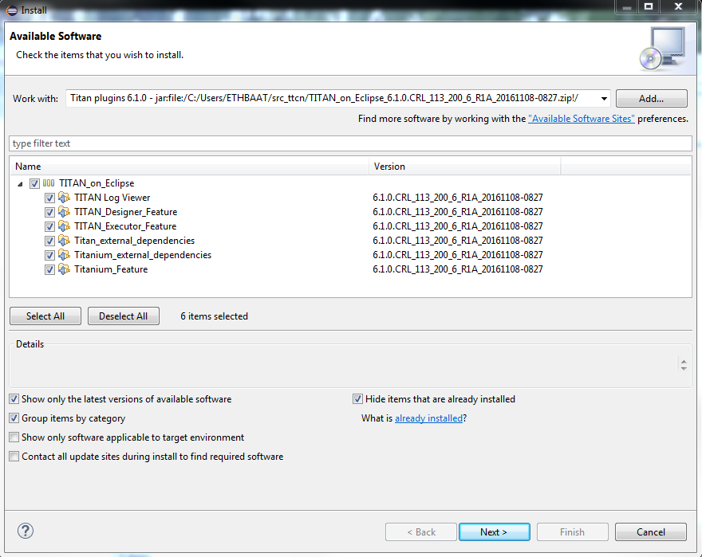
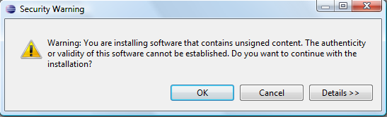
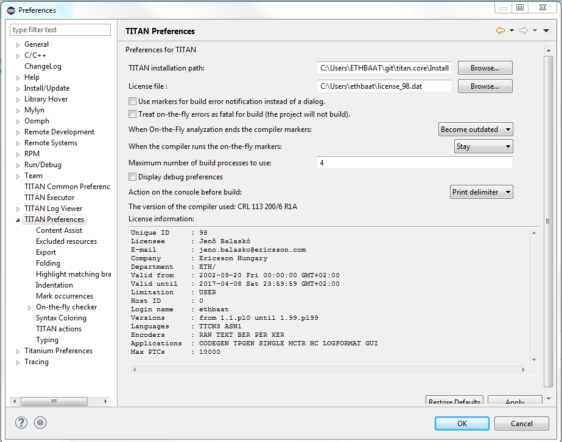

= Installation Guide for the TITAN Designer and TITAN Executor for the Eclipse IDE
:author: Jenő Balaskó
:revnumber: 3/1531-CRL 113 200/6, Rev. E
:revdate: 2018-12-03
:title-logo-image: images/titan_logo.png
:sectnums:
:doctype: book
:leveloffset: +1
:toc:
:toclevels: 2

ifdef::env-github,backend-html5[]

endif::[]

*Abstract*

This document describes the detailed information of installing the TITAN Designer and Executor for the Eclipse IDE.

*Copyright*

Copyright (c) 2000-2019 Ericsson Telecom AB. +
All rights reserved. This program and the accompanying materials are made available under the terms of the Eclipse Public License v2.0 that accompanies this distribution, and is available at +
https://www.eclipse.org/org/documents/epl-2.0/EPL-2.0.html.

*Disclaimer*

The contents of this document are subject to revision without notice due to continued progress in methodology, design and manufacturing. Ericsson shall have no liability for any error or damage of any kind resulting from the use of this document.

= Introduction

== Overview

This document describes the installation and configuration of the TITAN Designer, the TITAN Executor, the TITAN Log Viewer and the Titanium plug-ins for the Eclipse IDE (from now shortly TITAN plug-ins).

== Target Groups

This document is intended for system administrators and users who intend to install and configure the TITAN Designer, Executor, Log Viewer and Titanium plug-ins for the Eclipse IDE.

== Typographical Conventions

This document uses the following typographical conventions:

* *Bold* is used to represent graphical user interface (GUI) components such as buttons, menus, menu items, dialog box options, fields and keywords, as well as menu commands. Bold is also used with ’+’ to represent key combinations. For example, *Ctrl+Click*

* The "**/**" character is used to denote a menu and sub-menu sequence. For example, *File / Open*.

* `Monospaced` font is used represent system elements such as command and parameter names, program names, path names, URLs, directory names and code examples.

* *`Bold monospaced font`* is used for commands that must be entered at the Command Line Interface (CLI), For example, *`mctr_gui`*

= Requirements

== Requirements for the TITAN Designer, Executor and Log Viewer plug-ins for the Eclipse IDE

* Eclipse 4.2 (Juno) or later (max. 4.7.1a (Oxygen) - this one being recommended) and all its dependencies, for example, GTK2, must be installed

* ANTLR Runtime 4.3

* TITAN TTCN-3 Toolset installed. (Only needed if Eclipse is used for project compilation and test execution. Editing does not require it.)

* J2SE(TM) Runtime Environment 6.0 or later installed and set in Eclipse as the Java Runtime Environment

* Only Oracle Java Hotspot virtual machine is supported

== Requirements for the Titanium Plugin

* TITAN Designer

* JUNG 2.1 (Java Universal Network/Graph Framework)
+
see https://github.com/jrtom/jung

* Google Guava 21.0, see
+
https://github.com/google/guava

* Apache POI 3.9.0

* ANTLR Runtime 4.3.0

== Cygwin on Windows

* Using the Eclipse IDE on Windows is fully supported.

Installing Cygwin is optional and only needed if Eclipse is used for project compilation and test execution. TTCN-3 module editing is supported without Cygwin.

For detailed information on installing Cygwin and configuring the environment variables for TITAN to work, refer to <<_1, Installation Guide for TITAN TTCN-3 Test Executor>>.

Only one detail of that document is emphasized here:

"When installation is finished, add the `$CYGWIN_INSTALL_DIRECTORY\bin` directory to the `Path` environment variable of Windows, so Eclipse will access the shell commands.

For example, if the cygwin root is "C:\cygwin64\" then "Path" should contain "C:\cygwin64\bin"."

= Installing prerequisites

[[installing-the-titan-ttcn-3-toolset]]
== Installing the TITAN TTCN-3 Toolset

For detailed information on installing the TITAN TTCN-3 Toolset, and configuring the environment variables for TITAN to work, refer to <<_1, Installation Guide for TITAN TTCN-3 Test Executor>>.

== Installing Eclipse

Download the latest 32- or 64-bit Eclipse package, according to your platform and OS version form https://www.eclipse.org/downloads/. All Eclipse solution packages are suitable, but if you want to develop also adapters and/or external C/C\++ functions, the "Eclipse IDE for C/{cpp} Developers" can be a good choice.

NOTE: The CDT package can also be added to any Eclipse installation later.

If you want to use/edit XML, XSD and/or JSON files, the Eclipse ecosystem provides tools for this.

For *XML/XSD* editing and validation you can use the Web Tool Platform (WTP) project's XML Editor; it is contained in Eclipse IDE for Java EE Developers by default, and in other Eclipse packages it can be added from the project's update site (for other Eclipse releases just replace "oxygen" with the name of your Eclipse release: http://download.eclipse.org/webtools/repository/oxygen.

To validate your XSD or XML file(s), select the file(s), right-click on the selection and choose *Validate* from the pop-up menu. You can also validate your document by right clicking in the editor window and selecting "validate" from the pop-up menu.

To work with *JSON*, you can find a JSON editor at the Eclipse Marketplace (Help/Marketplace menu): type in the search field "JSON" and follow the instructions.

Decompress the downloaded file in a desired location, then run Eclipse with the executable, `eclipse.exe` or `./eclipse`, for Windows or UNIX, respectively.

NOTE: Users behind a firewall:
When using Eclipse from behind a firewall, the HTTP proxy must be set, and internal Ericsson locations, for example the update site, must be added to proxy exceptions. An example of the proxy settings in Eclipse:

== Installing Eclipse plug-in prerequisites for Titan Plug-ins and Titanium

The prerequisites for Titan plugins are POI and ANTLR Runtime.

The prerequisites for Titanium Plugin are JUNG and Google Guava.

These can be installed together with the Titan plug-ins as external dependencies, see the next chapter.

= Installation of the TITAN plug-ins

The TITAN plug-ins for Eclipse can be installed from the provided update sites.

* For Ericsson users only: http://ttcn.ericsson.se/download/update_site. The usage of this version is conditioned by the presence of a license file and supported by the Titan support team.
+
* For users outside Ericsson: https://projects.eclipse.org/projects/tools.titan/downloads. This version is licensed under the Eclipse Public License.
+
Choose the appropriate zip or tgz file, download it and pass the link of the downloaded zip to your Eclipse (like when installing a plugin from an archived update site) or unzip it and pass the link of the folder as update site.
+
NOTE: The all_in_one (or the Eclipse plug-ins plus dependencies) package contains ANTLR Runtime, JUNG and guava, the other packages do not contain any prerequisites.
+
From version 6.1.0 only all_in_one packages are delivered.
+
WARNING: If you have an earlier version than 4.2.0.CRL_113_200_4_R2A_20140902-1911 of TITAN plug-ins then any new installation should be preceded by uninstalling of the TITAN plug-ins or to start with a just installed Eclipse from scratch.

Perform the following steps:

. In Eclipse, open the *Help* scroll-down menu, and select the option "*Install New Software…*".

. Give the provided update site URL in the field or press the button "*Add*". Fill the Name and location. If a downloaded, zipped update site file is used press the button "*Archive…*" and select the zip file.
+

+
The result is something like this:
+

. Press *OK*. An install dialog appears.
+

. It is advised to uncheck the "Contact all update sites…" box. Select the TITAN plug-ins and the external dependency plugins to be installed.
+

. Click *Next*. An Install Details dialog box appears with the items to be installed.

. Click *Next* again.

. Accept the license agreements then push *OK*.

. At this point "Security Warning" window appears indicating that the authenticity or validity of the plug-ins cannot be established. It is safe to press the *OK* button here.
+

NOTE: When you update your TITAN plug-ins, it is suggested to update all the installed TITAN plug-ins because of dependencies. Otherwise eclipse will analyze the dependencies and after a while it will force you to update all of the already installed features.

= Post-Installation Steps

After installing the TITAN plug-ins in Eclipse, the locations of the installed TITAN TTCN-3 Toolset and the license file must be set.

Open the *Window* scroll-down menu, and open *Preferences.* In the pop-up window, open *TITAN Preferences* from the tree, and set the location of the TITAN installation path and License file (if label "License file" and text box exist in your version).

NOTE: TITAN install path is not mandatory. If you don’t want to build from Eclipse you can leave it empty.

== Turning-Off Automatic Building

By default, a new installation of Eclipse will be set to automatically compile its projects. In the current build system this can take a lot of time, so it is advised to turn this feature off, and only enabling if the actual projects make it possible. Open the *Project* scroll-down menu, and uncheck the *Build automatically* option.

== Configuring Java

You might need to modify your `eclipse.ini` file (usually located in the same directory as your `eclipse` executable.)

It is suggested to have at least 1GB and recommended 2 GB free memory per 1 million TTCN-3/ASN.1 source code lines (but it strongly depends on the code complexity). In Java it is controlled via the Xmx option.

For example, if Java 1.6 or 1.7 is applied and a project of 2 million TTCN-3 code lines is edited, the suggested settings in `eclipse.ini` are these:

[source]
----
-vmargs

-XX:MaxPermSize=2048M

-Dosgi.requiredJavaVersion=1.7

-Xms1024M

-Xmx4g
----

If Java 1.8 is used then `MaxPermSize` is ignored, its support is removed. Use these settings instead:

[source]
----
-vmargs

-Dosgi.requiredJavaVersion=1.8

-XX:+UseG1GC

-Xms1024M

-Xmx4g
----

NOTE: If you cannot edit the `eclipse.ini` file, you can start eclipse with flags. For example `eclipse -vmargs -Xmx4g` modifies the maximum memory allocation for the virtual machine.

= Compatibility Issues

The plug-ins require the Java Runtime Environment to be version 5.0 or later, but significant speed increase can be gained by installing version 6.0, 7.0 or 8.0.

Note that an actual version of the TITAN Designer plug-in is meant to be compatible with the same version of TITAN, but can be used with older TITAN releases, if:

* The additional features are not used (the makefile generator of TITAN is used to generate the makefile, so if a feature is used that is known by TITAN Designer, but is not known by the makefile generator, the makefile generation will fail)

* A special script is inserted into the actually used install directory's bin directory. The role of this script is to convert the call to the makefile generator to valid call of the compiler. (The makefile generator and the compiler are separated from TITAN 1.7.0). It is important to note, that such a file must contain a path to the compiler to be called, so such a script is not expected to work without modifications. Please note that the compiler must be called with *-M* as the first parameter, and the other parameters must be redirected to the compiler.

= Download the source code

The source code of Titan Eclipse plugin is available.

Download the first time:

[source,subs="+quotes"]
----
*git clone https://github.com/eclipse/titan.EclipsePlug-ins.git*
----

Updating the already existing local repository:

[source,subs="+quotes"]
----
*git pull https://github.com/eclipse/titan.EclipsePlug-ins.git*
----

= References

[[_1]]
* [1] link:https://github.com/eclipse/titan.core/blob/master/usrguide/installationguide.adoc[Installation guide for TITAN TTCN-3 Test Executor]

[[_2]]
* [2] link:https://github.com/eclipse/titan.core/blob/master/usrguide/userguide/README.adoc[User Guide for TITAN TTCN-3 Test Executor]

[[_3]]
* [3] link:https://github.com/eclipse/titan.EclipsePlug-ins/blob/master/Eclipse_Designer_userguide/README.doc[User Guide for the TITAN Designer for the Eclipse IDE]

[[_4]]
* [4] link:https://github.com/eclipse/titan.EclipsePlug-ins/blob/master/Eclipse_Executor_userguide/README.doc[User Guide for the TITAN Executor for the Eclipse IDE]

[[_5]]
* [5] Programmer´s Technical Reference for TITAN TTCN-3 Test Executor
