= Test Description for the Main Controller of the Java Based TITAN TTCN-3 Test Executor
:author: Jenő Balaskó
:revnumber: 7.2.0
:revdate: 2020-11-27
:title-logo-image: images/titan_logo.png
:sectnums:
:doctype: article
:toc:

ifdef::env-github,backend-html5[]

endif::[]

*Abstract*

This document describes detailed information on the testing the Main Controller of the TITAN TTCN-3 Test Executor in the Eclipse environment.

*Copyright*

Copyright (c) 2000-2020 Ericsson Telecom AB +
All rights reserved. This program and the accompanying materials are made available under the terms of the Eclipse Public License v2.0 that accompanies this distribution, and is available at

https://www.eclipse.org/org/documents/epl-2.0/EPL-2.0.html.

*Disclaimer*

The contents of this document are subject to revision without notice due to continued progress in methodology, design and manufacturing.
Ericsson shall have no liability for any error or damage of any kind resulting from the use of this document.

== Introduction

=== Overview

This document describes how to test the execution of a  Java based Titan project in Eclipse IDE. 
Java based Titan project means that the source code written in ttcn or in java in case of test ports.
The test is restricted for parallel mode.

=== Target Groups

This document is for the tester of the Titan Team.

=== Typographical Conventions

This document uses the following typographical conventions:

* *Bold* is used to represent graphical user interface (GUI) components such as buttons, menus, menu items, dialog box options, fields and keywords, as well as menu commands. Bold is also used with ’+’ to represent key combinations. For example, *Ctrl+Click*
* The "*/*" character is used to denote a menu and sub-menu sequence. For example, *File / Open*.
* `Monospaced` font is used represent system elements such as command and parameter names, program names, path names, URLs, directory names and code examples.
* *`Bold monospaced font`* is used for commands that must be entered at the Command Line Interface (CLI), For example, *`ttcn3_start`*

=== Installation

For details on installing the TITAN Designer for the Eclipse IDE plug-in, see the Installation Guide for TITAN Designer and TITAN Executor for the Eclipse IDE.

=== Prerequisites

* Eclipse IDE with version at least xxx
* Installed titan.EcipsePlug-ins
* A Java based Titan project "HelloJTitan".

== Testcases

=== TC1 Create Native Java Lauch Config for the Main Controller

==== Prerequisites

* Project "HelloJTitan" has been built and cfg file exists

==== Test Steps

. Select cfg.cfg on project HelloJTitan.
. Select popup Run as ... > Run Configurations ... > Native Java Launch Config > New
+
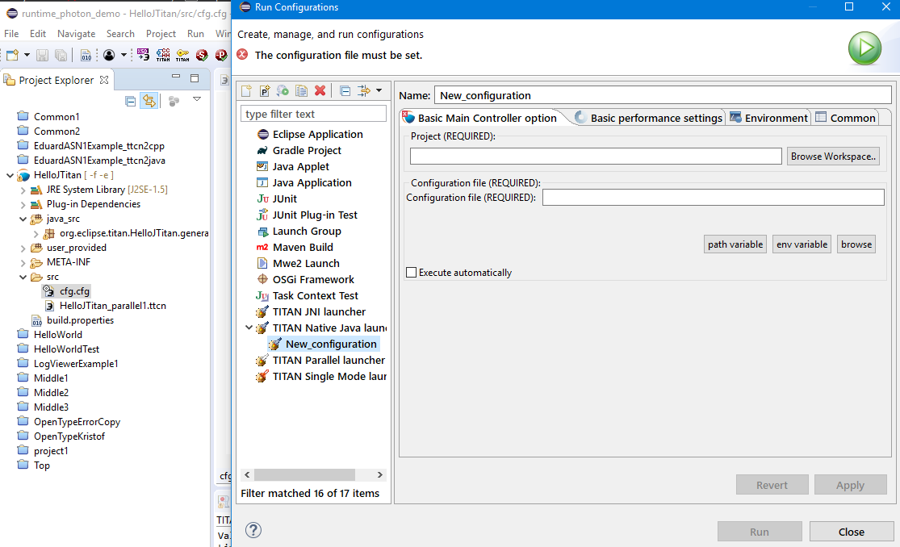
+
. Fill in the form with help of "Browse" buttons:
+
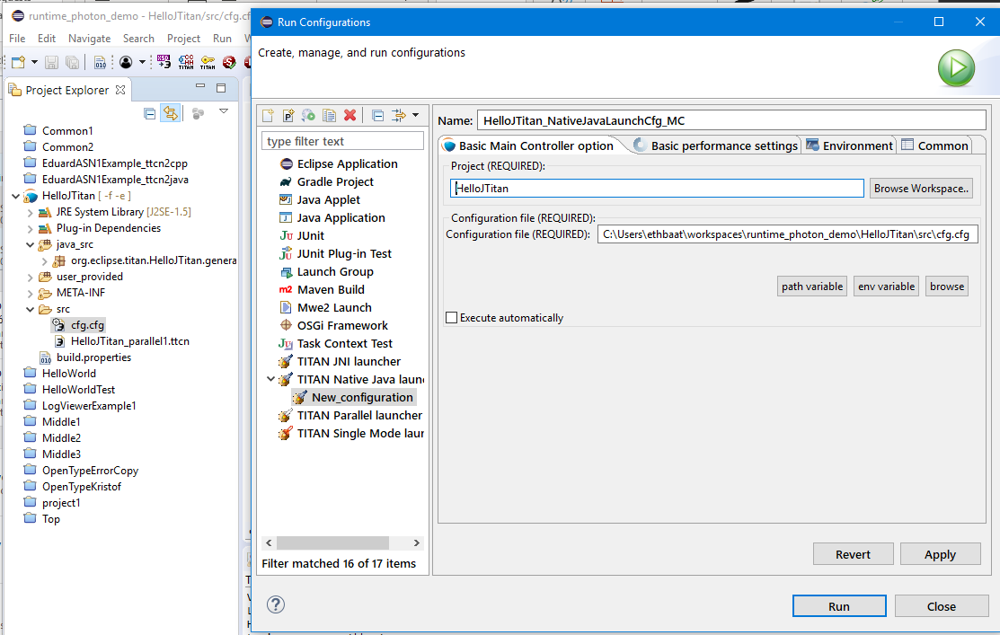
+
. Fill the form of tab "Common" to save the launch cfg:
+
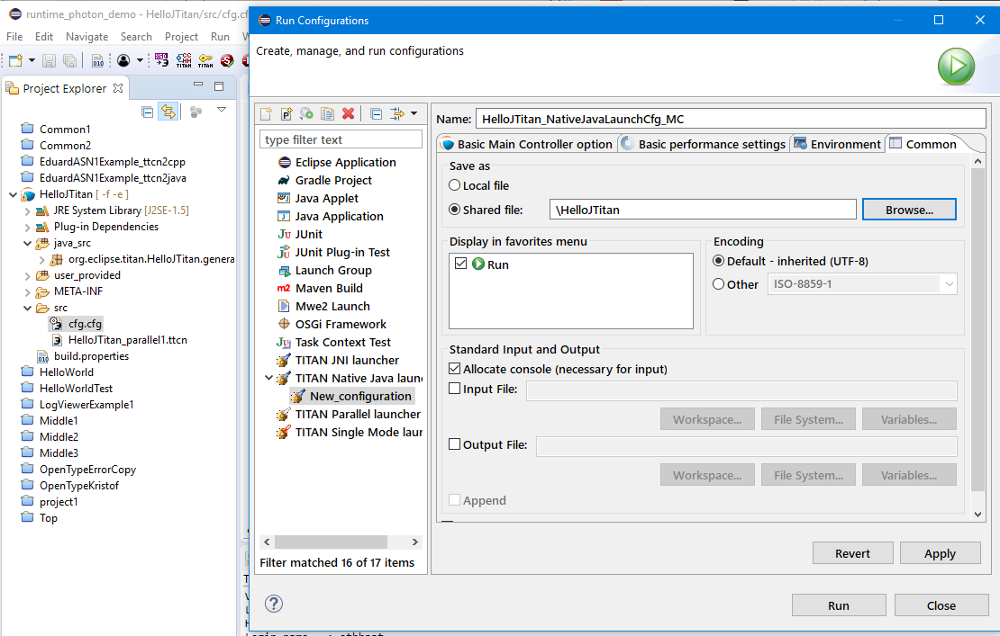
+
. Push the "Close" button. The Launch cfg has been created and saved

==== Status

Passed

=== TC2 Create Host Controller Java Application

==== Prerequisites

* Project "HelloJTitan" has been built

==== Test Steps

. Select project "HelloJTitan"
. Select popup Run as ... > Run Configurations ... > Java Application
. Fill the form in (see figure "Create HC2").
+
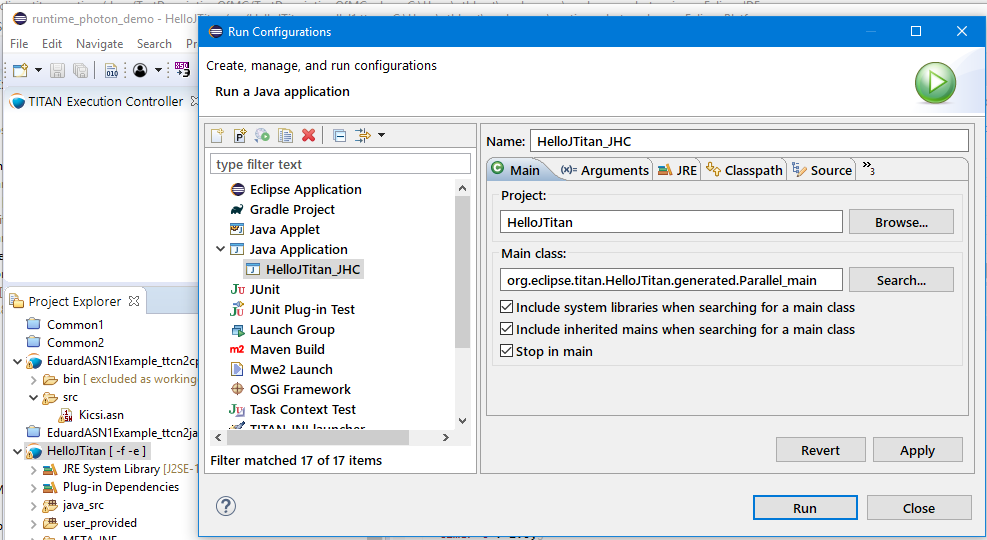
+
. On the tab "Argument", fill the fields in according to the config file of the project (Section [MAIN_CONTROLLER]). 
The first arg is the hostname, the second one is the port number.
+
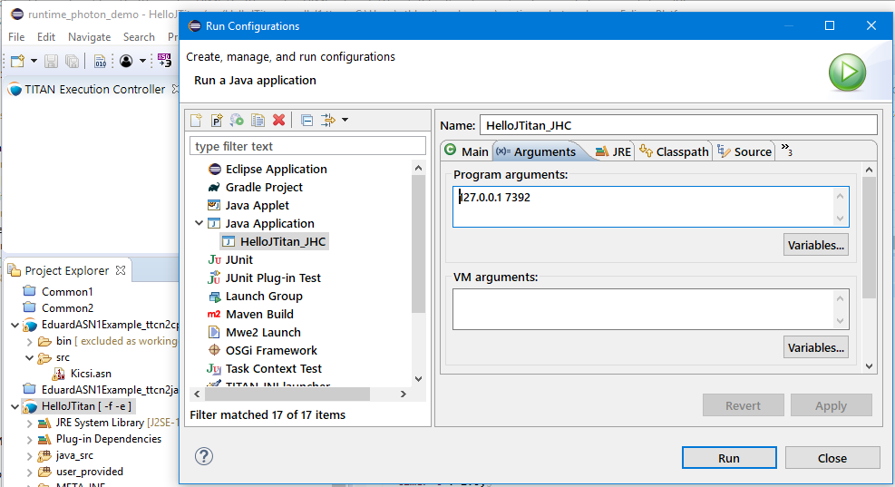
+
. Press button "Apply" and "Close".

==== Status

Passed

=== TC3 Run Parallel Test

==== Prerequisites

* Project "HelloJTitan" has been built and cfg file exists
* Lauch config "cfg.cfg"created for MC (according to TC1) 
* HC created  (according to TC2)
* cfg file detail:
+
[source]
----
[MAIN_CONTROLLER]
TCPPort := 7392
KillTimer := 100.0
NumHCs := 1
LocalAddress := 127.0.0.1
----

==== Test Steps

. Start MC (execute automatically switched off) ( On Run menu, select "HelloJTitan_NativeJavaLaunchCfg_MC", see figure "Run Menu"). 
+
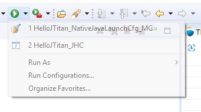
+
The Main controller starts, and its icon appears in the "TITAN Execution Controller view". 
. In Titan Execution Controller view, Select "Start session" on Popup menu of the Main Controller. 
+
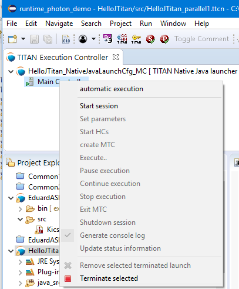
The MC starts listening (see figure "MC Listening")
+
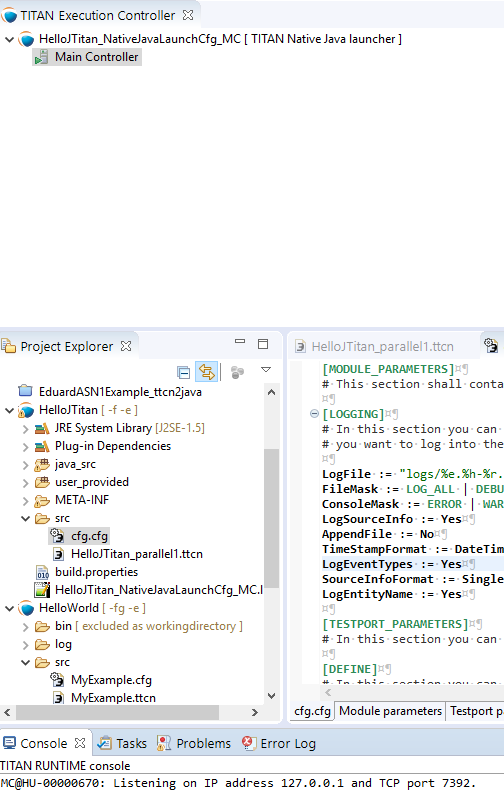
. Start HC (On the Run menu, select "HelloJTitan_JHC", see figure "Run Menu"). The Host controller starts and connects to the MC.
+
[source]
----
MC@HU-00000670: New HC connected from 127.0.0.1 [127.0.0.1]. HU-00000670: Windows 10 10.0 on amd64.
----
. Create MTC (not possible if execute automatically switched on)) (See figure "Create MTC log")
+
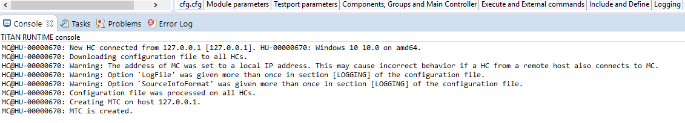
. Select "Execute" on Popup menu of the Main Controller.
+
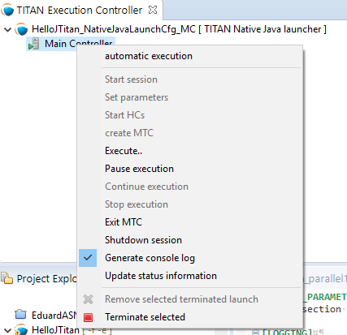
. Select the config file on the Execute Dialog (see figure "Execute Dialog"). The execution of the testcases starts. 
+
image::images/ExecuteDialog.PNG[title="Execute Dialog"]
The execution logged (See figure "Execution Log")
+
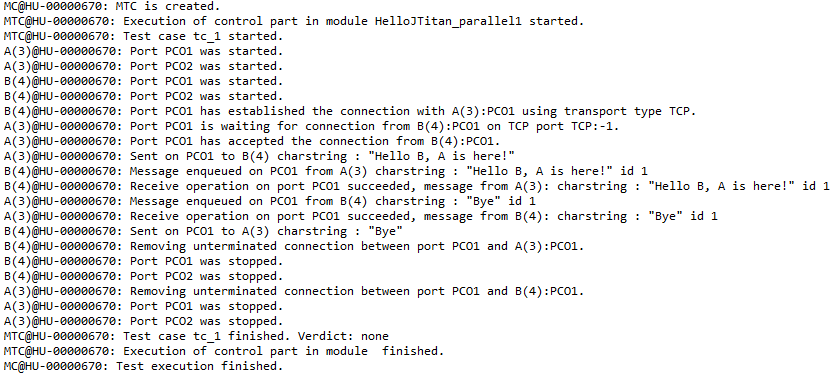
.Select ""

==== Status

Passed

=== TC4 Start the config again

==== Test steps

. Select "Execute..." on the Popup menu of the Main Controller.

==== Status

Passed

=== TC5 Exit MTC

. Select "MTC exit" on the Popup menu of the Main Controller. The MTC stops and statistics will be logged (See figure "MTC Exit" )
+
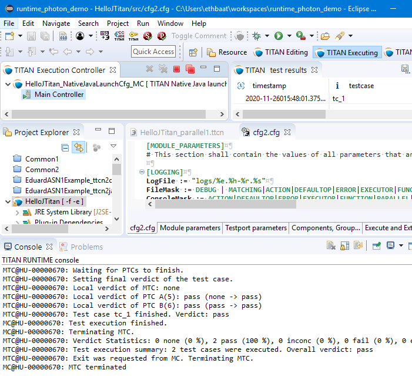

==== Result

As expected:
[source]
----
MC@HU-00000670: Test execution finished.
MC@HU-00000670: Terminating MTC.
MTC@HU-00000670: Verdict Statistics: 0 none (0 %), 2 pass (100 %), 0 inconc (0 %), 0 fail (0 %), 0 error (0 %)
MTC@HU-00000670: Test execution summary: 2 test cases were executed. Overall verdict: pass
MTC@HU-00000670: Exit was requested from MC. Terminating MTC.
----
==== Status

Passed 

==== Reason
Setverdict pass is not passed to MC.

=== TC6 Shutdown session

==== Prerequisites

* Continue the previous testcase

==== Test steps
. Select "Shutdown session" on on Popup menu of the Main Controller.
[source]
----
MC@HU-00000670: MTC terminated
MC@HU-00000670: Shutting down session.
HC@HU-00000670: MTC finished.
HC@HU-00000670: TC A(5) finished.
HC@HU-00000670: TC B(6) finished.
HC@HU-00000670: Exit was requested from MC. Terminating HC.
MC@HU-00000670: Shutdown complete.
----

==== Status

Pass

=== TC7 HC starts before "Start session"

==== Prerequisites

* Project "HelloJTitan" has been built and cfg file exists
* Lauch config created for MC (according to TC1) 
* HC created  (according to TC2)
* cfg file detail:
+
[source]
----
[MAIN_CONTROLLER]
TCPPort := 7392
KillTimer := 100.0
NumHCs := 1
LocalAddress := 127.0.0.1
----

==== Test Steps
. Start MC.
. Start HC (execute automatically switched off).

==== Result: 

[source]
----
Total execution took 1.6776762 seconds to complete
----

==== Status

Pass

==== Reason

Output as expected. HC stops immediately, because MC is not listening yet

=== TC8 Starting MC With Config File Without LocalAddress

This test checks if missing LocalAddress in cfg file causes LocalAddress := 127.0.0.1 or not.

==== Prerequisites

* Project "HelloJTitan" has been built and cfg file exists
* Lauch config "cfg.cfg"created for MC (according to TC1) 
* HC created  (according to TC2)

==== Test Steps
. Comment out the LocalAddress:
+
[source]
----
[MAIN_CONTROLLER]
TCPPort := 7392
KillTimer := 100.0
NumHCs := 1
# LocalAddress := 127.0.0.1
----
. Start MC.
. Start session
. Start HC (execute automatically switched off).
. Create MTC
. Execute...
. Exit MTC
. Shutdown session

==== Result

[source]
----
MC@HU-00000670: Listening on IP address 127.0.0.1 and TCP port 7392.

MC@HU-00000670: New HC connected from 127.0.0.1 [127.0.0.1]. HU-00000670: Windows 10 10.0 on amd64.
MC@HU-00000670: Downloading configuration file to all HCs.
HC@HU-00000670: Warning: The address of MC was set to a local IP address. This may cause incorrect behavior if a HC from a remote host also connects to MC.
HC@HU-00000670: Warning: Option `LogFile' was given more than once in section [LOGGING] of the configuration file.
HC@HU-00000670: Warning: Option `SourceInfoFormat' was given more than once in section [LOGGING] of the configuration file.
MC@HU-00000670: Configuration file was processed on all HCs.
MC@HU-00000670: Creating MTC on host 127.0.0.1.
MC@HU-00000670: MTC is created.
MTC@HU-00000670: Execution of control part in module HelloJTitan_parallel1 started.
MTC@HU-00000670: Test case tc_1 started.
...
MTC@HU-00000670: Test case tc_1 finished. Verdict: none
MTC@HU-00000670: Execution of control part in module  finished.
MC@HU-00000670: Test execution finished.
MC@HU-00000670: Terminating MTC.
MTC@HU-00000670: Verdict Statistics: 1 none (100 %), 0 pass (0 %), 0 inconc (0 %), 0 fail (0 %), 0 error (0 %)
MTC@HU-00000670: Test execution summary: 1 test case was executed. Overall verdict: none
MC@HU-00000670: MTC terminated
MC@HU-00000670: Shutting down session.
MC@HU-00000670: Shutdown complete.
----

==== Status

Pass (for the LocalAddress replacement)

=== TC9 Starting MC With Config File Without LocalAddress

This test checks if missing LocalAddress in cfg file causes LocalAddress := 127.0.0.1 or not.

==== Test Steps
. Set ConsoleMask for LOG_ALL
+
[source]
----
ConsoleMask := LOG_ALL
----
. Start MC.
+
[source]
----
ConsoleMask := LOG_ALL
----
. Start session
+
[source]
----
MC@HU-00000670: Listening on IP address 127.0.0.1 and TCP port 7392.
----
. Start HC (execute automatically switched off).
+
[source]
----
MC@HU-00000670: New HC connected from 127.0.0.1 [127.0.0.1]. HU-00000670: Windows 10 10.0 on amd64.
----
. Create MTC
+
[source]
----
MC@HU-00000670: Downloading configuration file to all HCs.
HC@HU-00000670: TTCN-3 Host Controller started on HU-00000670. Version: 7/CAX 105 7730 R2A. 
HC@HU-00000670: TTCN Logger v2.2 options: TimeStampFormat:=DateTime; LogEntityName:=Yes; LogEventTypes:=Yes;SourceInfoFormat:=Single; *.FileMask:=LOG_ALL | MATCHING | DEBUG; *.ConsoleMask:=LOG_ALL;LogFileSize:=0; LogFileNumber:=1; DiskFullAction:=Error
HC@HU-00000670: Warning: The address of MC was set to a local IP address. This may cause incorrect behavior if a HC from a remote host also connects to MC.
HC@HU-00000670: The address of MC was set to 127.0.0.1[127.0.0.1]:7,392.
HC@HU-00000670: Connected to MC.
HC@HU-00000670: Processing configuration data received from MC.
HC@HU-00000670: Warning: Option `LogFile' was given more than once in section [LOGGING] of the configuration file.
HC@HU-00000670: Initializing module PreGenRecordOf.
HC@HU-00000670: Initializing module PreGenRecordOf finished.
HC@HU-00000670: Initializing module TitanLoggerApi.
HC@HU-00000670: Initializing module TitanLoggerApi finished.
HC@HU-00000670: Initializing module HelloJTitan_parallel1.
HC@HU-00000670: Initializing module HelloJTitan_parallel1 finished.
MC@HU-00000670: Configuration file was processed on all HCs.
MC@HU-00000670: Creating MTC on host 127.0.0.1.
HC@HU-00000670: Configuration data was processed successfully.
HC@HU-00000670: MTC was created. Process id: 0.
MC@HU-00000670: MTC is created.
----
. Execute...
+
[source]
----
MTC@HU-00000670: Executing control part of module HelloJTitan_parallel1.
MTC@HU-00000670: Execution of control part in module HelloJTitan_parallel1 started.
MTC@HU-00000670: Test case tc_1 started.
...
A(3)@HU-00000670: Start timer t: 2 s
A(3)@HU-00000670: Sent on PCO1 to B(4) charstring : "Hello B, A is here!"
B(4)@HU-00000670: Start timer t: 2 s
B(4)@HU-00000670: Message enqueued on PCO1 from A(3) charstring : "Hello B, A is here!" id 1
B(4)@HU-00000670: Receive operation on port PCO1 succeeded, message from A(3): charstring : "Hello B, A is here!" id 1
A(3)@HU-00000670: Message enqueued on PCO1 from B(4) charstring : "Bye" id 1
A(3)@HU-00000670: Receive operation on port PCO1 succeeded, message from B(4): charstring : "Bye" id 1
B(4)@HU-00000670: Successfully received
B(4)@HU-00000670: Sent on PCO1 to A(3) charstring : "Bye"
B(4)@HU-00000670: Function f_behavior_B finished. PTC terminates.
B(4)@HU-00000670: Terminating component type HelloJTitan_parallel1.CT.
B(4)@HU-00000670: Stop timer t: 2 s
B(4)@HU-00000670: Removing unterminated connection between port PCO1 and A(3):PCO1.
B(4)@HU-00000670: Port PCO1 was stopped.
B(4)@HU-00000670: Port PCO2 was stopped.
B(4)@HU-00000670: Component type HelloJTitan_parallel1.CT was shut down inside testcase tc_1.
A(3)@HU-00000670: Successfully received Bye
A(3)@HU-00000670: setverdict(pass): none -> pass
A(3)@HU-00000670: Function f_behavior_A finished. PTC terminates.
A(3)@HU-00000670: Terminating component type HelloJTitan_parallel1.CT.
A(3)@HU-00000670: Stop timer t: 2 s
A(3)@HU-00000670: Removing unterminated connection between port PCO1 and B(4):PCO1.
A(3)@HU-00000670: Port PCO1 was stopped.
A(3)@HU-00000670: Port PCO2 was stopped.
A(3)@HU-00000670: Component type HelloJTitan_parallel1.CT was shut down inside testcase tc_1.
A(3)@HU-00000670: Final verdict of PTC: pass
B(4)@HU-00000670: Final verdict of PTC: none
MTC@HU-00000670: Terminating component type HelloJTitan_parallel1.MTC.
MTC@HU-00000670: Component type HelloJTitan_parallel1.MTC was shut down inside testcase tc_1.
MTC@HU-00000670: Waiting for PTCs to finish.
MTC@HU-00000670: Setting final verdict of the test case.
MTC@HU-00000670: Local verdict of MTC: none
MTC@HU-00000670: Local verdict of PTC A(3): pass (none -> pass)
MTC@HU-00000670: Local verdict of PTC B(4): none (none -> none)
MTC@HU-00000670: Test case tc_1 finished. Verdict: none
MTC@HU-00000670: Execution of control part in module  finished.
MC@HU-00000670: Test execution finished.
----
. Exit MTC
+
[source]
----
MC@HU-00000670: Terminating MTC.
MTC@HU-00000670: Verdict Statistics: 1 none (100 %), 0 pass (0 %), 0 inconc (0 %), 0 fail (0 %), 0 error (0 %)
MTC@HU-00000670: Test execution summary: 1 test case was executed. Overall verdict: none
MTC@HU-00000670: Exit was requested from MC. Terminating MTC.
MC@HU-00000670: MTC terminated
----
. Shutdown session
+
HC terminal:
+
[source]
----
Total execution took 708.7359537000001 seconds to complete
----
MC runtime console:
+
[source]
----
HC@HU-00000670: TC A(3) finished.
HC@HU-00000670: TC B(4) finished.
HC@HU-00000670: Exit was requested from MC. Terminating HC.
MC@HU-00000670: Shutdown complete.
----

==== Result

Pass

=== TC Run More Testcases With Pass, Fail and Error in the Behavior Functions

==== Prerequisites

* Project "HelloJTitan" has been built and cfg file exists
* Lauch config "cfg2.cfg"created for MC, with 3 testcases (1 pass, 1 fail, 1 error), setting "execute automatically"
* HC created  (according to TC2)

==== Test Steps

. Start MC
. Start HC

==== Result

The test executed automatically.
The Runtime log:
[source]
----
MC@HU-00000670: Listening on IP address 127.0.0.1 and TCP port 7392.

MC@HU-00000670: New HC connected from 127.0.0.1 [127.0.0.1]. HU-00000670: Windows 10 10.0 on amd64.
MC@HU-00000670: Downloading configuration file to all HCs.
HC@HU-00000670: TTCN-3 Host Controller started on HU-00000670. Version: 7/CAX 105 7730 R2A. 
HC@HU-00000670: TTCN Logger v2.2 options: TimeStampFormat:=DateTime; LogEntityName:=Yes; LogEventTypes:=Yes;SourceInfoFormat:=Single; *.FileMask:=LOG_ALL | MATCHING | DEBUG; *.ConsoleMask:=LOG_ALL;LogFileSize:=0; LogFileNumber:=1; DiskFullAction:=Error
HC@HU-00000670: Warning: The address of MC was set to a local IP address. This may cause incorrect behavior if a HC from a remote host also connects to MC.
HC@HU-00000670: The address of MC was set to 127.0.0.1[127.0.0.1]:7,392.
HC@HU-00000670: Connected to MC.
HC@HU-00000670: Processing configuration data received from MC.
HC@HU-00000670: Warning: Option `LogFile' was given more than once in section [LOGGING] of the configuration file.
HC@HU-00000670: Initializing module PreGenRecordOf.
HC@HU-00000670: Initializing module PreGenRecordOf finished.
HC@HU-00000670: Initializing module TitanLoggerApi.
HC@HU-00000670: Initializing module TitanLoggerApi finished.
HC@HU-00000670: Initializing module HelloJTitan_parallel1.
HC@HU-00000670: Initializing module HelloJTitan_parallel1 finished.
MC@HU-00000670: Configuration file was processed on all HCs.
MC@HU-00000670: Creating MTC on host 127.0.0.1.
HC@HU-00000670: Configuration data was processed successfully.
HC@HU-00000670: MTC was created. Process id: 0.
MC@HU-00000670: MTC is created.
MTC@HU-00000670: Executing control part of module HelloJTitan_parallel1.
MTC@HU-00000670: Execution of control part in module HelloJTitan_parallel1 started.
MTC@HU-00000670: Test case tc_1 started.
MTC@HU-00000670: Initializing variables, timers and ports of component type HelloJTitan_parallel1.MTC inside testcase tc_1.
MTC@HU-00000670: Component type HelloJTitan_parallel1.MTC was initialized.
MTC@HU-00000670: Creating new PTC with component type HelloJTitan_parallel1.CT, component name: A.
HC@HU-00000670: PTC was created. Component reference: 3, component type: HelloJTitan_parallel1.CT, component name: A, testcase name: tc_1, process id: 0.
A(3)@HU-00000670: Initializing variables, timers and ports of component type HelloJTitan_parallel1.CT inside testcase tc_1.
MTC@HU-00000670: PTC was created. Component reference: 3, alive: no, type: HelloJTitan_parallel1.CT, component name: A.
MTC@HU-00000670: Creating new PTC with component type HelloJTitan_parallel1.CT, component name: B.
HC@HU-00000670: PTC was created. Component reference: 4, component type: HelloJTitan_parallel1.CT, component name: B, testcase name: tc_1, process id: 0.
B(4)@HU-00000670: Initializing variables, timers and ports of component type HelloJTitan_parallel1.CT inside testcase tc_1.
MTC@HU-00000670: PTC was created. Component reference: 4, alive: no, type: HelloJTitan_parallel1.CT, component name: B.
MTC@HU-00000670: Connecting ports A(3):PCO1 and B(4):PCO1.
B(4)@HU-00000670: Port PCO1 was started.
B(4)@HU-00000670: Port PCO2 was started.
B(4)@HU-00000670: Component type HelloJTitan_parallel1.CT was initialized.
A(3)@HU-00000670: Port PCO1 was started.
A(3)@HU-00000670: Port PCO2 was started.
A(3)@HU-00000670: Component type HelloJTitan_parallel1.CT was initialized.
A(3)@HU-00000670: Port PCO1 is waiting for connection from B(4):PCO1 on TCP port TCP:-1.
B(4)@HU-00000670: Port PCO1 has established the connection with A(3):PCO1 using transport type TCP.
A(3)@HU-00000670: Port PCO1 has accepted the connection from B(4):PCO1.
MTC@HU-00000670: Connect operation on A(3):PCO1 and B(4):PCO1 finished.
MTC@HU-00000670: Starting function f_behavior_B() on component B(4).
B(4)@HU-00000670: Starting function f_behavior_B().
MTC@HU-00000670: Function was started.
MTC@HU-00000670: Starting function f_behavior_A() on component A(3).
B(4)@HU-00000670: Start timer t: 2 s
A(3)@HU-00000670: Starting function f_behavior_A().
A(3)@HU-00000670: Start timer t: 2 s
A(3)@HU-00000670: Sent on PCO1 to B(4) charstring : "Hello B, A is here!"
MTC@HU-00000670: Function was started.
MTC@HU-00000670: Disconnecting ports A(3):PCO1 and B(4):PCO1.
B(4)@HU-00000670: Message enqueued on PCO1 from A(3) charstring : "Hello B, A is here!" id 1
B(4)@HU-00000670: Receive operation on port PCO1 succeeded, message from A(3): charstring : "Hello B, A is here!" id 1
B(4)@HU-00000670: Successfully received
B(4)@HU-00000670: Sent on PCO1 to A(3) charstring : "Bye"
A(3)@HU-00000670: Message enqueued on PCO1 from B(4) charstring : "Bye" id 1
A(3)@HU-00000670: Receive operation on port PCO1 succeeded, message from B(4): charstring : "Bye" id 1
A(3)@HU-00000670: Successfully received Bye
A(3)@HU-00000670: setverdict(pass): none -> pass
A(3)@HU-00000670: Function f_behavior_A finished. PTC terminates.
A(3)@HU-00000670: Terminating component type HelloJTitan_parallel1.CT.
A(3)@HU-00000670: Stop timer t: 2 s
A(3)@HU-00000670: Removing unterminated connection between port PCO1 and B(4):PCO1.
A(3)@HU-00000670: Port PCO1 was stopped.
A(3)@HU-00000670: Port PCO2 was stopped.
A(3)@HU-00000670: Component type HelloJTitan_parallel1.CT was shut down inside testcase tc_1.
B(4)@HU-00000670: setverdict(pass): none -> pass
B(4)@HU-00000670: Function f_behavior_B finished. PTC terminates.
B(4)@HU-00000670: Terminating component type HelloJTitan_parallel1.CT.
B(4)@HU-00000670: Stop timer t: 2 s
B(4)@HU-00000670: Removing unterminated connection between port PCO1 and A(3):PCO1.
B(4)@HU-00000670: Port PCO1 was stopped.
B(4)@HU-00000670: Port PCO2 was stopped.
B(4)@HU-00000670: Component type HelloJTitan_parallel1.CT was shut down inside testcase tc_1.
B(4)@HU-00000670: Final verdict of PTC: pass
A(3)@HU-00000670: Final verdict of PTC: pass
MTC@HU-00000670: Disconnect operation on A(3):PCO1 and B(4):PCO1 finished.
MTC@HU-00000670: Terminating component type HelloJTitan_parallel1.MTC.
MTC@HU-00000670: Component type HelloJTitan_parallel1.MTC was shut down inside testcase tc_1.
MTC@HU-00000670: Waiting for PTCs to finish.
MTC@HU-00000670: Setting final verdict of the test case.
MTC@HU-00000670: Local verdict of MTC: none
MTC@HU-00000670: Local verdict of PTC A(3): pass (none -> pass)
MTC@HU-00000670: Local verdict of PTC B(4): pass (pass -> pass)
MTC@HU-00000670: Test case tc_1 finished. Verdict: pass
MTC@HU-00000670: Test case tc_fail started.
MTC@HU-00000670: Initializing variables, timers and ports of component type HelloJTitan_parallel1.MTC inside testcase tc_fail.
MTC@HU-00000670: Component type HelloJTitan_parallel1.MTC was initialized.
MTC@HU-00000670: Creating new PTC with component type HelloJTitan_parallel1.CT, component name: A.
HC@HU-00000670: TC A(3) finished.
HC@HU-00000670: TC B(4) finished.
HC@HU-00000670: PTC was created. Component reference: 5, component type: HelloJTitan_parallel1.CT, component name: A, testcase name: tc_fail, process id: 0.
A(5)@HU-00000670: Initializing variables, timers and ports of component type HelloJTitan_parallel1.CT inside testcase tc_fail.
A(5)@HU-00000670: Port PCO1 was started.
MTC@HU-00000670: PTC was created. Component reference: 5, alive: no, type: HelloJTitan_parallel1.CT, component name: A.
MTC@HU-00000670: Starting function f_behavior_fail() on component A(5).
MTC@HU-00000670: Function was started.
A(5)@HU-00000670: Port PCO2 was started.
A(5)@HU-00000670: Component type HelloJTitan_parallel1.CT was initialized.
A(5)@HU-00000670: Starting function f_behavior_fail().
A(5)@HU-00000670: setverdict(fail): none -> fail reason: "Intentionally fail", new component reason: "Intentionally fail"
A(5)@HU-00000670: Function f_behavior_fail finished. PTC terminates.
A(5)@HU-00000670: Terminating component type HelloJTitan_parallel1.CT.
A(5)@HU-00000670: Port PCO1 was stopped.
A(5)@HU-00000670: Port PCO2 was stopped.
A(5)@HU-00000670: Component type HelloJTitan_parallel1.CT was shut down inside testcase tc_fail.
A(5)@HU-00000670: Final verdict of PTC: fail reason: "Intentionally fail"
MTC@HU-00000670: Terminating component type HelloJTitan_parallel1.MTC.
MTC@HU-00000670: Component type HelloJTitan_parallel1.MTC was shut down inside testcase tc_fail.
MTC@HU-00000670: Waiting for PTCs to finish.
MTC@HU-00000670: Setting final verdict of the test case.
MTC@HU-00000670: Local verdict of MTC: none
MTC@HU-00000670: Local verdict of PTC A(5): fail (none -> fail) reason: "Intentionally fail"
MTC@HU-00000670: Test case tc_fail finished. Verdict: fail
MTC@HU-00000670: Test case tc_error started.
MTC@HU-00000670: Initializing variables, timers and ports of component type HelloJTitan_parallel1.MTC inside testcase tc_error.
MTC@HU-00000670: Component type HelloJTitan_parallel1.MTC was initialized.
MTC@HU-00000670: Creating new PTC with component type HelloJTitan_parallel1.CT, component name: A.
HC@HU-00000670: TC A(5) finished.
HC@HU-00000670: PTC was created. Component reference: 6, component type: HelloJTitan_parallel1.CT, component name: A, testcase name: tc_error, process id: 0.
MTC@HU-00000670: PTC was created. Component reference: 6, alive: no, type: HelloJTitan_parallel1.CT, component name: A.
MTC@HU-00000670: Starting function f_behavior_error() on component A(6).
A(6)@HU-00000670: Initializing variables, timers and ports of component type HelloJTitan_parallel1.CT inside testcase tc_error.
A(6)@HU-00000670: Port PCO1 was started.
A(6)@HU-00000670: Port PCO2 was started.
A(6)@HU-00000670: Component type HelloJTitan_parallel1.CT was initialized.
A(6)@HU-00000670: Starting function f_behavior_error().
A(6)@HU-00000670: Intentionally error:
MTC@HU-00000670: Function was started.
A(6)@HU-00000670: Dynamic test case error: Integer division by zero.
A(6)@HU-00000670: setverdict(error): none -> error
A(6)@HU-00000670: Performing error recovery.
A(6)@HU-00000670: Function f_behavior_error finished with an error. PTC terminates.
A(6)@HU-00000670: Terminating component type HelloJTitan_parallel1.CT.
A(6)@HU-00000670: Port PCO1 was stopped.
A(6)@HU-00000670: Port PCO2 was stopped.
A(6)@HU-00000670: Component type HelloJTitan_parallel1.CT was shut down inside testcase tc_error.
A(6)@HU-00000670: Final verdict of PTC: error
MTC@HU-00000670: Terminating component type HelloJTitan_parallel1.MTC.
MTC@HU-00000670: Component type HelloJTitan_parallel1.MTC was shut down inside testcase tc_error.
MTC@HU-00000670: Waiting for PTCs to finish.
MTC@HU-00000670: Setting final verdict of the test case.
MTC@HU-00000670: Local verdict of MTC: none
MTC@HU-00000670: Local verdict of PTC A(6): error (none -> error)
MTC@HU-00000670: Test case tc_error finished. Verdict: error
MTC@HU-00000670: Execution of control part in module  finished.
MC@HU-00000670: Test execution finished.
MC@HU-00000670: Terminating MTC.
MTC@HU-00000670: Verdict Statistics: 0 none (0 %), 1 pass (33.333 %), 0 inconc (0 %), 1 fail (33.333 %), 1 error (33.333 %)
MTC@HU-00000670: Test execution summary: 3 test cases were executed. Overall verdict: error
MTC@HU-00000670: Exit was requested from MC. Terminating MTC.
MC@HU-00000670: MTC terminated
MC@HU-00000670: Shutting down session.
HC@HU-00000670: MTC finished.
HC@HU-00000670: TC A(6) finished.
HC@HU-00000670: Exit was requested from MC. Terminating HC.
MC@HU-00000670: Shutdown complete.
----

==== Status

Passed

