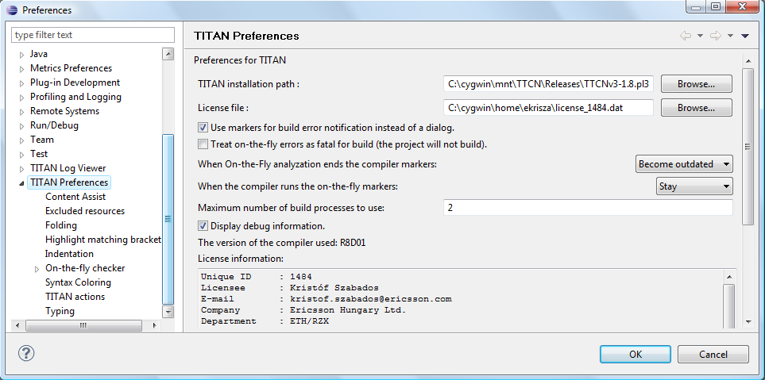
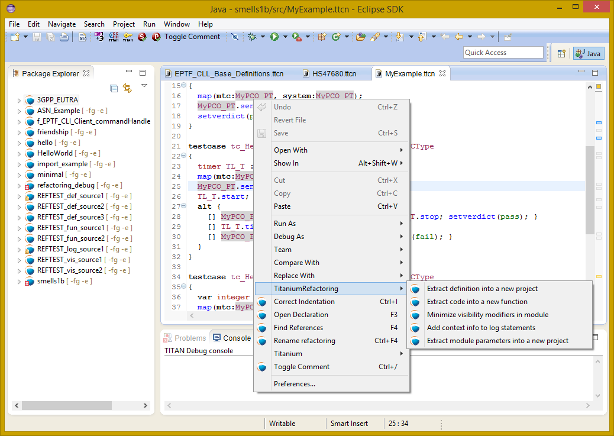
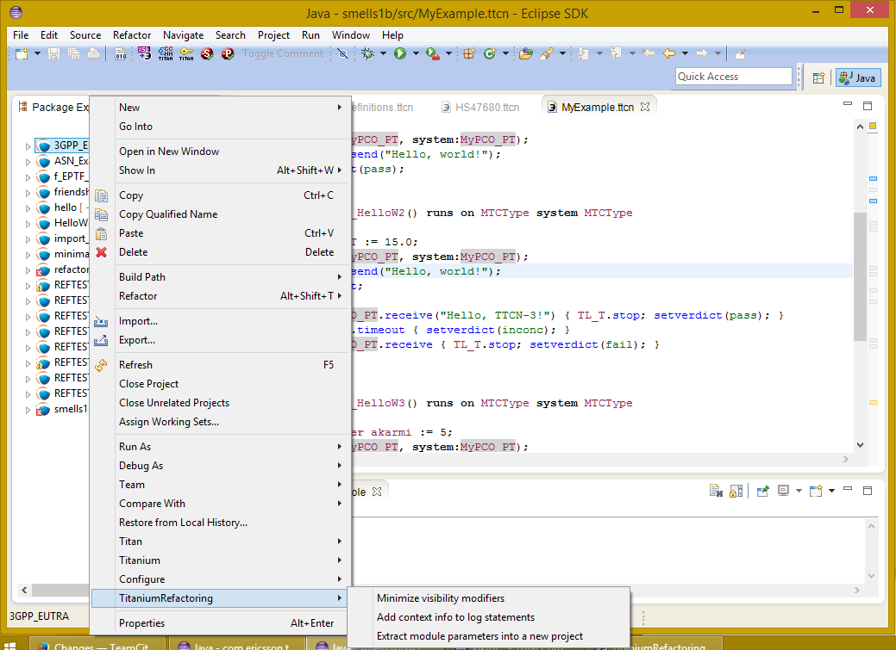
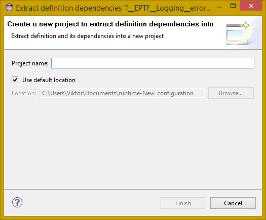
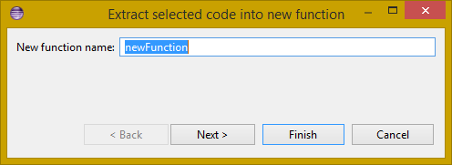
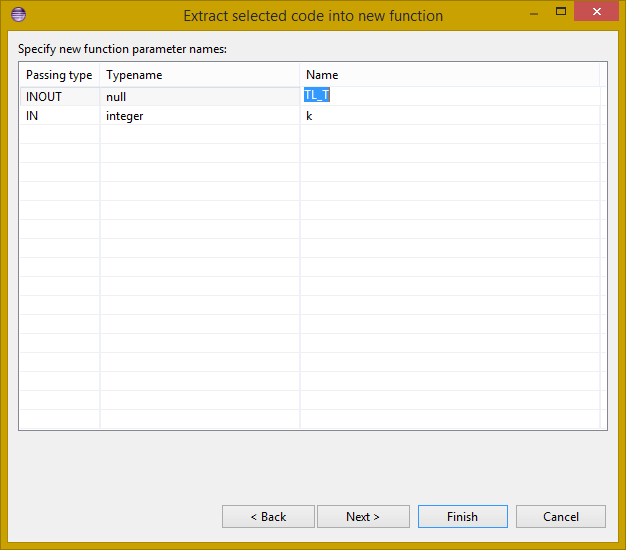
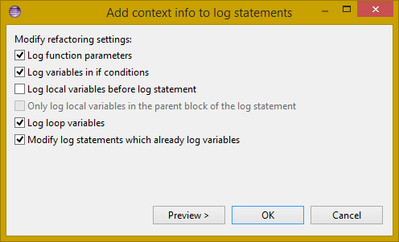
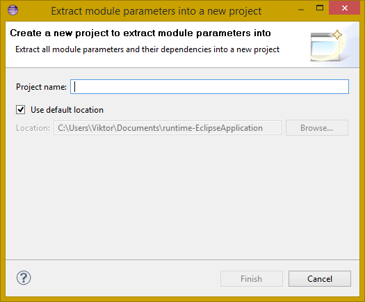
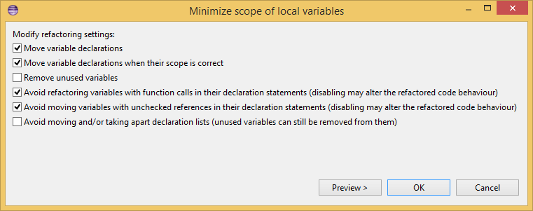

= Titanium Refactoring Description
:author: Kristóf Szabados
:revnumber: 1/1551-CRL 113 200/6, Rev. A
:revdate: 2019-05-17
:title-logo-image: images/titan_logo.png
:sectnums:
:doctype: book
:leveloffset: +1
:toc:
:toclevels: 3

ifdef::env-github,backend-html5[]

endif::[]

*Abstract*

This document describes Titanium Refactoring, the refactoring tool for TTCN-3 testing software.

*Copyright*

Copyright (c) 2000-2019 Ericsson Telecom AB. +
All rights reserved. This program and the accompanying materials are made available under the terms of the Eclipse Public License v2.0 that accompanies this distribution, and is available at +
https://www.eclipse.org/org/documents/epl-2.0/EPL-2.0.html.

*Disclaimer*

The contents of this document are subject to revision without notice due to continued progress in methodology, design and manufacturing. Ericsson shall have no liability for any error or damage of any kind resulting from the use of this document.

= Introduction

== How to read this document

This description contains detailed information on using the TitaniumRefactoring tool.

== Overview of TitaniumRefactoring

The TitaniumRefactoring tool is an Eclipse plug-in, extending the TITAN Designer for the Eclipse IDE Toolset with refactoring functionality. The Designer is required to be installed and be present for the correct operation.

[[the-titan-implementation-of-ttcn-3]]
== The TITAN implementation of TTCN-3

The TitaniumRefactoring plug-in is extending the TITAN Designer plug-in, which is an implementation of TTCN-3 Core Language standard (<<_3, [3]>>), supporting of ASN.1 language (<<_4, [4]>>).

The limitations present in the Designer plug-in also apply here: there are TTCN-3 language constructs which are not yet supported in the current version, while there are also some non-standard extensions implemented by TITAN. Information on these limitations and extensions and also some clarifications of how the standard has been implemented in TITAN, can be found in the <<_2, TITAN Programmer’s Technical Reference>>.

== Intended audience

This document is intended for users of the TITAN TTCN-3 Test Toolset (product number: CRL 113 200/1).

== Presumed knowledge

This document is intended to be read by users already familiar with the TITAN Designer toolset. For this reason this document includes TITAN related information only when necessary.

NOTE: This document does not wish to describe elements of Eclipse or Titan, and how to use them. Every time such a feature is described, it is done with simplicity in mind, assuming a minimal level of experience with Integrated Development Environments from the user. However, it is advised to read the manuals of Eclipse and Titan Designer (mainly contained in its included help system), because it can provide better descriptions of the elements.

== Typographical conventions

This document uses the following typographical conventions:

*Bold* is used to represent graphical user interface (GUI) components such as buttons, menus, menu items, dialog box options, fields and keywords, as well as menu commands. Bold is also used with "+" to represent key combinations. For example, *Ctrl + Click*

The slash (/) character is used to denote a menu and sub-menu sequence. For example, *File / Open*.

`Monospaced` font is used to represent system elements such as command and parameter names, program and path names, URLs, directory names and code examples.

== Installation

For details on installing the TitaniumRefactoring plug-in, see the Installation Guide for TITAN Designer and TITAN Executor for the Eclipse IDE [1].

== How to report an error for the tool

The following information should be included into trouble reports:

* a short description of the problem;
* what seems to have caused it, or how it can be reproduced;
* If the problem is graphical in some way (displaying something wrong), screenshots should also be included;
* Output appearing on the TITAN Console or the TITAN Debug Console;
* contents of the Error view if it contains some relevant information;

Before reporting a trouble, try to identify whether the trouble really relates to the Titanium plug-in. It might be caused by other third party plug-ins, or by Eclipse itself.

Reporting the contents of the Consoles and the Error log is important as TITAN consoles might display important debug information. The location on which the Error Log view can be opened can change with Eclipse versions, but it is usually found at *Window / Show View / Other… / PDE Runtime / Error Log* or *Window / Show View / Other… / General / Error Log*.

= Getting started

This section explains how to setup Eclipse and the TITAN Designer to access every feature provided by TitaniumRefactoring.

== The perspective

TitaniumRefactoring does not provide its own perspective, for convenience we recommend using the "TITAN Editing" perspective.

For those who have not yet used the TITAN Designer before, it is recommended to read chapter "The TITAN Editing perspective" of the TITAN Designer’s user guide on how to set up a default perspective for working with TTCN-3.

== Setting workbench preferences

In Eclipse, workbench preferences are used to set user specific general rules, which apply to every project; for example, preferred font styles, access to version handling systems and so on.

Workbench preferences are accessible selecting *Window / Preferences*. Clicking on the menu item will bring up the preferences page.

This section only concerns the preferences that are available under the TITAN preferences node of this preference tree. There are no preferences in this window concerning the TitaniumRefactoring plugin.

== TITAN preferences

The setting of the TITAN *license file* is mandatory for the refactoring features to work. Without a valid license the TITAN Designer plug-in will not create the semantic data, that the TitaniumRefactoring plug-in requires to work on.

NOTE: In case the license file is not provided, is not valid or has expired an additional link will appear on this page. Clicking on this link a browser will open directing the user to a web page where he can order a new license or can ask for a renewal of his existing one.

= Actions

The TitaniumRefactoring plug-in extends some of the context-sensitive menus of Eclipse where appropriate, providing a convenient way to use the available tools.

== Editor actions

While editing a TTCN-3 source file, the context menu can be opened by right clicking in the editor on some selection. Under the TitaniumRefactoring menu item, the available actions on this file can be found.

* *Extract definition into a new project:* Copies the selected definition and all of its dependencies to a new project. See Section 4 for details.
* *Extract code into a new function:* Extracts the selected code into a new function. See Section 5 for details.
* *Lazy-fication of formal parameters:* Automatically detects formal module parameters where applying the @lazy modifier would be beneficial see section 11 for details.
* *Minimize visibility modifiers in module:* Minimizes all visibility modifiers in a single module. This means, that all the definitions in the module which can be private are given a private visibility modifier. See Section 6 for details.
* *Expand value list notation in module:* Automatically transforms values given with value list notation into assignment notation.
* *Order value list notation in module:* Automatically correct the order of elements in assignment notation to mimic the order seen in the type of the value.
* *Add context info to log statements:* Adds context info to log statements in the selected piece of code. See Section 7 for details.
* *Extract module parameters into a new project:* Extracts all module parameters and all of their dependencies from an entire project into a new project. See Section 8 for details.
* *Minimize scope of local variables in function:* This is a complex refactoring operation that is able to automatically delete unused variables, move the declaration of variables closer to the first usage, if needed into a smaller scope unit.
* *Organize imports:* Automatically organizes the import statements into lexicographical order, removing all unused imports.
* *Ungroup module parameters in module:* For all instances where module parameters are declared using the deprecated grouped syntax, automatically replaces them with a separated list of the same module parameters.
* *Insert field:* This refactoring can be used on record and set types, to add a new field to the type. When a default value is provided for the new field the refactoring will automatically update all usage locations of the type with this default value.
* *Change union to select union:* Automatically transforms select statements used with a union parameter, to the more specific select union statement.
* *Move function:* With the involvement of the user, this refactoring tries to detect which functions are located in a module they do not belong to, find a better new location for them and automatically move them to their new location. Automatically correcting the imports as needed.

== Project explorer actions

Some of the refactoring operations can work on files, folders or projects. These operations can be found in the Project Explorer context menu, under the TitaniumRefactoring menu item.

* *Lazy-fication of formal parameters:* Automatically detects formal module parameters where applying the @lazy modifier would be beneficial see section 11 for details.
* *Minimize visibility modifiers:* Minimizes all visibility modifiers in the selected file(s), folder(s) or project(s). This means, that all the definitions in these resources which can be private are given a private visibility modifier. See Section 6 for details.
* *Expand value list notation in module:* Automatically transforms values given with value list notation into assignment notation.
* *Order value list notation in module:* Automatically correct the order of elements in assignment notation to mimic the order seen in the type of the value.
* *Add context info to log statements:* Adds context info to all log statements in the selected file(s), folder(s) or project(s). See Section 7 for details.
* *Extract module parameters into a new project:* Extracts all module parameters and all of their dependencies from an entire project into a new project. See Section 8 for details.
* *Minimize scope of local variables in function:* This is a complex refactoring operation that is able to automatically delete unused variables, move the declaration of variables closer to the first usage, if needed into a smaller scope unit.
* *Organize imports:* Automatically organizes the import statements into lexicographical order, removing all unused imports.
* *Ungroup module parameters in module:* For all instances where module parameters are declared using the deprecated grouped syntax, automatically replaces them with a separated list of the same module parameters.
* *Insert field:* This refactoring can be used on record and set types, to add a new field to the type. When a default value is provided for the new field the refactoring will automatically update all usage locations of the type with this default value.
* *Change union to select union:* Automatically transforms select statements used with a union parameter, to the more specific select union statement.
* *Move function:* With the involvement of the user, this refactoring tries to detect which functions are located in a module they do not belong to, find a better new location for them and automatically move them to their new location. Automatically correcting the imports as needed.

= Headless mode

The TitaniumRefactoring plug-in offers some commands which can be called in headless mode. This way it can be used from command line, and for example integrated into nightly build systems.

In headless mode eclipse plug-ins can offer entry point, called applications, through which the user is able to invoke functionalities of the plug-in without starting the graphical interface of Eclipse. In this mode everything is working exactly the same way as it is when invoked from the graphical user interface, but there are no windows popping up, no user interaction.

It is important to note, that as in this mode there is no interaction between eclipse and the user, all of the settings should be set beforehand. Otherwise the operation might not be able to work properly, or produce un-expected result.

== Important settings

There are two settings that are always important to be set correctly; otherwise the headless mode will not be able to operate correctly:

* The license file has to be set in the Designer and it has to be active, otherwise the on-the-fly analyser will not be able to execute.
* The "__Display debug information__" setting in the Designer has to be turned off. If that option is turned on, the Designer will try to write debug information to the Titan Debug Console … which does not exist in headless mode and the execution aborts.
* The on-the-fly analysis of code smells must be enabled on the Code smells preference page under Titanium Preferences, otherwise only the Designer will check the code.

== The general structure of invocation

A generic call to a headless entry point of eclipse follows this pattern:

[source,subs="+quotes"]
*eclipse.exe -noSplash -data <path to workspace to use> -application <entry point> <parameters>*

The items in this call have the following meaning:

_Eclipse.exe_ : this is the binary executable of Eclipse to be used.

"__-noSplash__": Eclipse should not display even the splash screen.

"__-data <path to workspace to use>__": The data parameter tells eclipse which workspace to use. A workspace is usually needed, to work with resources.

"__-application <entry point> <parameters>__": The application parameter tells eclipse which entry point to call, and what parameters to pass to that entry point.

An example call could be:

[source,subs="+quotes"]
*-noSplash -application org.eclipse.titanium.refactoring.definition.ExtractDefinitionHeadlessRunner -data "C:\Users\JohnDoe\workspace" -in proj1 -out ExtDefTest05 -module test -definition funtest -location "D:\Refactoring\Tests\Headless"*

= Extract definition into a new project

Often it is problem in practice to create a set of the contents of a project, which is still able to reproduce some behaviour of the project and is small enough to debug/analyse.

This functionality extracts a definition and all of its dependencies to a new TITAN project. Even the settings are copied to the new project.

== Usage

To extract a definition and all of its dependencies to a new project, right click on a definition identifier in the editor window and choose *TitaniumRefactoring / Extract definition* from the context menu. If the type of the selection is not supported for the operation, an error message is displayed in the status bar.

If the selection is supported for the operation, then a wizard dialog is presented for the user to specify the name of the new project. Project names that are already present in the workspace are not accepted. After entering the name and clicking on the *Finish* button, the new project is created and added to the workspace.

== Headless mode

The plug-in also can be called in headless mode, this way it can be used from command line, and for example integrated into nightly build systems.

The entry point can be invoked as:

[source,subs="+quotes"]
*-noSplash -application org.eclipse.titanium.refactoring.definition.ExtractDefinitionHeadlessRunner -data <Workspace> -in <InputProjectName> -out <OutputProjectName> -module <ModuleName> -definition <DefinitionName> [-location <LocationToPutTheProject>]*

== Known limitations

Please note that the "Extract definition" feature is working only on TTCN-3 files. ASN.1 and pre-processable TTCN-3 files are not supported; their whole content will be copied without selection.

NOTE: The algorithm ignores missing references in the source project.

= Extract code into a new function

This functionality extracts TTCN-3 statements to a new function and replaces their old location with the invocation of the newly created function. The parameters of the new function are automatically determined by the algorithm.

== Usage

To extract parts of the code into a new function, select an arbitrary piece of code and right click on it. From the context menu choose *TitaniumRefactoring / Extract to a new function*.

The algorithm searches for whole statements in the selection, half selected statements are not included. If the selection does not contain any complete statements, then an error message is displayed in the status bar.

If the selection is valid for the operation, then a wizard is presented for the user to specify the name of the new function and the names of its parameters. After this, the produced changes can be reviewed and accepted by clicking on the *Finish* button.

== Known limitations

 The "Extract to a new function" feature is working only on TTCN-3 files. ASN.1 and pre-processable TTCN-3 files are not supported, and so will be skipped by the algorithm.

= Lazy-fication of formal parameters

This functionality allows users automatic lazy-fication of non-lazy formal parameters, if they evaluation could be delayed.

== Usage

To use the refactoring operation on a single module, select *TitaniumRefactoring / Lazy-fication of formal parameters* from the editor right-click context menu.

To use the operation on any number of files, folders or projects, select *TitaniumRefactoring / Lazy-fication of formal parameters* from the Project Explorer right-click context menu.

A wizard dialog is presented for the user to review the changes, before executing them.

== Known limitations

Please note that the "Lazy-fication of formal parameters" feature is working only on TTCN-3 files. ASN.1 and pre-processable TTCN-3 files are not supported, and so will be skipped by the algorithm.

= Minimize visibility modifiers

This operation sets the visibility modifier of all definitions in the selected resources to private, where possible. If a definition is referred from another module, its visibility modifier will not be replaced.

== Usage

To use the refactoring operation on a single module, select *TitaniumRefactoring / Minimize visibility modifiers in module* from the editor right-click context menu.

To use the operation on any number of files, folders or projects, select *TitaniumRefactoring / Minimize visibility modifiers* from the Project Explorer right-click context menu.

== Known limitations

Please note that the "Minimize visibility modifiers" feature is working only on TTCN-3 files. ASN.1 and pre-processable TTCN-3 files are not supported, and so will be skipped by the algorithm.

= Expend value list notation
This functionality allows users to automatically expand value list notations with field names, throughout the entire project or smaller parts of the code.
Making the tests easier to understand and maintain.

While it might be tempting to save development time, on not writing out field names in value list notations, this can cause problems during maintenance.
During maintenance reviewing a large data structure, where the values are listed without direct information on what they are assigned to, can add an unnecessary complexity and slow down the effort.
Using this feature, such value list notations are automatically expanded with the names of the fields, making navigation and understanding much easier.

Examples:
[source]
----
//given the type:
type record my_rec {
  integer field1,
  integer field2
}

// this constant is refactored
const my_rec my_const := {1,2}

//to have more information
const my_rec my_const := {field1 := 1,field2 := 2}
----

== Usage
To use the refactoring operation on a single module, select *TitaniumRefactoring / Expand value list notation in module* from the TTCN-3 editor's right-click context menu.

To use the operation on any number of files, folders or projects, select *TitaniumRefactoring / Expend value list notation* from the Project Explorer right-click context menu.

A wizard dialog is presented for the user to review the changes, before executing them.

== Known limitations

Please note that the "Expand value list notation" feature is working only on TTCN-3 files. ASN.1 and pre-processable TTCN-3 files are not supported.

= Order value list notation
This functionality allows users to automatically re-order the values in assignment list notations, to reflect the field's order in the original type, throughout the entire project or smaller parts of the code.

It can easily happen during the development of a test system, that a value given with an assignment notation, does not follow the order of the original type.
During maintenance this can cause problems. For example checking that a value of a set type has its fields set to the right value, in case of different field ordering, provide an overhead of tracking which field of the type is where in the value.
Using this feature, such assignment list notations are automatically reordered to reflect the order of fields in the original type, making navigation and understanding much easier.

Examples:
[source]
----
//given the type:
type set my_set {
  integer field1,
  integer field2
}

// this constant is refactored
const my_set my_const := {field2 := 2,field1 := 1}

//to have its assignment in the order of fields present in type my_set
const my_set my_const := {field1 := 1,field2 := 2}
----

== Usage
To use the refactoring operation on a single module, select *TitaniumRefactoring / Order assignment list notation in module* from the TTCN-3 editor's right-click context menu.

To use the operation on any number of files, folders or projects, select *TitaniumRefactoring / Order assignment list notation* from the Project Explorer right-click context menu.

A wizard dialog is presented for the user to review the changes, before executing them.

== Known limitations

Please note that the "Order assignment list notation" feature is working only on TTCN-3 files. ASN.1 and pre-processable TTCN-3 files are not supported.

= Add context info to log statements

This functionality allows users to add automatically constructed additional content to existing log statements throughout the entire project or smaller parts of code.

== Usage

To add context info to log statements in a part of the code, select an arbitrary piece of code and right click on it. From the context menu choose *TitaniumRefactoring / Add context info to log statements*. To run the refactoring process on entire files, folders or projects, right click on the specific resource in the Package Explorer and choose the same entry from the context menu, as given above.

The algorithm searches for log statements in the selection and modifies them if necessary, to log additional variables. Variables that are already logged in the statement, will not be inserted again.

After selecting the appropriate options, click on the *OK* button to finish the operation.

=== Settings

* *Log function parameters:* Adds all function parameters of the parent function to the log statement.
* *Log variables in if conditions:* Adds all variables present in the condition expression of ancestor if blocks.
* *Log local variables before log statement:* Adds all local variables that were declared before the log statement.
* *Only log local variables in the parent block of the log statement:* Adds all local variables that were declared before the log statement only in the direct parent block.
* *Log loop variables:* Adds the loop variables from all ancestor loop blocks.
* *Modify log statements which already log variables:* If this option is disabled, only those log statements will be modified which do not log any variables.

== Known limitations

Please note that the "Extract to a new function" feature is working only on TTCN-3 files. ASN.1 and pre-processable TTCN-3 files are not supported, and so will be skipped by the algorithm.

= Extract module parameters into a new project

This functionality extracts all module parameters and all of their dependencies from an entire project to a new TITAN project. The project settings are also copied to the new project.

== Usage

To extract all module parameters and all of its dependencies to a new project, right click on anywhere in the editor window, or right click on the project, or any file or folders of the project in Package Explorer, and choose *TitaniumRefactoring / Extract module parameters* from the context menu.

A wizard dialog is presented for the user to specify the name of the new project. Project names that are already present in the workspace are not accepted. After entering the name and clicking on the *Finish* button, the new project is created and added to the workspace.

== Headless mode

The plug-in also can be called in headless mode, this way it can be used from command line, and for example integrated into nightly build systems.

The entry point can be invoked as:

[source,subs="+quotes"]
*-noSplash -application org.eclipse.titanium.refactoring.modulepar.ExtractModuleParHeadlessRunner -data <Workspace> -in <InputProjectName> -out <OutputProjectName> [ -location <LocationToPutTheProject> ]*

== Known limitations

Please note that the "Extract definition" feature is working only on TTCN-3 files. ASN.1 and pre-processable TTCN-3 files are not supported; their whole content will be copied without selection.

NOTE: The algorithm ignores missing references in the source project.

= Minimize scope of local variables in function

This functionality allows users to rearrange local variable declarations in functions. Declarations which could have a narrower scope can be moved into the appropriate code blocks, or declarations which are declared too early can be moved to a latter location. Also, unused variable declarations can be removed.

== Usage

To run the refactoring operation on a specific TTCN-3 function, move the cursor into the function body and right click using the mouse. From the context menu choose *TitaniumRefactoring / Minimize scope of local variables in function*. To run the refactoring process on entire files, folders or projects, right click on the specific resource in the Package Explorer and choose the same entry from the context menu, as given above.

After selecting the appropriate options, click on the *OK* button to finish the operation, or use the *Preview* action to browse the changes before accepting them.

=== Settings

* *Move variable declarations:* If this option is disabled, variable declarations will not be moved (just removed if unused and other settings and circumstances allow this)
* *Move variable declarations when their scope is correct:* If this option is disabled, variable declarations will only be moved to a new location if their scope could be narrower.
* *Remove unused variables:* Removes unused variable declarations.
* *Avoid refactoring variables with function calls in their declaration statements (disabling may alter the refactored code behaviour):* If this option is enabled, variable declarations containing function calls are not going to be moved or removed. When such declaration is moved or removed and the function called in the declaration has side effects, the behaviour of the code may change.
* *Avoid moving variables with unchecked references in their declaration statements (disabling may alter the refactored code behaviour):* Some reference types in a variable declaration are currently not checked for other occurrences in the code. If this option is disabled and a variable declaration contains such unchecked references, then moving this variable (possibly beyond a left-hand-side occurrence of this specific unchecked variable) may result in the change of the code behaviour.
* *Avoid moving and/or taking apart declaration lists (unused variables can still be removed from them):* When large declaration lists with many declarations are moved, the current algorithm doesn’t preserve the declaration list itself, but creates individual declaration statements for each variable declaration. Sometimes this can be annoying, so disabling this option leaves all variables declared in declaration lists unmoved. Unused entries can still be removed from these declaration lists.

== Algorithm behaviour

The main steps of the refactoring operation are the following:

* For a single function, local variables are processed in reverse order. This guarantees that for a variable A and a latter declared variable B referencing A in its declaration, when B is moved, A could be moved along if possible.
* If a variable declaration contains a function call, the algorithm declares it unsafe to move or remove this declaration. Similarly, if a declaration contains a reference for an unchecked variable, then the algorithm declares it unsafe to move (but not to remove) this declaration. The default settings for the refactoring operation ensure the unchanged behaviour of the resulted code.
* The new scope of a variable V is calculated as the smallest common containing block of all references of this variable let this scope be S.
* If the variable V declaration does not contain references to any other variables, then the new location of the declaration is inside S (the new scope), just before the first reference to variable V let this location be L.
* If the variable V declaration does contain references to other variables, then all left hand side usages (before the location L, but after the declaration of V) of these other variables are collected and their smallest common containing block is calculated. Let this be S2. The new scope of the variable V will become the smallest common containing block of S and S2 (for clarity: a block contains itself in this case) Let this be S3. The new location of the declaration will be in S3 right before the location of the first reference to V or the first left hand side reference mentioned above (the earliest of these).
* If the calculated new scope of a variable is a loop block, then the new scope is going to be the smallest ancestor block of the loop block which is not greater than the original scope. Moving a variable declaration into a loop block even when all references are inside the loop block may result in changed behaviour.

== Known limitations

"Minimize scope of local variables in function" feature is working only on TTCN-3 files. ASN.1 and pre-processable TTCN-3 files are not supported, and so will be skipped by the algorithm.

= Organize imports

This functionality allows users to rearrange and correct imports in their TTCN-3 modules.
As part of the functionality the existing imports are order in alphabetical order.
When the algorithm encounters an unused import it is removed.
When the algorithm finds that an import is missing, and it can identify which module needs to be imported, the import is inserted.

== Usage
To use the refactoring operation on a single module, select *TitaniumRefactoring / Organize imports* from the TTCN-3 editor's right-click context menu.

To use the operation on any number of files, folders or projects, select *TitaniumRefactoring / Organize imports* from the Project Explorer right-click context menu.

A wizard dialog is presented for the user to review the changes, before executing them.

== Known limitations

Please note that the "Organize imports" feature is working only on TTCN-3 files. ASN.1 and pre-processable TTCN-3 files are not supported.

= Runs on scope reduction

This functionality allows users to reduce the "runs on" components of functions, altsteps and testcases to the minimal needed.

When writing functions, altsteps or testcases it is quite common to start with a blueprint of what component they might need to run on.
However sometimes it just happens that the function written, does not actually need to run on the component mentioned in its "runs on" clause, as it does not use any of that component's member declarations.
This feature analyzes the function, altstep or testcase in question, and based on the declarations it uses from the component hierarchy it determines the smallest possible component it could run on (which the current one is extending).
This effectively also means, that the same function will now be applicable in many more situations, as a "smaller" component means possibly more calling sites.

== Usage
To use the refactoring operation on a single module, select *TitaniumRefactoring / Runs on scope reduction* from the TTCN-3 editor's right-click context menu.

To use the operation on any number of files, folders or projects, select *TitaniumRefactoring / Runs on scope reduction* from the Project Explorer right-click context menu.

A wizard dialog is presented for the user to review the changes, before executing them.

== Known limitations

Please note that the "Runs on scope reduction" feature is working only on TTCN-3 files. ASN.1 and pre-processable TTCN-3 files are not supported.

= Ungroup module parameters

This functionality allows users to ungroup module parameters, that are present in the code using the group style definition.

Group style definition of module parameters have been deprecate in the TTCN-3 for a long time and this style is planned to be removed from the standard soon.
This feature lets users update their code automatically to the replacement notation.

Examples:
[source]
----

// this deprecated syntax is refactored
modulepar {
  integer mp_1 := 1, mp_2 := 2;
  charstring mp_3 := "example";
}

//to the following ungruped version
modulepar integer mp_1 := 1;
modulepar integer mp_2 := 2;
modulepar charstring mp_3 := "example";
----

== Usage
To use the refactoring operation on a single module, select *TitaniumRefactoring / Ungroup module parameters in module* from the TTCN-3 editor's right-click context menu.

To use the operation on any number of files, folders or projects, select *TitaniumRefactoring / Ungroup module parameters* from the Project Explorer right-click context menu.

A wizard dialog is presented for the user to review the changes, before executing them.

== Known limitations

Please note that the "Ungroup module parameters" feature is working only on TTCN-3 files. ASN.1 and pre-processable TTCN-3 files are not supported.

= Insert field
This functionality allows users to insert a new field into the selected record or set type. The new field appears at all of the type's occurences in the project.

== Usage
To insert a new field into a record or set type, right click on the type definition identifier in the editor window and choose *TitaniumRefactoring / Insert field* from the context menu. If the type of the selection is not supported for the operation, an error message is displayed in the status bar.

If the selection is supported for the operation, then a wizard dialog is presented for the user to specify the position, name, type and value of the new field. Names that are already present in the selected type definition are not accepted. After this, the produced changes can be reviewed and accepted by clicking on the Finish button.

== Known limitations
Please note that the "Insert field" feature is working only on TTCN-3 files. ASN.1 and pre-processable TTCN-3 files are not supported, and so will be skipped by the algorithm.

NOTE: The algorithm does not check if the type and the value of the new field are valid.

= Change union to select union

This functionality allows users to automatically convert already existing select statements, to more efficient and descriptive select union statements, if possible.

The TTCN-3 standard has been extended recently with the select union statement, to provide better support for the situation, when several execution path are possible based on the currently selected field of a union typed value.
As the below example shows, previously select statements could be used for this purpose, but were lacking.
The new syntax not only communicates its purpose better, but also allows for checking if all possible fields are covered (leading to safer code).

Examples:
[source]
----

//given the following union type
type union my_union {
  integer field1,
  integer field2
}

// this example function
function f_example(in my_union my_par) {
  select(true) {
    case (ischosen(my_par.field1)) {
      ...
    }
    case (ischosen(my_par.field2)) {
      ...
    }
  }
}

//can be refactored to
function f_example(in my_union my_par) {
  select union(my_par) {
    case(field1){

    }
    case(field2){

    }
  }
}
----

== Usage
To use the refactoring operation on a single module, select *TitaniumRefactoring / Change union to select union* from the TTCN-3 editor's right-click context menu.

To use the operation on any number of files, folders or projects, select *TitaniumRefactoring / Change union to select union* from the Project Explorer right-click context menu.

A wizard dialog is presented for the user to review the changes, before executing them.

== Known limitations

Please note that the "Change union to select union" feature is working only on TTCN-3 files. ASN.1 and pre-processable TTCN-3 files are not supported.

= Move function
This refactoring tries to detect functions that are located in a module they do not belong to, find a better new location for them and automatically move them there while also inserting the missing imports.

== Usage
To run the refactoring operation, select the modules or the project to be refactored and from the context menu that appears on right click, choose *TitaniumRefactoring / Move function*.

A wizard is presented for the user to choose the functions to be moved from the selected modules, the method used for finding their new destination and the name filtering option. After this, the produced changes can be reviewed and accepted by clicking on the Finish button.

== Algorithm behaviour

The main steps of the refactoring operation are the following:

  * At first, the methods to be moved are detected from the selected modules. If the function does not use anything (fields, methods, etc.) from its own module and is not private, it is added to a list that contains the methods to be moved.
  * The implementation provides three main approaches for the possible target modules of the functions; selecting the shortest module that is used by the method, selecting that of the used ones that needs the least new imports after inserting the function and finding the one which contains the most methods running on the same component as the one to be moved.
  * Modules can be excluded from the destinations list by filtering by their name.
  * The possible new destinations are rated between 0% and 100%, which represents to what degree they are recommended.
  * After the final destination for the method has been selected, the missing imports are inserted as well into the destination module. The missing imports are those modules, that the method uses but are not among the imported modules of the destination.
  * Those modules that import the original location of the method are checked to see if they contain references to the function. If they do, then their imports are examined to decide if they import the new destination. If they do not, then a new import to the destination module is inserted.

== Known limitations
Please note that the "Move function" feature is working only on TTCN-3 files. ASN.1 and pre-processable TTCN-3 files are not supported, and so will be skipped by the algorithm.

= References

[[_1]]
* [1] link:https://github.com/eclipse/titan.EclipsePlug-ins/blob/master/org.eclipse.titan.help/docs/Eclipse_installationguide/Eclipse_installationguide.adoc[Installation Guide for TITAN Designer and TITAN Executor for the Eclipse IDE]

[[_2]]
* [2] link:https://github.com/eclipse/titan.core/blob/master/usrguide/referenceguide/ReferenceGuide.adoc[Programmers Technical Reference for TITAN TTCN-3 Test Executor]

[[_3]]
* [3] link:http://www.etsi.org/deliver/etsi_es/201800_201899/20187301/04.01.01_60/es_20187301v040101p.pdf[Methods for Testing and Specification (MTS);The Testing and Test Control Notation version 3.Part 1: Core Language European Telecommunications Standards Institute. ES 201 873-1 Version 4.1.1, July 2009]

[[_4]]
* [4] link:http://www.etsi.org/deliver/etsi_es/201800_201899/20187307/04.01.01_60/es_20187307v040101p.pdf[Methods for Testing and Specification (MTS);The Testing and Test Control Notation version 3.Part 7: Using ASN.1 with TTCN-3 European Telecommunications Standards Institute. ES 201 873-7 Version 4.1.1, July 2009]

= Glossary

ASN.1:: Abstract Syntax Notation One

IDE:: Integrated Development Environment

TTCN-3:: Tree and Tabular Combined Notation version 3 (formerly)Testing and Test Control Notation (new resolution)
