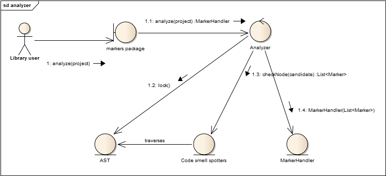

= Titanium code smells
:toc:

== Overview

One feature of Titanium is to find code smells, that is, highlight bad code patterns in ttcn3 projects. The implementation focused on being flexible and extensible, while still being fast enough that it can be executed on-the-fly immediately after semantic analyses.

The code of the implementation resides in the `org.eclipse.titanium.markers` and its submodules. A rough overview of the interaction of entities during an analysis of a project is depicted below.

== Spotters

Code smell spotters are the independent units that are responsible for recognizing one kind of code smell in an AST node. They encapsulate the logic, and nothing else.

Spotters must declare a start node type, the type of AST node that is susceptible with having its kind of code smell. For example, the spotter that is responsible for finding goto statements declares the Goto_statement class as its entry AST node. During the analysis it is actually the Analyzer that traverses the AST, and it calls the appropriate spotters for each node type, but it is only an optimization.

When a spotter finished its job on a node, it returns a list of `Markers`, which are the abstraction of code smell instances. Spotters are immutable, thus thread-safe. While the current code does not rely on this property of the spotters, it makes possible to improve the `Analyzer` by executing the spotters in parallel in an executor service.

== MarkerHandler

The `MarkerHandler` class stores the `Markers` created during analysis, and associates them to the `IResource` (ttcn3 files or the whole ttcn3 project) where the code smell instance belongs. `MarkerHandler` instances are obtained via the analyzer methods, and can be used to query the code smells by the associated `IResource` or by type, or to create the appropriate problem markers (`IMarker`) for a given `IResource` in Eclipse.

Note that creating the markers in Eclipse requires locking the resource. Acquiring the lock is attempted internally, which might lead to deadlock if the method was called with the lock already held. To avoid this situation, the `show()` and `showAll()` methods schedule a separate job to create the problem markers.

== Type hierarchy

There lies an architectural weakness in the `marker` package, that stems from a necessary optimization. When a spotter claim to be interested in e.g. the node type `Expression`, that means that it should be executed not only on the AST nodes whose class is `Class<Expression>`, but also on those that are subclass of `Expression`. However, doing this at runtime, via reflexion (using `Class#isInstance()`) turned out to be too expensive (this way an analysis is about 4-6 times slower than the current solution).

The current solution is that the type hierarchy of the AST nodes is wired in the code statically, and when a spotter is registered for a node type, it is also registered for all its subtypes. This way, during the AST traversal it is enough to query the class of the current node, without searching for its superclasses.

For the performance gain we lost some maintainability: whenever the type hierarchy of the AST in the designer project changes, the code in the class `StaticData` should reflect this change.

== Interaction of the markers and the designer package

The single point of communication is the Analyzer, which is responsible for acquiring the AST of the project to analyze from the Parser, so it can hand the AST over to the spotters for traversal. Apart from this, it should be noted that the code smell spotters rely on the methods offered by the nodes of the AST, those methods should be also considered part of the interface.
