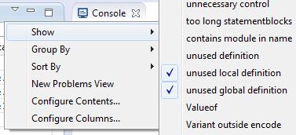
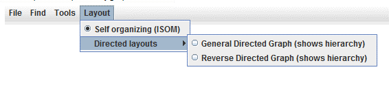

= Titanium Description
:author: Kristóf Szabados
:revnumber: 1551-CRL 113 200/7, Rev. H
:revdate: 2020-05-29
:title-logo-image: images/titan_logo.png
:sectnums:
:doctype: book
:leveloffset: +1
:toc:
:toclevels: 3

ifdef::env-github,backend-html5[]
image::images/titan_logo.png[alt]
endif::[]

*Abstract*

This document describes Titanium, the Quality Analyzer for TTCN-3 testing software.

*Copyright*

Copyright (c) 2000-2020 Ericsson Telecom AB. +
All rights reserved. This program and the accompanying materials are made available under the terms of the Eclipse Public License v2.0 that accompanies this distribution, and is available at +
https://www.eclipse.org/org/documents/epl-2.0/EPL-2.0.html.

*Disclaimer*

The contents of this document are subject to revision without notice due to continued progress in methodology, design and manufacturing. Ericsson shall have no liability for any error or damage of any kind resulting from the use of this document.

= Introduction

== How to read this document

This description contains detailed information on using the Titanium tool.

This documentation should be read together with the detailed mathematical explanations and lists found on the projects https://ericsson.sharepoint.com/sites/DUCI_SW_Technology/Titanium/Wikis/Forms/AllPages.aspx[Sharepoint site].

== Overview of Titanium

The Titanium tool is an Eclipse plug-in, built upon the TITAN Designer for the Eclipse IDE Toolset. As it extends the TITAN Designer plug-in, the Designer is required to be installed and be present for the correct operation.

Titanium extends the already existing feature of the Designer with higher level code analysis features such as:

* Detecting and reporting code smellsfootnote:[Code smells are described in Wikipedia as: "In computer programming, code smell is any symptom in the source code of a program that possibly indicates a deeper problem. Code smells are usually not bugs—they are not technically incorrect and don't currently prevent the program from functioning. Instead, they indicate weaknesses in design that may be slowing down development or increasing the risk of bugs or failures in the future."] in TTCN-3 and ASN.1 source codes;
* Measuring and displaying code quality metrics on TTCN-3 source codes;
* Extracting and displaying an architectural overview of the projects;

== General workflow

The workflow of the Titanium tool is extending the Designer’s workflow with additional checks and measurement. As such the integration should be seamless.

The differences only involve the new features provided:

* In order to use the code smell reporting most efficiently, the user can configure which code smells he wishes to be detected and reported.
* The metrics view and the architectural display simply needs to be invoked on a project, to refresh their measurements and contents.

There are three more notes important to know when working with the tool:

* The tool does not need to be used in interactive mode. It is perfectly valid to check the quality of the source periodically, extracting the issues to be solved into tasks for the team working with the source code. As such it can be used as part of the review process, or the nightly check system.
* It is advised to work in an iterative manner. When a code smell is corrected in some way, it can happen that this might trigger the detection of new code smells. For example when unnecessary import statements are removed from the system, it might turn out that some of the modules were not used in the system at all.
* When working with code smells, metrics and architectural level tools it is important to concentrate on the "larger picture". Correcting these issues on "face value" might hide away bigger problems. For example we found a case where unused variables with the same name were reported several times in a module. This turned out to indicate, that the function they were contained in were copy pasted, without review.

[[the-titan-implementation-of-ttcn-3]]
== The TITAN implementation of TTCN–3

The Titanium plug-in is extending the TITAN Designer plug-in, which is an implementation of TTCN–3 Core Language standard (<<_3, [3]>>), supporting of ASN.1 language (<<_4, [4]>>).

The limitations present in the Designer plug-in also apply here: there are TTCN–3 language constructs which are not yet supported in the current version, while there are also some non-standard extensions implemented by TITAN. Information on these limitations and extensions and also some clarifications of how the standard has been implemented in TITAN, can be found in the TITAN Programmer’s Technical Reference <<_2, [2]>>.

== Intended audience

This document is intended for users of the TITAN TTCN–3 Test Toolset (product number: CRL 113 200/5). In addition to this document, readers analyzing their codes with this tool are advised to read our knowledge base listing the code smells and metrics available.

== Presumed knowledge

This document is intended to be read by users already familiar with the TITAN Designer toolset. For this reason this document includes TITAN related information only when necessary.

The document also assumes that the reader has some level of mathematical and quality assurance knowledge. For the most optimal usage of the architectural view an architectural mind-set and point of view is also beneficial.

[NOTE]
====
This document does not wish to describe elements of Eclipse or Titan, and how to use them. Every time such a feature is described, it is done with simplicity in mind, assuming a minimal level of experience with Integrated Development Environments from the user. However, it is advised to read the manuals of Eclipse and Titan Designer (mainly contained in its included help system), because it can provide better descriptions of the elements.

There are only a few points in this document where Eclipse related information is separated from toolset related information. This is done so because the plug-in is so deeply integrated into Eclipse that separating the functionalities cannot be done without getting into implementation level of details (which the users are not interested in, and would be probably very confusing for them).
====

== Typographical conventions

This document uses the following typographical conventions:

*Bold* is used to represent graphical user interface (GUI) components such as buttons, menus, menu items, dialog box options, fields and keywords, as well as menu commands. Bold is also used with "+" to represent key combinations. For example, *Ctrl + Click*

The slash (`/`) character is used to denote a menu and sub-menu sequence. For example, *File / Open*.

`Monospaced` font is used to represent system elements such as command and parameter names, program and path names, URLs, directory names and code examples.

== Installation

For details on installing the Titanium plug-in, see the Installation Guide for TITAN Designer and TITAN Executor for the Eclipse IDE <<_1, [1]>>.

== How to report an error for the tool

The following information should be included into trouble reports:

* a short description of the problem;
* what seems to have caused it, or how it can be reproduced;
* if the problem is graphical in some way (displaying something wrong), screenshots should also be included;
* output appearing on the TITAN Console or the TITAN Debug Console;
* contents of the Error view if it contains some relevant information;

Before reporting a trouble, try to identify whether the trouble really relates to the Titanium plug-in. It might be caused by other third party plug-ins, or by Eclipse itself.

Reporting the contents of the Consoles and the Error log is important as TITAN consoles might display important debug information. The location on which the Error Log view can be opened can change with Eclipse versions, but it is usually found at *Window / Show View / Other… / PDE Runtime / Error Log* or *Window / Show View / Other… / General / Error Log*.

= Getting started

This section explains how to setup Eclipse and the TITAN Designer to access every feature provided by Titanium.

== The perspective

Titanium does not provide its own perspective, since most of its tools are meant to be extensions to whatever perspective the user is already using.

For those who have not yet used the TITAN Designer before, it is recommended to read chapter "The TITAN Editing perspective" of the TITAN Designer’s user guide on how to set up a default perspective for working with TTCN-3.

== Setting workbench preferences

This section gives an overview about the various settings related to the workbench provided by the Titanium plug-in.

In Eclipse, workbench preferences are used to set user specific general rules, which apply to every project; for example, preferred font styles, access to version handling systems and so on.

Workbench preferences are accessible selecting *Window / Preferences*. Clicking on the menu item will bring up the preferences page. The opening window contains a preference tree on the left pane to ease navigation – see Figure 1.

This section only concerns the preferences that are available under the TITAN preferences node of this preference tree.

== TITAN preferences

image::images/2_F2.png[title="TITAN Preferences"]

For the correct operation of the Titanium plug-in it is necessary to set the *license file* preference of TITAN. If this is not set the TITAN Designer plug-in will not do semantic analysis, which also stops the Titanium plug-in as there will be no semantic data to work on.

Although not required it is recommend to set the *maximum number of build processes to use* option to the number of processing units in the machine, to reach optimal speed.

NOTE: In case the license file is not provided, is not valid or has expired an additional link will appear on this page. Clicking on this link a browser will open directing the user to a web page where he can order a new license or can ask for a renewal of his existing one.

= Titanium preferences

This section introduces the preference pages where one can control the behavior of the views and other features provided by the Titanium plug-in.

== Code smell preferences

Code smells are indicators of suspicious code that is not erroneous (i.e. the code compiles), but most of the times they are not preferable. In this preference page, one can control the way of reporting the available code smells.

The first item on this page is the option to enable on-the-fly processing. When this option is enabled the code smells will be checked immediately after whenever the Designer’s on-the-fly analyzer executes. When this option is disabled the code smells have to be explicitly requested by the *Check code for code smells* action on the menu bar.

The reporting level of all code smells is configurable to be *Ignore*, *Warning* or *Error*. Code smells set to be reported as *Ignore* will not be analysed and reported. Code smells configured to be reported as *Warning* or *Error* will be reported with that severity level.

The code smells are categorized in 5 categories based on what kind of issue they are pointing at.

=== Potential structural problems

The code smells here might indicate some kind of architectural issue in the code.

* *Report the usage of label and goto statements*: go to statements and labels usually indicate incorrect programing practices. Developers are encouraged to used elements of structured programming practices.
+
* *Report private component access from other module*: report instances when a private component variable is accessed from a function located in a different module, but running on that component.
+
* *Report operations which are not safe in blocking statements*: reports the usage of operations, that are not safe to be used in blocking statements.
+
* *Report circular module dependencies*: Report the case when module imports form a circle. This situation slows down the parallel build, and might disable compilation in some cases.
+
NOTE: The algorithm will not report all circles, in a few cases where a small circle is embedded in a larger one, both of them cannot be detected at the same time.

* *Report modules with different language specifications*: Report the case where the TTCN-3 modules of a project don’t all have the same language specification. This situation invites confusion, misunderstandings and also indicates the need to updated some of the dated modules.
+
NOTE: TITAN does not support these language restrictions.
+

* *Missing imported module:* A definition could not be resolved using local and imported definitions, but could be resolved by importing another module.

* *Report unused module importation:* The reported importations are not needed, as none of their declaration is referred.

* *Report friend declarations with missing modules:* The module referred as a friend module is missing.

* *Report TTCN-3 definitions that could be private, but are not set so*: Detect and report definitions that are only used inside their own module, but are not declared private. This situation allows for external modules to refer to these definitions, making them part of the module’s public interface (which it might not have been intended to be a part of).

* *Report visibility settings mentioned in the name of definitions*: Detects the cases when visibility names are mentioned in the name of the definition. If this meant to serve as a protection mechanism against misuse it would be better to use the actual visibility attribute. In that case the compiler would be able to automatically check the correctness of its usage.

* *Report runs on scope reduction*: Detect the cases when the component in the runs on clause of a functions/altstep/testcase could be reduced.

* *Report unusable connection*: Detect connect statements where it is not possible to send or receive any message, even though the connection is otherwise perfectly valid.

=== Code style problems

Code smells in this category indicate some issue in coding style.

* *Report unnecessary negations in if statements:* When the condition of an "if" statement is negated, while it has exactly two branches.
* *Report if the name of the module is mentioned in the name of the definition*: In TTCN-3 it is supported to refer definitions in a module name prefixed way. In cases the module reference notation is not need, this naming style only makes the name longer.
* *Report if the name of the type is mentioned in the name of the definition*: In repeating the name of the type of a definition in the definitions name is a convenience method, but in some cases this makes the name of definition very large without adding any information.
* *Report magic constants:* an integer higher than 5 or any string literal.
* *Report if the attributes are being overridden*: When attributes are being overridden.

=== Potential performance problems

Code smells in this category might indicate some codes with performance problems.

* *Report infinite loops:* When there is no way to escape the loop.
* *Report uninitialized variable:* variable defined without initial assignment. Usually these variables are assigned a value later, but initializing at creation time is more efficient.
* *Report size check in loop condition:* The conditional part of loops is checked every iteration. In case the loop is iterating on a fixed sized list, the checking of the size in every iteration only wastes resources.
* *Report consecutive assignments:* Multiple consecutive assignment statements to the same definition are not optimal. They should be merged into one statement. Lower limit can be set for the number of consecutive assignments to be marked as a code smell. Default value is 4.
* *Report proper usage of @lazy modifier:* In parameters are not always optimal. If an in formal parameter is only evaluated in some special cases declaring it lazy might provide a performance improvement.

=== Potential Programming problems

Code smells in this category indicate issues related to bad or misunderstood architecture. Usually these issues also indicate maintenance problems in the future.

* *Report read only variables:* a local variable, an out- or an in-out parameter of a function is never written. These variables could be constants instead, or might have been designed to be assigned a value.
* *Report TTCN-3 definitions that have too many parameters:* When a function has too many parameters it becomes hard to invoke it. This might be a good indication that the function is doing too much work on its own. Limit can be set, default is 7.
* *Report TTCN-3 expressions that are too complex*: When an expression is too complex it becomes more likely that it is also incorrect. Limit can be set, default is 3.
* *Report empty statement blocks:* a statement block without any statement might indicate missing functionality.
* *Report statement blocks that have too many statements*: When there are too many statements in a block it might indicate, that it is doing too much work, and become too complex. Limit can be set, default is 150.
* *Report too big or too small shift and rotation sizes*: When the argument is larger than the length of the string or smaller than 1, the rotation might be incorrectly designed.
* *Report conditional statements without else block:* An "if" statement without else branch. In tests this might indicate, that the incorrect parameters or values were not logged.
* *Report switching on Boolean value:* select statement on boolean argument.
* *Report setverdict without reason:* The setverdict statement is used without telling the reason in a parameter.
* *Report uncommented functions:* procedures without documented headers.
* *Report stop statement in functions:* Functions whose body contains stop statement, which will stop the test’s execution without releasing resources and driving the SUT in correct state.
* *Report unused function return values:* function return value is not used, or function is started on component without being able to retrieve any return value.
* *Report starting functions with out inout parameters:* when starting a function with out or inout parameters, the resulting values of those parameters will be lost.
* *Report receive statements accepting any value*: the alt branch has a receive statement that accepts any value, but uses value redirection.
* *Report insufficient altstep coverage:* When an altstep or alt statement might receive a message type without having a corresponding alt branch that could accept.
* *Report alt branches that should use alt guards:* When an alt branch starts with an if statement, it should be considered whether an alt guard could be used instead of the conditional statement.
* *Report alt branches that should use receive template:* When an alt branch redirects the received message to a variable, and later it is used in a `match' operation.
* *Report the usage of shorthand statements:* The shorthand timeout, receive, trigger, getcall, catch, check, getreply, done, killed statements should not be used inside a function, testcase, or altstep without the `runs on' clause, except for when the shorthand statement is located inside an alt statement, because an activated default can change their behavior.
* *Report the usage of isBound without else branch:* isbound, ispresent and ischosen are used to check the existence of some states or objects. In test systems it is valuable to log some information in the else branch about why it failed the test.
* *Report the usage of non-enumeration types in select statements:* Select statements should be used with enumerations. Branch coverage cannot be calculated on select statements used with other types.
* *Report insufficient coverage of select statements:* When a select statement is used with an enumeration type and not all the enumeration items are covered with the case branches. If the select statement has an else branch or a branch with an unfoldable value, the statement will not be marked as a code smell.
* *Report disordered cases of select statements:* When a select statement is used with integer type and the cases are not listed in increasing order. If the select statement has an else branch or a branch with an un-foldable value, the statement will not be marked as a code smell.
* *Report the usage of isvalue with a value as a parameter:* isvalue check on a value always returns true. Isbound should be used to check existence.
* *Report possible iteration on wrong array:* This code smell is marked, when an array that differs from the array used in the final expression of a loop is indexed with the loop variable.
* *Report reading out parameter before assigning a value to it:* An out parameter of a function might be uninitialized before its first assignment. Reading the parameter before that, can cause problems.
* *Report the usage of groups without any attributes:* Group(s) created without any attributes.

=== Unnecessary code

Code smells in this category indicate pieces of the code, which is not used.

* *Report unused module level definition:* a definition is never referred.
* *Report unused local definition:* local definition is never referred.
* *Report unnecessary controls:* for example a branch of an if statement is unreachable, as the condition is known at compile time.
* *Report unnecessary "valueof" operation:* value of is applied to a value itself, like "valueof(42)".

=== Repair times of code smells

In this section you may set the repair time values of the signed problems. Normally these values are set according to developers, who gave us estimated repair times.

Repair times are used upon exporting code smells to CSV format. The repair time tells how long it takes to fix one problem of a certain type. You may set minimal, average and maximal repair times for each problem. In these fields only floating point numbers are accepted.

[[organize-import-preferences]]
== Organize import preferences

This page let you set the behaviour of import organization.

* *Add the necessary module where missing reference is found:* When checked, appropriate module importations will be added to the file when organize action is called. In case of ambiguous identifier, the user is asked interactively to decide.
* *Remove unused imports:* When checked, this action will remove those import statements, which import a module whose definitions are not referenced in the importer module.
* *Enable sorting:* When checked, import statements will be placed in the beginning of the file, sorted alphabetically.
* *Method of change:*
** Simple: Removed importations are deleted from the file; added importations are inserted without any comment.
** Comment: Removed importations are commented out; added importations have a short comment noting the definition that induced the module to import.

== Metrics preferences

This page gives a short overview about the following subpages that are related to the metrics.

== Metric limits preferences

This page provides the possibility of fine-tuning the metric highlight mechanism. Metrics generally work as follows:

* A metric calculates a concrete value for the measured entity (for example, the *`Number of functions`* metric counts the number of functions in a TTCN3 module.
* When set, classifies this value as *NO*, *LOW* or *HIGH* risk.

Some metrics have default pre-set limits, but here they can be customized. First, a method of warning has to be selected:

* *Never warn:* the metric will never classify anything as "suspicious". In the Metrics View, in the Top Riskiest Modules View and in the Module Graph View this metric will show everything in *green* colour.
* *Low risk:* the metric will classify entities to be "a bit suspicious", if the measured value is above a set limit. These entities will be shown in *yellow* colour.
* *High risk:* the metric will classify entities to be "really suspicious", if the measured value is above a set limit. These entities will be shown in *red* colour.
* *Tri-state:* this metric will require two limits to be set. If the measured value is under the first limit, then the entity is considered to bear no risk. If the value is above the second limit, then the entity is considered to be "really suspicious". Finally, if the value is between the two limits, then it is considered `a bit suspicious'.

After choosing the method, the values of the limits can be set.

Metrics are separated by the entities they measure.

=== Project metrics

These metrics collect information about the whole project.

* *Number of TTCN3 modules:* counts the number of TTCN3 modules in the project. Default: *Never warn*.
* *Number of ASN1 modules:* counts the number of ASN1 modules in the project. Default: *Never warn*.

=== Module metrics

These metrics collect information about each module of the project.

* *Number of functions:* counts the number of functions in a module. Default: *Never warn*.
* *Number of testcases:* counts the number of test cases in a module. Default: *Never warn*.
* *Number of altsteps:* counts the number of altsteps in a module. Default: *Never warn*.
* *Internal feature envy:* counts the number of references to entities inside the module. Default: *Never warn*.
* *External feature envy:* counts the number of references to entities outside the module. Default: *Never warn*.
* *Fixme comments:* counts the number of comments beginning with "FIXME". Default: *Low risk* above 1.
* *Imported:* counts the times the module was imported by other modules. Default: *Never warn*.
* *Imports:* counts the number of module importations in the module. Default: *Never warn*.
* *Efferent coupling:* counts the number of referred assignments that are defined outside the module. Default: *Never warn*.
* *Afferent coupling:* counts the number of assignments in the module that are referred by other modules. Default: *Never warn*.
* *Instability:* Measures the efferent to (efferent plus afferent) coupling ratio. This metric can be used to separate library-like modules (defining types, functions, altsteps used by other modules) and high-level modules (defining test cases, high level behavior of the test). Low values of this metric (near 0.0) indicate a high level module, while high values (near 1.0) indicate that the module is used as a library. Both situations feature a well-structured module. However, when the value of the metric is midway between the two edges (near 0.5); it is a sign of instable module that might be worth separating to two modules. Default: classify to *Low risk* when the value is between 0.3 and 0.7.

=== Function metrics

These metrics collect information about each function.

* *Number of parameters:* counts the number of formal parameters in the function definition. Default: *No risk* under 5, *Low risk* between 5 and 7, *High risk* above 7 parameters.
* *Lines of code:* counts the lines of source code of the function. Default: *No risk* under 100, *Low risk* between 100 and 150, *High risk* above 150 lines.
* *Cyclomatic complexity:* Cyclomatic (or McCabe) complexity of the function. Basically, it is the number of control structures (loops, if branches, etc.) in the code. Default: *No risk* under 10, *Low risk* between 10 and 20, *High risk* above 20.
* *Nesting:* counts the maximal number of nested blocks in the code. Default: *No risk* under 4, *Low risk* between 4 and 6, *High risk* above 6 nested blocks.
* *Return points:* counts the number of exit points in the functions (i.e. the return statements, and the end of functions). Default: *Never warn*.
* *Default activations:* counts the maximal number of default altstep branches that can be activated during the function call. Default: *Never warn*.
* *External feature envy:* counts the number of references in the function body to entities inside the module where the function resides. Default: *Never warn*.
* *Internal feature envy:* counts the number of references in the function body to entities outside the module where the function resides. Default: *Never warn*.

=== Testcase metrics

These metrics collect information about each test case.

* *Lines of code:* counts the lines of source code of the test case. Default: *No risk* under 100, *Low risk* between 100 and 150, *High risk* above 150 lines.
* *Cyclomatic complexity:* Cyclomatic (or McCabe) complexity of the test case. Basically, it is the number of control structures (loops, if branches, etc.) in the code. Default: *No risk* under 10, *Low risk* between 10 and 20, *High risk* above 20.
* Nesting: counts the maximal number of nested blocks in the code. Default: *No risk* under 4, *Low risk* between 4 and 6, *High risk* above 6 nested blocks.
* *Number of parameters:* counts the number of formal parameters in the test case definition. Default: *No risk* under 5, *Low risk* between 5 and 7, *High risk* above 7 parameters.
* *External feature envy:* counts the number of references in the test case body to entities inside the module where the testcase resides. Default: *Never warn*.
* *Internal feature envy:* counts the number of references in the test case body to entities outside the module where the testcase resides. Default: *Never warn*.

=== Altstep metrics

These metrics collect information about each altstep.

* *Lines of code:* counts the lines of source code of the altstep. Default: *No risk* under 100, *Low risk* between 100 and 150, *High risk* above 150 lines.
* *Cyclomatic complexity:* Cyclomatic (or McCabe) complexity of the altstep. Basically, it is the number of control structures (loops, if branches, etc.) in the code. Default: *No risk* under 10, *Low risk* between 10 and 20, *High risk* above 20.
* *Nesting:* counts the maximal number of nested blocks in the code. Default: *No risk* under 4, *Low risk* between 4 and 6, *High risk* above 6 nested blocks.
* *Branches:* counts the number of branches in the altstep definition. Default: *Never warn*.
* *Number of parameters:* counts the number of formal parameters in the altstep definition. Default: *No risk* under 5, *Low risk* between 5 and 7, *High risk* above 7 parameters.
* *External feature envy:* counts the number of references in the altstep body to entities inside the module where the altstep resides. Default: *Never warn*.
* *Internal feature envy:* counts the number of references in the altstep body to entities outside the module where the altstep resides. Default: *Never warn*.

== Metrics view preferences

This page configures the contents of the Metrics View. Only the metrics checked will be displayed in the view.

By default, all metrics are checked, therefore visible in the Metrics View.

== Project risk factor preference page

image::images/3_F8.png[title="Project risk factor preference page"]

The project action of exporting the code smells to an excel sheet (see <<project-actions, here>>) classifies the project quality according to a method described in <<_5, [5]>>. The parameters of this algorithm can be fine-tuned here.

== Graph preferences

=== General graph preferences

At the *Titanium Preferences/Graph* page (see Figure 9) it is possible to set some parameters that are related to all the graphs. Currently this page provides two settings, as you can see on the figure, these are:

* *Maximal number of iterations*: This parameter sets the maximal number of iterations (cycles) used to have a stable place for all nodes. If this limit is reached the nodes will not move anymore, however the provided place for the nodes may not be the optimal according to the used layout algorithm. A smaller value will allow the algorithms to finish much sooner, but the drawback is that in those cases the structure might not be that much visible.
+
NOTE: This setting applies only to certain algorithms that have such a settable value. At the moment this means Fruchterman-Reingold and Kamada-Kawai algorithms.

* *Directed layout’s distance:* The *General Directed Graph* and *Reverse Directed Graph* algorithms do not only order the nodes by a hierarchical level, but they also try to find an optimal vertical order for the nodes on a given level. But this ordering depends on how we define the distance of two nodes (this is usually related to the incident edges). To use a certain notion of distance you can choose here. The first option is *Sum of distances* this means that we measure the Euclidean distance for all the related edges, and try to minimize the sum of these distances. The second choice is *Maximal distance.* This means that we measure the Euclidean distance for all related edges again, but the actual distance will be defined as the maximum of these values. The ordering algorithms try to minimalize this distance value. So changing this parameter may change the vertical ordering. In different cases different distance notion can be useful. If you do not know which one to use you could try both, and decide later which one looks better to you.
+
NOTE: The better algorithm may also depend on the actual structure of the drawn graph.

For further information about graph layouts see the chapter 10.

image::images/3_F9.png[title="Graph preference page"]

=== Metrics preferences of module graph

This page is similar to the Metrics View preferences, but controls the set of metrics available in the Module Graph View.

By default, all metrics are checked, therefore can be selected in the Module Graph View.

=== Cluster preferences of module graph

This page gives a short overview about the available clustering tools. The settings for these tools can be found on the subpages.

See <<clustering-menu, here>> for more details about how clustering the module graph works.

==== Preferences of the automatic clustering tool

The setting for the automatic clustering tool can be found on this page.

The method works by improving the clustering of the other available clustering tools.

The _clustering tools_ settings group contains the available tools whose clustering can be improved by the automatic method. At least one should be chosen for the tool to function. If more than one is selected, the best result will be displayed. All the tools are chosen by default.

The _inner settings_ group contains information that the algorithm uses.

The _maximum number of iterations_ is the number of maximum steps the algorithm takes to improve a given clustering. If it is set too high, the algorithm can take a long time to finish.

The algorithm will not create more clusters than the setting for _maximum number of clusters_. This value should be set to the number of components the project should have.

WARNING: The algorithm takes a long time on larger module graphs. However, progress information is displayed during execution.

==== Clustering by module name preferences

The setting for clustering by module name can be found on this page.

The method works by splitting the module names creating the clusters. A module will be assigned to the narrowest cluster such that the module name begins with the cluster name. Thus the clusters will form a hierarchy.

The _split preferences_ contain settings about where the split in the module names will occur. More than one option can be chosen.

If _word boundaries_ is set, module names will be split around underscore (_) and hyphen (-) characters. Default value is on.

If _alternating case_ is set, module names will be split if an uppercase character follows a lowercase character. Default value is off.

The _number of times to split the names_ setting tells the algorithm how deep the hierarchy should be.

[[clustering-using-regular-expressions-preferences]]
==== Clustering using regular expressions preferences

The method works by creating clusters for the given regular expressions and assigning the modules to a given cluster if the module name matches the given regular expression.

This page can be used to create the regular expressions.

Figure 14 shows an example with two clusters. The first will contain modules, whose name begins with the letter "m" or "M". The second will contain modules, whose name begins with the letter "a" or "A".

By default, the list of clusters is empty.

NOTE: A module name should only match one regular expression from the list, otherwise the clustering will fail. Module names not matching any of the regular expressions will have a separate cluster.

==== Clustering using module location

Preferences on this page apply to the *Linked file location* clusterer and *Module location clusterer* tools. For details on the algorithms, see <<clustering-menu, here>>.

On this page, you can set paths to directories whose name will be omitted from the beginning of the cluster names created by the above mentioned clusterers.

Clicking the New or Edit buttons will bring up a dialog window, where you can select the directory.

= Headless mode

The Titanium plug-in offers several commands which can be called in headless mode. This way it can be used from command line, and for example integrated into nightly build systems.

In headless mode eclipse plug-ins can offer entry point, called applications, through which the user is able to invoke functionalities of the plug-in without starting the graphical interface of Eclipse. In this mode everything is working exactly the same way as it is when invoked from the graphical user interface, but there are no windows popping up, no user interaction.

NOTE: As in this mode there is no interaction between eclipse and the user, all of the settings should be set beforehand. Otherwise the operation might not be able to work properly, or produce un-expected result.

== Important settings

There are two settings that are always important to be set correctly; otherwise the headless mode will not be able to operate correctly:

. The license file has to be set in the Designer and it has to be active, otherwise the on-the-fly analyser will not be able to execute.
. The "__Display debug information__" setting in the Designer has to be turned off. If that option is turned on, the Designer will try to write debug information to the Titan Debug Console … which does not exist in headless mode and the execution aborts.
. The on-the-fly analysis of code smells must be enabled on the Code smells preference page (3.1), otherwise only the Designer will check the code.

== The general structure of invocation

A generic call to a headless entry point of eclipse follows this pattern:

[source,subs="+quotes"]
*eclipse.exe -noSplash -data <path to workspace to use> -application <entry point> <parameters>*

The items in this call have the following meaning:

* _eclipse.exe_: this is the binary executable of Eclipse to be used.

* "__-noSplash__": Eclipse should not display even the splash screen.

* "__-data <path to workspace to use>__": The data parameter tells eclipse which workspace to use. A workspace is usually needed, to work with resources.

* "__-application <entry point> <parameters>__": The application parameter tells eclipse which entry point to call, and what parameters to pass to that entry point.

An example call could be:

[source,subs="+quotes"]
*-noSplash -data c:Users\ekrisza\runtime_headless_workspace -application org.eclipse.titanium.applications.ImportProjectsFromPrj c:\cygwin\home\ekrisza\TitanSim\src\Applications\TitanSim_LPA108463\demo\TitanSim.prj*

Titanium declares the following entry points.

=== Pitfalls

NOTE: On Linux eclipse should be invoked using the "eclipse" command (without file extension). On Windows we recommend using "eclipse*c*.exe" not "eclipse.exe". The plugins will work with both eclipse versions, but error messages are only printed to the console when using "eclipse*c*.exe". "eclipse.exe" is not able to print to the console it was started from.

== Clearing all projects from the workspace

The "__org.eclipse.titanium.applications.ClearAllProjects__" entry point deletes all existing projects from the provided workspace. This entry point can be used to initialize the contents of the workspace back to a default state.

The entry point can be invoked as:

[source,subs="+quotes"]
*eclipse.exe -noSplash -data c:\Users\ekrisza\runtime_headless -application org.eclipse.titanium.applications.ClearAllProjects*

This entry point does not take any parameters.

[[importing-projects-from-prj]]
== Importing projects from .prj

The "__org.eclipse.titanium.applications.ImportProjectsFromPrj__" entry point can be used to import projects described in the _mctr_gui_’s .prj project descriptor into the provided workspace.

The entry point can be invoked as:

[source,subs="+quotes"]
*eclipse.exe -noSplash -data c:Users\ekrisza\runtime_headless -application org.eclipse.titanium.applications.ImportProjectsFromPrj c:\cygwin\home\ekrisza\TitanSim\src\Applications\TitanSim_LPA108463\demo\TitanSim.prj*

This entry point takes exactly one parameter: the location of the project descriptor file.

[[importing-projects-from-the-tpd]]
== Importing projects from the .tpd

The "__org.eclipse.titanium.applications.ImportProjectsFromTpd__" entry point can be used to import projects described in the Tpd project descriptor into the provided workspace.

The entry point can be invoked as:

[source,subs="+quotes"]
*eclipse.exe -noSplash -data c:\Users\ekrisza\runtime_headless -application org.eclipse.titanium.applications.ImportProjectsFromTpd c:\cygwin\home\ekrisza\TitanSim\src\Applications\TitanSim_LPA108463\demo\TitanSim.tpd*

This entry point takes exactly one parameter: the location of the project descriptor file.

== Exporting the detected code smells into Excel files

The "__org.eclipse.titanium.applications.__ExportAllCodeSmells" entry point can be used to invoke the on-the-fly analyser on all projects in the workspace and extract the detected code smells into excel files.

To support un-attended nightly tests, this entry point analyses a project found in the workspace. This is very useful in large systems, where we might wish to check all projects in the workspace at once.

[source,subs="+quotes"]
*eclipse.exe -noSplash -data c:\Users\ekrisza\runtime_headless -application org.eclipse.titanium.applications.ExportAllCodeSmells ForProject c:\ekrisza\temporal\TitanSim\TitanSim_20130530*

This entry point takes 1 or 2 parameters:

. The first parameter is mandatory and is the prefix of the output path.
. The second parameter is optional and is date to be used in the generated file’s name (the current date if not provided).

This prefix will be appended with the name of the project, the provided or current date and the ".xls" extension.

=== Exporting the detected code smells of a single project into an Excel file

The "__org.eclipse.titanium.applications.__ExportAllCodeSmellsForProject" entry point can be used to invoke the on-the-fly analyser on a single project in the workspace and extract the detected code smells into a single excel file.

To support un-attended nightly tests, this entry point analyses the provided projects found in the workspace. This is very useful in large systems, where the source code is hierarchically separated into several projects, as the code smells of the project and all projects it references will be displayed in a single xml instead of one xml for each project.

[source,subs="+quotes"]
*eclipse.exe -noSplash -data c:\Users\ekrisza\runtime_headless -application org.eclipse.titanium.applications.ExportAllCodeSmells c:\ekrisza\temporal\TitanSim\TitanSim_20130530 Hello_World*

This entry point takes 2 or 3 parameters:

1.  The first parameter is mandatory and is the prefix of the output path.
2.  The second parameters is mandatory and is the name of the project to process.

The third parameter is optional and is date to be used in the generated file’s name (the current date if not provided).

This prefix will be appended with the name of the project, the provided or current date and the ".xls" extension.

== Exporting the detected code smells into CSV files

The "__org.eclipse.titanium.applications.__ExportAllCodeSmellsToCSV" entry point can be used to invoke the on-the-fly analyser on all projects in the workspace and extract the detected code smells into CSV files.

To support un-attended nightly tests this entry point analyses all projects found in the workspace. This is very useful in large systems, where the source code is hierarchically separated into several projects.

[source,subs="+quotes"]
*eclipse.exe -noSplash -data c:\Users\ekrisza\runtime_headless -application org.eclipse.titanium.applications.ExportAllCodeSmellsToCSV c:\ekrisza\temporal\TitanSim\TitanSim_20130530*

This entry point takes exactly one parameter: the prefix of the output path. This prefix will be appended with the name of the project and either "summary" or the name of a code smell as ending. The "summary" file contains a summary of the code smells, listing all smells and their occurrence. While the code smell unique files only contain reports specific to that code smell. In these files the reported message, the path of the file where it was found, and the line number in which it was found is reported for all occurrences.

The "times" file contains the estimate repair times calculated for the whole project grouped by types.

== Exporting the measured Metrics data into Excel files

The "__org.eclipse.titanium.applications.__ ExportAllMetrics" entry point can be used to invoke the on-the-fly analyser on all projects in the workspace and extract the measured values of Metrics into excel files.

To support un-attended nightly tests, this entry point analyses all projects found in the workspace. This is very useful in large systems, where the source code is hierarchically separated into several projects.

[source,subs="+quotes"]
*eclipse.exe -noSplash -data c:\Users\ekrisza\runtime_headless -application org.eclipse.titanium.applications.ExportAllMetrics c:\ekrisza\temporal\TitanSim\TitanSim_20130530*

This entry point takes exactly one parameter: the prefix of the output path.This prefix will be appended with the name of the project and the ".xls" extension.

[[exporting-the-module-dependency-graph]]
== Exporting the module dependency graph

There are two ways of exporting the module dependency graph. The two ways only differ in the used file format. The first one is to create a Pajek .net file. The second option is exporting it to a .dot file, which is the original file format of GraphViz and it is easily readable by humans.

The "__org.eclipse.titanium.applications.SaveModuleNet__" entry point can be used to invoke the on-the-fly analyser on all projects in the workspace and extract their module dependency graphs into the Pajek ".net" format.

And the “_org.eclipse.titanium.applications.SaveModuleDot”_ entry point can be used to export to a .dot file.

The entry points can be invoked as:

[source,subs="+quotes"]
*eclipse.exe -noSplash -data c:\Users\ekrisza\runtime_headless -application org.eclipse.titanium.applications.SaveGraph c:\ekrisza\temporal\TitanSim\NightlyGraphs_*

These entry points take one obligatory parameter: the prefix of the output path.This prefix will be appended with the name of the project and the ".net"/”.dot” ending, creating a separate output file for every project. This parameter must be the first parameter of the application

The second optional parameter is the clustering parameter. A clusterer algorithm maybe set to export cluster graph and not the original module graph. This parameter can be provided by a "_–c<algorithm_name>_" parameter, for example:

[source,subs="+quotes"]
*eclipse.exe -noSplash -data c:\Users\ekrisza\runtime_headless -application org.eclipse.titanium.applications.SaveGraph c:\ekrisza\temporal\TitanSim\NightlyGraphs_ -cmodulelocation*

The possible values of <algoritm_name> are:

. `ModuleLocation`
. `FolderName`
. `LinkedLocation`
. `RegularExpression`
. `ModuleName`

== Exporting the component dependency graph

Similarly to the module graph the component graph also can be exported into two file formats, thus two applications maybe called depending on the desired file format.

The "__org.eclipse.titanium.applications.SaveComponentNet__" entry point can be used to invoke the on-the-fly analyser on all projects in the workspace and extract their component dependency graphs into the Pajek ".net" format

The “_org.eclipse.titanium.applications.SaveComponenDot”_ entry point should be called to export the component graph in ".dot" format

The entry points can be invoked as:

[source,subs="+quotes"]
*eclipse.exe -noSplash -data c:\Users\ekrisza\runtime_headless -application org.eclipse.titanium.applications.SaveComponentGraph c:\ekrisza\temporal\TitanSim\NightlyGraphs_*

These entry points take exactly one parameter: the prefix of the output path. This prefix will be appended with the name of the project and the ".net"/".dot" ending, creating a separate output file for every project.

== Exporting data for the Titanium SonarQube plugin

The code quality data can be exported and displayed on a SonarQube server. For more information see Section 12. This entry point can be used by automated tests or continuous integration servers as well to export the data in headless mode.

The "__org.eclipse.titanium.applications.ExportDataForSonar__" entry point can be used to invoke the on-the-fly analyser on all projects in the workspace and extract the result into a format which can be processed by the Titanium SonarQube plugin. This application can also be used to export the data of specific projects by providing the project names as command line parameter.

The exported files will be available in the ".sonar_titanium" directory.

The following command exports the detected code smells of all the projects in the workspace.

[source,subs="+quotes"]
*eclipse.exe -noSplash -data c:\Users\ekrisza\runtime_headless -application org.eclipse.titanium.applications.ExportDataForSonar*

The following command exports the data of the project "MyProject1" and "MyProject2".

[source,subs="+quotes"]
*eclipse.exe -noSplash -data c:\Users\ekrisza\runtime_headless -application org.eclipse.titanium.applications.ExportDataForSonar MyProject1,MyProject2*

= Actions

The Titanium plug-in extends some of the context-sensitive menus of Eclipse where appropriate, providing a convenient way to use the available tools.

== Editor actions

While editing a TTCN3 source file, you can open the context menu by right clicking in the editor. Under the Titanium menu point, you will find the available actions on this file.

* *Organize imports:* Intelligently adds and removes module importation statements, according the currently referenced definitions in the file. For details cf. Section 6.

* *Show module in Module hierarchy:* Displays the module hierarchy, and reveals in it the location of the current module.

* *List what is running on this component:* When the cursor is over a component type definition, this feature will collect all function/altstep/testcase definition that run on that component and list the in the TITAN Console view.

[[project-actions]]
== Project actions

To access the Titanium project actions, right click to a Titan project name in the Package Explorer, and select the Titanium menu.

* *Organize imports:* Organize imports of all TTCN3 source files in the project. See <<configuring-the-problems-view, here>>.
* *View top risk metrics:* Open the Top risk metrics view showing the selected project. See <<top-riskiest-modules-view, here>>.
* *View metrics:* Open the Metrics view showing the selected project. See <<metrics-view, here>>.
* *Draw component structure:* Visualize the components of the project. See <<the-component-dependency-graph, here>>.
* *Draw module structure:* Visualize the module dependencies of the project. <<the-module-dependency-graph, here>>.

[[file-actions]]
== File actions

To access the Titanium file actions, right click on a file inside a Titan project, in the Package Explorer, and select the Titanium menu.

* *Organize imports:* Organize imports of all TTCN3 source files in the project. See <<configuring-the-problems-view, here>>.
* *Show module in Module hierarchy:* Displays the module hierarchy, and reveals in it the location of the current module.

[[configuring-the-problems-view]]
= Configuring the Problems view

The amount of problems reported in the Problems view for some projects can be quite overwhelming for users.

This can be changed, as in eclipse it is possible to configure the contents of the Problems view to filter the list of seen issues.

== Configuring by hand

The first way to configure the contents of the *Problems* view is to use its *View* menu. By right clicking on the *View* menu (the triangle in the right hand side of the toolbar) the menu of the *Problems* view pops up. Here it is possible to check and set which filters are active, set the grouping and sorting of problems, configure the contents and columns of the view.

As seen on Figure 19 the *_Show_* menu displays which already configured settings are active at any time. The configurations active are selected in this menu. If some of them have to be filtered out, or a previously inactive filter has to be activated, it can be done with a single click here.

By selecting the *Configure Contents…* menu entry, the configuration window appears. In this window it is possible to create/remove/change configuration to best fit any user need.For a more detailed description please refer to the help system of eclipse, using the *Workbench User Guide / Concepts / Views / Problems view* path.

== Importing a configuration predefined for Titanium

To help in getting started with Titanium, we have created a beginning set of configurations. These settings can be imported from a single file, and fine-tuned to best fit any use case.

The file containing the setting can be downloaded from https://sharepoint.ericsson.com/sites/DUCI_SW_Technology/Titanium/Documents/problems_view_preferences.epf[here].To import it, inside eclipse select *File / Import …* . In the window that pops up select *General / Preferences* (as shown on Figure 20). Till this point this is just like importing a new project, but instead now eclipse is asked to import some of its setting saved previously.

In the window that pops up select the file that was just downloaded. As this file only contains settings for the *Problems* view both selecting the configuration, and selecting to *Import all* will lead to the loading of the contents. To finish the procedure the *Finish* button has to be selected, and after eclipse loads the settings, the configurations will automatically appear in the *Problems* view.

= Organize imports

Organizing imports means intelligently adding and removing module importation statements, according to the currently referenced definitions in the source file.

Usage:

* To organize imports of the currently edited file, press *Ctrl+Shift+O* or open the context menu by a right click and select *Titanium / Organize imports*.
* To organize imports of all TTCN3 source file in a project, open the context menu by a right click on the project name in the project browser view, and select *Titanium / Organize imports*.

The changes in the import list will be made respectively to the preference settings described <<organize-import-preferences, here>>. When Titanium cannot decide which module to import (for example because a module uses a definition whose identifier is not unique), the user is faced with a dialog, where she can select the proper module to import.

image::images/7_F22.png[title="Module importation disambiguation"]

NOTE: The "Organize imports" feature is working only on TTCN-3 files. ASN.1 and pre-processable TTCN-3 files are not supported, and so will be skipped by the algorithm.

[[metrics-view]]
= Metrics View

The Metrics View provides a convenient overview of the 'health' of a project from many different viewpoints.

Usage:

. Open the Window / Show perspective / Metrics view.
. Choose a project to analyse from the combo box (on the top of the view).
+
NOTE: Only those projects can be selected that are visible in the project explorer.
. Press the "Refresh" button (near the project selector).

This will create a table with five columns, where the user can explore the results of the metrics on the chosen project.

The first column contains a tree with the following levels:

* On the top the different kind of metrics are listed. No values are shown here.
* Opening a node, the metrics of that kind are listed. The values shown are regarded the whole project.
* Excluding project metrics, node can be opened further, listing the modules of the project. The shown values are regarded the whole module.
* Function, testcase and altstep metrics can be opened again, listing the exact functions, test cases, altsteps that reside in that module. At this level, no statistics are shown, but only the exact value of the measurement.

On Figure 24 the selected row shows information about the *Number of functions* metric (which is in fact a module metric).It can be seen, that:

* the project contains a total of 834 functions
* the module with the most functions containing 314 of them
* modules of the project contain 12.26 functions on average
* with 41.09 standard deviation

As the node is opened, under this node we can examine the modules of the project, ordered by the number of functions they contain, and see that module _AtsIpv6**Core**…_ contains 314 functions, module _AtsIpv6**NeighborDiscovery**…_ contains 113 functions, etc.

== Risk highlighting

The Metrics View provides the exact values of the metrics, but these values might be hard to interpret for users. That is why the Metrics View uses highlighting to emphasize some suspicious points of the project.

A row can be highlighted with red, which signs serious weakness in the project, or with yellow, which might be only a minor flaw. Highlight behaviour can be set in the *Window / Preferences / Titanium Preferences / Metrics / Limits* preference page.

Moreover, to let the users conveniently and quickly overview the riskiest points of the project, nodes of the tree in the Metrics View are ordered descending by the risk of the entities: the earlier a node is in the list the higher the chance of some error is there.

== Jumping to code

Naturally when one finds for example a test case with an extremely high cyclomatic complexity value, he may want to have a look at that testcase definition. While it is possible to search the location of that testcase by hand, it is much more convenient to simply double click on that row. This will load an editor for the specific module, with the cursor positioned to the beginning of testcase definition.

[[top-riskiest-modules-view]]
= Top Riskiest Modules View

The Top Riskiest Modules View provides a view to easily decide, which modules are considered the 'riskiest' based on the results of some metrics.

== Usage

Usage of the Top Riskiest Modules View is somewhat similar to the usage of the Metrics View:

. Open the *Window / Show perspective / Top riskiest modules* view
. Select the project to analyse from the combo box at the top of the view (only open projects are shown)
. Press the refresh button right near the project selector
. A dialog will pop up, where the user can check the metrics she wants to use. When ready, click the "OK" button on the bottom

This will finally create a table in the View.

Rows in the table show modules, and the results measured by the different metrics on that module.

== Colouring

Cells of the table are coloured in the same manner as rows in the Metrics View.If the metric measures high risk for the module it is displayed with red background. When the risk is measured to be low it is yellow. If the metric does not considers a module suspicious, it will be displayed in green. The limits of this classification can be set in the *Window / Preferences / Titanium Preferences / Metrics / Limits* preference page.

NOTE: Ordering of the modules happens descending by the cumulative risk according to the chosen metrics.

== Jumping to code

Just as in the Metrics View, double clicking on a module name will open an editor on the selected module.

[[the-module-dependency-graph]]
= The module dependency graph

== Introduction to the dependency graph

The dependency graph was introduced to help architects see the actual state and architecture of their TTCN-3/ASN projects.

To see how it displays the architecture let's examine a small project with 3 TTCN3 source file called _A.ttcn_, _B.ttcn_ and _C.ttcn._ The content of these files include:

.A.ttcn
[source]
----
module A {
	import from B all;
	import from C all;
	...
}
----

.B.ttcn
[source]
----
module B {
	import from C all;
	...
}
----

Module A imports B and C. The module dependency graph should show 3 nodes (one for each module), a directed edge pointing from A to B, and one also from A to C. Module B import C, so the dependency graph should also have and edge pointing from B to C.

In real life projects this might be a much more complicated structure, which is most of the time impossible to hold in anybody’s memory. Not to mention the complication when there is more than one man working on a project and not everyone follows the predefined architectural rules perfectly. In such cases it becomes impossible for anyone to know the structure of the project with such a tool.

The aim of this feature is to visualize for system architects the actual architecture of their project. So that they can become familiar with it, can experiment on it, and catch possible architectural errors that appeared in the system.

NOTE: This tool is meant to be used by people who have a large scale overview of the project, and at least some low level graph theory background. For this reason to maximize its usefulness it might be needed to have such experience.

== Usage of the module graph

=== Drawing a graph

The architecture of a project can be opened by right clicking on a TTCN-3 project managed by the TITAN Designer, and selecting *Titanium/Draw module structure* (see below)

Depending on the size of the project and whether it was already analysed by the On-the-fly analyser of the Designer plug-in or not this might take up to a few minutes. The reporting of progress is done in the Eclipse Progress View.

After the successful draw of module graph you should see something similar shown on Figure 29.
+
NOTE: This image has two main parts, on the right hand side you can see the so called satellite view (this is an Eclipse view that automatically opens upon every graph drawing). And on the left hand side you can see an editor (let’s call it graph area).

Clicking on a specific place in the satellite view, the graph area will jump to show that place, and the area will have a white background on the satellite view.

=== Interactive events of the graph

After successfully making a module graph several things can be done on the graph area:

* Clicking the left button and dragging the mouse:
** If clicked on a graph node, the node can be dragged to a new location.
** When the click happened outside the nodes a cyan square appears, marking all nodes selected inside the square. This way all the marked nodes can be moved as a group later.
* Scrolling with the mouse wheel:
** This causes the graph to zoom in or out depending on the scrolls direction.
* Right clicking on a node:
** A menu should appear, here you can choose an action to perform, there are three actions: (see Figure 30)
*** *Select node*: Here the node is only selected, so it will be marked by different colour, and the incident edges will be red, while all other edges will be grey.
*** *Search parallel paths*: This menu item starts a search for parallel paths whose source is the clicked node. This action may take longer, however it is much faster than the search for all parallel paths on the graph which may be used from *Tools* menu.
*** *Show Dependent nodes*: This menu item searches and selects all nodes that could be removed if this node is removed (does not have other transitive dependencies)
*** *Go to definition:* By clicking on this entry the source file of the selected module will be opened. The place of definition should be highlighted inside the file.
*** *Show Info window:* Clicking on this item pops up a small window which contains the metrics information calculated for this node (module). See Figure 31
* Clicking the right mouse button and dragging it inside the window while the Ctrl button is pressed:
** The view inside the graph will move according to the dragging.
* +/- key presses:
** Zoom in and out of the graph.

=== Module information window

The metric popup window can be opened by right clicking on a selected node

The edges belonging to *c* are drawn red, and all the other edges are drawn very soft, grey. This feature visualizes the neighbours of a given node.In the metrics window the *Number of functions* metric is selected in the metrics menu (see Figure 31). The colour of the row in this view is the same as the selected node’s colour, which represents how bad it was according to the selected metric

=== Menu functions

This section lists the functionalities that are reachable from the graph window’s menu. There are six main menus: *File, Layout, Find, Tools, Metrics and Clustering*

==== File menu

There are two entries in the file menu:

* Save: This will save the graph into a specific format called Pajek .net. For further information please check http://netwiki.amath.unc.edu/DataFormats/PajekNetAndPajFormats[Pajek’s documentation]. This format stores only the node names, and the connections, but nothing else (no static place, node shape, colour, etc.). _This function also can be reached by Ctrl+S hotkey combination while the graph editor is active._
* Export to image file: Clicking on this item first pops up a window where you can select from three options (see Figure 32):
** *Whole graph:* Export all the nodes into a big image file. On big graphs this action may fail, because the image file can be too big
** *Only the seen part:* You export the graph editor window to an image file (only the nodes what you see there).
** *The Satellite view:* In this case you only export the satellite view in its seen size to an image file.

_This function also can be reached by Ctrl+E hotkey combination while the graph editor is active._

==== Layout menu

This menu allows you to change the layout of the graph. Graph layout is a method for organizing the nodes on the screen. There are several aspects, and therefore several layouts. This guide should be used to choose the best for the given job.

The currently available layouts:

* *Self Organizing ISOM:* This layout groups the most frequently visited modules close to each other, and collects less visited nodes separately. These way outstanding branches become visible. Isolated components (a group of nodes that does not have any edge that goes to a node that is outside the group) are displayed as separated graphs.
+
Further details: Meyer, B; `Self-Organizing Graphs - A Neural Network Perspective of Graph Layout', Graph Drawing'98. http://www.csse.monash.edu.au/%7Eberndm/ISOM/[this link]
* *Fruchterman-Reingold algorithm:* This algorithm is based on a method of modern physics. It collects the most frequently visited modules to the centre of a circle like shape. The less visited modules will be on the edge of this circle.
+
The exact algorithm can be seen here: THOMAS M. J. FRUCHTERMAN* AND EDWARD M. REINGOLD: "Graph Drawing by Force-directed Placement"SOFTWARE—PRACTICE AND EXPERIENCE, VOL. 21(1 1), 1129-1164 (NOVEMBER 1991)
* *Kamada-Kawai algorithm:* This algorithm is similar to the self-organizing layout, but it is based on the reduction of number of edge crossings. Thus it may provide better view.
+
For further details see:
** "Tomihisa Kamada and Satoru Kawai: An algorithm for drawing general indirect graphs. Information Processing Letters 31(1):7-15, 1989"
** "Tomihisa Kamada: On visualization of abstract objects and relations. Ph.D. dissertation, Dept. of Information Science, Univ. of Tokyo, Dec. 1988."
* *Spring force directed:* This algorithm is based on the force of springs. The edges should be imagined as strong springs that would like to get the nodes closer. But nodes have a toss power, so they won't necessarily get very close. (This toss power is bigger if more nodes are close) This layout is not really good for small graphs, as nodes may cover each other, but it can be useful for big graphs.
* *Logical ring:* This layout will organize nodes to a logical ring (circle). The edges will point to different other points of the circle (other nodes). It is not really useful for big graphs, but sometimes it may be good for small graphs.
* *Directed layouts:* These layouts try to show you some kind of structure inside the graph. They usually show you how distinct logical levels separated on the graph.
** *General Directed Graph:* In this case you will see a few root nodes on the top of the screen, these nodes only have edges that point out of them, but there is no edge that points into the node. Below this you will see the children of these nodes (nodes that have an edge pointing to it from one of the root nodes), and so on (later you will see the children of children (grandchildren), and great grandchildren, etc.)
** *Reverse Directed Graph:* In this layout the roots will be such nodes that only have edges pointing inside, and not edges pointing out. In this case you will see a structure similar to the above defined, but the direction of the edges will be reverse. So you can see the parents of the roots on the second level, and the grandparents on the third level, and so on.
* *Metrics layouts:* These layouts are similar to directed layouts. Just the calculation of the depth of a node is different. We could say they are also directed layouts, but the depth is calculated according to the measured metric value. You should choose one given metric in the submenu. After this we determine the maximal and minimal value of this metric measured for the whole project module by module. Then this interval (min-max) is divided into equal parts. And each node gets a depth according to its subinterval. These layouts show well the possible structural problems, and they can show problems from a given aspect.

==== Find menu

This menu currently only has one entry, *node by name.* Clicking on this entry should pop up a small find window, where you may enter a text (see Figure 33). This text will be normally considered only as the beginning part of the node name, and the finder won’t mind whether it is upper or lower case. You can modify this behaviour by selecting *exact match* or *case sensitive* check boxes. If *exact match* is selected then only such nodes will be found that have exactly the written name (this still doesn’t mind about upper/lower case). These options maybe selected also together, in this case lower/upper case will also be handled separately.

On the dialog you can see two buttons, *Find* button will show you a table with the results (see Figure 34), or a message if there is no result. By clicking on an item of the list the graph window will jump there, and colour the selected node to be light blue, while all other nodes will be coloured grey. To totally understand this you can see a mixed figure on Figure 34, you can see the satellite view, the find window and the shown part of graph window together. You can see on the satellite view that your graph has two more nodes that are out of your screen. But as you clicked on A_Ext node the shown part was placed there (in this case the graph window’s center is slide to the node). On the Find window’s result set you can see that there is one more node that matched your search, this is called A_Base. Would you click there the graph window would jump there, and would colour A_Ext grey, and A_Base blue.

By clicking *Clear result* you may change back to the original node colours, and make the result list to be empty (in this case Find window returns to its original size, and hides the part shown below the horizontal separator line).

NOTE: Running two searches in series will show the union of the two found sets, unless you click on clear result. Closing the dialog also causes the nodes to change to their former colour.

==== Tools menu

In this menu you can find three options:

* *Show circles:* Clicking on this item starts a search for circles on the graph. When the searching is finished all the circle edges should be coloured red (here the colour of the text is same as the edge colour on the graph).
+
NOTE: This algorithm will not find all circles: In some cases when a circle shares several nodes with another circle, one of them might not be detected.
* *Show parallel paths:* This is very similar to the former action. The only difference is in the direction of the edges. Clicking on this item starts a parallel path search. The result should be denoted by the same way as on circle searching.
* *Clear results:* Clicking on this item sets back all the edge colours to the original state. Generally it should be used after searching. This action is never performed automatically.

==== Metrics menu

In this menu the metrics set on the preference page (see section 3) can be selected. This will cause the graph nodes to have specific colours according to their metric values set in this menu.

The meaning of colours:

[width="100%",cols="50%,50%",options="header",]
|===
|Colour |Meaning
|[green-background]#Green# |Good module, probably it is not risky according to the chosen metric
|[yellow-background]#Yellow# |Medium module, it may be bad according to the metric
|[red-background]#Red# |Suspicious module, this is probably bad, but still not surly
|[purple-background]#Purple# |These modules are not measured, as their source code cannot be found in the project
|[gray-background]#Grey# |The chosen metric is not calculable on this module
|===

NOTE: In this table all the cells are coloured according to the exact colours inside the plug-in.

Finally the menu contains an entry *Recalculate metrics.* This entry drops away all the used metrics information and calculates each again. It also runs a refresh on the semantical analysis. This entry should be used if you modified something in a module and you would like to see the refreshed metric values (metric values are used also for metric layouts).

[[clustering-menu]]
==== Clustering menu

This menu provides the clustering capabilities for module graphs. It can be divided into two further submenus:

* *Grouping clusterer:* Using these entries the identified clusters are drawn into knots on the screen. All nodes that are close each other are in the same cluster (see Figure 36)
* *Graph generating cluster:* Using these clusterers each node will represent one named cluster. The edges will represent whether there is connection between the two clusters (maximally can be two edges between two clusters, one pointing out to the other cluster, and one reverse).

To see the difference between the two behaviours compare Figure 36 and Figure 37.

. Clustering graph’s behavior
+
As we have already seen in case of using a graph generating clusterer a totally new graph (cluster graph) will be shown. But it results some special behavior in graph menus. First of all, as it does not make sense to speak about the metrics of a cluster (graph node), the info window and the metrics menu will be deactivated. On the second hand all the cluster making menu entries will be deactivated, as currently clustering a cluster graph is not supported.
+
All the now mentioned constraints will be changed back, and the original module graph will be seen in case you choose the *Go back to the original graph* entry (see Figure 38).
+

. The clustering algorithms
+
In the clustering menu the following clustering methods can be chosen:
+
* *By folder name:* The modules will be grouped together by their physical location in the eclipse project.
* *By linked file location:* The modules will be grouped by their absolute path on the file system.
* *By module location:* Modules contained in eclipse folders will be grouped by their relative path, while modules contained in linked resources will be grouped by their full path.
* *Using regular expressions:* The modules will be grouped by matching the module name to the regular expressions given on the _Graph/Clusters/Using regular expressions_ preference page. See <<clustering-using-regular-expressions-preferences, here>>.
* *Automatically:* First the other methods will be used to create an initial clustering. Then they will be improved and the best one displayed. The clustering achieved tries to better reflect the structure of the project. For details on how the algorithm works, see <<_6, [6]>>.
* *By module names:* This algorithm results in a hierarchical grouping. The module names will get to separate clusters according their main part (for example prefix name), then get to more accurate subgroups according their secondary name, and so on. In case of using this algorithm in grouping mode you only get separate groups according to the prefixes of the modules. If you use this algorithm with cluster graph you will see the whole hierarchy from the level of the main module names down to the actual module names. The subgroup separator here is determined according to the most usual symbols (“_” sign, Upper case, etc.).

NOTE: In case of using this algorithm with cluster graph you will automatically change to General Directed Graph layout. This selection naturally can be change through the *Layout* menu. After changing back to the original graph you will again get an ISOM layout.

[[the-component-dependency-graph]]
= The component dependency graph

== Functionality

Similarly to the module graph the structure of component inheritance can also be drawn for a given project. This functionality has many things in common with the module graph, but also there are few minor differences. In this graph nodes represent components and an edge A->B represents that B is inherited from A. The component graph can be drawn similarly as the module graph, for an example please look at Figure 28. Component graph drawing is exactly below the module graph drawing.

NOTE: In many cases this graph can be empty, principally in smaller projects.

== Interactive actions

=== General actions

Scrolling and +/- zooming works the same way as on module graph. Also satellite view works exactly the same way.

=== Graph node actions

Component graph works similarly as the module graph. On the component graph there are no colours, all the nodes are coloured light green, and the selected node is coloured light blue. A node may be selected by the same way as on the module graph, also a group of nodes.

There are no metrics defined on components, so in this case there won’t be a metrics menu (see Figure 40) and also metrics info pop-up window is not active on this graph. Selecting a node by right click only causes the edges and the node to be selected.

=== Menu actions

==== File menu

File menu is the exact copy of the file menu seen on module graph.

==== Layout menu

On a component graph only ISOM and DAG layouts maybe chosen, therefore the layout menu has only these two entries.

==== Find menu

Also find menu works the same way as on the module graph.

= Titanium Sonar plugin

The Titanium Sonar plugin makes it possible to display the exported code quality information on the SonarQube server. Currently the detected code smells can be processed. The following sections describe how to install the server and how to transfer the data from the Titanium eclipse plugin to the SonarQube.

A working example of SonarQube server can be examined at the following address: http://nemo.sonarqube.org/ .

== Setting up the SonarQube server

The following description can be used to set up the SonarQube server on a development machine, for a single user. If you need to install it on a server for multiple users please read the documentation at http://docs.codehaus.org/display/SONAR/Documentation .

1.  Download the proper zip file (sonarqube-<version>.zip) from http://www.sonarqube.org/downloads/ . Versions 4.1+ are supported.
2.  Unzip the package
3.  Install the Titanium Sonar plugin: copy the jar file to the _<sonar_dir>/extensions/plugins_ directory
4.  Start the proper executable according to your platform in the bin directory.
5.  The sonar server can be accessed on the http://localhost:9000 address. The default user: admin. Default password: admin
6.  Download the SonarQube runner from http://www.sonarqube.org/downloads/ . This application will be responsible for feeding the exported data into the server.
7.  It is recommended to include the _<sonar-runner_dir>/bin_ directory in the system path.

== Exporting the data from Eclipse

The code quality data needs to be exported for the SonarQube analyser. This can be done on the GUI or in headless mode.

=== On the workbench

The functionality can be accessed in the context menu of the project explorer on the path: Titanium/Export data for SonarQube. One or more projects should be selected.

=== In headless mode

See <<exporting-the-module-dependency-graph, here>>

== Load the data on the server

The sonar-runner must be executed in the root directory of the project.

== Browse the result

By default the SoarQube web interface can be accessed on the http://localhost:9000 address. For more information about this interface see http://docs.codehaus.org/display/SONAR/User+Guide .

= References

[[_1]]
* [1] link:https://github.com/eclipse/titan.EclipsePlug-ins/blob/master/org.eclipse.titan.help/docs/Eclipse_installationguide/Eclipse_installationguide.adoc[Installation Guide for TITAN Designer and TITAN Executor for the Eclipse IDE]

[[_2]]
* [2] link:https://github.com/eclipse/titan.core/blob/master/usrguide/referenceguide/ReferenceGuide.adoc[Programmers Technical Reference for TITAN TTCN-3 Test Executor]

[[_3]]
* [3] link:https://www.etsi.org/deliver/etsi_es/201800_201899/20187301/04.01.01_60/es_20187301v040101p.pdf[Methods for Testing and Specification (MTS); The Testing and Test Control Notation version 3. Part 1: Core Language European Telecommunications Standards Institute ES 201 873-1 Version 4.1.1, July 2009]

[[_4]]
* [4] link:https://www.etsi.org/deliver/etsi_es/201800_201899/20187307/04.01.01_60/es_20187307v040101p.pdf[Methods for Testing and Specification (MTS); The Testing and Test Control Notation version 3. Part 7: Using ASN.1 with TTCN–3 European Telecommunications Standards Institute. ES 201 873-7 Version 4.1.1, July 2009]

[[_5]]
* [5] link:https://www.researchgate.net/publication/263765466_Test_software_quality_issues_and_connections_to_international_standards[Test software quality issues and connections to international standards Attila Kovács, Kristóf Szabados Acta Univ. Sapientiae, Informatica, 5, 1 (2013)]

[[_6]]
* [6] link:https://www.cs.drexel.edu/~bmitchel/research/iwpc98.pdf[Mancoridis, S., Mitchell, B. S., Rorres, C., Chen, Y., & Gansner, E. R. (1998, June). Using automatic clustering to produce high-level system organizations of source code. In Program Comprehension, 1998. IWPC'98. Proceedings., 6th International Workshop on (pp. 45-52). IEEE]

= Glossary

ASN.1:: Abstract Syntax Notation One

GCC:: GNU Compiler Collection

GUI:: Graphical User Interface

HC:: Host Controller

IDE:: Integrated Development Environment

IP:: Internet Protocol

MC:: Main Controller

MTC:: Main Test Component

PTC:: Parallel Test Component

SUT:: System Under Test

TCP:: Transmission Control Protocol

TTCN–3:: Tree and Tabular Combined Notation version 3 (formerly)Testing and Test Control Notation (new resolution)

TTCNPP:: TTCN Preprocessable (file)

TTCNIN:: TTCN Includable (file)

URL:: Universal Resource Locator
