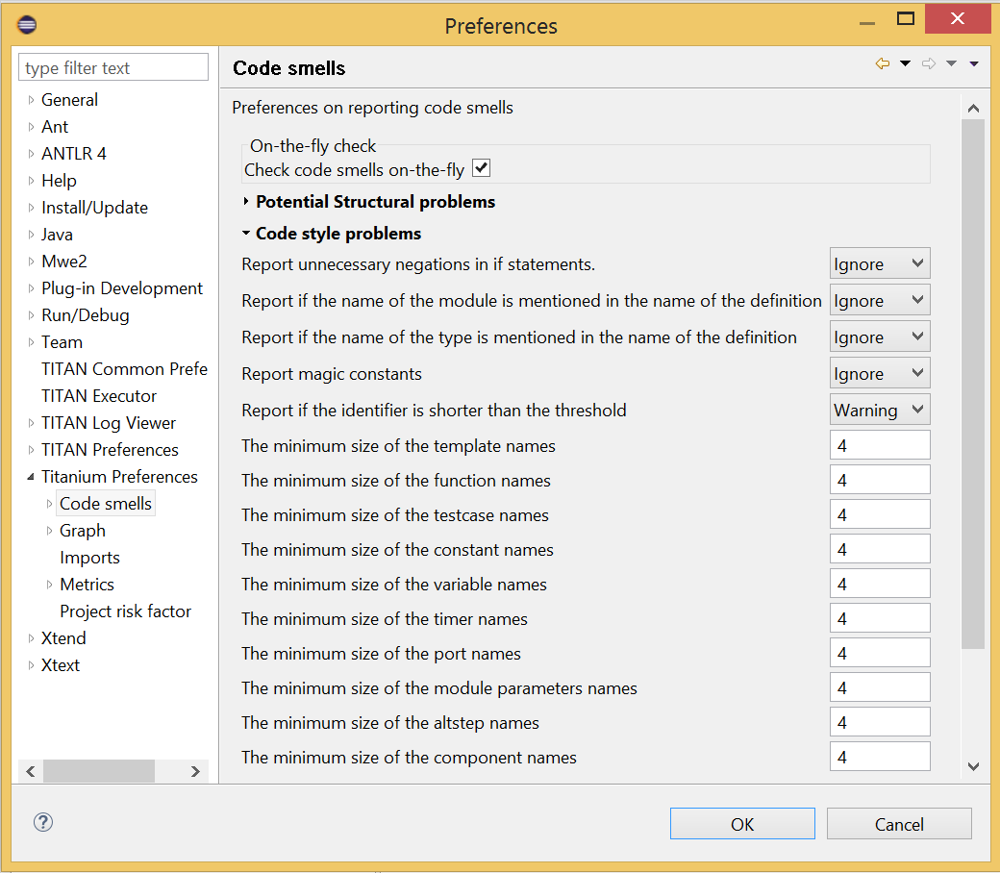
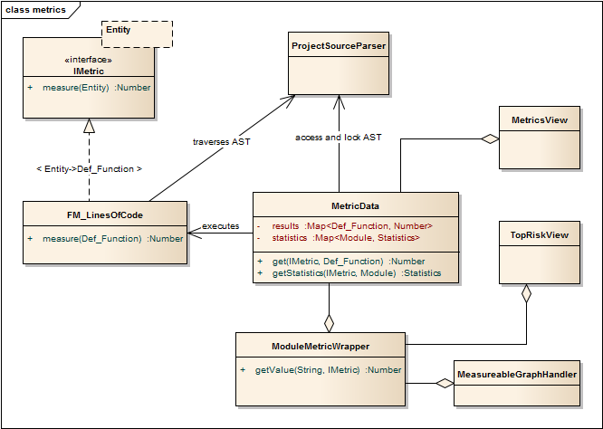

= Programmers' Technical Reference Guide for Titanium
:author: Kristóf Szabados
:revnumber: 9/198 17-CRL 113 200/6, Rev. PE1
:revdate: 2018-06-19
:title-logo-image: images/titan_logo.png
:sectnums:
:doctype: book
:leveloffset: +1
:toc:
:toclevels: 3

ifdef::env-github,backend-html5[]

endif::[]

*Abstract*

This document describes detailed information on writing components of executable test suites for the TITAN TTCN-3 Toolset.

*Copyright*

Copyright (c) 2000-2018 Ericsson Telecom AB. +
All rights reserved. This program and the accompanying materials are made available under the terms of the Eclipse Public License v2.0 that accompanies this distribution, and is available at +
https://www.eclipse.org/org/documents/epl-2.0/EPL-2.0.html.

*Disclaimer*

The contents of this document are subject to revision without notice due to continued progress in methodology, design and manufacturing. Ericsson should have no liability for any error or damage of any kind resulting from the use of this document.

= About the Document

== Purpose

The purpose of this document is to provide detailed information on writing components, for example, test ports, and so on, for executable test suites.

== Target Groups

This document is intended for programmers of TTCN–3 test suites with information in addition to that provided in the TITAN User Guide <<_3, [3]>>. It is recommended that the programmer reads the TITAN User Guide before reading this document.

== Typographical Conventions

This document uses the following typographical conventions:

*Bold* is used to represent graphical user interface (GUI) components such as buttons, menus, menu items, dialog box options, fields and keywords, as well as menu commands. Bold is also used with "+" to represent key combinations. For example, *Ctrl+Click*

The character "**/**"" is used to denote a menu and sub-menu sequence. For example, *File / Open*.

`Monospaced` font is used represent system elements such as command and parameter names, program names, path names, URLs, directory names and code examples.

`*Bold monospaced*` font is used for commands that must be entered at the Command Line Interface (CLI).

= Adding a new Code Smell

This chapter guides you through the world of Code Smells. It contains a tutorial like description on how to add a new Code Smell, which are the important things you have to pay attention to, and why. A concrete example is provided to help understanding the concepts and usage.

== Adding the new Code Smell class

=== The location of the new Code Smell class

The new code smell-s class is actually a code smell spotter implementation. That is why you have to add the new class in the

*package* org.eclipse.titanium.markers.spotters.implementation .

The name of the class has to refer to the role of the code smell.

_In this description we study about Code Smells using a concrete code smell, which is implemented in the class named Goto.java._

=== The description of the new Code Smell class

Do not forget to add a description about the role of your new code smell. This should contain your id as author.

_In the Goto example code smell a description could be:_

....
/**

* This class marks the following code smell:
* The code contains goto statements, which is not recommended.
* @author <XY_id>

*/
....

=== The superclass of the new Code Smell class

The new Code Smell has to extend the class BaseModuleCodeSmellSpotter. This class is an abstract class in the *package* org.eclipse.titanium.markers.spotters .

_Example:_

[source]
public class Goto extends BaseModuleCodeSmellSpotter { ... }

=== The code of the new Code Smell class

* It is recommended for your code smell class to have as private attribute named `ERROR_MESSAGE`, this containing the message which should appear to the user of the Code Smell, when the Code Smell is detected.
+
Example:
+
[source]
private static final String ERROR_MESSAGE = "Usage of goto and label statements is not recommended ";

* The constructor of the Code Smell should contain `super(CodeSmellType.<Code_Smell_Id>);` as first row, where `Code_Smell_Id` is choosen by the author, and will be used in registering a the new code smell. Information on this id is in section <<register-the-new-code-smell-type, Register the new Code Smell Type>>.
+
Example:
+
[source]
----
public Goto() {
  super(CodeSmellType.GOTO);
}
----

* As the code smell-s superclass, the `BaseModuleCodeSmellSpotter` has two abstract methods, we have to override these. The method `getStartNode()` will have to return the list of AST nodes on which the spotter will work, on which we are interested to analyze the appearance of our code smell.
+
Example:
+
[source]
----
@Override
public List<Class<? extends IVisitableNode>> getStartNode() {
	List<Class<? extends IVisitableNode>> ret =new ArrayList<Class<? Extends IVisitableNode>>(1);
	ret.add(Goto_statement.class);
	return ret;
}
----

* The method `process(IVisitableNode node, Problems problems)` has to be overriden as well. The actual work for matching the code smell is done here. This method would surely contain a `problems.report(s.getLocation(), ERROR_MESSAGE);` row.
+
Example:
+
[source]
----
@Override
public void process(IVisitableNode node, Problems problems) {
	if (node instanceof Goto_statement) {
		Goto_statement s = (Goto_statement) node;		problems.report(s.getLocation(), ERROR_MESSAGE);
	}
}
----

== Register the new Code Smell

[[register-the-new-code-smell-type]]
== Register the new Code Smell Type

The _CodeSmellType_ enum in *_package_* _org.eclipse.titanium.markers.types_ contains all the Code Smell Types as instances. We have to add the new Code Smell, using the _<Code_Smell_Id>_ which we have chosen in the constructor of our code smell’s class.We have to add a short description of the problem detected by our code smell, and we must specify three numeric parameters as well:
. the minimum time needed to improve the detected code smell
. the average time needed to improve the detected code smell
. the maximum time needed to correct on instance of the detected code smell.

Example:

[source]
----
package org.eclipse.titanium.markers.types;
public enum CodeSmellType implements ProblemType{
	 ...
	GOTO("Goto", 1.0, 5.5, 26.0)
...
}
----

=== Add the new Code Smell to semantic problem related map

The class StaticData has the newSpotters() method which returns an unmodifiable map. This map contains the code smell spotters,that are related to each semantic problem. The map’s key is the relevant instance of the CodeSmellType, the value is new instance of the code smell class.

This information is used to gather the active code smells spotters, for a code smell type, during the analysis.

Example:

[source]
----
package org.eclipse.titanium.markers.spotters.implementation;
class StaticData {

public static Map<CodeSmellType, BaseModuleCodeSmellSpotter[]> newSpotters() {
...
m.put(CodeSmellType.GOTO, new BaseModuleCodeSmellSpotter[] { new Goto() });
...
return Collections.unmodifiableMap(m);
}
}
----

=== Register the new Problem Type Preference

The ProblemTypePreference contains an item related to each Code Smell. This enum is going to serve in the process of setting the preferences of a Code Smell. It also contains a short description about the effect of the related Code Smell. This description going to appear when the user browses in the Titanium Preferences / Code Smell window. Try to be short and very clear.

Example:

[source]
----
package org.eclipse.titanium.preferences
enum ProblemTypePreference

public enum ProblemTypePreference {
	...
GOTO("Report the usage of label and goto statements", EnumSet.of(CodeSmellType.GOTO)),
...
}
----

=== Initialize the preference of the Code Smell

All Code Smells have a default preference. This must be given in the class PreferenceInitializer.

There are three kind of preferences: _ERROR, WARNING, IGNORE_. If _ERROR_ is set, the detecting of the referred Code Smell is going to occur an error. In the case of _WARNING_ the user is going to get a warning message if the referred Code Smell is detected. _IGNORE_ means that the user is not going to receive any sign, even if the Code Smell exists.

Example:

[source]
----
package org.eclipse.titanium.preferences;
class PreferenceInitializer

	public final void initializeDefaultPreferences() {
		IPreferenceStore preferenceStore = getPreference();
...
    preferenceStore.setDefault(ProblemTypePreference.GOTO.getPreferenceName(), GeneralConstants.IGNORE);
...
}
----

=== Refresh Markers Preference Page

The class MarkersPreferencePage is the place where users can set the severity of each code smell. This page also contains the explanation on the program code containing the specific Code Smell, could be written more clearly, correct, why is it important to pay attention on it. This explanation appears to the user in the Titanium Preferences / Code Smell window, when the mouse is set above the short description of the code smell.

Example:

[source]
----
package org.eclipse.titanium.preferences.pages;
class MarkersPreferencePage

static {
Map<ProblemTypePreference, String> m = new EnumMap<ProblemTypePreference, String>(ProblemTypePreference.class);

		...
		m.put(ProblemTypePreference.GOTO,
"In almost all cases the usage of goto should be forbidden as it can very easily breaks the principles of"
						+ " structured/well designed source code.");
		...

}
----

The function createFieldEditors() is responsible for creating the fields. Only the fields created in this function going to be seen by the user in the Titanium Preferences / Code Smell window. Be sure you put the new field in the block corresponding to the type of problem detected by your Code Smell.

Example:

[source]
----
package org.eclipse.titanium.preferences.pages;
class MarkersPreferencePage

protected void createFieldEditors() {
  ...

addField(b1);
		{
			...
			sec.setText("Potential Structural problems");
			sec.setFont(fonts.getBold(""));
			Composite comp = new Composite(sec, 0);
			comp.setLayoutData(new GridData(GridData.FILL_HORIZONTAL));
			comp.setLayout(new FillLayout(SWT.VERTICAL));
		createField(comp, ProblemTypePreference.GOTO);
        		 ...
}
}
----

==== Using parameters

It is also possible to ask for parameters from the user on this page. In which case the parameter must also be a preference setting, and have a place on the preference window, preferably next to its main option. Please don’t forget to provide a default value for each parameter, so that the code smell can work out of the box if needed.

In the following example we would like to have a minimum length for identifiers. This threshold has a default value, but it should be changeable by the user. Figure 1 shows a sample window, consisting of all the parameters which are responsible for the minimum lengths of the identifiers. The default value is 4, but the user can change the threshold values any time here.

Initializing process of a parameterized code smell looks like the previously shown code smells, however there are some differences about the GUI parameters.

To define the parameters, the PreferenceInitializer must be completed.

Example:

[source]
----
package org.eclipse.titanium.preferences;
class PreferenceInitializer

preferenceStore.setDefault(
PreferenceConstants.IDENTIFIER_EXCESSIVELY_SHORT_TEMPLATE_SIZE, 4);
----

Constant need to be added to PreferenceConstants.

Example:

[source]
----
package org.eclipse.titanium.preferences;
class PreferenceConstants

public static final String IDENTIFIER_EXCESSIVELY_SHORT_TEMPLATE_SIZE = "IDENTIFIER_EXCESSIVELY_SHORT_TEMPLATE_SIZE";
----

== Refresh Titanium documentation

The last, important step is to refresh the documentation. In the chapter Titanium Preferences / Code Smell Preferences are presented several Code Smell categories. Search for the category your Code Smell belongs in the Titanium Preferences/Code Smell window, use the short description of the code smell from the Preferences/Code Smell window l to introduce the new description.

Example:

In docs/Titanium – 1551

Titanium Preferences / Code Smell Preferences / Potential structural problems

* *Report the usage of label and goto statements*: goto statements and labels usually indicate incorrect programing practices. Developers are encouraged to used elements of structured programming practices.

= Titanium metrics

== Overview

One of the core features of Titanium is the code metrics for ttcn3 projects. Code metrics (like block nesting of a test case, or cyclomatic complexity of a function) are indicators of code quality, that can tell the user about which are the complex modules of a project, and may serve as a lead in refactoring by showing overly complicated, bloated parts of the project.

Calculating metrics is planned to happen rarely, only when the user opens explicitly an eclipse view that requires the metrics, thus it was not designed to be lightweight.

The code of the implementation resides in the `com.ericsson.titanium.markers` and its submodules. A rough overview of some notable classes and its associations is depicted below.

== Metrics

Metrics are similar to the code smell spotters in the `marker` package. Their purpose is to measure a ttcn3 entity (e.g. count the length of a function definition). They can contain local state (to ensure flexibility), but after initialization this state should not be changed, so their measure method is intended to serve a stateless behavior.

== MetricData

This is the core class of the package that controls the execution of the metrics, stores the results of them, calculates its statistics and risk factors. It is immutable, in fact a snapshot of the project’s state and quality at the time of creating the `MetricData` object. As a result, it is quite a heavyweight object, which should be created sparingly and cached when possible.

Note that constructing an instance requires locking the project to prevent modifications during the measurements. This locking is handled internally.

== ModuleMetricWrapper

During development it was an important aspect to ensure an easy-to-use interface for the graph package, and also that the graph package and the `MetricData` class is not tightly coupled. The `ModuleMetricWrapper` class is the façade that solves this.

== MetricsView

This view gives the user an overview of the project from the point of view of the metrics. The project is explorable via a tree view, where the user can see all the metrics, and under those nodes the entities related to these metrics, and also the detailed results of the metrics.

The view uses a `MetricData` instance as its data source, constructed when the view is opened.

== TopRiskView

This view is designed to show the users the modules that are potentially dangerous according to the metrics, that is, that have bad quality index for the metrics. When using this view, the user can select which metrics to count in the quality index, and than we list the modules of the project ordered by this quality index (along with the details of the metrics).

As here we are interested only in the modules, this class is not in direct association with a `MetricData` instance, but rather uses a `ModuleMetricWrapper` to show the metric details.

== Interaction with the titan designer

This module has a single point where the designer is directly touched. The `MetricData` instance must access to the AST of the project, so it can execute the metrics on the entities that should be measured. This happens in the `measure()` method of the `MetricData`, where the module nodes are queried from the `ProjectSourceParser` associated with the project that we measure.

On the other hand, the metrics themselves rely on the methods of the AST nodes, and AST traversal, so this should be also considered as part of the interface.

= Graph generation and display

== The generation of graphs on the UI

The graph generation can be basically divided into two parts:

. The generation of component graph
. The generation of module graph

These two finally use the same methods for the display, but the graph creation is totally different.

Clicking in the appropriate menu entry first launches an *`AbstractHandler`*, this can be *`ModuleGraphAction`* or *`ComponentGraphAction`* according to the claimed graph. These classes only do a search for the appropriate graph drawing window, set a reference to the opened window, or create a new window if needed. After opening the window the *`EditorPart`* takes the control. Both the component and module windows are inherited from *`GraphEditor`* class, this class implements basic *`EditorPart`* methods, and besides it creates the UI elements needed for showing the graph (only the common UI elements are built here).

For the graph building (generation) we use *`GraphGenerator`*, this class implements a frame how a generator should look like: It can generate graph, return the generated graph (this method is synchronized with the generation), and it can refresh the graph searching for changes. The most important method here is *`createGraph()`* which is protected, and abstract.. According to the claimed graph we make instance of the appropriate subclass, thus all the differences are solved in the graph drawing. The two present subclasses of *`GraphGenerator`* are *`ComponentGraphGenerator`* and *`ModuleGraphGenerator`*.

After this step the editor window takes back the control, and displays the graph through JUNG API. Because of synchronization issues the editor doesn’t wait for the generator, the generator can set a new graph and thus launch the process of display through a method call on the inherited *`SetGraph()`* method. Here the most important steps are the following:

. Handling of *`DrawArea`* (this is a Swing component that displays the graph).
. Handling of *`SatelliteView`* (this is handled through a reference).

As Jung is compatible with Java AWT (it finally returns a subclass of AWT *`Component`*), we add everything to these two swing objects.

To make a *`Component`* from our generated graph we use *`GraphHandler`* class. This class provides a quite complex functionality, let’s see the main ones:

. Visualizing a graph (make a drawable object from inner representation)
. Save the graph to an output file (pajek or image)
. Change the graph’s layout
. Set custom rendering for graph nodes (font style, node shape, node colour,…)
. Other, less important lightweight UI features.

Finally the visualized graph is added to the *`DrawArea`*, and *`SatelliteView`* in the *`GraphEditor`* class (this class calls the *`GraphHandler`*).

image::images/2_F3.png[title="The 5 steps of graph drawing"]

== The generation of graph on the headless interface

Compared to the UI graph building headless building is simplier. *`SaveModuleGraph`* or *`SaveComponentGraph`* launches the generation**.** The called application looks for all projects in your workspace, and generates a graph for each TTCN project.

To generate graph an appropriate *`GraphGenerator`* subclass is instanced and called (*`ModuleGraphGenerator`* or *`ComponentGraphGenerator`*). This class generates the inner representation of the claimed graph.

After this the application calls the *`SaveGraphToPajek`* method of *`GraphHandler`*, this method is static, therefore it needs no instance to build up. This call takes as parameter the graph, which will be claimed from the generator through *`getGraph()`* call (note that this is a significant difference from the UI case). As this method is synchronized with the generation the call will only return after the generation is done, so this call maybe longer. After all the *`GraphHandler`* writes out the graph to the disk in Pajek .net format. If there was no problem during the run the application returns here, and the run terminates.

image::images/2_F4.png[title="Generating graph on headless interface"]

== How graph data is obtained?

In this section we are going to speak about the connection among Titanium, and TITAN designer. As the graphs always represent the current state of the TTCN code naturally this connection is unavoidable. Just like in the former sections we are going to discuss two cases, which are now quite different:

. Module graph
. Component graph

Both generations are implemented in the *`GraphGenerator`* classes, more precisely at the *`createGraph()`* method.

=== Obtaining data for module graph

Module graph data can be obtained a bit easier. The following steps are done in the appropriate method:

. Creating an instance of *`ProjectSourceParser`*
. Checking whether it is up to date
. Analyzing if it wasn’t up to date
. Iterating through all the visited projects, here visited project are got through *`ProjectBasedBuilder`*
. Getting a *`ProjectStructureDataCollector`* object through *`GlobalProjectStructureTracker`* object for the current project
. Get *`knownModules`*, *`missingModules`* and importations from the collector. From these values the graph can be directly generated

=== Obtaining data for component graph

For component graph we need to use a bit more complicated interface. Up to step 4 we do the same as at generating module graph. After this we do the following steps:

. Iterate through *`knownModules`*
. Override the *`accept()`* method of the current module by a new *`ASTVisitor`*
. Check whether the visited node is a *`Component`*
. If it was a component then we get its *`Identifier`*, otherwise we return
. We can create the base node through the datas provided in the Identifier
. We get the extensions and the extension attributes through the original *`Component_Type`* object
. We override there the *`accept()`* method again, and we work with *`Reference`* objects only (otherwise we return)
. Build up a new node through the *`Reference`*’s *`Identifier`*, and add an edge from the first node to the second one.

= Graph clustering

== Algorithms

The classes of the implemented algorithms are all subclasses of *`BaseCluster`*. The algorithms are the following:

=== Clustering by folder name

This algorithm is implemented in the *`FolderNameCluster`* class.

We recursively check the Resources beginning from the project root directory.

If the currently checked resource is a directory, we create a cluster and continue the recursive search.

If the currently checked resource is a file, we extract the contained module and assign it to the appropriate cluster.

=== Clustering using regular expressions

This algorithm is implemented in the *`RegexpCluster`* class.

We iterate through the nodes, and check which regular expressions match the module name.

Then we create the clusters by iterating through the nodes again.

If no matches were found for a given node, then we assign that node to the cluster that contains the nodes which have no matches.

If one match was found, we assign the node to the cluster belonging to the matching regular expression.

If more than one match was found, we display them, and the clustering fails.

=== Clustering by module name

This algorithm is implemented in the *`ModuleNameCluster`* class.

First, we create the clusters by iterating through the nodes and splitting the module names according to the settings. A cluster is created for every name segment.

Then we iterate through the nodes again and choose the narrowest cluster the module belongs to, because we want the nodes to belong to only one cluster.

=== Automatic clustering

This algorithm is implemented in the *`AutomaticCluster`* class.

This clustering uses a similar algorithm to the one in the article here: http://www.mcs.drexel.edu/~bmitchel/research/iwpc98.pdf

The changes are documented in the javadoc of the class.

== Running the algorithms

Running the algorithm is simple. We create the appropriate clustering object and call its *`run(monitor, group)`* method.

The monitor parameter is the progress monitor. The group parameter is a Boolean value which tells the tool whether only the clusters are needed, or we create a graph from the clusters.

If we want to display the results, we simply override the *`drawGraph()`* method as it will be called at the end of the *`run`* method.footnote:[These overrides are already done at *ModuleGraphEditor* class]

It is possible to circumvent the *`run`* method and create and obtain the clustering using the public interface (for more information consult the javadoc), but using the above method is much simpler.

== Connection with TITAN designer

Only folder name based clustering uses TITAN directly. This algorithm uses a *`ProjectSourceParser`* object to obtain module paths, thus it can create a directory hierarchy.

= Titanium DAG layout algorithm

The layout algorithm, which creates a tree-like layout for directed acyclic graphs in the *`jung`* graph library, was inefficient and could not handle cycles in the graph, so we created our own.

== Basic idea

Since strongly connected components (cycles in this case) are not common in a module or component graph, it makes sense to search for nodes that are not in a cycle.

So we begin by creating a topologic ordering of the nodes by choosing the node that has no arcs going into it (in-degree = 0). We "delete" this node, and decrease its neighbours’ in-degree.

If the next node (ordered by in-degree) does not have 0 in-arcs, then it is in a cycle. We find this cycle using DFS.

== Versions

There are two versions. Basically the topologic order can be created by finding sources (no in-arcs) or by finding sinks (no out-arcs). These are implemented in the *`TitaniumDAGLayoutAlgorithm`* and *`TitaniumDAGLayoutReverseAlgorithm`* classes respectively.

The obtained order of the nodes and the level at which they will be drawn differ. If we search for sinks, modules that are not importing other modules come first. If we search for sources, modules that are not imported come first.

== Display

The display is done through *`TitaniumDAGLayout`* class. It implements the *`Layout`* interface of Jung. After this everything works the same way as any other Jung layout.

= Searching for parallel paths and cycles

The module and component graphs of a project should be trees. A tree does not contain cycles and parallel paths.

== Finding parallel paths

The tool implemented in *`CheckParallelPaths`* finds the arcs that are contained in parallel paths from a given source node or from every node.

We use a modified DFS algorithm. If we find an already checked node, then we have either found a parallel path or a cycle. We check if it is not a cycle and put the arcs of the two parallel paths in a set.

This method does not find every parallel path, but every arc contained in a parallel path will be in the set.

== Finding circles

*`CircleCheck`* class implements a circle searching algorithm for graphs. It can be instanced by providing a Jung graph. After this *`IsCyclic`* method returns whether the graph contained any circle. And *`getCircles`* method returns all the found circles.

Note that this class may not find all circles, however it finds if there is any circle for sure. Finding all circles is quite a difficult exercise, as circles may even overlap, which causes difficulties.

= Code smell table merging

For the project analysis we export code smells to an excel table. This table will only contain the current code smells. We would like to examine how the figures changed in time.

== Algorithm

The merging algorithm is implemented in *`MergeExportedMarkerTables`*.

First we collect the dates and code smell names contained in the different files. This way, if a code smell name changes, the change will be handled. We can also merge tables containing more than one column.

Then we iterate through the found dates in ascending order and write the appropriate information to a new excel table.

== Limitation

The *`.xls`* format used by the *`jxl`* library only supports 255 columns in a table.

= References

[[_1]]
* [1] link:https://github.com/eclipse/titan.core/blob/master/usrguide/installationguide.adoc[Installation guide for TITAN TTCN-3 Test Executor]

[[_2]]
* [2] link:https://github.com/eclipse/titan.EclipsePlug-ins/blob/master/Eclipse_installationguide.adoc[Installation Guide for TITAN Designer and TITAN Executor for the Eclipse IDE]

[[_3]]
* [3] link:https://github.com/eclipse/titan.core/blob/master/usrguide/userguide/README.adoc[User Guide for TITAN TTCN-3 Test Executor]

[[_4]]
* [4] link:https://github.com/eclipse/titan.core/blob/master/usrguide/referenceguide/README.adoc[Programmers Technical Reference for TITAN TTCN-3 Test Executor]

[[_5]]
* [5] link:https://github.com/eclipse/titan.core/blob/master/usrguide/releasenotes.adoc[Release Notes for TITAN TTCN-3 Test Executor]

[[_6]]
* [6] TTCN–3 Style Guide

[[_7]]
* [7] TTCN–3 Naming Convention

[[_8]]
* [8] link:https://www.etsi.org/deliver/etsi_es/201800_201899/20187310/04.05.01_60/es_20187310v040501p.pdf[Methods for Testing and Specification (MTS);The Testing and Test Control Notation version 3.Part 1: Core Language European Telecommunications Standards Institute. ES 201 873-1 Version 4.5.1, April 2013]

[[_9]]
* [9] link:https://www.etsi.org/deliver/etsi_es/201800_201899/20187304/04.04.01_60/es_20187304v040401p.pdf[Methods for Testing and Specification (MTS);The Testing and Test Control Notation version 3.Part 4: TTCN–3 Operational Semantics European Telecommunications Standards Institute. ES 201 873-4 Version 4.4.1, April 2012]

[[_10]]
* [10] link:https://www.etsi.org/deliver/etsi_es/201800_201899/20187307/04.05.01_60/es_20187307v040501p.pdf[Methods for Testing and Specification (MTS);The Testing and Test Control Notation version 3.Part 7: Using ASN.1 with TTCN–3 European Telecommunications Standards Institute. ES 201 873-7 Version 4.5.1, April 2013]
